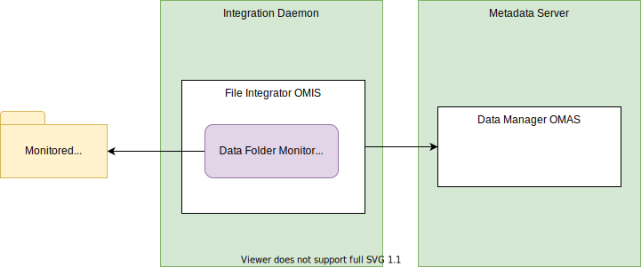

---
hide:
- toc
---

<!-- SPDX-License-Identifier: CC-BY-4.0 -->
<!-- Copyright Contributors to the ODPi Egeria project. -->

--8<-- "snippets/content-status/tech-preview.md"

# Data Folder Monitor Integration Connector

??? info "Connector details"
    - Connector Category: [Integration Connector](/connectors/integration-connector)
    - Hosting Service: [Files Integrator OMIS](/services/omis/files-integrator)
    - Hosting Server: [Integration Daemon](/concepts/integration-daemon)
    - Source Module: [files-integration-connectors :material-github:](https://github.com/odpi/egeria/tree/master/open-metadata-implementation/adapters/open-connectors/integration-connectors/files-integration-connectors){ target=gh }
    - Jar File Name: `files-integration-connectors.jar`

The data folder monitor integration connector monitor changes in a file directory (folder) and maintains a [`DataFolder`](/types/2/0220-files-and-folders/#datafolder) asset for the folder. The files and directories underneath it are assumed to be elements/records in the `DataFolder` asset and so each time there is a change to the files and directories under the monitored directory, it results in an update to the `lastModified` property of the corresponding `DataFolder` asset.

!!! attention "Assumes the DataFolder asset already exists"
    This connector assumes that the `DataFolder` asset is already defined. If it cannot retrieve the `DataFolder` asset, it ignores file changes.

## Configuration


> **Figure 1:** Operation of the data folder monitor integration connector

This connector uses the [Files Integrator OMIS](/services/omis/files-integrator/overview) running in the [integration daemon](/concepts/integration-daemon).

Following is its connection definition to use on the [administration commands that configure the Files Integrator OMIS](/guides/admin/servers/configuring-an-integration-daemon/#configure-the-integration-services):

!!! example "Connection configuration"
    ```json linenums="1" hl_lines="13"
    {
      "connection": 
      {
        "class": "Connection",
        "connectorType": 
        {
          "class": "ConnectorType",
          "connectorProviderClassName": "org.odpi.openmetadata.adapters.connectors.integration.basicfiles.DataFolderMonitorIntegrationProvider"
        },
        "endpoint": 
        {
          "class": "Endpoint",
          "address": "{{folderName}}"
        }
      }
    }
    ```

    Replace `{{folderName}}` with the path name of the folder to monitor.

??? education "Further information"
    This connector is configured in the `exchangeDL01` integration daemon server in the [open metadata labs](/education/open-metadata-labs)

--8<-- "snippets/abbr.md"
