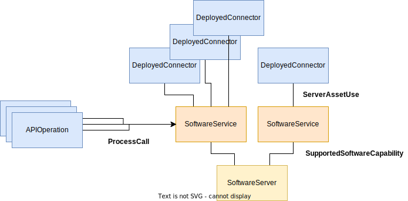

<!-- SPDX-License-Identifier: CC-BY-4.0 -->
<!-- Copyright Contributors to the ODPi Egeria project. -->

--8<-- "snippets/content-status/in-development.md"

# Egeria Infrastructure Cataloguing Integration Connector

??? info "Connector details"
    - Connector Category: [Integration Connector](/connectors/integration-connector)
    - Hosting Service: [Infrastructure Integrator OMIS](/services/omis/infrastructure-integrator)
    - Hosting Server: [Integration Daemon](/concepts/integration-daemon)
    - Source Module: [egeria-infrastructure-catalog-connector :material-github:](https://github.com/odpi/egeria-dev-projects/tree/master/egeria-infrastructure-catalog-connector){ target=gh }
    - Jar File Name: `egeria-infrastructure-catalog-connector.jar`

## Overview

The *Egeria Infrastructure Cataloguing Connector* is a *Infrastructure Integration Connector* that creates a metadata representation of an OMAG Server Platform.


> **Figure 1:** Operation of the Egeria infrastructure cataloguer integration connector

The connector listens for the cataloguing of `SoftwareServerPlatform` entities that have the `deployedImplementationType` property set to`OMAG Server Platform`.  The aim of the connector is to extract as much information about the platform as possible and add this detail to the catalog. It needs the URL of the platform and this is obtained by following the `ServerEndpoint` relationship to extract the network address from the linked endpoint.  If the endpoint is not attached it tries again on the next refresh call. 


> **Figure 2:** Locating the platform

Once the endpoint is located, the `platformVersion` property of the software server platform entity is updated with the [*platform origin*](/services/platform-services/overview/#platform-origin) extracted from the platform.  This proves that the endpoint is actually pointing to an OMAG Server Platform.

Next, a request for [all of the configured servers](/services/admin-services/overview/#managing-configuration-documents) that the platform knows about is made.  This returns the [configuration documents](/concepts/configuration-document) for these servers and the contents are examined to catalog the OMAG servers as `SoftwareServer` entities. 

The platform is called to return the [*known servers*](/services/platform-services/overview/#known-servers).  These are servers that have run on the platform.  For each of these, the connector adds the `DeployedOn` relationship between the `SoftwareServer` entity and the `SoftwareServerPlatform` entity.

The platform is called again for the [active server status](/services/admin-services/overview/#querying-the active-server-status).  This returns the type of server which is used to set up the appropriate `ServerPurpose` classification:

* `MetadataServer` for [Metadata Access Servers](/concepts/metadata-access-server).
* `GovernanceDeamon` for [Engine Hosts](/concepts/engine-host).
* `IntegrationServer` for [Integration Daemons](/concepts/metadata-access-server).
* `RepositoryProxy` for [Repository Proxies](/concepts/repository-proxy).


> **Figure 3:** Extracting OMAG server configuration

The details of each configured OMAG server is used to create appropriate `SoftwareService` entities linked by `SupportedSoftwareCapability` relationships to the server's `SoftwareServer` entity.  Most OMAG services manage one or more connectors and these are represented using `DeployedConnector` entities linked by `ServerAssetUse` relationships.

If the API for the platform is catalogued, the connector uses the service name in the urls to link the individual operations to the appropriate software service using the `ProcessCall` relationship.  The service url marker used to match the API operations is extracted by requesting the [*registered services*](/services/platform-services/overview/#registered-services) from the platform.


> **Figure 4:** Adding the configured services

The connection information is catalogued for each of the deployed connectors and where the connector type is recognized, additional assets (such as Apache Kafka topics) may be created/linked to the deployed connectors.


> **Figure 5:** Adding the connections for the deployed connectors

This processing occurs each time the refresh method is called, and the connector catalogs as much as is possible given the status of the environment on each iteration.

## Configuration

This connector uses the [Infrastructure Integrator OMIS](/services/omis/infrastructure-integrator/overview)
running in the [Integration Daemon](/concepts/integration-daemon).

This is its connection definition to use on the [administration commands that configure the Infrastructure Integrator OMIS](/guides/admin/servers/configuring-an-integration-daemon/#configure-the-integration-services).

!!! example "Connection configuration"
    ```json linenums="1"
    {
       "connection" : 
                    { 
                        "class" : "Connection",
                        "qualifiedName" : "TopicMonitorConnection",
                        "connectorType" : 
                        {
                            "class" : "ConnectorType",
                            "connectorProviderClassName" : "org.odpi.openmetadata.devprojects.connectors.integration.egeria.EgeriaInfrastructureIntegrationProvider"
                        }
                    }
    }
    ```


---8<-- "snippets/abbr.md"