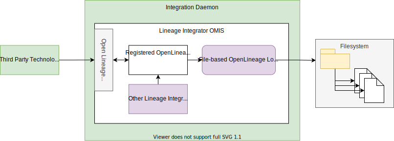

<!-- SPDX-License-Identifier: CC-BY-4.0 -->
<!-- Copyright Contributors to the ODPi Egeria project. -->

--8<-- "snippets/content-status/stable.md"

# File-based Open Lineage Log Store Integration Connector

!!! info "Connector details"
    - Connector Category: [Integration Connector](/concepts/integration-connector)
    - Hosting Service: [Lineage Integrator OMIS](/services/omis/lineage-integrator/oveview)
    - Hosting Server: [Integration Daemon](/concepts/integration-daemon)
    - Source Module: [openlineage-integration-connectors :material-github:](https://github.com/odpi/egeria/tree/main/open-metadata-implementation/adapters/open-connectors/integration-connectors/openlineage-integration-connectors){ target=gh }
    - Jar File Name: `openlineage-integration-connectors.jar`

## Overview

The File-based OpenLineage Log Store integration connector stores open lineage events to the file system.


> **Figure 1:** Operation of the File-based OpenLineage log store integration connector


## Configuration

This connector uses the [Lineage Integrator OMIS](/services/omis/lineage-integrator/overview)
running in the [Integration Daemon](/concepts/integration-daemon).

This is its connection definition to use on the [administration commands that configure the Lineage Integrator OMIS](/guides/admin/server/configuring-an-integration-daemon/#configure-the-integration-services).

!!! example "Connection configuration"
    ```json linenums="1" hl_lines="14"
    {
       "connection" : 
                    { 
                        "class" : "Connection",
                        "qualifiedName" : "Egeria:IntegrationConnector:Lineage:FileBasedOpenLineageLogStore Connection",
                        "connectorType" : 
                        {
                            "class" : "ConnectorType",
                            "connectorProviderClassName" : "org.odpi.openmetadata.adapters.connectors.integration.openlineage.FileBasedOpenLineageLogStoreProvider"
                        },
                        "endpoint" :
                        {
                            "class" : "Endpoint",
                            "address" : "{{folderName}}"
                        }
                    }
    }
    ```

    - Replace `{{folderName}}` with the path name of the folder where the files will be located.

---8<-- "snippets/abbr.md"
