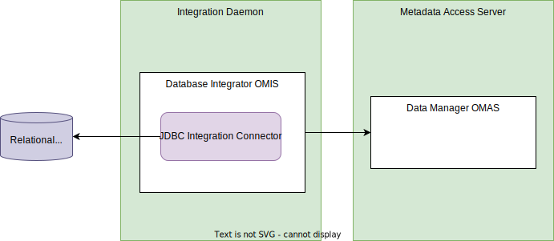
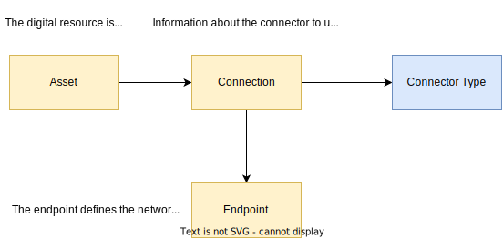

<!-- SPDX-License-Identifier: CC-BY-4.0 -->
<!-- Copyright Contributors to the ODPi Egeria project. -->

--8<-- "snippets/content-status/tech-preview.md"

# JDBC Integration Connector

!!! info "Connector details"
    - Connector Category: [Integration Connector](/concepts/integration-connector)
    - Hosting Service: [Database Integrator OMIS](/services/omis/database-integrator/overview)
    - Hosting Server: [Integration Daemon](/concepts/integration-daemon)
    - Source Module: [jdbc-integration-connector :material-github:](https://github.com/odpi/egeria-database-connectors/tree/main/jdbc-integration-connector){ target=gh }
    - Jar File Name: `jdbc-integration-connector.jar`


The JDBC integration connector connects to a relational database and extracts its database schema information and catalogs it as open metadata.


> **Figure 1:** JDBC integration connector accessing a database and cataloguing its schemas in a metadata access server

It uses an embedded [JDBC Digital Resource Connector](/connectors/resource/jdbc-resource-connector) to access the database.

## Catalogued elements

The JDBC integration connector catalogs a database asset, database schema assets, tables, views, columns, primary and foreign keys. 


> **Figure 2:** Open metadata types used to catalog a database

If the endpoint information is available, it will also attach the connection information to access the database through the [JDBC Digital Resource Connector](/connectors/resource/jdbc-resource-connector).


> **Figure 3:** Connection information attached to catalogued database enables consumers of the database to get access to the database contents

## Configuration

This connector uses the [Database Integrator OMIS](/services/omis/database-integrator/overview)running in the [Integration Daemon](/concepts/integration-daemon).

This is its connection definition to use on the [administration commands that configure the Database Integrator OMIS](/guides/admin/servers/configuring-an-integration-daemon/#configure-the-integration-services).

!!! example "Connection configuration"
    ```json linenums="1" hl_lines="14"
    {
        "connection" : 
        {
            "class": "VirtualConnection",
            "connectorType" : 
            {
                "class": "ConnectorType",
                "connectorProviderClassName": "org.odpi.openmetadata.adapters.connectors.integration.jdbc.JdbcIntegrationConnectorProvider"
            },
            "embeddedConnections":
            [
                {
                    "class" : "EmbeddedConnection",
                    "embeddedConnection" :
                    {
                        "class" : "Connection",
                        "userId" : "{{userId}}",
                        "clearPassword" : "{{clearPassword}}",
                        "connectorType" : 
                        {
                            "class": "ConnectorType",
                            "connectorProviderClassName": "org.odpi.openmetadata.adapters.connectors.resource.jdbc.JdbcConnectorProvider"
                        },
                        "endpoint":
                        {
                            "class": "Endpoint",
                            "address" : "{{address}}"
                        }
                    }
                }
            ],
            "configurationProperties": 
            {
                "includeSchemaNames": [],
                "excludeSchemaNames": [],
                "includeTableNames": [],
                "excludeTableNames": [],
                "includeViewNames": [],
                "excludeViewNames": [],
                "includeColumnNames": [],
                "excludeColumnNames": []
            }
        }
    }
    ```

    - Replace '{{userId}}' and '{{clearPassword}}' with the database username and password.
    - Replace '{{address}}' with the database jdbc url.
    - Populate the include/exclude lists with database object names to filter out the import. Optional, no wildcards supported 


