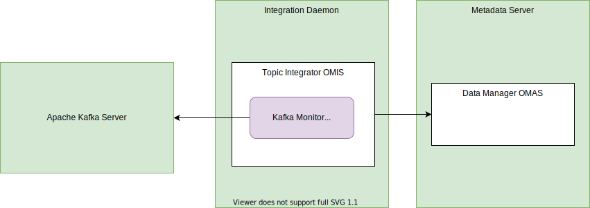

<!-- SPDX-License-Identifier: CC-BY-4.0 -->
<!-- Copyright Contributors to the ODPi Egeria project. -->

--8<-- "snippets/content-status/tech-preview.md"

# Kafka Monitor Integration Connector

!!! info "Connector details"
    - Connector Category: [Integration Connector](/concepts/integration-connector)
    - Hosting Service: [Topic Integrator OMIS](/services/omis/topic-integrator/overview)
    - Hosting Server: [Integration Daemon](/concepts/integration-daemon)
    - Source Module: [kafka-integration-connector :material-github:](https://github.com/odpi/egeria/tree/main/open-metadata-implementation/adapters/open-connectors/integration-connectors/kafka-integration-connector){ target=gh }
    - Jar File Name: `kafka-integration-connector.jar`

## Overview

The kafka monitor integration connector monitors an Apache Kafka server and creates a [KafkaTopic](/types/2/0223-Events-and-Logs) asset for each topic that is known to the server. If the topic is removed from the Apache Kafka Server, its corresponding KafkaTopic asset is also removed.


> **Figure 1:** Operation of the kafka monitor integration connector


## Configuration

This connector uses the [Topic Integrator OMIS](/services/omis/topic-integrator/overview)
running in the [Integration Daemon](/concepts/integration-daemon).

This is its connection definition to use on the [administration commands that configure the Topic Integrator OMIS](/guides/admin/servers/configuring-an-integration-daemon/#configure-the-integration-services).

!!! example "Connection configuration"
    ```json linenums="1" hl_lines="14"
    {
       "connection" : 
                    { 
                        "class" : "Connection",
                        "qualifiedName" : "TopicMonitorConnection",
                        "connectorType" : 
                        {
                            "class" : "ConnectorType",
                            "connectorProviderClassName" : "org.odpi.openmetadata.adapters.connectors.integration.kafka.KafkaMonitorIntegrationProvider"
                        },
                        "endpoint" :
                        {
                            "class" : "Endpoint",
                            "address" : "{{serverURL}}"
                        }
                    }
    }
    ```

    - Replace `{{serverURL]}` with the network address of Kafka's bootstrap server (for example, `localhost:9092`).

---8<-- "snippets/abbr.md"
