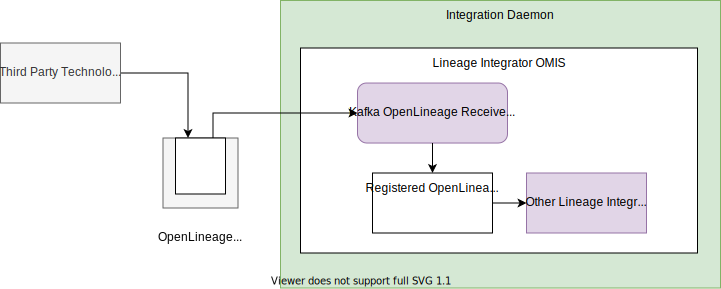

<!-- SPDX-License-Identifier: CC-BY-4.0 -->
<!-- Copyright Contributors to the ODPi Egeria project. -->

# Kafka Open Lineage Receiver Integration Connector

??? info "Connector details"
    - Connector Category: [Integration Connector](/egeria-docs/connectors/integration-connector)
    - Hosting Service: [Lineage Integrator OMIS](/egeria-docs/services/omis/lineage-integrator)
    - Hosting Server: [Integration Daemon](/egeria-docs/concepts/integration-daemon)
    - Source Module: [lineage-integration-connectors :material-github:](https://github.com/odpi/egeria/tree/master/open-metadata-implementation/adapters/open-connectors/integration-connectors/lineage-integration-connectors){ target=gh }
    - Jar File Name: `lineage-integration-connectors.jar`

## Overview

The Kafka OpenLineage Receiver integration connector receives open lineage events from a kafka topic and publishes them to the lineage integration connectors with OpenLineage listeners registered in the same instance of the Lineage Integrator OMIS.


> **Figure 1:** Operation of the kafka OpenLineage receiver integration connector


## Configuration

This connector uses the [Lineage Integrator OMIS](/egeria-docs/services/omis/lineage-integrator/overview)
running in the [Integration Daemon](/egeria-docs/concepts/integration-daemon).

This is its connection definition to use on the [administration commands that configure the API Integrator OMIS](/egeria-docs/guides/admin/servers/configuring-an-integration-daemon/#configure-the-integration-services).

!!! example "Connection configuration"
    ```json linenums="1" hl_lines="11-14"
    {
       "connection" : 
                    { 
                        "class" : "Connection",
                        "qualifiedName" : "Egeria:IntegrationConnector:Lineage:KafkaOpenLineageReceiver Connection",
                        "connectorType" : 
                        {
                            "class" : "ConnectorType",
                            "connectorProviderClassName" : "org.odpi.openmetadata.adapters.connectors.integration.lineage.KafkaOpenLineageReceiverIntegrationProvider"
                        },
                        "embeddedConnections" :
                        {
                            ...
                        }
                    }
    }
    ```

    - Add details of the connector to the topic in the `embeddedConnections` section.  This will have the topic name in the endpoiint's `networkAddress`.

---8<-- "snippets/abbr.md"