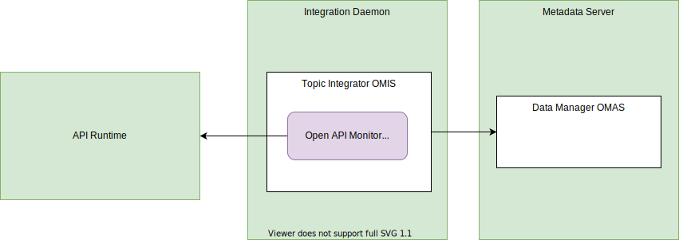

<!-- SPDX-License-Identifier: CC-BY-4.0 -->
<!-- Copyright Contributors to the ODPi Egeria project. -->

# Open API Monitor Integration Connector

??? info "Connector details"
    - Connector Category: [Integration Connector](/egeria-docs/connectors/integration-connector)
    - Hosting Service: [API Integrator OMIS](/egeria-docs/services/omis/api-integrator)
    - Hosting Server: [Integration Daemon](/egeria-docs/concepts/integration-daemon)
    - Source Module: [openapi-integration-connector :material-github:](https://github.com/odpi/egeria/tree/master/open-metadata-implementation/adapters/open-connectors/integration-connectors/openapi-integration-connector){ target=gh }
    - Jar File Name: `openapi-integration-connector.jar`

## Overview

The Open API monitor integration connector connects to an endpoint and extracts the open API specification through the `GET {{serverURL}}/v3/api-docs` request.  It creates a [DeployedAPI](/egeria-docs/types/0212-Deployed-APIs) asset for each API Tag that is known to the server. A new [APIOperation](/egeria-docs/types/0536-API-Schemas) is created for each combination of path name and operation (GET, POST, PUT, DELETE).


> **Figure 1:** Operation of the Open API monitor integration connector


## Configuration

This connector uses the [API Integrator OMIS](/egeria-docs/services/omis/api-integrator/overview) running in the [Integration Daemon](/egeria-docs/concepts/integration-daemon).

This is its connection definition to use on the [administration commands that configure the API Integrator OMIS](/egeria-docs/guides/admin/configuring-the-integration-daemon/#configure-the-integration-services).  

!!! example "Connection configuration"
    ```json linenums="1" hl_lines="15"
    {
       "connection" : 
                    { 
                        "class" : "Connection",
                        "qualifiedName" : "APIMonitorConnection",
                        "connectorType" : 
                        {
                            "class" : "ConnectorType",
                            "connectorProviderClassName" : "org.odpi.openmetadata.adapters.connectors.integration.openapis.OpenAPIMonitorIntegrationProvider"
                        },
                        "endpoint" :
                        {
                            "class" : "Endpoint",
                            "address" : "{{serverURL}}"
                        }
                    }
    }
    ```
    
    - Replace `{{serverURL}}` with the network address of the process where the API is hosted (for example, `localhost:9443`).

---8<-- "snippets/abbr.md"