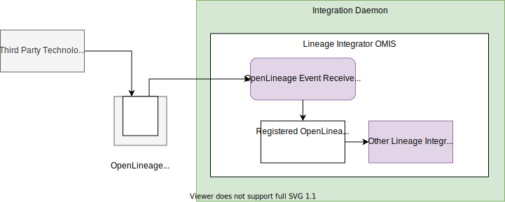

<!-- SPDX-License-Identifier: CC-BY-4.0 -->
<!-- Copyright Contributors to the ODPi Egeria project. -->

--8<-- "snippets/content-status/tech-preview.md"

# Open Lineage Event Receiver Integration Connector

??? info "Connector details"
    - Connector Category: [Integration Connector](/connectors/integration-connector)
    - Hosting Service: [Lineage Integrator OMIS](/services/omis/lineage-integrator)
    - Hosting Server: [Integration Daemon](/concepts/integration-daemon)
    - Source Module: [lineage-integration-connectors :material-github:](https://github.com/odpi/egeria/tree/master/open-metadata-implementation/adapters/open-connectors/integration-connectors/lineage-integration-connectors){ target=gh }
    - Jar File Name: `lineage-integration-connectors.jar`

## Overview

The OpenLineage Event Receiver integration connector receives open lineage events from an event topic and publishes them to the lineage integration connectors with OpenLineage listeners registered in the same instance of the Lineage Integrator OMIS.


> **Figure 1:** Operation of the OpenLineage event receiver integration connector


## Configuration

This connector uses the [Lineage Integrator OMIS](/services/omis/lineage-integrator/overview)
running in the [Integration Daemon](/concepts/integration-daemon).

Its connection definition to use on the [administration commands that configure the Lineage Integrator OMIS](/guides/admin/servers/configuring-an-integration-daemon/#configure-the-integration-services) is a *VirtualConnection* with an embedded [OpenMetadataTopicConnection](/concepts/open-metadata-topic-connector). 

!!! example "Connection configuration"
    ```json linenums="1" hl_lines="11"
    {
       "connection" : 
                    { 
                        "class" : "VirtualConnection",
                        "qualifiedName" : "Egeria:IntegrationConnector:Lineage:OpenLineageEventReceiver Connection",
                        "connectorType" : 
                        {
                            "class" : "ConnectorType",
                            "connectorProviderClassName" : "org.odpi.openmetadata.adapters.connectors.integration.openlineage.OpenLineageEventReceiverIntegrationProvider"
                        },
                        "embeddedConnections" : [ {{topicConnection}} ]
                    }
    }
    ```

    - Add the connection for the open metadata topic connector in the `embeddedConnections` section replacing {{topicConnection}}.  This will have the topic name in the endpoint's `networkAddress`.  The example below shows the  connection for the [Kafka open metadata topic connector](/connectors/resource/kafka-open-metadata-topic-connector)

    !!! example "Kafka topic connection configuration"
        ```json linenums="1" hl_lines="11-40"
        {
           "connection" : 
                        { 
                            "class" : "VirtualConnection",
                            "qualifiedName" : "Egeria:IntegrationConnector:Lineage:OpenLineageEventReceiver Connection",
                            "connectorType" : 
                            {
                                "class" : "ConnectorType",
                                "connectorProviderClassName" : "org.odpi.openmetadata.adapters.connectors.integration.openlineage.OpenLineageEventReceiverIntegrationProvider"
                            },
                            "embeddedConnections" : [
                            {
                                "class": "EmbeddedConnection",
                                "embeddedConnection : 
                                {
                                    "class": "Connection",
                                    "qualifiedName": "Kafka Open Metadata Topic Connector",
                                    "connectorType":
                                    {
                                        "class": "ConnectorType",
                                        "connectorProviderClassName": "org.odpi.openmetadata.adapters.eventbus.topic.kafka.KafkaOpenMetadataTopicProvider"      
                                    },
                                    "endpoint":
                                    {
                                        "class": "Endpoint",
                                        "address": {{openLineageTopicName}}
                                    },
                                    "configurationProperties": 
                                    {
                                        "producer": 
                                        {
                                            "bootstrap.servers": {{kafkaEndpoint}}
                                        },
                                        "local.server.id": "{{localServerId}}",
                                        "consumer":
                                        {
                                            "bootstrap.servers": {{kafkaEndpoint}}
                                        }
                                    }
                                }
                            }]
                        }
        }
        
        - Add the name of the topic in {{openLineageTopicName}}; the integration daemon's server id in {{localServerId}} and the enpoint for Apache Kafka (for example localhost:9092) in {{kafkaEndpoint}}.

     
---8<-- "snippets/abbr.md"