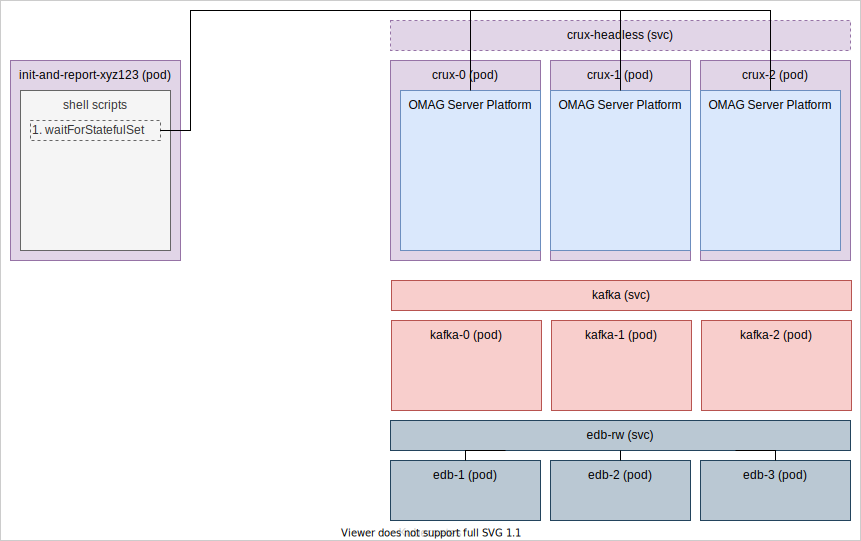
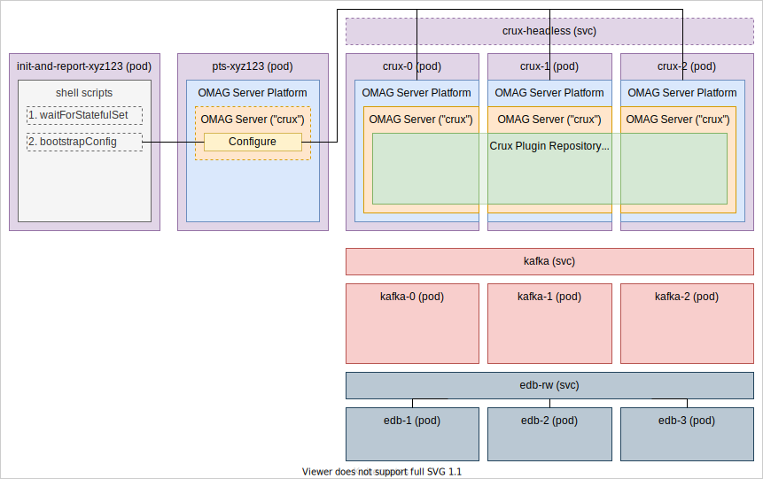
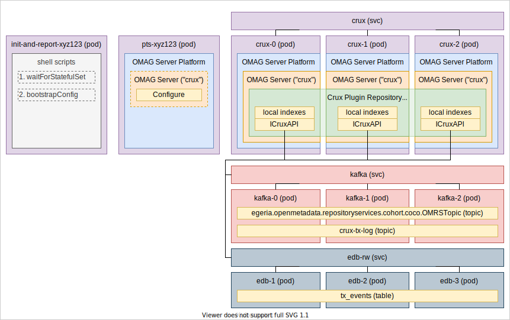
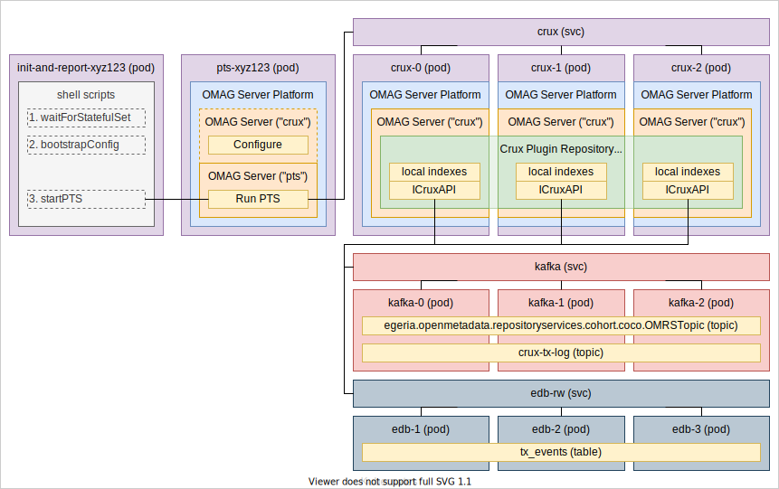
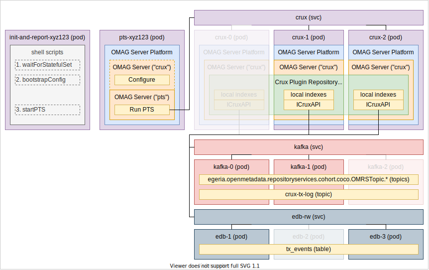

<!-- SPDX-License-Identifier: CC-BY-4.0 -->
<!-- Copyright Contributors to the Egeria project. -->

# Crux OMRS Repository Connector

??? success "Fully conformant with all Egeria profiles"
    Last tested on [release 3.0 of Egeria, release 3.0 of connector using release 1.18.1 of Crux](performance.md).

    Profile | Result
    ---|---
    [Metadata sharing](/egeria-docs/guides/cts/profiles/metadata-sharing) | :material-check-all: CONFORMANT_FULL_SUPPORT
    [Reference copies](/egeria-docs/guides/cts/profiles/reference-copies) | :material-check-all: CONFORMANT_FULL_SUPPORT
    [Metadata maintenance](/egeria-docs/guides/cts/profiles/metadata-maintenance) | :material-check-all: CONFORMANT_FULL_SUPPORT
    [Dynamic types](/egeria-docs/guides/cts/profiles/dynamic-types) | :material-help: UNKNOWN_STATUS
    [Graph queries](/egeria-docs/guides/cts/profiles/graph-queries) | :material-check-all: CONFORMANT_FULL_SUPPORT
    [Historical search](/egeria-docs/guides/cts/profiles/historical-search) | :material-check-all: CONFORMANT_FULL_SUPPORT
    [Entity proxies](/egeria-docs/guides/cts/profiles/entity-proxies) | :material-check-all: CONFORMANT_FULL_SUPPORT
    [Soft-delete and restore](/egeria-docs/guides/cts/profiles/soft-delete-and-restore) | :material-check-all: CONFORMANT_FULL_SUPPORT
    [Undo an update](/egeria-docs/guides/cts/profiles/undo-an-update) | :material-check-all: CONFORMANT_FULL_SUPPORT
    [Reidentify instance](/egeria-docs/guides/cts/profiles/reidentify-instance) | :material-check-all: CONFORMANT_FULL_SUPPORT
    [Retype instance](/egeria-docs/guides/cts/profiles/retype-instance) | :material-check-all: CONFORMANT_FULL_SUPPORT
    [Rehome instance](/egeria-docs/guides/cts/profiles/rehome-instance) | :material-check-all: CONFORMANT_FULL_SUPPORT
    [Entity search](/egeria-docs/guides/cts/profiles/entity-search) | :material-check-all: CONFORMANT_FULL_SUPPORT
    [Relationship search](/egeria-docs/guides/cts/profiles/relationship-search) | :material-check-all: CONFORMANT_FULL_SUPPORT
    [Entity advanced search](/egeria-docs/guides/cts/profiles/entity-advanced-search) | :material-check-all: CONFORMANT_FULL_SUPPORT
    [Relationship advanced search](/egeria-docs/guides/cts/profiles/relationship-advanced-search) | :material-check-all: CONFORMANT_FULL_SUPPORT

    ??? info "Additional notes"
        - The entity search tests could fail a particular long-running query pattern unless Lucene is configured: typically where a query by value or attribute is done without providing any restriction on the type of instances against which the query should run. Configure the connector with Lucene to avoid these timeouts.
        - The [Dynamic types](/egeria-docs/guides/cts/profiles/dynamic-types) profile currently does not have any tests defined, so will be `UNKNOWN_STATUS` for all repositories and connectors.

=== "Latest release"
    [](http://repository.sonatype.org/service/local/artifact/maven/redirect?r=central-proxy&g=org.odpi.egeria&a=egeria-connector-crux&v=RELEASE&c=jar-with-dependencies)

=== "Latest snapshot"
    [](https://oss.sonatype.org/content/repositories/snapshots/org/odpi/egeria/egeria-connector-crux/){ target=dl }

    Navigate to the latest snapshot directory, and within that find the latest connector archive with the name: `egeria-connector-crux-{version}-jar-with-dependencies.jar`

=== "Source"
    The connector is hosted in its own repository at [odpi/egeria-connector-crux :material-github:](https://github.com/odpi/egeria-connector-crux){ target=gh }, where the source code can be cloned and the connector built from source.

The *Crux OMRS repository connector* enables the use of [Crux :material-dock-window:](https://opencrux.com){ target=crux } and its own pluggable architecture to support a variety of underlying storage back-ends including S3, RocksDB, Apache Kafka, LMDB, JDBC and more.

Crux supports temporal graph queries to provide native support for storing historical information and answering temporal queries. The connector is also capable of running as a highly-available service. In addition, currently this is the highest-performance open source persistent repository for Egeria across all operations: read, write, update, search and purge.

## How it works

The Crux OMRS Repository Connector is a [repository connector](/egeria-docs/connectors/repository), hosted by the [plugin repository proxy](/egeria-docs/services/omrs/todo), running on a [metadata server](/egeria-docs/concepts/metadata-server).


Crux itself is started as an embedded process within the connector. It can be configured to use any of the various pluggable persistence layers supported by Crux itself, and communication between the Java code of the connector and Crux itself (which is implemented in Clojure) occurs directly via the Crux Java API (not via REST).

The repository connector (and metadata collection) methods of the repository connector interface simply communicate with Crux via Crux's Java API to read and write information to the underlying Crux node.

Crux itself handles write transactions and persistence guarantees via its APIs, ensuring that all data is at least recorded into the transaction log and document store prior to any write method returning.

!!! tip "Synchronous by default, but configurable for asynchronous operation"
    By default, the repository connector further awaits confirmation that any write has been indexed (and is therefore available for read operations) prior to returning. However, it is also possible to [configure the connector in an "ingest-optimized" mode](#connector-options) that allows the indexing to occur asynchronously, and can therefore improve the speed of write operations significantly.

## Configuration

The following options are used to configure this connector, as part of the [*configure the local repository* step when configuring a metadata server](/egeria-docs/guides/admin/configuring-a-metadata-server/#configure-the-local-repository).

### Pluggable persistence

There are many options for configuring Crux itself.

A list of overall persistence modules and deeper configuration options for each can be found through [Crux's own documentation :material-dock-window:](https://opencrux.com/reference/configuration.html){ target=crux }.

To enable persistence, send in the JSON document configuration outlined in [Crux's own documentation :material-dock-window:](https://opencrux.com/reference/configuration.html){ target=crux } directly to the `cruxConfig` key of the `configurationProperties` property of Egeria's connector configuration:

!!! example "Example persistent configuration"
    ```json linenums="1" hl_lines="8-30"
    {
      "class": "Connection",
      "connectorType": {
        "class": "ConnectorType",
        "connectorProviderClassName": "org.odpi.egeria.connectors.juxt.crux.repositoryconnector.CruxOMRSRepositoryConnectorProvider"
      },
      "configurationProperties": {
        "cruxConfig": {
          "crux.lucene/lucene-store": {
            "db-dir": "data/servers/crux/lucene"
          },
          "crux/index-store": {
            "kv-store": {
              "crux/module": "crux.rocksdb/->kv-store",
              "db-dir": "data/servers/crux/rdb-index"
            }
          },
          "crux/document-store": {
            "kv-store": {
              "crux/module": "crux.rocksdb/->kv-store",
              "db-dir": "data/servers/crux/rdb-docs"
            }
          },
          "crux/tx-log": {
            "kv-store": {
              "crux/module": "crux.rocksdb/->kv-store",
              "db-dir": "data/servers/crux/rdb-tx"
            }
          }
        }
      }
    }
    ```

    !!! attention "Some of the Lucene configuration will be automatically injected"
        In the example above, lines 9-11 configure Crux's built-in Lucene index. You should be aware that some additional entries will be automatically injected by Egeria: specifically the `indexer` and `analyzer` entries used to configure the Lucene index optimally for the OMRS-level search interfaces that Egeria defines. If you have defined your own `analyzer` or `indexer` in the configuration, these will be overridden by the connector's injection process -- in other words, any custom configuration you attempt for `analyzer` or `indexer` will be ignored.

    It is highly recommended to include the Lucene entry like that above as it offers significant performance improvements for any text-based queries.

    The remainder of the configuration in this example defines RocksDB to act as the persistence layer for Crux's index and document stores, as well as its transaction log.

!!! tip "You may need to download additional dependencies"
    Depending on the persistence you choose to use, you may need to download additional dependencies and place them into the same directory as the connector.

    For example, when using RocksDB you will need the following:

    - [pro.juxt.crux:crux-rocksdb :material-dock-window:](https://search.maven.org/artifact/pro.juxt.crux/crux-rocksdb){ target=dl }
    - [org.rocksdb:rocksdbjni :material-dock-window:](https://search.maven.org/artifact/org.rocksdb/rocksdbjni){ target=dl }
    - [com.github.jnr:jnr-ffi :material-dock-window:](https://search.maven.org/artifact/com.github.jnr/jnr-ffi){ target=dl }

    You can generally determine the additional dependencies you will need by looking at the `project.clj` file of relevant Crux module -- specifically its `:dependencies` section. For example, sticking with RocksDB, here is the [project.clj :material-github:](https://github.com/juxt/crux/blob/master/crux-rocksdb/project.clj){ target=crux }:

    ```clojure linenums="1" hl_lines="1 13-14"
    (defproject pro.juxt.crux/crux-rocksdb "crux-git-version"
      :description "Crux RocksDB"
      :plugins [[lein-parent "0.3.8"]]
      :parent-project {:path "../project.clj"
                       :inherit [:repositories :deploy-repositories
                                 :managed-dependencies
                                 :pedantic? :global-vars
                                 :license :url :pom-addition]}
      :scm {:dir ".."}
      :dependencies [[org.clojure/clojure "1.10.3"]
                     [pro.juxt.crux/crux-core "crux-git-version"]
                     [pro.juxt.crux/crux-metrics "crux-git-version" :scope "provided"]
                     [org.rocksdb/rocksdbjni "6.12.7"]
                     [com.github.jnr/jnr-ffi "2.1.12"]]
      :middleware [leiningen.project-version/middleware])
    ```

    Note that its dependencies include `org.rocksdb:rocksdbjni` and `com.github.jnr:jnr-ffi`. The third dependency given in the previous slide is this Crux persistence module itself (`pro.juxt.crux:crux-rocksdb`).

### Connector options

There are currently two configuration options for the connector itself:

| Option | Description |
|---|---|
| `luceneRegexes` | Controls whether the connector will interpret unquoted regexes as Lucene-compatible (true) or not (false): in the latter case ensuring that we fallback to full Java regex checking (which will be significantly slower). |
| `syncIndex` | Controls whether the connector will wait for the Crux indexes to be updated before returning from write operations (true) or only that they are transactionally persisted (false). |

!!! example "Example configuration showing the default settings"
    ```json
    {
      "class": "Connection",
      "connectorType": {
        "class": "ConnectorType",
        "connectorProviderClassName": "org.odpi.egeria.connectors.juxt.crux.repositoryconnector.CruxOMRSRepositoryConnectorProvider"
      },
      "configurationProperties": {
        "cruxConfig": { },
        "luceneRegexes": true,
        "syncIndex": true
      }
    }
    ```

## High availability

A [sample Helm chart is provided for configuring the Crux connector for high availability :material-github:](https://github.com/odpi/egeria-connector-crux/tree/main/cts/charts/ec-ha-crux){ target=gh }. This chart starts up a number of different elements and configures them in a specific sequence.

!!! attention "Requires a pre-existing JDBC database"
    The chart relies on a pre-existing JDBC database somewhere to use as the document store, and the moment assumes this will be of a PostgreSQL variety (that's the only driver it downloads). A quick setup would be to use [Enterprise DB's k8s operator :material-dock-window:](https://www.enterprisedb.com/docs/kubernetes/cloud_native_postgresql/installation_upgrade/#directly-using-the-operator-manifest){ target=edb } to quickly start up a PostgreSQL cluster in your kubernetes cluster, which is what the following diagrams illustrate[^1].

### Startup



When it is first deployed, the Helm chart starts a number of pods and services: for Egeria (purple), Kafka (red), execution of the Performance Test Suite and a pod used for configuration. (As mentioned above, it assumes a pre-existing JDBC database: a vanilla PostgreSQL cluster (grey) deployed and managed independently by EnterpriseDB's k8s operator.)

Each Crux pod runs its own separate [OMAG Server Platform](/egeria-docs/concepts/omag-server-platform), in its own JVM, and a script in the `init-and-report` pod will wait until all three pods' OMAG Server Platforms are running before proceeding to any of the following steps. (The `headless` service allows each pod to be directly addressed, without load-balancing, to do such a check.)

### Configure



The next script creates a singular configuration document via the `pts` pod, and deploys this common configuration to each of the pods (again using the `headless` service to directly address each one individually): each will have a separate `crux` server configured with the same Crux connector (same [metadata collection ID](/egeria-docs/services/omrs/metadata-repositories/#metadata-collection-id)).

When the `/instance` is called against each pod to start the connector, each will create a local index and instance of the `ICruxAPI` interface: all pointing to the same golden stores (in this example, Kafka and EDB) where all persistence for Crux is handled. All servers will refer to the singular `crux` load-balancing service as their root URL.



### Run



Now when we start the Performance Test Suite, all traffic to the technology under test is routed via this `crux` load-balancing service: which will round-robin each request it receives to the underlying pods running the Crux plugin repository connector.

Kafka has a similar service, which handles load-balancing across its own pods for all write operations.

The underlying JDBC cluster may have a similar load-balancing service again (e.g. if the data store uses sharding), but also may not. In this example the `edb-rw` service layer is instead an abstraction of the primary data store (`edb-1`): all writes will go to this primary data store, while the others act as secondary / standby servers to which EnterpriseDB is automatically handling data replication from the primary. If the primary pod fails, EnterpriseDB can re-point the `edb-rw` service layer to one of these existing secondary stores (which is automatically promoted to primary by EnterpriseDB).

### Outages



Should there be any outage (in the example above, an Egeria pod, a Kafka pod, and an EnterpriseDB pod all going down) the Kubernetes services will simply stop routing traffic to those pods and the overall service will continue uninterrupted.

Depending on how the underlying services are managed, they may also be able to self-heal:

- Kafka is deployed as a `StatefulSet` in kubernetes, so if any pod fails kubernetes will automatically attempt to start another in its place to keep the total number of replicas defined by the `StatefulSet` running at all times.
- EnterpriseDB i nour example was deployed through an operator: this operator self-heals any individual pod failure to e.g. start another standby server pointing at the same `PersistentVolumeClaim` as the failed pod (to pick up the data that was already replicated), switch the primary server to one of the standby servers if the primary server fails, and so on.

### Limitations

There are a number of limitations to be aware of with the high availability configuration:

!!! attention "Must use a non-embedded Crux back-end"
    Write operations will only be consistent when using a non-embedded Crux back-end: e.g. Kafka, S3, or JDBC.

!!! attention "Read operations are eventually consistent"
    Since the indexes are local to each pod, read operations will be eventually consistent: the specific pod to which a query is routed may not yet have updated its embedded index with the results of the very latest write operations from some other pod.

    (Note in particular that this has a knock-on impact to our test suites, which currently assume immediate consistency: expect various scenarios to fail if you decide to run them against an eventually-consistent HA configuration.)

!!! danger "Cannot yet be dynamically scaled"
    Currently configuration of Egeria requires making a number of REST API calls, which limits how dynamic we can be in adding or removing pods to an already-running cluster (in particular: [we cannot rely on a readiness probe to indicate pod readiness to process actual work, but only its readiness to be configured](https://github.com/odpi/egeria-connector-crux/issues/127#issuecomment-841678140){ target=issue }). We hope to address this soon by allowing configuration and startup to be done without relying on REST calls, at which point we should be able to also support dynamically adding and removing pods from the cluster.

[^1]: For other databases, modify the `JDBC_DRIVER_URL` value in the `configmap.yaml` of the chart to point to the location of the appropriate driver, and replace the use of the `bin/bootstrapConfig.sh` script in the `init-and-report.yaml` template with an inline script in that template (to specify [the appropriate Crux configuration and JDBC dialect to use for the document store :material-dock-window:](https://opencrux.com/reference/1.18.1/jdbc.html#_example_configuration){ target=crux }).

--8<-- "snippets/abbr.md"
