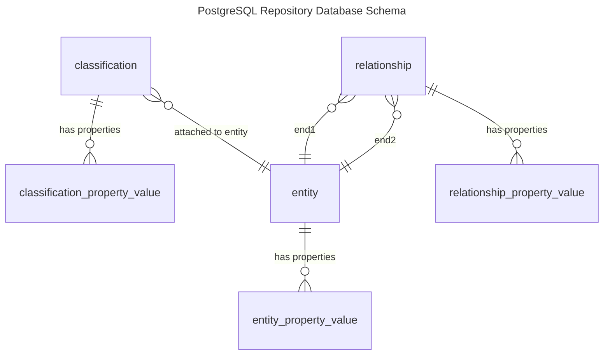

<!-- SPDX-License-Identifier: CC-BY-4.0 -->
<!-- Copyright Contributors to the ODPi Egeria project. -->


--8<-- "snippets/content-status/in-development.md"

# PostgreSQL Repository Connector

!!! info "Connector summary"

    - Connector Category: [Native Repository Connector](/concepts/repository-connector)
    - Hosting Service: [Open Metadata Repository Services (OMRS)](/services/omrs)
    - Hosting Server: [Metadata Access Store](/concepts/metadata-access-store)
    - Source Module: [postgres-repository-connector :material-github:](https://github.com/odpi/egeria/tree/main/open-metadata-implementation/adapters/open-connectors/repository-services-connectors/open-metadata-collection-store-connectors/postgres-repository-connector){ target=gh }
    - Jar File Name: `postgres-repository-connector.jar`
    - ConnectorProviderClassName: `org.odpi.openmetadata.adapters.repositoryservices.inmemory.repositoryconnector/PostgresOMRSRepositoryConnectorProvider.java`


The PostgreSQL OMRS Repository Connector provides a repository implementation that stores metadata in a PostgreSQL Database.  Each Open Metadata Repository uses the same table structure within its own Database Schema.  This database schema is managed by a single instance of the PostgreSQL Repository Connector.

Access to the PostgreSQL Database Schema is provided by the [JDBC Resource Connector](/connectors/resource/jdbc-resource-connector).  This connector manages the SQL Queries, connection management and use of the secrets store for security connections.

The diagram below shows the tables used in the PostgreSQL Database Schema.



## Debugging

Logging levels can be set up in the `application.properties` file.  To log each SQL command issues, add the following:

```
logging.level.org.odpi.openmetadata.adapters.connectors.resource.jdbc=DEBUG
```

To log how queries are built up from the values supplied on the repository API, add the following:

```
logging.level.org.odpi.openmetadata.adapters.repositoryservices.postgres.repositoryconnector.database=DEBUG
```

--8<-- "snippets/abbr.md"

