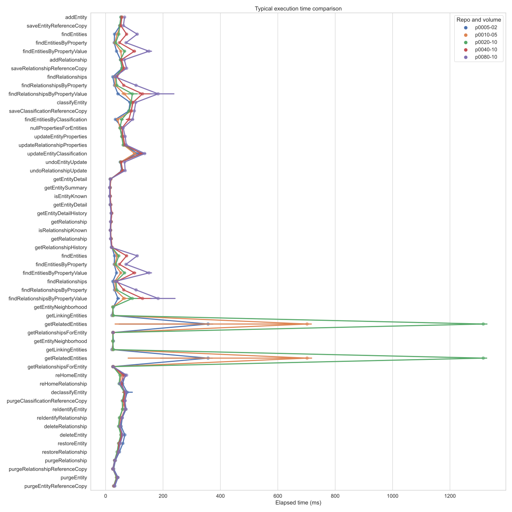
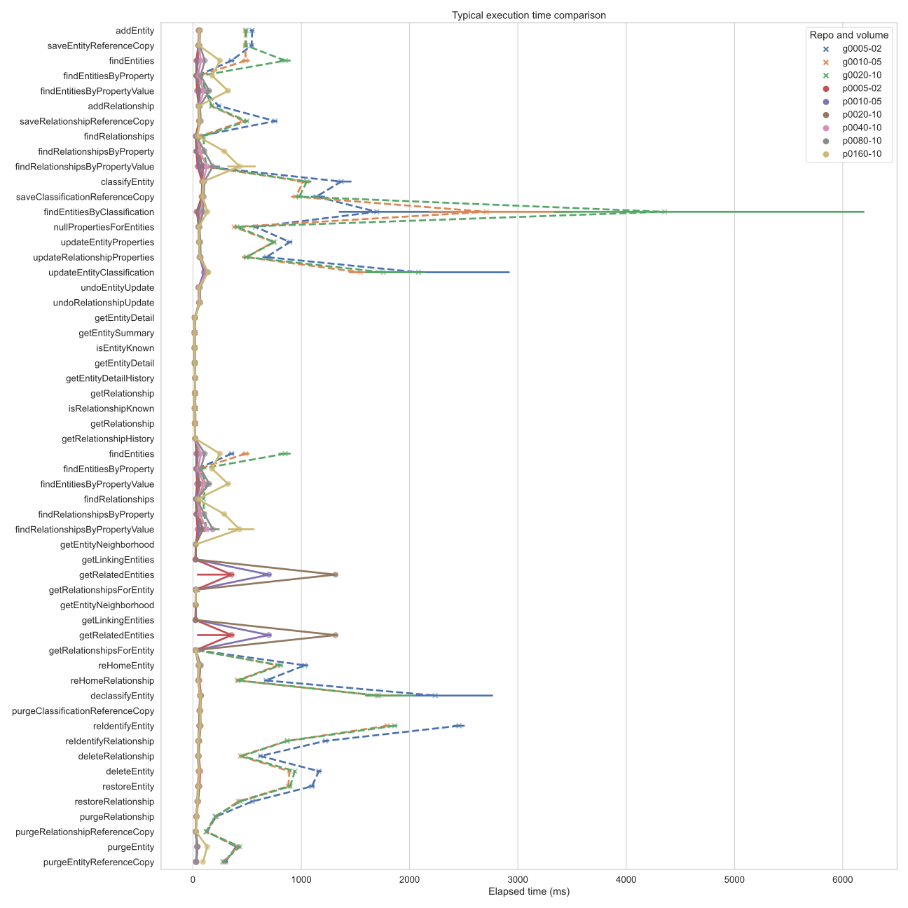
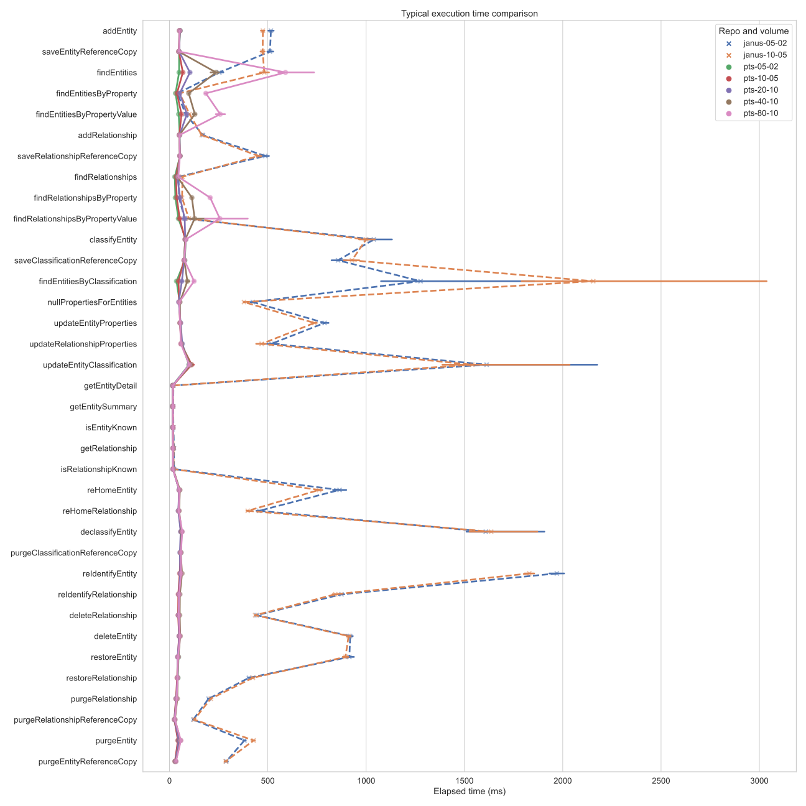

<!-- SPDX-License-Identifier: CC-BY-4.0 -->
<!-- Copyright Contributors to the Egeria project. -->

# XTDB Connector Performance

Following are details on XTDB's performance at the latest release of the connector (v3.4, using XTDB v1.20.0). All raw metrics and elements used to produce the results are described further under [reproducibility](#reproducibility) below, but the historical details themselves are no longer included below in the interest of being concise.

??? info "Details on the performance metrics"
    The *median* of all results for that method across all executions for a given set of volume parameters is given (all times in milliseconds) to give an idea of the "typical" result, while limiting potential skew from significant outliers.

    A more detailed set of statistics is best reviewed through the Jupyter Notebook provided in each results directory, where you can review:

    - the full distributions of execution times (including the outliers)
    - detailed individual outlier results (e.g. the top-10 slowest response times per method)
    - volumes in place during the tests (how many entities, how many relationships, etc)
    
    The volume parameters that were used for each test are specified using the convention `i-s`, where `i` is the value for the `instancesPerType` parameter to the PTS and `s` is the value for `maxSearchResults`. For example, `0005-02` means 5 instances will be created for every open metadata type and 2 will be the maximum number of results per page for methods that include paging.

    - All tests are run from `0005-02` through `0020-10` to give a sense of the performance impact of doubling the number of instances and search results.
    - Above this, the graph queries are no longer included: they become exponentially more complex as the volumes grow, and while they will still return results, the depth of their testing in the PTS means that they can contribute many hours (or even days) to the overall suite execution -- they are therefore left out to be able to more quickly produce results for the other methods at progressively higher volumes.
    - The page size is left at a maximum of `10` for subsequent tests so that it is only the volume of instances in total that are doubling each time, rather than also the number of detailed results.
    - Instance counts range from a few thousand (at `0005-02`) up to nearly one hundred thousand (at `0080-10`).
    - If time allows prior to the next release cycle, the XTDB connector will continue to be tested up to higher volumes (ideally up to `1280-10`, which is approximately 1.25 million metadata instances).

    In the graphical comparisons, a point plot is used to show the typical execution time of each method at the different volumes / by repository. Each point on the plot represents the _median_ execution time for that method, at a given volume of metadata. (For the repository comparison plots, `p` = XTDB and `g` = JanusGraph.) The horizontal lines that appear around each point are confidence intervals calculated by a bootstrapping process: in simple terms, the larger the horizontal line, the more variability there is for that particular method's execution time (a singular median value is insufficient to represent such variability on its own).

## XTDB at varying volumes

!!! summary
    The retrieval and write operations remain very consistent, with almost no variability, throughout the growth in volume. The search operations, however, begin to clearly degrade at the highest volumes tested. Further investigation into other optimized settings for the search operations for these larger volumes is likely warranted as the next step to continue to improve performance.

| Profile                        | Method                           | 0005-02 (4,920) | 0010-05 (9,840) | 0020-10 (19,680) | 0040-10 (39,360) | 0080-10 (78,720) | 0160-10 (157,440) | 0320-10 (314,880) | 0640-10 (629,760) | 1280-10 (1,259,520) |
|--------------------------------|----------------------------------|-----------------|-----------------|------------------|------------------|------------------|-------------------|-------------------|-------------------|---------------------|
| Entity creation                | addEntity                        | 51.0            | 50.0            | 50.0             | 50.0             | 53.0             |                   |                   |                   |                     |
| ...                            | saveEntityReferenceCopy          | 47.0            | 46.0            | 45.0             | 46.0             | 50.0             |                   |                   |                   |                     |
| Entity search                  | findEntities                     | 28.0            | 35.0            | 42.0             | 60.0             | 100.0            |                   |                   |                   |                     |
| ...                            | findEntitiesByProperty           | 27.0            | 30.0            | 34.0             | 48.0             | 81.0             |                   |                   |                   |                     |
| ...                            | findEntitiesByPropertyValue      | 35.0            | 45.0            | 59.0             | 83.0             | 140.0            |                   |                   |                   |                     |
| Relationship creation          | addRelationship                  | 49.0            | 48.0            | 47.0             | 49.0             | 53.0             |                   |                   |                   |                     |
| ...                            | saveRelationshipReferenceCopy    | 54.0            | 53.0            | 52.0             | 54.0             | 60.0             |                   |                   |                   |                     |
| Relationship search            | findRelationships                | 25.0            | 30.0            | 33.0             | 33.0             | 37.0             |                   |                   |                   |                     |
| ...                            | findRelationshipsByProperty      | 27.0            | 30.0            | 38.0             | 59.0             | 103.0            |                   |                   |                   |                     |
| ...                            | findRelationshipsByPropertyValue | 36.0            | 45.0            | 59.0             | 83.0             | 148.0            |                   |                   |                   |                     |
| Entity classification          | classifyEntity                   | 76.0            | 82.5            | 78.0             | 81.0             | 89.0             |                   |                   |                   |                     |
| ...                            | saveClassificationReferenceCopy  | 72.5            | 76.0            | 73.0             | 75.0             | 83.0             |                   |                   |                   |                     |
| Classification search          | findEntitiesByClassification     | 34.0            | 44.0            | 54.0             | 76.0             | 100.5            |                   |                   |                   |                     |
| Entity update                  | nullPropertiesForEntities        | 48.0            | 46.0            | 47.0             | 48.0             | 55.0             |                   |                   |                   |                     |
| ...                            | updateEntityProperties           | 53.5            | 54.0            | 53.0             | 57.0             | 58.0             |                   |                   |                   |                     |
| Relationship update            | updateRelationshipProperties     | 61.0            | 62.0            | 58.0             | 58.0             | 62.0             |                   |                   |                   |                     |
| Classification update          | updateEntityClassification       | 109.0           | 109.0           | 113.0            | 112.0            | 115.0            |                   |                   |                   |                     |
| Entity undo                    | undoEntityUpdate                 | 47.0            | 51.0            | 48.0             | 50.0             | 52.0             |                   |                   |                   |                     |
| Relationship undo              | undoRelationshipUpdate           | 52.0            | 58.0            | 51.5             | 54.0             | 57.0             |                   |                   |                   |                     |
| Entity retrieval               | getEntityDetail                  | 16.0            | 18.0            | 15.0             | 16.0             | 17.0             |                   |                   |                   |                     |
| ...                            | getEntitySummary                 | 16.0            | 18.0            | 15.0             | 16.0             | 17.0             |                   |                   |                   |                     |
| ...                            | isEntityKnown                    | 16.0            | 18.0            | 15.0             | 16.0             | 17.0             |                   |                   |                   |                     |
| Entity history retrieval       | getEntityDetail                  | 21.0            | 23.0            | 18.0             | 20.0             | 22.0             |                   |                   |                   |                     |
| ...                            | getEntityDetailHistory           | 22.0            | 25.0            | 20.0             | 22.0             | 23.0             |                   |                   |                   |                     |
| Relationship retrieval         | getRelationship                  | 18.0            | 19.0            | 16.0             | 17.0             | 18.0             |                   |                   |                   |                     |
| ...                            | isRelationshipKnown              | 18.0            | 20.0            | 16.0             | 17.0             | 18.0             |                   |                   |                   |                     |
| Relationship history retrieval | getRelationship                  | 23.0            | 24.0            | 20.0             | 21.0             | 23.0             |                   |                   |                   |                     |
| ...                            | getRelationshipHistory           | 24.0            | 26.0            | 21.0             | 22.0             | 24.0             |                   |                   |                   |                     |
| Entity history search          | findEntities                     | 32.0            | 41.0            | 50.0             | 76.0             | 130.0            |                   |                   |                   |                     |
| ...                            | findEntitiesByProperty           | 29.0            | 34.0            | 33.0             | 40.0             | 50.0             |                   |                   |                   |                     |
| ...                            | findEntitiesByPropertyValue      | 39.0            | 50.0            | 66.0             | 99.0             | 157.0            |                   |                   |                   |                     |
| Relationship history search    | findRelationships                | 30.0            | 37.0            | 41.0             | 43.0             | 44.0             |                   |                   |                   |                     |
| ...                            | findRelationshipsByProperty      | 36.0            | 43.0            | 50.0             | 52.0             | 57.0             |                   |                   |                   |                     |
| ...                            | findRelationshipsByPropertyValue | 54.0            | 80.0            | 113.0            | 138.0            | 210.0            |                   |                   |                   |                     |
| Graph queries                  | getEntityNeighborhood            | 28.0            | 27.0            | 25.0             | 27.0             | 29.0             |                   |                   |                   |                     |
| ...                            | getLinkingEntities               | 23.0            | 27.0            | 27.0             | --               | --               |                   |                   |                   |                     |
| ...                            | getRelatedEntities               | 326.0           | 596.0           | 1246.5           | --               | --               |                   |                   |                   |                     |
| ...                            | getRelationshipsForEntity        | 28.0            | 28.0            | 26.0             | 28.0             | 30.0             |                   |                   |                   |                     |
| Graph history queries          | getEntityNeighborhood            | 28.0            | 27.0            | 24.0             | 26.0             | 28.0             |                   |                   |                   |                     |
| ...                            | getLinkingEntities               | 24.0            | 28.0            | 27.0             | --               | --               |                   |                   |                   |                     |
| ...                            | getRelatedEntities               | 330.0           | 596.0           | 1247.0           | --               | --               |                   |                   |                   |                     |
| ...                            | getRelationshipsForEntity        | 26.0            | 26.0            | 24.0             | 26.0             | 28.0             |                   |                   |                   |                     |
| Entity re-home                 | reHomeEntity                     | 48.0            | 47.0            | 50.0             | 50.0             | 54.0             |                   |                   |                   |                     |
| Relationship re-home           | reHomeRelationship               | 45.0            | 43.0            | 46.0             | 45.0             | 49.0             |                   |                   |                   |                     |
| Entity declassify              | declassifyEntity                 | 60.0            | 58.0            | 62.0             | 62.0             | 67.0             |                   |                   |                   |                     |
| ...                            | purgeClassificationReferenceCopy | 54.0            | 50.0            | 56.0             | 57.0             | 62.0             |                   |                   |                   |                     |
| Entity re-identify             | reIdentifyEntity                 | 56.0            | 53.0            | 56.0             | 59.0             | 62.0             |                   |                   |                   |                     |
| Relationship re-identify       | reIdentifyRelationship           | 47.0            | 45.0            | 45.0             | 48.0             | 52.0             |                   |                   |                   |                     |
| Relationship delete            | deleteRelationship               | 44.0            | 42.0            | 42.0             | 46.0             | 49.0             |                   |                   |                   |                     |
| Entity delete                  | deleteEntity                     | 48.0            | 48.0            | 49.0             | 53.0             | 57.0             |                   |                   |                   |                     |
| Entity restore                 | restoreEntity                    | 42.0            | 41.0            | 43.0             | 46.0             | 48.0             |                   |                   |                   |                     |
| Relationship restore           | restoreRelationship              | 38.0            | 38.0            | 38.0             | 41.0             | 45.0             |                   |                   |                   |                     |
| Relationship purge             | purgeRelationship                | 31.0            | 30.0            | 29.0             | 32.0             | 35.0             |                   |                   |                   |                     |
| ...                            | purgeRelationshipReferenceCopy   | 26.0            | 25.0            | 23.0             | 26.0             | 29.0             |                   |                   |                   |                     |
| Entity purge                   | purgeEntity                      | 36.0            | 36.0            | 37.0             | 39.0             | 49.0             |                   |                   |                   |                     |
| ...                            | purgeEntityReferenceCopy         | 28.0            | 27.0            | 28.0             | 30.0             | 36.0             |                   |                   |                   |                     |

## XTDB vs JanusGraph

!!! summary
    In almost all cases, the XTDB repository is *significantly* faster than JanusGraph: at most volumes completing all methods in less than 100ms and with very little variability. For JanusGraph, on the other hand, there is significant variability (in particular for methods like `findEntitiesByClassification`), and there are numerous examples of the median execution time taking more than multiple seconds.

    Even at 8 times the volume of metadata the XTDB connector still outperforms the JanusGraph connector in almost every method (the only exceptions being a few of the find methods, where the performance is approximately even at 2-4 times the volume).

!!! attention "Graph queries were disabled for JanusGraph"
    The graph queries were disabled for JanusGraph in order to have results in a timely manner: it would take more than a month to produce results for these queries for the JanusGraph connector. In addition, the 0040-10 and beyond scales were stopped when a single test scenario ran for more than 5 consecutive days (120 hours) without completing.

The XTDB results can be difficult to see in detail due to the skew from the Janus results, so it may be easier to look at this more granular comparison that drops the higher scales of Janus for readability of the XTDB results:

| Profile                        | Method                           | 0005-02 (XTDB) | 0005-02 (Janus) | 0010-05 (XTDB) | 0010-05 (Janus) | 0020-10 (XTDB) | 0020-10 (Janus) | 0040-10 (XTDB) | 0040-10 (Janus) | 0080-10 (XTDB) | 0080-10 (Janus) | 0160-10 (XTDB) |
|--------------------------------|----------------------------------|----------------|-----------------|----------------|-----------------|----------------|-----------------|----------------|-----------------|----------------|-----------------|----------------|
| Entity creation                | addEntity                        | 51.0           | 493.0           | 50.0           | 524.0           | 50.0           | WIP             | 50.0           | DNF             | 53.0           | DNF             | WIP            |
| ...                            | saveEntityReferenceCopy          | 47.0           | 486.5           | 46.0           | 519.0           | 45.0           | WIP             | 46.0           | DNF             | 50.0           | DNF             | WIP            |
| Entity search                  | findEntities                     | 28.0           | 201.0           | 35.0           | 375.0           | 42.0           | WIP             | 60.0           | DNF             | 100.0          | DNF             | WIP            |
| ...                            | findEntitiesByProperty           | 27.0           | 36.0            | 30.0           | 47.0            | 34.0           | WIP             | 48.0           | DNF             | 81.0           | DNF             | WIP            |
| ...                            | findEntitiesByPropertyValue      | 35.0           | 76.0            | 45.0           | 95.0            | 59.0           | WIP             | 83.0           | DNF             | 140.0          | DNF             | WIP            |
| Relationship creation          | addRelationship                  | 49.0           | 162.5           | 48.0           | 165.0           | 47.0           | WIP             | 49.0           | DNF             | 53.0           | DNF             | WIP            |
| ...                            | saveRelationshipReferenceCopy    | 54.0           | 471.5           | 53.0           | 476.0           | 52.0           | WIP             | 54.0           | DNF             | 60.0           | DNF             | WIP            |
| Relationship search            | findRelationships                | 25.0           | 40.0            | 30.0           | 57.0            | 33.0           | WIP             | 33.0           | DNF             | 37.0           | DNF             | WIP            |
| ...                            | findRelationshipsByProperty      | 27.0           | 42.0            | 30.0           | 59.0            | 38.0           | WIP             | 59.0           | DNF             | 103.0          | DNF             | WIP            |
| ...                            | findRelationshipsByPropertyValue | 36.0           | 68.0            | 45.0           | 82.0            | 59.0           | WIP             | 83.0           | DNF             | 148.0          | DNF             | WIP            |
| Entity classification          | classifyEntity                   | 76.0           | 1005.0          | 82.5           | 1032.5          | 78.0           | WIP             | 81.0           | DNF             | 89.0           | DNF             | WIP            |
| ...                            | saveClassificationReferenceCopy  | 72.5           | 844.0           | 76.0           | 977.0           | 73.0           | WIP             | 75.0           | DNF             | 83.0           | DNF             | WIP            |
| Classification search          | findEntitiesByClassification     | 34.0           | 1008.0          | 44.0           | 1812.0          | 54.0           | WIP             | 76.0           | DNF             | 100.5          | DNF             | WIP            |
| Entity update                  | nullPropertiesForEntities        | 48.0           | 387.0           | 46.0           | 382.0           | 47.0           | WIP             | 48.0           | DNF             | 55.0           | DNF             | WIP            |
| ...                            | updateEntityProperties           | 53.5           | 752.0           | 54.0           | 740.0           | 53.0           | WIP             | 57.0           | DNF             | 58.0           | DNF             | WIP            |
| Relationship update            | updateRelationshipProperties     | 61.0           | 451.5           | 62.0           | 481.5           | 58.0           | WIP             | 58.0           | DNF             | 62.0           | DNF             | WIP            |
| Classification update          | updateEntityClassification       | 109.0          | 1478.0          | 109.0          | 1563.0          | 113.0          | WIP             | 112.0          | DNF             | 115.0          | DNF             | WIP            |
| Entity undo                    | undoEntityUpdate                 | 47.0           | --              | 51.0           | --              | 48.0           | --              | 50.0           | --              | 52.0           | --              | WIP            |
| Relationship undo              | undoRelationshipUpdate           | 52.0           | --              | 58.0           | --              | 51.5           | --              | 54.0           | --              | 57.0           | --              | WIP            |
| Entity retrieval               | getEntityDetail                  | 16.0           | 18.0            | 18.0           | 19.0            | 15.0           | WIP             | 16.0           | DNF             | 17.0           | DNF             | WIP            |
| ...                            | getEntitySummary                 | 16.0           | 17.0            | 18.0           | 18.0            | 15.0           | WIP             | 16.0           | DNF             | 17.0           | DNF             | WIP            |
| ...                            | isEntityKnown                    | 16.0           | 19.0            | 18.0           | 19.0            | 15.0           | WIP             | 16.0           | DNF             | 17.0           | DNF             | WIP            |
| Entity history retrieval       | getEntityDetail                  | 21.0           | --              | 23.0           | --              | 18.0           | --              | 20.0           | --              | 22.0           | --              | WIP            |
| ...                            | getEntityDetailHistory           | 22.0           | --              | 25.0           | --              | 20.0           | --              | 22.0           | --              | 23.0           | --              | WIP            |
| Relationship retrieval         | getRelationship                  | 18.0           | 21.0            | 19.0           | 21.0            | 16.0           | WIP             | 17.0           | DNF             | 18.0           | DNF             | WIP            |
| ...                            | isRelationshipKnown              | 18.0           | 22.0            | 20.0           | 21.0            | 16.0           | WIP             | 17.0           | DNF             | 18.0           | DNF             | WIP            |
| Relationship history retrieval | getRelationship                  | 23.0           | --              | 24.0           | --              | 20.0           | --              | 21.0           | --              | 23.0           | --              | WIP            |
| ...                            | getRelationshipHistory           | 24.0           | --              | 26.0           | --              | 21.0           | --              | 22.0           | --              | 24.0           | --              | WIP            |
| Entity history search          | findEntities                     | 32.0           | --              | 41.0           | --              | 50.0           | --              | 76.0           | --              | 130.0          | --              | WIP            |
| ...                            | findEntitiesByProperty           | 29.0           | --              | 34.0           | --              | 33.0           | --              | 40.0           | --              | 50.0           | --              | WIP            |
| ...                            | findEntitiesByPropertyValue      | 39.0           | --              | 50.0           | --              | 66.0           | --              | 99.0           | --              | 157.0          | --              | WIP            |
| Relationship history search    | findRelationships                | 30.0           | --              | 37.0           | --              | 41.0           | --              | 43.0           | --              | 44.0           | --              | WIP            |
| ...                            | findRelationshipsByProperty      | 36.0           | --              | 43.0           | --              | 50.0           | --              | 52.0           | --              | 57.0           | --              | WIP            |
| ...                            | findRelationshipsByPropertyValue | 54.0           | --              | 80.0           | --              | 113.0          | --              | 138.0          | --              | 210.0          | --              | WIP            |
| Graph queries                  | getEntityNeighborhood            | 28.0           | --              | 27.0           | --              | 25.0           | --              | 27.0           | --              | 29.0           | --              | WIP            |
| ...                            | getLinkingEntities               | 23.0           | --              | 27.0           | --              | 27.0           | --              | --             | --              | --             | --              | --             |
| ...                            | getRelatedEntities               | 326.0          | --              | 596.0          | --              | 1246.5         | --              | --             | --              | --             | --              | --             |
| ...                            | getRelationshipsForEntity        | 28.0           | 37.0            | 28.0           | 38.0            | 26.0           | WIP             | 28.0           | DNF             | 30.0           | DNF             | WIP            |
| Graph history queries          | getEntityNeighborhood            | 28.0           | --              | 27.0           | --              | 24.0           | --              | 26.0           | --              | 28.0           | --              | WIP            |
| ...                            | getLinkingEntities               | 24.0           | --              | 28.0           | --              | 27.0           | --              | --             | --              | --             | --              | --             |
| ...                            | getRelatedEntities               | 330.0          | --              | 596.0          | --              | 1247.0         | --              | --             | --              | --             | --              | --             |
| ...                            | getRelationshipsForEntity        | 26.0           | --              | 26.0           | --              | 24.0           | --              | 26.0           | --              | 28.0           | --              | WIP            |
| Entity re-home                 | reHomeEntity                     | 48.0           | 791.0           | 47.0           | 812.0           | 50.0           | WIP             | 50.0           | DNF             | 54.0           | DNF             | WIP            |
| Relationship re-home           | reHomeRelationship               | 45.0           | 389.5           | 43.0           | 432.0           | 46.0           | WIP             | 45.0           | DNF             | 49.0           | DNF             | WIP            |
| Entity declassify              | declassifyEntity                 | 60.0           | 1523.0          | 58.0           | 1714.0          | 62.0           | WIP             | 62.0           | DNF             | 67.0           | DNF             | WIP            |
| ...                            | purgeClassificationReferenceCopy | 54.0           | --              | 50.0           | --              | 56.0           | --              | 57.0           | --              | 62.0           | --              | WIP            |
| Entity re-identify             | reIdentifyEntity                 | 56.0           | 1852.0          | 53.0           | 1977.5          | 56.0           | WIP             | 59.0           | DNF             | 62.0           | DNF             | WIP            |
| Relationship re-identify       | reIdentifyRelationship           | 47.0           | 796.5           | 45.0           | 905.5           | 45.0           | WIP             | 48.0           | DNF             | 52.0           | DNF             | WIP            |
| Relationship delete            | deleteRelationship               | 44.0           | 407.5           | 42.0           | 439.0           | 42.0           | WIP             | 46.0           | DNF             | 49.0           | DNF             | WIP            |
| Entity delete                  | deleteEntity                     | 48.0           | 825.0           | 48.0           | 918.0           | 49.0           | WIP             | 53.0           | DNF             | 57.0           | DNF             | WIP            |
| Entity restore                 | restoreEntity                    | 42.0           | 834.5           | 41.0           | 928.5           | 43.0           | WIP             | 46.0           | DNF             | 48.0           | DNF             | WIP            |
| Relationship restore           | restoreRelationship              | 38.0           | 377.0           | 38.0           | 412.0           | 38.0           | WIP             | 41.0           | DNF             | 45.0           | DNF             | WIP            |
| Relationship purge             | purgeRelationship                | 31.0           | 186.0           | 30.0           | 200.0           | 29.0           | WIP             | 32.0           | DNF             | 35.0           | DNF             | WIP            |
| ...                            | purgeRelationshipReferenceCopy   | 26.0           | 114.5           | 25.0           | 121.0           | 23.0           | WIP             | 26.0           | DNF             | 29.0           | DNF             | WIP            |
| Entity purge                   | purgeEntity                      | 36.0           | 370.0           | 36.0           | 399.0           | 37.0           | WIP             | 39.0           | DNF             | 49.0           | DNF             | WIP            |
| ...                            | purgeEntityReferenceCopy         | 28.0           | 278.0           | 27.0           | 275.0           | 28.0           | WIP             | 30.0           | DNF             | 36.0           | DNF             | WIP            |

## Reproducibility

### Re-running the tests

Two Helm charts are provided, that were used to automate the execution of these suites against the XTDB repository connector:

- [The Helm chart used to execute the CTS suite](/egeria-docs/guides/operations/kubernetes/charts/cts)
- [The Helm chart used to execute the PTS suite](/egeria-docs/guides/operations/kubernetes/charts/pts)

These use a default configuration for the XTDB repository where Lucene is used as a text index and RocksDB is used for all persistence: index store, document store and transaction log. No additional tuning of any parameters (XTDB or RocksDB) is applied: they use all of their default settings.

### Data points

The [`cts/results` :material-github:](https://github.com/odpi/egeria-connector-xtdb/tree/main/cts/results){ target=gh } directory in the code repository for the connector contains results of running the suites against the XTDB connector. For each test suite execution, you will find the following details:

- `openmetadata_pts_summary.json` - a summary of the results of each profile
- Description of the k8s environment
    - `deployment` - details of the deployed components used for the test
    - `configmap.yaml` - details of the variables used within the components of the test
- The OMAG Server configurations:
    - `omag.server.[tut|xtdb|crux].config` - the configuration of the XTDB connector (proxy)
    - `omag.server.pts.config` - the configuration of the test workbench
- The cohort registrations:
    - `cohort.[pts|coco].[tut|xtdb|crux].local` - the local XTDB connector (proxy) cohort registration information
    - `cohort.[pts|coco].[tut|xtdb|crux].remote` - the cohort members considered remote from the XTDB connector (proxy)'s perspective
    - `cohort.[pts|coco].pts.local` - the local test Workbench cohort registration
    - `cohort.[pts|coco].pts.remote` - the cohort members considered remote from the test Workbench's perspective
- Detailed results:
    - `pd.tar.gz` - an archive containing the full detailed results of every profile tested
    - `tcd.tar.gz` - an archive containing the full detailed results of every test case executed
- Jupyter Notebooks used to analyze the results:
    - `analyze-performance-results.ipynb` - details about the environment, instance counts, and distribution of elapsed times per method, also illustrating how the results can be analyzed more deeply
    - `calculate-medians.ipynb` - used to calculate the medians displayed in the table further below
    - (to run either of these notebooks, you will need to first extract the `pd.tar.gz` file to have the JSON results files for analysis)

--8<-- "snippets/abbr.md"
