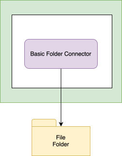

<!-- SPDX-License-Identifier: CC-BY-4.0 -->
<!-- Copyright Contributors to the Egeria project. -->

# Basic Folder Resource Connector

???+ info "Connector summary"
    - Connector Category: [Digital Resource Connector](/concepts/digital-resource-connector)
    - Source Module: [basic-file-connector :material-github:](https://github.com/odpi/egeria/tree/main/open-metadata-implementation/adapters/open-connectors/data-store-connectors/file-connectors/basic-file-connector){ target=gh }.
    - Jar File Name: `basic-file-connector.jar`
    - Supported Asset Type: [FileFolder](/types/2/0220-Files-and-Folders)

The basic folder resource connector provides support to read and write the files in a folder (directory) using the Java File object.

--8<-- "snippets/abbr.md"
