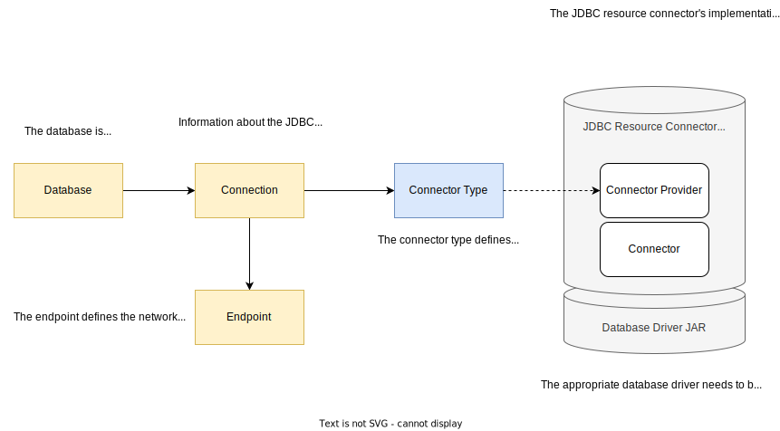

<!-- SPDX-License-Identifier: CC-BY-4.0 -->
<!-- Copyright Contributors to the ODPi Egeria project. -->
  
--8<-- "snippets/content-status/tech-preview.md"

# JDBC Resource Connector

???+ info "Connector summary"
    - Connector Category: [Digital Resource Connector](/concepts/digital-resource-connector)
    - Source Module: [jdbc resource connector :material-github:](https://github.com/odpi/egeria/tree/main/open-metadata-implementation/adapters/open-connectors/data-store-connectors/jdbc-resource-connector){ target=gh }.
    - Jar File Name: `jdbc-resource-connector.jar`
    - Supported Asset Type: [RelationalDatabase](/types/2/0224-Databases)


The JDBC Resource Connector provides a DataSource, which in turn is used to get a connection to underlying database.  It provides access to both the schema metadata and the business data content.


> **Figure 1:** JDBC resource connector


## Usage

The connector is initialized using the connection information attached to the [RelationalDatabase](/types/2/0224-Databases) asset in the open metadata ecosystem.


> **Figure 2:** Connection information used to create an instance of the JDBC resource connector

The optional configuration properties supported by this connector are:

* `jdbcDriverManagerClassName` - requests the named class to be loaded and registered as a driver. This property only needs to be defined if the connector is experiencing exceptions related to a missing DriverManager class for the database URL.
* `jdbcConnectionTimeout` - sets the maximum time in seconds that this data source will wait while attempting to connect to a database. The default value is 0 which means use the system default timeout, if any; otherwise it means no timeout.
* `jdbcDatabaseName` - provides a name to use in messages about the database.  If it is not set then the connection URL string is used.

Below is an example connection for a PostgreSQL database:

```json
{
    "class": "Connection",
    "connectorType": {
      "class": "ConnectorType",
      "connectorProviderClassName": "org.odpi.openmetadata.adapters.connectors.resource.jdbc.JDBCResourceConnectorProvider"
    },
    "endpoint": {
      "class": "Endpoint",
      "address": "jdbc:postgresql://localhost:5432/myDatabase"
    },
    "userId": "xxxxx",
    "clearPassword": "xxxx",
    "configurationProperties": {
      "jdbcDriverManagerClassName": "org.postgresql.Driver",
      "jdbcConnectionTimeout": "10",
      "jdbcDatabaseName": "MyDatabase"
    }
}
```

--8<-- "snippets/abbr.md"

