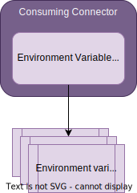

<!-- SPDX-License-Identifier: CC-BY-4.0 -->
<!-- Copyright Contributors to the ODPi Egeria project. -->

--8<-- "snippets/content-status/stable.md"

# Environment Variable Secrets Store Connector

!!! info "Connector details"
    - Connector Category: [Secret Store Connector](/concepts/secrets-store-connector)
    - Source Module: [env-variable-secrets-store-connector :material-github:](https://github.com/odpi/egeria/tree/main/open-metadata-implementation/adapters/open-connectors/secrets-store-connectors/env-variable-secrets-store-connector){ target=gh }
    - Jar File Name: `env-variable-secrets-store-connector.jar`

## Overview

The *Environment Variable Secrets Store Connector* retrieves secrets from environment variables.  The name of the secret requested is the name of the environment variable it tries to retrieve.  It returns null if the environment variable is not defined.


> **Figure 1:** Operation of the Environment Variable Secrets Store Connector


## Configuration

This is its connection definition to embed into a connector's connection object.

!!! example "Connection configuration for the environment variable secrets store connector"
    ```json linenums="1" hl_lines="14"
    {
        "connection" : 
        { 
            "class" : "Connection",
            "qualifiedName" : "Egeria:SecretsStoreConnector:Environment Variables Connection",
            "connectorType" : 
            {
                "class" : "ConnectorType",
                "connectorProviderClassName" : "org.odpi.openmetadata.adapters.connectors.secretsstore.envar.EnvVarSecretsStoreProvider"
            }
        }
    }
    ```

---8<-- "snippets/abbr.md"
