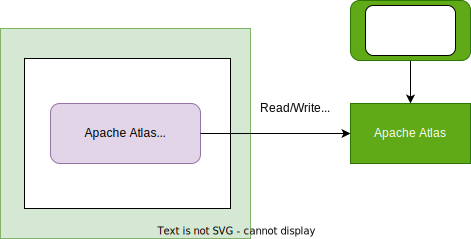

<!-- SPDX-License-Identifier: CC-BY-4.0 -->
<!-- Copyright Contributors to the Egeria project. -->

--8<-- "snippets/content-status/stable.md"

# Apache Atlas REST Connector

???+ info "Connector summary"
    - Connector Category: [Digital Resource Connector](/concepts/digital-resource-connector)
    - Source Module: [apache-atlas-rest-connector :material-github:](https://github.com/odpi/egeria/tree/main/open-metadata-implementation/adapters/open-connectors/system-connectors/apache-atlas-rest-connector){ target=gh }
    - Jar File Name: `apache-atlas-rest-connector.jar`

---8<-- "snippets/systems/apache-atlas-intro.md"

Th Apache Atlas REST connector is a [digital resource connector](/concepts/digital-resource-connector) that provides a Java interface to Apache Atlas's REST API plus offering useful additional services to help an application to integrate with Apache Atlas.

> **Figure 1:** Operation of the Apache Atlas REST Connector

--8<-- "snippets/abbr.md"

-