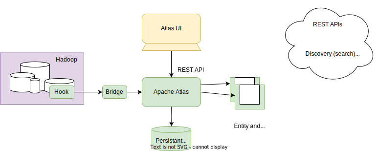
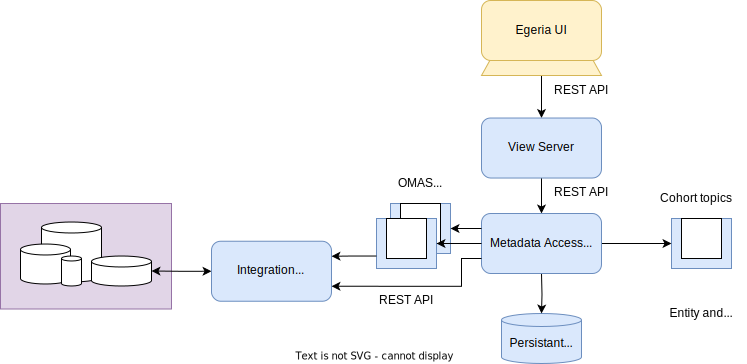

<!-- SPDX-License-Identifier: CC-BY-4.0 -->
<!-- Copyright Contributors to the ODPi Egeria project 2020. -->

# Apache Atlas

[Apache Atlas](https://atlas.apache.org) is a metadata server and UI designed to catalog both the data and associated processing within a Hadoop deployment.  The open metadata and governance capability of Egeria started out as a module in Apache Atlas, but as its function grew, it became obvious that it should be a project in its own right and the Egeria project was born.  

In the intervening years, Egeria has flourished and developed a rich set of services.  However, the original association often means that the two technologies are often compared.  Indeed, Apache Atlas influenced many of the base capabilities for Egeria.

## Overview of Apache Atlas

The diagram below shows the key features of Apache Atlas.

Apache Atlas has a server that supports a variety of REST API services.  These services are used by its browser-based UI and its integration function that captures metadata from the running Hadoop technologies (called the hooks and bridges).

Metadata is stored through JanusGraph services to a choice of persistent stores supported by JanusGraph.  Choosing a highly available persistent store such as HBASE means that Apache Atlas can support Active-Passive HA operations.

Metadata is organized as a graph where the nodes are called *Entities* and the links between the nodes are called *Relationships*.  Entities can have tags called classifications that provide additional information about their attached entity.

Entities, relationships and classifications can have properties associated with them.  The properties that are valid in a type of entity, relationship or classification is defined in a type definition (TypeDef).  These type definitions are typically loaded at server start up via JSON files.  Alternatively they can be defined dynamically using the *Types* REST API.

Instances of entities (with their classifications) can be created and maintained using Apache Atlas's Entity REST API.  Similarly, instance of relationships can be created and maintained using Apache Atlas's Relationship REST API.

When changes are made to an entity (or one of its classifications), a notification is sent on Apache Atlas's entity topic.  Similarly, when changes are made to a relationship, a notification is sent on Apache Atlas's relationship topic.

Searching the content of Apache Atlas's repository is done through the Discovery REST API.  There are different type of search supported that vary in sophistication and scope.

Apache Atlas's focus on the Hadoop ecosystem has resulted in it providing automated cataloguing of Hadoop data stores such as Hive and HDFS, plus processing services such as Falcon and Sqoop.  They are activated by installing the appropriate hook/bridge into the hadoop environment and configuring them with the location of the Apache Atlas server.  The result is a metadata description of the hadoop data, the processing that is running and how data is flowing between the data stores (this information is called lineage and is maintained and accessed through the Lineage REST API).

Apache Atlas's main focus is to document a Hadoop deployment, principally for technical users.  However, it does support the attachment of business metadata properties to the technical metadata and describe the business terminology in a glossary.  This business terminology is maintained through the Glossary REST API.  technical metadata can be tagged with the glossary terms to allow business type searches.

One of the uses of the business terms and the classifications is to identify where sensitive data is stored.  Apache Atlas has an integration with Apache Ranger to pass details of the tags assigned to the technical metadata to ranger, so they can be used in security rules that control access to data at runtime.

## Comparison with Egeria

### Deployment infrastructure

If you are familiar with Egeria, you will recognize that may of the Apache Atlas concepts appear in Egeria.  However, there are differences in the implementations because of their differences in mission/purpose.

While Apache Atlas provides centralized metadata support to a single environment, Egeria's operation is distributed and aims to integrate a heterogeneous technical landscape that is deployed in different data centers.  It adds governance and business context in a rich manner that allows different parts of an organization to collaborate.  It has many frameworks to allow plug-ability, both in the services it uses, the technologies it is integrating and the governance policies and rules it is implementing.

The diagram below shows an equivalent deployment of Egeria to cover the Apache Atlas features.

The first difference you notice is that Egeria has many more "servers" running.  These are logical [OMAG Servers](/concepts/omag-server) that can be deployed together on a single [OMAG Server Platform](/concepts/omag-server-platform) or replicated/distributed across multiple platforms to support horizontal scaling, isolation and high availability.

Egeria's [Metadata Access Store](/concepts/metadata-access-store) is similar to Apache Atlas's server.  It provides REST APIs to maintain and search for metadata.  It also uses an external persistence store that is controlled by the libraries "plugged into" the metadata access store via a [repository connector](/concepts/repository-connector).  Egeria does have a [repository connector for JanusGraph](/connectors/repository/janus-graph/overview), so it is possible to deploy Egeria with the same type of persistent capability as Apache Atlas, however, neither server can read the other's repository despite using the same type of technology.  Egeria also has other repository connector implementations to provide additional features.  For example, the [XTDB repository connector](/connectors/repository/xtdb) provides historical queries over the metadata.

The [Open Metadata Repository Services (OMRS)](/services/omrs) REST APIs are similar to Apache Atlas's Types, Entity, Relationship and Discovery Rest APIs.  Egeria also has more domain-specific REST APIs called [Open Metadata Access Services (OMAS)](/services/omas) to provide technical, governance and business metadata services for different user roles and use cases.

The OMRS also creates instance notifications similar to Apache Atlas's Entity and Relationship notifications through its [Cohort Topics](/concepts/cohort-events).  These topics also provide notifications about type changes and aid different deployments of Egeria to connect and share metadata.

Egeria's UI is supported via the REST services of the [View Server](/concepts/view-server).  The *View Server* is stateless and can be scaled independently to the *Metadata Access Store*.  It provides additional validation to protect the metadata services behind it from cyberattacks.

Egeria's [Integration Daemon](/concepts/integration-daemon) is Egeria's equivalent to Apache Atlas's hooks and bridges.  Just like the *View Server*, it can be deployed with the *Metadata Access Store* or deployed and scaled independently.  It runs [integration connectors](/concepts/integration-connector) that each connect to a third party technology to exchange metadata.  Egeria supports some integration connectors [out of the box](/connectors/#integration-connectors) plus a SDK to allow you to [build and deploy your own](/guides/developer/integration-connectors/overview).

Egeria also has [Governance Servers](/concepts/governance-server) that enable different types of governance processes to be configured and controlled.

### Types

Egeria's type system is modelled on Apache Atlas's type system.  However, there are changes to allow the types to operate in a distributed heterogeneous deployment.

The biggest differences are:

* Egeria introduces type definitions for attributes (properties). These are called [AttributeTypeDefs](/concepts/open-metadata-type-definitions).
* Egeria's [pre-defined type system](/types) is more comprehensive and normalized to facilitate governance over a wide range of activities and technologies.

When you are either migrating between Apache Atlas and Egeria, the differences in the pre-defined types is the biggest challenge you are going to face.

!!! education "Connectors for Apache Atlas"
    * [Apache Atlas REST Connector](/connectors/system/apache-atlas-rest-connector) provides a Java interface to the Apache Atlas REST APIs.
    * [Apache Atlas Survey Service](/connectors/discovery/apache-atlas-survey-service) builds a discovery analysis report on the contents of an Apache Atlas metadata repository.
    * [Apache Atlas Integration Connector](/connectors/integration/apache-atlas-catalog-integration-connector) synchronizes metadata between Apache Atlas and the open metadata ecosystem.

--8<-- "snippets/abbr.md"

