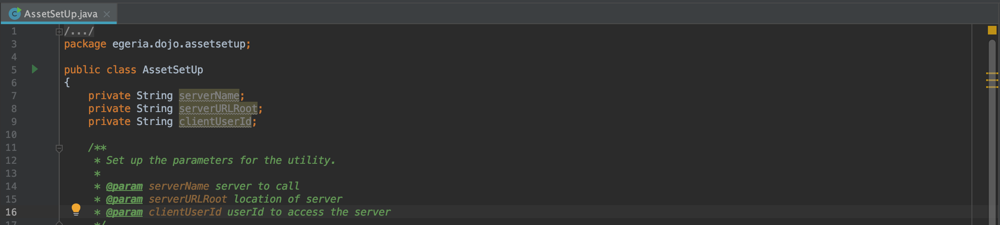

<!-- SPDX-License-Identifier: CC-BY-4.0 -->
<!-- Copyright Contributors to the Egeria project. -->

Paste this code between the curly braces of the `AssetSetUp` class.

```java
    private String serverName;
    private String serverURLRoot;
    private String clientUserId;

    /**
     * Set up the parameters for the utility.
     *
     * @param serverName server to call
     * @param serverURLRoot location of server
     * @param clientUserId userId to access the server
     */
    private AssetSetUp(String serverName,
                       String serverURLRoot,
                       String clientUserId)
    {
        this.serverName = serverName;
        this.serverURLRoot = serverURLRoot;
        this.clientUserId = clientUserId;
    }


    /**
     * This runs the utility
     */
    private void run()
    {
        try
        {
            // The code to create the asset goes here
        }
        catch (Exception error)
        {
            System.out.println("There was a " + error.getClass().getName() + " exception when calling the OMAG Server Platform.  Error message is: " + error.getMessage());
        }
    }


    /**
     * Main program that initiates the operation of the AssetSetUp utility.  The parameters are optional.  They are passed space separated.
     * They are used to override the utility's default values.
     *
     * @param args 1. service platform URL root, 2. client userId, 3. server name,
     */
    public static void main(String[] args)
    {
        String  platformURLRoot = "https://localhost:9443";
        String  clientUserId = "erinoverview";
        String  serverName = "mds1";

        if (args.length > 0)
        {
            platformURLRoot = args[0];
        }

        if (args.length > 1)
        {
            clientUserId = args[1];
        }

        if (args.length > 2)
        {
            serverName = args[2];
        }

        System.out.println("===============================");
        System.out.println("Asset Set Up Utility:          ");
        System.out.println("===============================");
        System.out.println("Running against platform: " + platformURLRoot);
        System.out.println("Focused on server: " + serverName);
        System.out.println("Using userId: " + clientUserId);
        System.out.println();

        try
        {
            AssetSetUp assetSetUp = new AssetSetUp(serverName, platformURLRoot, clientUserId);

            assetSetUp.run();
        }
        catch (Exception  error)
        {
            System.out.println("Exception: " + error.getClass().getName() + " with message " + error.getMessage());
            System.exit(-1);
        }
    }
```

On the right-hand side of the editor you will see a square of yellow and 4 little yellow lines.  



The yellow lines are warnings that the code is incomplete.  You can hover the mouse pointer over these lines and the reason for the warning is displayed.   As you add content to the file during this exercise, these lines should disappear.  If you make a syntax error, you will see a red line in this column showing which line is in error.  The yellow box at the top is a summary of the findings of the static analysis.  Hovering the mouse pointer over this area will show the report.  It will change colour to indicate the most serious finding.  You are aiming for a green tick, which means no errors have been found.