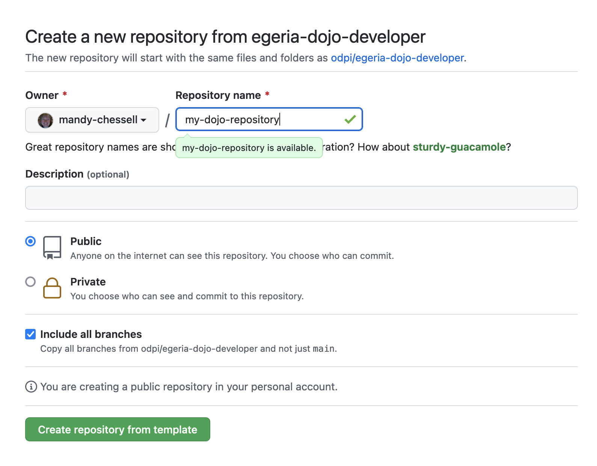
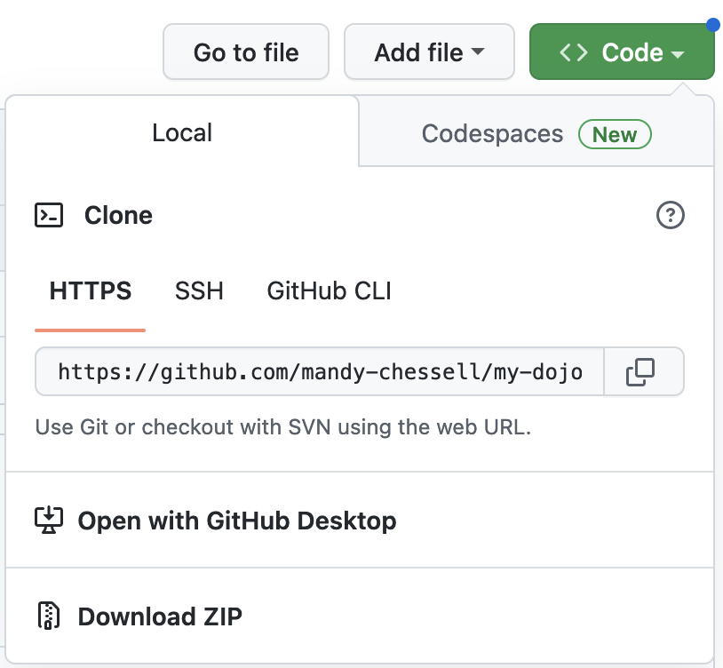

<!-- SPDX-License-Identifier: CC-BY-4.0 -->
<!-- Copyright Contributors to the Egeria project. -->

Link to the template repository: [https://github.com/odpi/egeria-dojo-developer](https://github.com/odpi/egeria-dojo-developer){ target=gh }.

Click on the `Use this template` button and select `Create a new repository`.


A new page is displayed.  Enter the name of your new repository, click the option `Include all branches`.  This will copy both the template code and the worked answers.  It is up to you whether you want the repository to be public or private.  If it is public, it is easier for the Egeria community to help you if you get stuck.



Select the `Code` button and copy the HTTPS URL to clone this repository.



On your laptop ... from a command window 

Create a new directory for your work:

```bash
mkdir egeria-dojo
```
Change to your new directory.

```bash
cd egeria-dojo
```

Clone your new repository replacing the url with the url of your repository:

```bash
git clone https://github.com/USER/my-dojo-repository.git
```

A new directory has been created with the template code.

```bash
cd egeria-dojo
```

The ls command allows you to list the files from the repository:

```bash
ls
```

It should be the same as the contents of the git repository on GitHub.

--8<-- "snippets/abbr.md"


