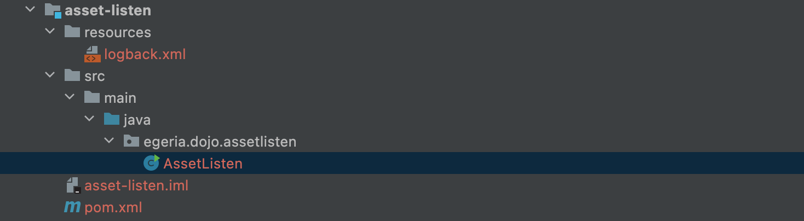

<!-- SPDX-License-Identifier: CC-BY-4.0 -->
<!-- Copyright Contributors to the Egeria project. -->

Open the template workspace in IntelliJ. You will see there are four projects.  

Open up the **asset-listen** folder. You will see under the `resources` directory is a `logback.xml` file for controlling debug logging.  Open up the directories under `src` and you will find the `AssetListen` Java source file.  This is where you will develop your code.

--8<-- "snippets/abbr.md"

