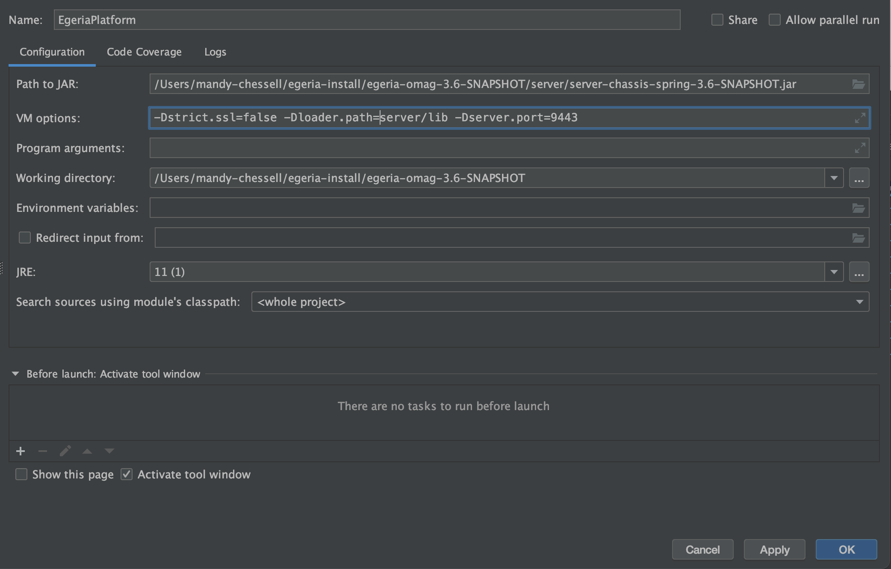
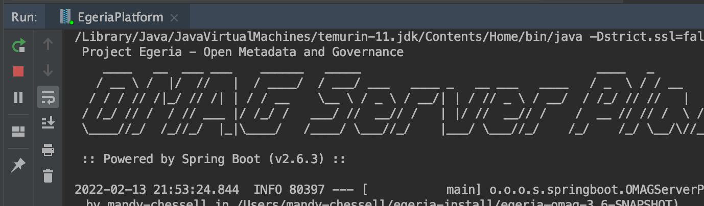
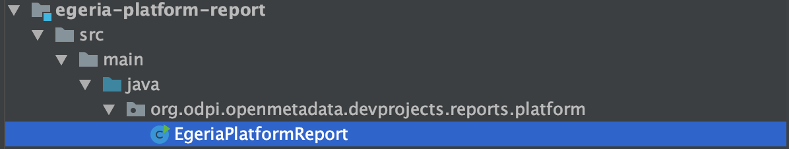

<!-- SPDX-License-Identifier: CC-BY-4.0 -->
<!-- Copyright Contributors to the ODPi Egeria project 2020. -->

# Egeria Dojo - Developer Day

Egeria has an extensive set of APIs and asynchronous event interactions for retrieving and maintaining metadata.    It is also possible to write connectors that execute in Egeria's runtime and either:

- Provide Egeria access to third party technology and resources.
- Provide the mechanism to synchronize metadata between a third party technology and the open metadata ecosystem that Egeria orchestrates.

Connectors can also be called in your applications to access third party technology along with its associated metadata.

Finally, Egeria's open metadata archives have a wide set of uses in distributing standard definitions and types.

After completing developer day of the egeria dojo you should feel comfortable with calling Egeria's APIs, writing connectors and working with open metadata archives.

--8<-- "docs/education/egeria-dojo/ski-run-colours.md"

## Preparing your machine for the Dojo

!!! tip "In preparation ..."
    Egeria's interfaces are written in Java.  It is expected that you have basic Java skills and have the Java 11 SDK installed on your machine.
    
    ??? tip "Installing Java ..."
        --8<-- "docs/education/tutorials/building-egeria-tutorial/task-installing-java.md"

    You will need to build Egeria's source which needs Apache Maven installed.
    
    ??? tip "Installing Apache Maven ..."
        --8<-- "docs/education/tutorials/building-egeria-tutorial/task-installing-maven.md"

    During the dojo you will running Apache Kafka to experiment with event notifications.
    
    ??? tip "Installing Apache Kafka ..."
        --8<-- "docs/education/tutorials/kafka-tutorial/task-installing-kafka.md"

    The dojo makes use of egeria libraries and code samples in the following git repositories and you will needd a clone of them on your machine.
    
    - https://github.com/odpi/egeria
    - https://github.com/odpi/egeria-samples
    - https://github.com/odpi/egeria-dev-projects
    
    ??? tip "Downloading (cloning) Egeria's git repositories ..."
        --8<-- "docs/education/tutorials/git-and-git-hub-tutorial/task-downloading-egeria-source.md"

    Many of the contributors to the Egeria project use the *[IntelliJ IDEA](https://www.jetbrains.com/idea/)* IDE.  Jetbrains offers a [free community edition of IntelliJ](https://www.jetbrains.com/idea/download/) which is sufficient to work with Egeria.  You are free to use any IDE during the dojo, however the instructions will focus on IntelliJ IDEA.

    ??? tip "Installing IntelliJ IDEA ..."
        --8<-- "docs/education/tutorials/intellij-tutorial/task-installing-intellij.md"
      
    Congratulations, you are ready to begin.
    
???+ education "Developer Dojo starts here"

    ??? beginner "Developer choices when customizing Egeria (15 mins reading)"
        --8<-- "docs/guides/developer/developer-choices.md"
        
        In this dojo, you will have an opportunity to build and run Java utilities and connectors.  However before you get to the coding, you will spend some time setting up your development and test environment.
        
    ??? beginner "Setting up your IDE to use Egeria (30 mins)"
        
        You need to bring the main `egeria.git` code into IntelliJ to build its platform and clients.
        
        ??? beginner "Building Egeria's core libraries (15 mins)"
            --8<-- "docs/education/tutorials/intellij-tutorial/task-loading-egeria-into-intellij.md"
            
            Now build the egeria.git repository.  For the Dojo, it is OK to use the *Quick Build* option when offered.
            
            --8<-- "docs/education/tutorials/intellij-tutorial/intellij-building-egeria-git.md"
        
        Once Egeria's core libraries are built, it is helpful to install Egeria in a directory that is easy to find
        
        ??? beginner "Installing Egeria's core libraries (15 mins)"
            ### Installing Egeria
            --8<-- "docs/education/tutorials/intellij-tutorial/intellij-open-terminal.md"
            --8<-- "docs/education/tutorials/building-egeria-tutorial/terminal-installing-egeria.md"

    ??? beginner "Setting up your Test environment (30 mins)"
    
        The `egeria-dev-projects.git` repository contains the utilities to support your Egeria test environment. This was one of the git repositories that you cloned in the prerequisite tasks.  Open this git repository in IntelliJ.
        
        ??? tip "Opening egeria-dev-projects.git in IntelliJ IDEA ..."
            Use **File**->**Open...** and select the top-level `egeria-dev-projects` directory that was downloaded from GitHub in the file selection window. Click the **Open** button.

        Now build the `egeria-dev-projects` code ...
        
        ??? beginner "Building egeria-dev-projects.git in IntelliJ IDEA ..."
            ### Building egeria-dev-projects.git
            --8<-- "docs/education/tutorials/intellij-tutorial/intellij-building-egeria-dev-projects-git.md"

        Egeria's services run in the [OMAG Server Platform](/concepts/omag-server-platform).  The jar file for the OMAG Server Platform was built by the `egeria.git` build.  It is located in the `server` directory of your Egeria install and is called `server-chassis-spring-{{release}}.jar`.  You will need an easy way to start and stop the OMAG Server Platform.   This is done with an IntelliJ *Configuration*.
        
        ??? beginner "Set up IntelliJ to run the OMAG Server Platform ..."
            ### Creating a configuration for OMAG Server Platform
            From your `egeria-dev-projects` IntelliJ window, look for a box called `Add Configuration...`
            
            Click on it and a wizard window opens. Open the list of *Templates* on the left hand column.
            
            Scroll down to *Jar Application* template and select it.  A form appears on the right-hand side.
            
            Enter:
            
            * `EgeriaPlatform` at the top under `Name:`
            * `Path to Jar` is set to the directory where the OMAG Server Platform jar is located
            * `VM Options` is set to `-Dstrict.ssl=false -Dloader.path=server/lib -Dserver.port=9443`.  This turns of SSL checking, points to the `lib` directory where you will be adding your new connector jar files and requests that the OMAG Server listents on port `9443`.
            * `Working Directory` is set to the parent directory above the directory with the OMAG Server Platform jar.  This directory includes the `truststore.p12` certificate file needed for the platform to start successfully.
            
            The example below is from a machine where the directory used to install Egeria was `/Users/mandy-chessell/egeria-install`. Notice the directory name needs to be specified in full, - the `~` notation does not work here. In this example, the Egeria release used was `3.6-SNAPSHOT`.
            

            Once you have entered these values, click `OK`.  The `Add Configurations ...` box has been replaced by a drop-down menu that includes your new configuration called `EgeriaPlatform` is in the configurations box.
            
            
            
            If you click on the down arrow next to `EgeriaPlatform` you will see `Add Configurations ...` has been replaced by `Edit configurations...`.  You will use this option later to add configurations for other utilities as the dojo progresses.

            

            With `EgeriaPlatform` showing in the configurations box, click the green triangle and a *Run* tab opens showing the platform is starting up.  When you see the `OMAG server platform ready for more configuration` message, it is ready for work.
            
            ```bash
            /Library/Java/JavaVirtualMachines/temurin-11.jdk/Contents/Home/bin/java -Dstrict.ssl=false -Dloader.path=server/lib -Dserver.port=9443 -Dfile.encoding=UTF-8 -jar /Users/mandy-chessell/egeria-install/egeria-omag-3.6-SNAPSHOT/server/server-chassis-spring-3.6-SNAPSHOT.jar
             Project Egeria - Open Metadata and Governance
                ____   __  ___ ___    ______   _____                                 ____   _         _     ___
               / __ \ /  |/  //   |  / ____/  / ___/ ___   ____ _   __ ___   ____   / _  \ / / __    / /  / _ /__   ____ _  _
              / / / // /|_/ // /| | / / __    \__ \ / _ \ / __/| | / // _ \ / __/  / /_/ // //   |  / _\ / /_ /  | /  _// || |
             / /_/ // /  / // ___ |/ /_/ /   ___/ //  __// /   | |/ //  __// /    /  __ // // /  \ / /_ /  _// / // /  / / / /
             \____//_/  /_//_/  |_|\____/   /____/ \___//_/    |___/ \___//_/    /_/    /_/ \__/\//___//_/   \__//_/  /_/ /_/
            
             :: Powered by Spring Boot (v2.6.3) ::
            
            2022-02-13 21:53:24.844  INFO 80397 --- [           main] o.o.o.s.springboot.OMAGServerPlatform    : Starting OMAGServerPlatform using Java 11.0.12 on MacBook-Pro.local with PID 80397 (/Users/mandy-chessell/egeria-install/egeria-omag-3.6-SNAPSHOT/server/server-chassis-spring-3.6-SNAPSHOT.jar started by mandy-chessell in /Users/mandy-chessell/egeria-install/egeria-omag-3.6-SNAPSHOT)
            2022-02-13 21:53:24.848  INFO 80397 --- [           main] o.o.o.s.springboot.OMAGServerPlatform    : No active profile set, falling back to default profiles: default
            2022-02-13 21:53:27.913  INFO 80397 --- [           main] o.s.b.w.embedded.tomcat.TomcatWebServer  : Tomcat initialized with port(s): 9443 (https)
            2022-02-13 21:53:28.851  WARN 80397 --- [           main] o.o.o.s.springboot.OMAGServerPlatform    : strict.ssl is set to false! Invalid certificates will be accepted for connection!
            2022-02-13 21:53:31.565  INFO 80397 --- [           main] o.s.b.w.embedded.tomcat.TomcatWebServer  : Tomcat started on port(s): 9443 (https) with context path ''
            2022-02-13 21:53:31.578  INFO 80397 --- [           main] o.o.o.s.springboot.OMAGServerPlatform    : Started OMAGServerPlatform in 7.563 seconds (JVM running for 8.591)
            Sun Feb 13 21:53:31 GMT 2022 No OMAG servers listed in startup configuration
            Sun Feb 13 21:53:31 GMT 2022 OMAG server platform ready for more configuration
            ```

            The *Run* tab where the OMAG Server Platform is running includes a control panel that allows you to start, restart, stop and control the scrolling of output of the program that is running.  If you hover your mouse over the controls, the hover-text indicates what it does.  
            
            
            
    ??? beginner "Calling Egeria's APIs (2.5 hours)"
        ??? beginner "Different types of APIs and their uses (30 mins)"
            Egeria's APIs can be broken down into three main categrories:
            
            - APIs to configure Egeria
            - APIs to operate Egeria
            - APIs to work with open metadata and governance
            
            It is useful to see them running to appreciate the differences between them.
            
            In `egeria-dev-projects`, there is a module called `egeria-platform-report`.  This contains a utility that reports on the status of a running OMAG Server Platform.  Navigate down the contents of `egeria-platform-report` until you come across a java class called `EgeriaPlatformReport`.
            
            
            
            Select `EgeriaPlatformReport` and then `Run 'EgeriaPlatformReport...main()'` from the right-mouse menu.
            
            A new *Run* tab appears next to `EgeriaPlatform` and `EgeriaPlatformReport` runs but fails:
            
            ```bash
            /Library/Java/JavaVirtualMachines/temurin-11.jdk/Contents/Home/bin/java ... org.odpi.openmetadata.devprojects.reports.platform.EgeriaPlatformReport
            ===============================
            OMAG Server Platform Report:    Sun Feb 13 22:13:33 GMT 2022
            ===============================
            Running against platform: https://localhost:9443
            Using userId: garygeeke
            
            Platform report for: https://localhost:9443
               Platform deployment
            There was an org.odpi.openmetadata.frameworks.connectors.ffdc.PropertyServerException exception when calling the platform.  Error message is: OMAG-COMMON-503-001 A client-side exception was received from API call getPlatformOrigin to OMAG Server EgeriaPlatform at https://localhost:9443.  The error message was CLIENT-SIDE-REST-API-CONNECTOR-503-002 A client-side exception org.springframework.web.client.ResourceAccessException was received by method getPlatformOrigin from API call https://localhost:9443/open-metadata/platform-services/users/{1}/server-platform/origin to server EgeriaPlatform on platform https://localhost:9443.  The error message was I/O error on GET request for "https://localhost:9443/open-metadata/platform-services/users/garygeeke/server-platform/origin": PKIX path building failed: sun.security.provider.certpath.SunCertPathBuilderException: unable to find valid certification path to requested target; nested exception is javax.net.ssl.SSLHandshakeException: PKIX path building failed: sun.security.provider.certpath.SunCertPathBuilderException: unable to find valid certification path to requested target
            
            Process finished with exit code 255

            ```
            This is because it does not have a valid security certification.  You will notice that IntelliJ has added a new configuration for `EgeriaPlatformReport'
            
            
           
            Click on the white down arrow of the configurations box and select `Edit Configurations...`.  Select the configuration for `EgeriaPlatformReport` to show its configuration form.
           
            Add `-Dstrict.ssl=false` to the `VM Options` and click `OK` to save the configuration.  This turns off the need for a certificate. Re-run `EgeriaPlatformReport` by clicking on the green arrow on the .
            
            

            - EgeriaPlatforn report shows the origin and registered servers
            - Configure a server (mds1) and re-run the platform report
            - Start the server and re-run the platform report.
            
            - Why are there so many APIs
            - How to choose the right API
            - Where is the documentation
        
        ??? beginner "Writing a simple client program that creates, updates, finds and deletes metadata. (60 mins)"
            ??? beginner "Create a new project for your utility"
                ---8<-- "docs/education/tutorials/intellij-tutorial/intellij-new-project.md"
            ??? beginner "Create a new java package"
                ---8<-- "docs/education/tutorials/intellij-tutorial/intellij-add-java-package.md"
            ??? beginner "Create a new java class"
                ---8<-- "docs/education/tutorials/intellij-tutorial/intellij-add-java-class.md"
            ??? beginner "Paste in the skeleton code"
                ---8<-- "docs/education/egeria-dojo/developer/asset-set-up-skeleton.md"
            ??? beginner "Create a Maven POM file"
                ---8<-- "docs/guides/developer/building-utilities/creating-pom-file-in-intellij.md"

            - Write AssetCreate.
            - AssetListen will display assets
            - Initializing a client
            - Creating properties
            - Using GUIDs and qualifiedNames
            - Eventually consistent operation
            - Get and find operations
            - Element headers and classifications
        ??? beginner "Extending your client program to listen for events from Egeria. (15 mins)"
            - Registering a listener to receive events
        ??? beginner "Handling errors (15 mins read)"
            - Meaning of InvalidParameterException, UserNotAuthorizedException and PropertyServerErrorException
    
    ??? beginner "Connector introduction (1.5 hours)"
        ??? beginner "What is a connector and why do we need them? (15 mins)"
            - Providing pluggability
        ??? beginner "Basic structure and lifecycle of a connector (15 mins)"
            - Connector provider
            - Connection
            - Connector instance and connector instance id
            - Audit log
            - Initialize, start, disconnect
            - The specialised connector interface
        ??? beginner "The anatomy of the connection object (15 mins)"
            - Connector types and connector categories
            - Endpoints
        ??? beginner "Extending your client program to set up connections and make use of connectors to access resources. (45 mins)"
            - Creating connectors through the Asset Consumer OMAS client
            - Using connected asset properties
    
    ??? beginner "Developing a simple connector, step-by-step (1.5 hours)"
        ??? beginner "Setting up a new connector project (30 mins)"
            - dependencies
            - build approach
        ??? beginner "Updating an Audit Log Connector (30 mins)"
            - Understanding the interface and base class
        ??? beginner "Testing your connector (30 mins)"
            - Installing the connector in Egeria's platform
        
        - Then use AssetSetUp and AssetLookUp to explore more options.

    ??? intermediate "Writing an integration connector (5 hours)"
        ??? intermediate "Design of an integration connector (30 mins)"
            - How the integration connector runs in the integration daemon
            - Additional lifecycle methods - refresh
            - Synchronization directions
            - Disconnecting
        ??? intermediate "Working with the context (30 mins)"
            - What is the context and how and when can you use it
        ??? intermediate "Receiving events from Egeria (30 mins)"
            - Implementing and registering a listener
        ??? intermediate "Handling errors (30 mins)"
            - FFDC, audit logs and exceptions
        ??? intermediate "Testing your connector (60 mins)"
            - Installing, configuring and driving the connector
            - Verifying the metadata is correct
        ??? advanced "Nested connectors (60 mins)"
            - Why nest connectors
            - VirtualConnections
            - Access embedded connector instances
        ??? advanced "Configurable connectors (30 mins)"
            - Using configuration properties
            - Using incoming events
        ??? advanced "Multi-threaded connectors (30 mins)"
            - Listening for third party events
            - Starting up and shutting down
        ??? advanced "Blocking connectors (30 mins)"
            - Using the engage method to be allocated Egeria thread
        
    ??? beginner "Working with open metadata archives (1.5 hours)"
        ??? beginner "The structure of an archive (15 mins)"
            - header, types and instances
            - role of archives
        ??? beginner "Setting up your archive header and dependency list (15 mins)"
            - versions, archive GUID and dependency list
        ??? beginner "Using the archive utilities (30 mins)"
            - look up dependent elements
            - build new elements
        ??? beginner "Deploying and testing your archive (30 mins)"
            - Configuring metadata access store
            - How the content of the archive is distributed across the open metadata ecosystem


--8<-- "snippets/abbr.md"