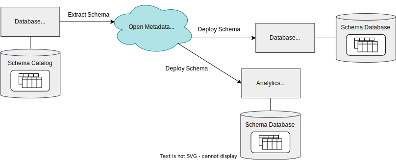

<!-- SPDX-License-Identifier: CC-BY-4.0 -->
<!-- Copyright Contributors to the ODPi Egeria project 2020. -->

## Metadata supply chains

The open metadata ecosystem collects, links and disseminates metadata from many sources.  However, it is designed in an iterative, agile manner, adding new use cases and capabilities over time.

Each stage of development considers a particular source of metadata and where it needs to be distributed to.  Consider this scenario...  

There is a database server that is used to store application data that is of interest to other teams.  An initiative is started to automatically capture the schemas of the databases on this database server.  This schema information will be replicated to two destinations:

* An analytics tool that is in use by a data science team.  This tool uses schema information in its own catalog to show the data science team what data is available.
* Another database server in a different data centre that will only be used in an emergency to load the back-up of the original database server.

--8<-- "snippets/abbr.md"