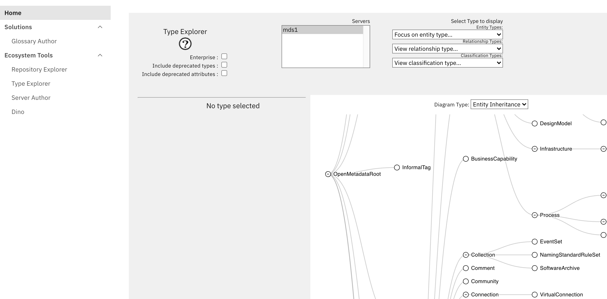
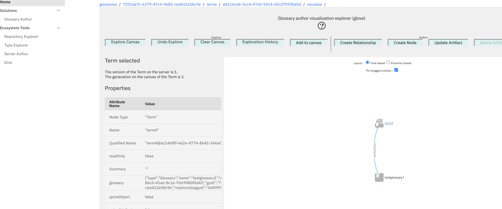
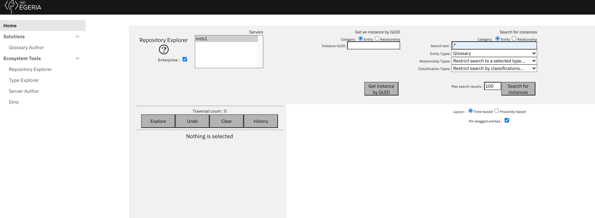
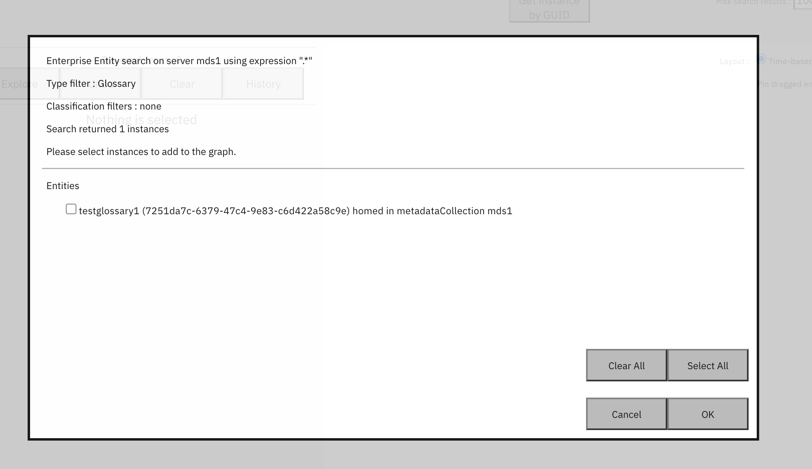
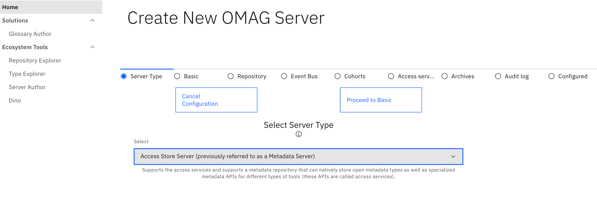
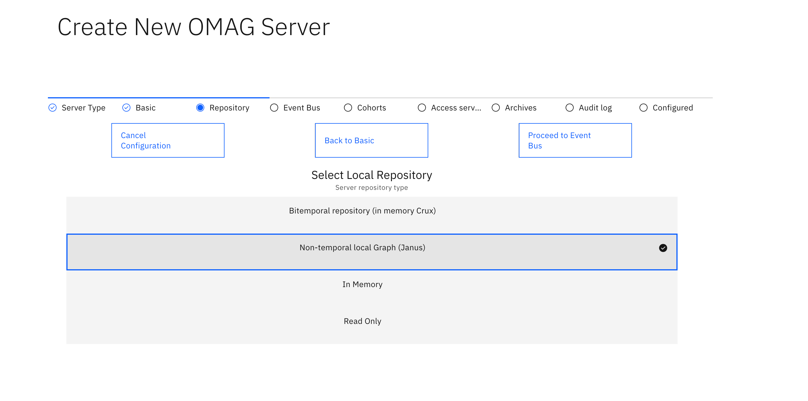
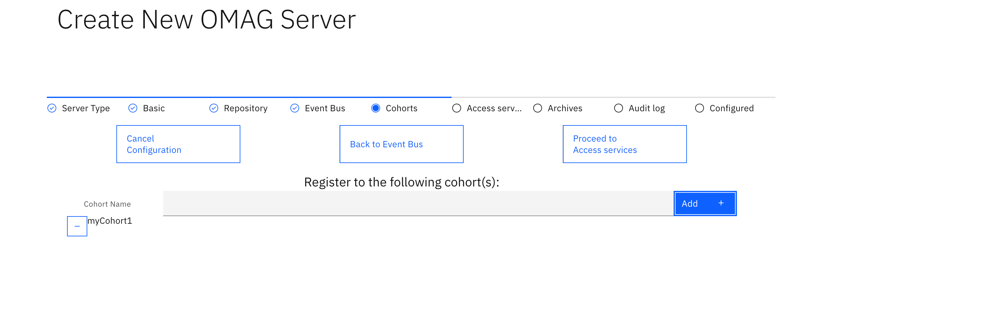

# Using the Egeria Ecosystem UI

## Prerequisites

Ensure that you have successfully completed the [Simple Install](../../simple-install.md).
At this point you should have all your pods running.

Firstly you will need to do a port forward
```
kubectl port-forward service/base-presentation 8091:8091
```
Leave that running.
## Using the UI.

You need to use an up to date Chrome browser.

* Login in a browser go to https://localhost:8091/org/login
You should now see a screen like this 


*  login with userid <code>garygeeke</code> and password <code>admin</code>
note the login details here are hard-coded for demonstration purposes.
You should now see a screen like this:


## Type Explorer 

Egeria has a rich set of [open types](../../../../types/) that are used by the [OMRS](../../../../services/omrs/). These types can be for entities, relationships and classifications.
In order to write connectors, work with the internals of Egeria or just to understand the scope of Egeria, you may want to
familiarise yourself with the types. There are hundreds of open types. The Type Explorer allows you to explore the types on a server.
More information can be found in the [Type Explorer User Guide](../../../../guides/react-ui/tex-user-guide.md)

### Using the type explorer
* Click on the Type Explorer in the left navigation pane.
* You will see one server called mds1. Click that and you should see:


The screen shows a horizontal tree showing the entity hierarchy.

* You may want to know more about a particular entity type. You do this by setting the focus on that type. You can do this by:
   * clicking a node on the canvas. 
   or
   * selecting an entity from the dropdown 
   Once an entity type has focus, it will be coloured blue and its properties will be displayed. 
   The properties of an entity type include attributes and its relationships. 
* For this dojo try choosing an entity type - for example Asset. Notice you have see the Asset in a neighbourhood view, by changing the view.
you should see
  
The neighbourhood view centers around an entity type (in this case Asset) and shows it's possible relationships
and the type of the entity at the other end of the relationship.

There is a checkbox called <code>Enterprise</code>. When checked this shows an enterprise view of the types- i.e. the selected servers view of all the types it can see including
types from other servers in its [cohorts](../../../../../services/omrs/cohort.md).

The over time new releases of Egeria deprecate types. The deprecated types can still be used, but in time may be removed. Most of the time
it is not useful to see the deprecated types. It is possible to use tex to explore deprecated types and attributes.
There is a checkbox called <code>Include deprecated types</code> to include deprecated types.
There is a checkbox called <code>Include deprecated attributes</code> to include deprecated attributes.

??? question "Test yourself"
     * Can I find the attributes of the type GlossaryTerm using the type explorer?
     * Can I find the GlossaryTerm description? 
     * Why might a GlossaryTerm be useful?  
     * Can I find the possible relationships of the type GlossaryTerm using the type explorer?
     * Can I find the attributes of the relationship type SemanticAssignment using the type explorer?

## Dino

Dino allows you to explore the operational environment of the Egeria ecosystem. 
More information can be found in the [Dino User Guide](/guides/react-ui/dino-user-guide.md)


### Using Dino
* Click on the Glossary Author in the left navigation pane.
* Choose platform and mds1. As you open sections on the left the operational landscape picture is
updated. Here is an example after I opened some sections.
  
[dino](dino.png)
Known issue: [issue 327](https://github.com/odpi/egeria-react-ui/issues/327) viewing view server config : 

## Glossary Author

More information can be found in the [Glossary Author User Guide](../../../../guides/react-ui/glossary-author-user-guide.md)

### Using the Glossary Author

* Click on the Glossary Author in the left navigation pane. You should see:

* Glossaries contain Terms and Categories. This initial screen shows the list of all glossaries, in a system with no glossaries, we expect 
this screen to be empty.
* To create a glossary press the <button>+ button, follow the wizard - call it "testglossary1" on the first screen, and press the Create button then finished.
* You should now see

* toggle to see the table view

* toggle back to card view and select the glossary

* you will notice that some action buttons have appeared at the top of the screen.
* the first is to quickly create terms; quickly putting in names and descriptions of terms is 
something that is useful as part of innovation/ planning sessions to get terms in quickly.
Known issue: There is a formatting error in the response screen - this is tracked in [issue 325](https://github.com/odpi/egeria-react-ui/issues/325).
The green ticks indicate that the terms have been created where there was a name.

* Back on the glossary card screen, you will notice that there are other icons tpo the right of the quick terms, respectively they:
  
   * shows the children of the glossary, any Terms of categories.
     if you click on this you will see there are no categories. Switch to the Terms tab and there should be no terms.
     
      * you can create terms using the <button>+</button> button.
   * edit allows you to update the glossary
   * canvas - this shows a canvas view of the glossary 
   * delete - this allows the glossary to be deleted- this will only work if there is no active content in the glossary.
* Create 4 terms in the glossary, 
   * Create terms called term1 and term 2 the Glossary children terms view using the <button>+</button>. create terms called term1 and term2.      
   * Press the breadcrumb **Glossaries** switch to the Terms tab and use the the <button>+</button>. create terms called term3 and term4.
* Navigate to the glossary children and select a term (term4) in my example. Press the canvas button.

  You will notice that there is a node on the canvas that is selected and it's properties are displayed. 

* On the canvas press the Explore button  

This screen shows you the relationships and nodes that this term is directly connected to. In this case the Term is connected to 
a glossary via the TermAnchor relationship. We select all and should see
  
* In this canvas view, you cannot delete the starting node, but you can use the other button to explore, create, update content.
* Try pressing "Create Node", to create a term called term5. This ill be added to the canvas - you may need to scroll down to see this new
Term. You can drag content around the canvas as required.

Known issue : there is currently an issue with 'Create relationship', that it does not work . [issue 326](https://github.com/odpi/egeria-react-ui/issues/326) has been raised. 
* Notice that you can use the breadcrumb to navigate back to previous screens
* Notice on the card and table views there are paging controls to allow you to alter the number of elements displayed on the screen.
* You can use the + button on the category tab to create a new category, and optionally specify a parent category. In this way you can 
author a category hierarchy.

??? question "Test yourself"
     In the glossary author:
     * Can I create a glossary ?
     * Can I create a Term in the Glossary?
     * Can I create a Category in the Glossary? 
     * Can I use Rex to find the same content I have just created.
     * Stretch goal. Can I create a category hierarchy that makes sense in the world or in your work or play?
     * Stretch goal. Can I explain what the different is between a GlossaryTerm entity in Tex and the Term in the Glossary Author? Why do you think they are different?
     * Stretch goal can I create a Term with a Category.
     ??? hint
        
## Repository Explorer
The Repository Explorer allows the user to explore [Open Metadata Instances](../../../../../concepts/open-metadata-instances.md) 
If you know the guid of an entity you can enter it and start exploring. More usefully you can start your exploration using a
text search restricted by types. More information can be found in the [Repository Explorer User Guide](../../../../guides/react-ui/rex-user-guide.md)


### Using the Repository Explorer
* Click on the Repository Explorer in the left navigation pane.
* You will see one server called mds1. Click that and you should see:
  
  
If you have are running this UI on an empty system, there will be no entities in the system. If this is the case then you can 
either run some of the notebooks to create Egeria content or use the glossary author user interface to create glossary content 
you can then explore.
<p>
The following assumes you have created glossary with terms named **term1**  **term2** **term3** and **term4** , also a category called **cat1** with a child category **cat2** using the Glossary Author 

* select the server **mds1** search for dot star of type Glossary
  
* Click <button>Search for instances</button> You will see the search list showing one glossary

* Select all and press <button>OK</button> 
* you will see that there is now a selected node on the canvas

* Click <button>Explore</button> you should see a pre-traversal screen showing the relationships and related entities with their type and the number of them in brackets. 

* Click <button>Select All</button> and <button>OK</button>. Select **Cat1**. You will see a screen like this:

* Click **Cat1** then <button>Explore</button> in the pre traversal popup, <button>Select all</button> and <button>OK</button>.
You should see:

* click on a TermAnchor to give it focus and you should see the properties of that relationship


Note that 

* only the additional relationship was added
* you can press <button>Undo</button> to undo the last traversal
* you can press <button>History</button> to see the history.
* by default later content is added down the canvas with the **timed based** layout. You can toggle the layout to Proximity-based; to see a layout based on proximity only.
* Nodes on the canvas can be dragged and pinned.
* There is an **Enterprise** flag, when not set, only entities in a particular repository are shown, otherwise an enterprise view is used. 


??? question "Test yourself"
     * What are the 3 sorts of Open Metadata Instances?
     * Can I create glossary term in the glossary author and then find it in Rex? Can I then find its associated glossary and see its guid?
     
## Server author
The Server Author is an authoring UI to create new server configurations. This is currently being developed and 
will support all the server types. In this dojo you will create a Access Store Server.  

More information can be found in the [Server Author User Guide](../../../../guides/react-ui/server-author-user-guide.md)

### Using the Server Author

* Click on the Server author in the left navigation pane.
* You will see the existing servers

* Click <button>Create New</button> and choose Access Store Server from the dropdown

* Click <button>Process to Basic</button>. Call the new server (Server Name) **dojo1** and add a Local user Id of **dojo1**.

* Click <button>Process to Repository</button> and choose **Non-temporal local Graph (janus) graph from the dropdown.

* Click <button>Proceed to Event Bus</button> . This currently defaults, but will be customisable in the near future.
* Click <button>Proceed to Cohorts</button> and add a name for the cohort you will use.

* You will now see a list of cohorts this server will be part of.  

* Click <button>Proceed to Access Services</button> and select all

* Click <button>Proceed to Archives</button>, then <button>Proceed to Audit Log</button>  
* There is no need to add an audit log as there is a default, but here we will add a second json style audit log. Press <button>Create new</button>
Then change the name to be json and the type from the dropdown to be Json. You can click which severity messages should go to this audit log as well. 

* Press <button>Issue add</button>

You will see the default console audit log and your new audit log destination. You can select an audit log and update it or delete it.   
* Click <button>Proceed To Configured</button> then <button>Finished</button>
You will not see your server in the list, as the Dojo is running on release 3.4, this issue is fixed in the latest [Egeria Ecosystem UI code](https://github.com/odpi/egeria-react-ui).
* to see your server in the list, choose rex , then Server Author in the left navigation and you should see the new server


??? question "Test yourself"
     * What is an Egeria OMAG Platform?
     * What is an Egeria OMAG Server?
     * What types of audit log destinations can be associated with a server?
      


--8<-- "snippets/abbr.md"