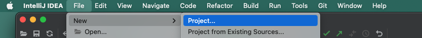
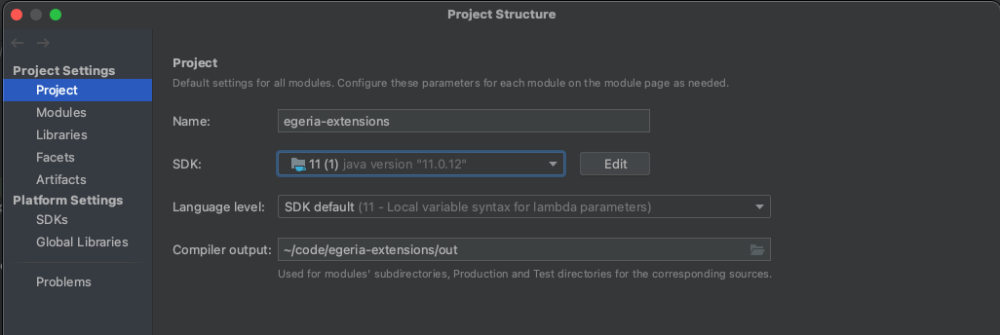
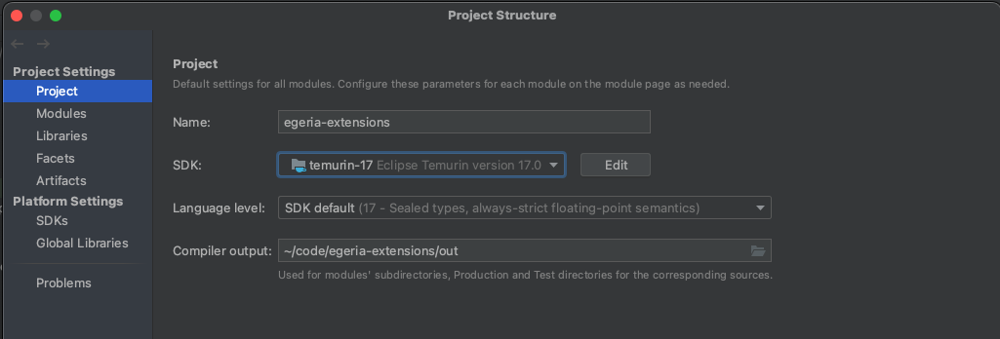

<!-- SPDX-License-Identifier: CC-BY-4.0 -->
<!-- Copyright Contributors to the Egeria project. -->

### Create IntelliJ project

Either from start up wizard click on the `New Project` button or from IntelliJ's top
From an IntelliJ window, select `File->New Project` from the top menu bar.

Enter information about the project.  In this example, the project is called `egeria-extensions`, it is written in Java and being built with Maven.

Press the `Create` button and the new project is opened.

??? tip "Set up Java Level ..."
    Validate that the project is set up with the right level of Java - you need Java 17.  Select `File` and then `Project Structure...`.  When the wizard opens select `Project` and ensure the SDK is Java 17.

    

    If the SDK is not 17, click on the dropdown and change it to 17, and click OK to save it.  If Java 17 is not listed, make sure you have Java 17 installed on your machine and retry.

    

??? tip "Ensure you have enough memory ..."
    ---8<-- "docs/education/tutorials/intellij-tutorial/intellij-memory-settings.md"

