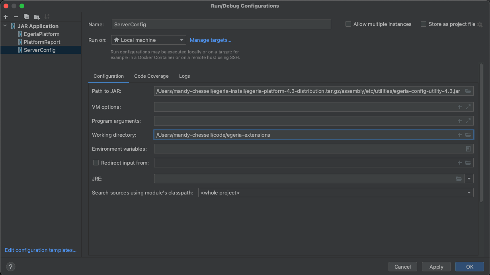
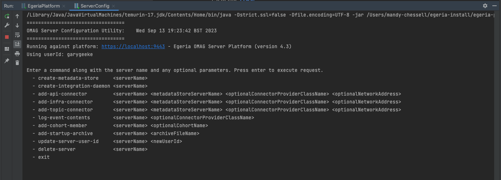
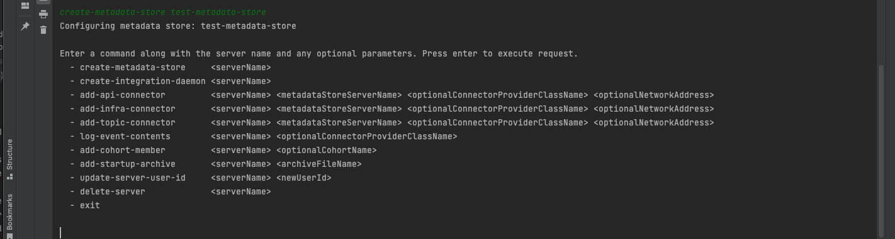

<!-- SPDX-License-Identifier: CC-BY-4.0 -->
<!-- Copyright Contributors to the Egeria project. -->

### Create test servers

Egeria's assembly includes a utility for configuring servers.  It is called `ServerConfig`.  Select `Edit Configurations` and create another `JAR Application` run configuration entry for `ServerConfig`.

=== "V4.3 and before"
    

=== "V5.0" and beyond
    

When you click `OK`, then `ServerConfig` appears in the dropdown run menu.  Press the green triangle to run the utility and a new tab appears in the panel of the IntelliJ window where the platform is running.

`ServerConfig` prints out a menu of the different configuration options it supports.

Click in the ServerConfig run window and enter `create-metadata-store test-metadata-store` and press enter.

This will create a new [Metadata Access Store](/concepts/metadata-access-store) called `test-metadata-store`.

You can select `PlatformReport` in the dropdown run menu, and click on the green triangle to re-run the `PlatformReport`.  Notice that details of this new server are now included.

