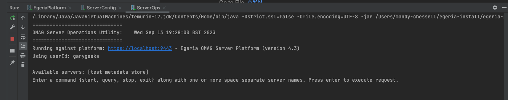

<!-- SPDX-License-Identifier: CC-BY-4.0 -->
<!-- Copyright Contributors to the Egeria project. -->

### Start and stop servers

Egeria's assembly includes a utility called `ServerOps` that makes it easy to start and stop servers on your OMAG Server Platform.  Select `Edit Configurations` and create another `JAR Application` run configuration entry for `ServerOps`.

=== "V4.3 and before"
    

=== "V5.0" and beyond
    

When you click `OK`, then `ServerOps` appears in the dropdown run menu.  Press the green triangle to run the utility and a new tab appears in the panel of the IntelliJ window where the platform is running.

`ServerOps` prints out a menu of the different operations it supports.

Click in the ServerOps run window and enter `start test-metadata-store` and press enter.

`ServerOps` returns with a list of the services that have been started.

