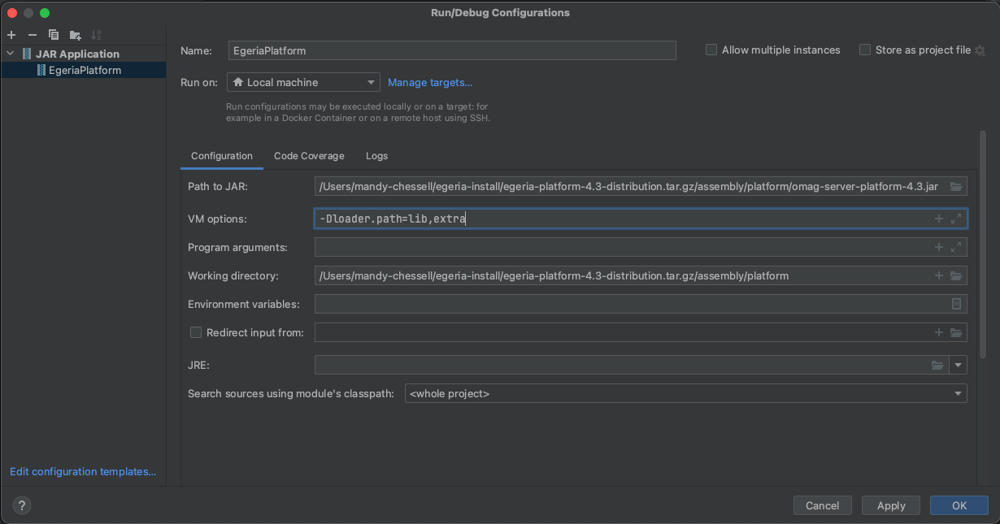
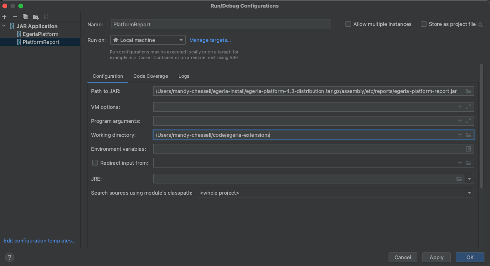
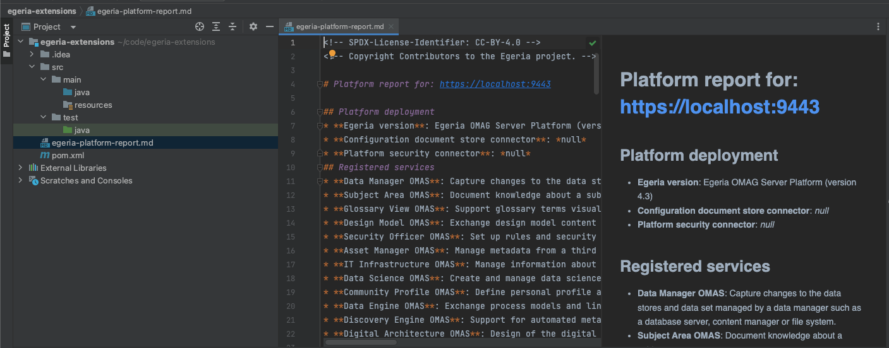

<!-- SPDX-License-Identifier: CC-BY-4.0 -->
<!-- Copyright Contributors to the Egeria project. -->

### Set up OMAG Server Platform in intelliJ

The next set of instructions makes it easy to start and stop an OMAG Server Platform from IntelliJ.

Select `Edit Configurations` from the dropdown run menu.

Click on the `+` sign in the top left of the wizard.

Select `JAR Application`:

Fill in the properties based on the directory where you installed egeria.  In this example, egeria was installed in directory `/Users/mandy-chessell/egeria-install/egeria-platform-4.3-distribution.tar.gz/` and so the settings are:

* Path to JAR: `{install directory}/assembly/platform/omag-server-platform-4.3.jar`
* VM Options: `-Dloader.path=lib,extra`
* Working Directory: `{install directory}/assembly/platform`

Press `OK` to save the configuration and `EgeriaPlatform` appears in the dropdown run menu.

Press the green triangle to run the platform.

A new section appears in the IntelliJ window showing the platform is starting up.

When you see the message `OMAG server platform ready for more configuration` then the platform has initialized.

Egeria's assembly includes a utility called `EgeriaPlatformReport` that queries the status of an OMAG Server Platform.  It is useful to set up to check that your platform is running correctly.

Select `Edit Configurations` to create another `JAR Application`.  This time call it `PlatformReport`.  The JAR file is called `{install directory}/assembly/etc/reports/egeria-platform-report.jar`

Leave the `Working Directory` to default to your project directory.  If you are using Version 4.3 of Egeria, set the VM Options to `-Dstrict.ssl=false`; for release V4.4 and beyond, you can leave them blank.

==== "V4.3 and before"
    

==== "V4.4" and beyond
    

When you click `OK`, then `PlatformReport` appears in the dropdown run menu.  Press the green triangle to run the report and a new tab appears in the section of the IntelliJ window where the platform is running.

Also notice that a new markdown file called `egeria-platform-report.md` has appeared in your project files that includes the details of the platform report as a markdown file.

The platform report provides details of the current status of the platform.  Each time you run the report, a new copy of `egeria-platform-report.md` is created

If you open `egeria-platform-report.md` you can see a formatted version of the report.

