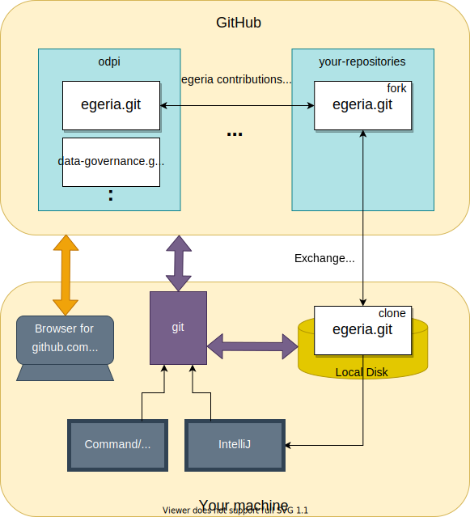

<!-- SPDX-License-Identifier: CC-BY-4.0 -->
<!-- Copyright Contributors to the ODPi Egeria project 2020. -->

# Git and GitHub Tutorial

Git is an open source version control system.  It is what the Egeria project uses to:

- Store all of the source code, documentation and other file-based resources.
- Track changes to the underlying Egeria code as the project evolves
- Track issues and enhancements, and link these back to the code changes that resolve them
- Collaborate on and review the issues, enhancements and code changes

As a result, it gives us a definitive source for the latest and greatest source code for Egeria itself, its history, and the rationale behind various decisions that are made over time.

--8<-- "docs/education/tutorials/git-and-git-hub-tutorial/egeria-git-repositories.md"

## General tasks for all community members

This tutorial covers common tasks associated with using Git and GitHub to work with the Egeria content and make a contribution.

* [Getting a GitHub user log in](#getting-git-hub-id) - This is required to add anything - even a comment - to the Egeria project's repositories.
* [Creating an Issue on GitHub](#creating-an-issue-on-github) - Issues are used by developers to describe a contribution.  They are also used by consumers of Egeria to request help with function they think is not working.
* [Installing Git on your local Machine](#installing-git-on-your-local-machine) - Git provides the commands to manage Egeria's content on your local machine.
* [Downloading Egeria to build and run](#downloading-the-egeria-source-from-github) - If you do not want to make changes to Egeria, but want to build the distribution file to run it natively on your machine then follow this task.  If you want to be able to make changes to Egeria and contribute them back to the community, then follow the contributors tasks.

--8<-- "docs/education/tutorials/git-and-git-hub-tutorial/task-getting-git-hub-id.md"
--8<-- "docs/education/tutorials/git-and-git-hub-tutorial/task-creating-an-issue-on-git-hub.md"
--8<-- "docs/education/tutorials/git-and-git-hub-tutorial/task-installing-git.md"
--8<-- "docs/education/tutorials/git-and-git-hub-tutorial/task-downloading-egeria-source.md"

## Additional contributor tasks

The tasks below describe how to use Git and GitHub to create a contribution to the Egeria project.  The contribution process using Git and GitHub is illustrated in Figure 1.

> **Figure 1:** Git and GitHub contribution flow

The tasks below step through this process

* [Creating a Fork and a Clone](/egeria-docs/education/tutorials/git-and-git-hub-tutorial/task-creating-a-fork-and-clone)
* [Creating a Branch in a git repository](/egeria-docs/education/tutorials/git-and-git-hub-tutorial/task-creating-git-branches)
* [Adding your changes to a git repository](/egeria-docs/education/tutorials/git-and-git-hub-tutorial/task-adding-changes-to-git)
* [Adding your contribution to Egeria](/egeria-docs/education/tutorials/git-and-git-hub-tutorial/task-git-pull-push-pr)

In addition, these are [further tips](/egeria-docs/education/tutorials/git-and-git-hub-tutorial/further-git-tips) for using Git.

--8<-- "docs/education/tutorials/git-and-git-hub-tutorial/task-creating-a-fork-and-clone.md"
--8<-- "docs/education/tutorials/git-and-git-hub-tutorial/task-creating-git-branches.md"
--8<-- "docs/education/tutorials/git-and-git-hub-tutorial/task-adding-changes-to-git.md"
--8<-- "docs/education/tutorials/git-and-git-hub-tutorial/task-git-pull-push-pr.md"
--8<-- "docs/education/tutorials/git-and-git-hub-tutorial/further-git-tips.md"

---8<-- "snippets/abbr.md"
