<!-- SPDX-License-Identifier: CC-BY-4.0 -->
<!-- Copyright Contributors to the ODPi Egeria project 2022. -->

# Postman

Postman provides an interactive application for issuing [REST APIs :material-dock-window:](https://en.wikipedia.org/wiki/Representational_state_transfer){ target=wp } calls to a server and reviewing responses.

Basically a REST API is an application program interface (API) that uses HTTP requests to GET, PUT, POST and DELETE data.  The call is made using a URL - just like requesting a web page from your browser.  In fact, when you request a web page from your browser, the browser is issuing a GET HTTP request for the page.

REST APIs for services such as the open metadata and governance services of Egeria use the full range of HTTP requests as follows:

* **GET** - retrieving simple structures.
* **POST** - creating, updating, deleting complex structures and retrieving long lists of information with paging.
* **DELETE** - deleting simple structures.

With Postman it is possible issue these HTTP requests and experiment with what they do.
The Egeria dojos use Postman *collections* to illustrate the calls and save you typing in the full URLs (which can be quite long :).

Egeria by default uses https:// requests with a self-signed certificate. Any Postman users therefore will need to
go into settings->general and turn off 'SSL certificate verification' or requests will fail.

## Setting up Postman 

Postman is a [free download :material-dock-window:](https://www.getpostman.com/){ target=pm } with optional enterprise licenses for teams.  It includes a wide variety of [tutorials :material-dock-window:](https://learning.getpostman.com/concepts/){ target=pm } to help you go from novice to expert.  Familiarity with Postman will help you get the most value from the Egeria tutorials.

Install Postman from [the Postman downloads site :material-dock-window:](https://www.getpostman.com/downloads/){ target=pm }. At the time of writing, 10.11.1 is current and recommended.

Once Postman is installed, start up the application.  You should see an initial page that looks something like this (shown on an Intel-based Mac with Postman version 10.11.1):

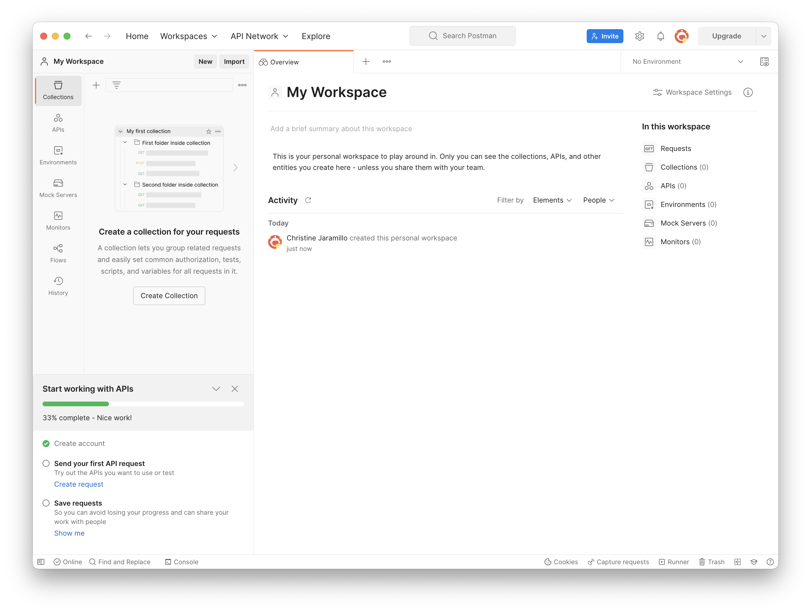
<figcaption style="text-align:center">Initial overview displays an empty workspace</figcaption>


## Setting up Postman with Egeria data

We will import two types of information from Egeria's code repository on GitHub:

* Collections - these define the REST API calls to issue.
* Environments - these define the values of replaceable variables in the API calls, such as host and server names.

Follow through these steps to configure your Postman environment:

## Create a new workspace

Creating a workspace for egeria helps keep everything we'll work with together. If you mess up your
postman files later, you can just create a new environment again to work with

??? beginner "Select the workspace menu at the top of the Postman interface and click 'Create Workspace'"
    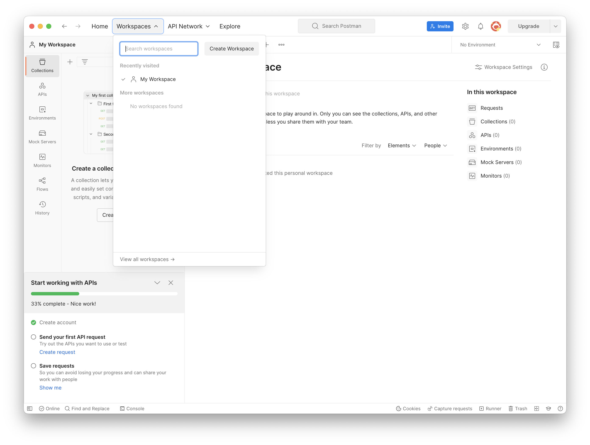

??? beginner "Enter 'Egeria dojo' into the *Name* field, add a summary into the *Summary* field, select the 'Personal' visibility option, and click 'Create Workspace'"
    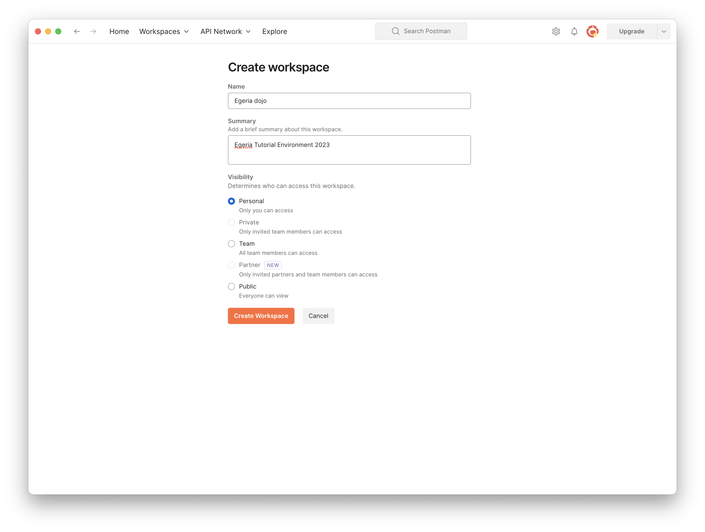

??? success "Your new workspace should display an 'Overview' tab with the new workspace name and summary displayed"
    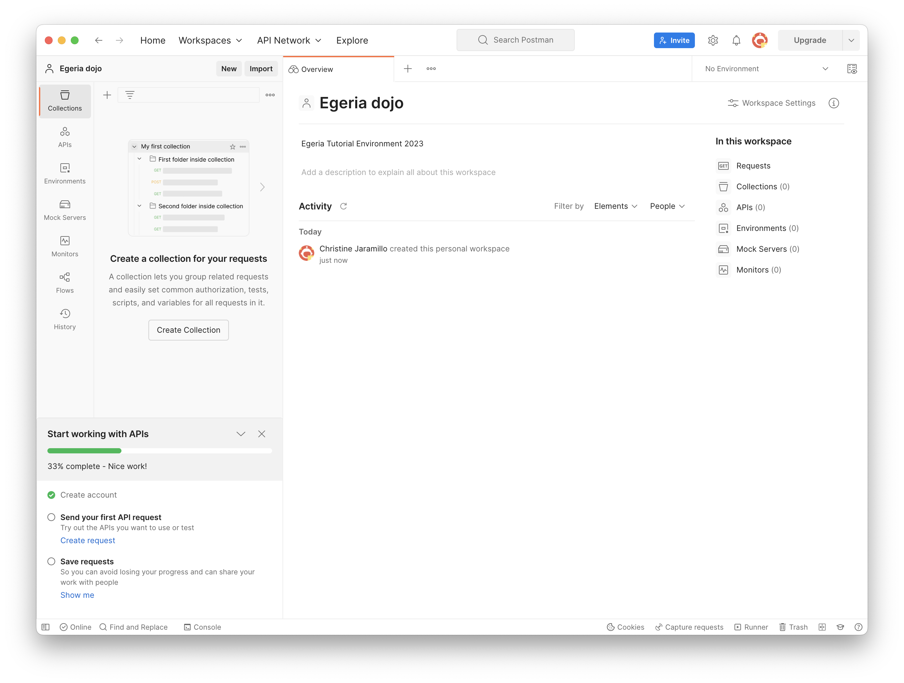

## Importing Egeria Postman data

We now will individually import the Egeria Postman collections required for this dojo:

??? beginner "Click 'Import' and select 'Link' as the source"
    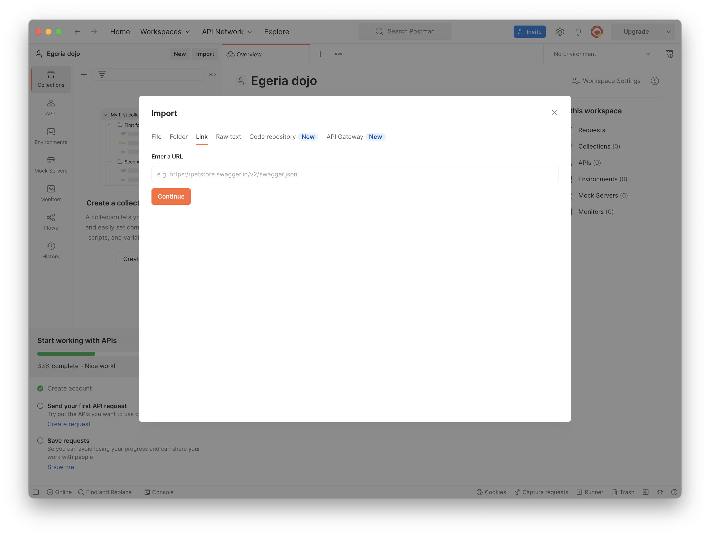

??? beginner "Paste the URL found below for the 'Egeria-admin-services-operational' collection and click 'Continue'"
    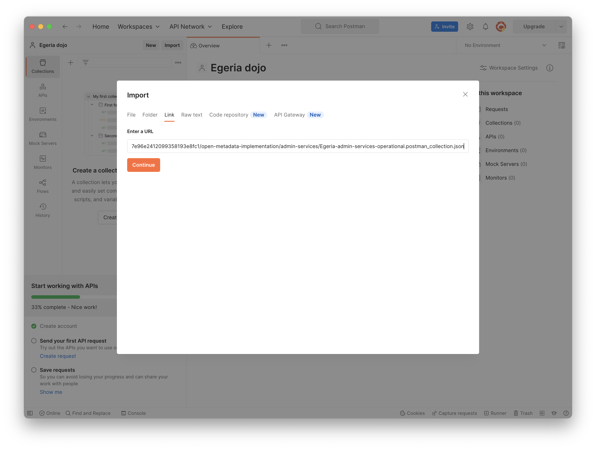

```{.url .copy}
https://raw.githubusercontent.com/odpi/egeria/40ec581a8dbf82eeb7e96e2412099358193e8fc1/open-metadata-implementation/admin-services/Egeria-admin-services-operational.postman_collection.json
```

??? beginner "In the 'Import Elements' tab, confirm the collection to be imported and click 'Import'"
    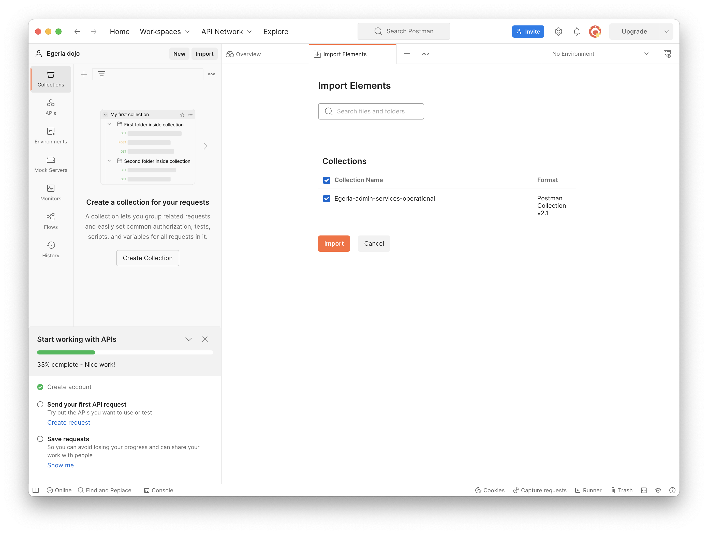

??? success "Confirm the 'Import Elements' tab displays 'Import Complete'"
    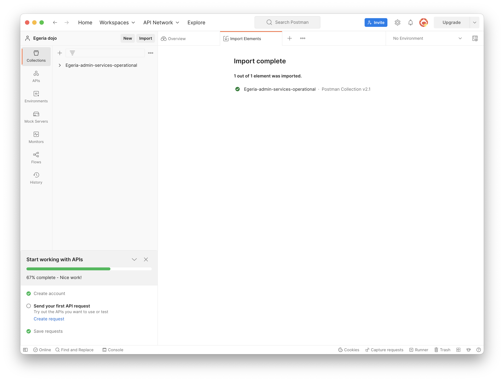

Repeat the same procedure for the following Egeria collections:

!!! info "Egeria-admin-services-platform-configuration"
    ``` {.url .copy}
    https://raw.githubusercontent.com/odpi/egeria/40ec581a8dbf82eeb7e96e2412099358193e8fc1/open-metadata-implementation/admin-services/Egeria-admin-services-platform-configuration.postman_collection.json
    ```

!!! info "Egeria-admin-services-server-configuration"
    ``` {.url .copy}
    https://raw.githubusercontent.com/odpi/egeria/40ec581a8dbf82eeb7e96e2412099358193e8fc1/open-metadata-implementation/admin-services/Egeria-admin-services-server-configuration.postman_collection.json
    ```
    
!!! info "Egeria-asset-owner-omas"
    ``` {.url .copy}
    https://raw.githubusercontent.com/odpi/egeria/c31a2b19c3b42da1c2622dbe4ebed958f6a62cb5/open-metadata-implementation/access-services/asset-owner/Egeria-asset-owner-omas.postman_collection.json
    ```   
    
!!! info "Egeria-platform-services"
    ``` {.url .copy}
    https://raw.githubusercontent.com/odpi/egeria/40ec581a8dbf82eeb7e96e2412099358193e8fc1/open-metadata-implementation/platform-services/Egeria-platform-services.postman_collection.json
    ```     
    
!!! info "Egeria-repository-services-local-repository"
    ``` {.url .copy}
    https://raw.githubusercontent.com/odpi/egeria/40ec581a8dbf82eeb7e96e2412099358193e8fc1/open-metadata-implementation/repository-services/Egeria-repository-services-local-repository.postman_collection.json
    ``` 
    
!!! info "Egeria-repository-services-metadata-highway"
    ``` {.url .copy}
    https://raw.githubusercontent.com/odpi/egeria/e256aa1ca99240ac276b584f652cf02382220bf7/open-metadata-implementation/repository-services/Egeria-repository-services-metadata-highway.postman_collection.json
    ```

Once all collections are imported, your workspace should display all of the imported collections to the left of the Overview:

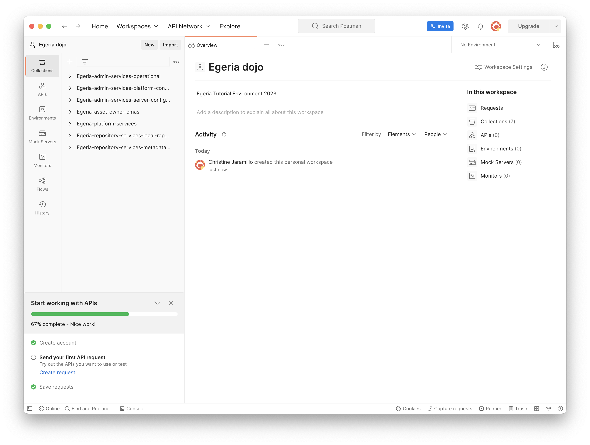
<figcaption style="text-align:center">All imported collections displayed</figcaption>


We must now import the environment required for this dojo:

??? beginner "Again, click 'Import' and select 'Link' as the source"
    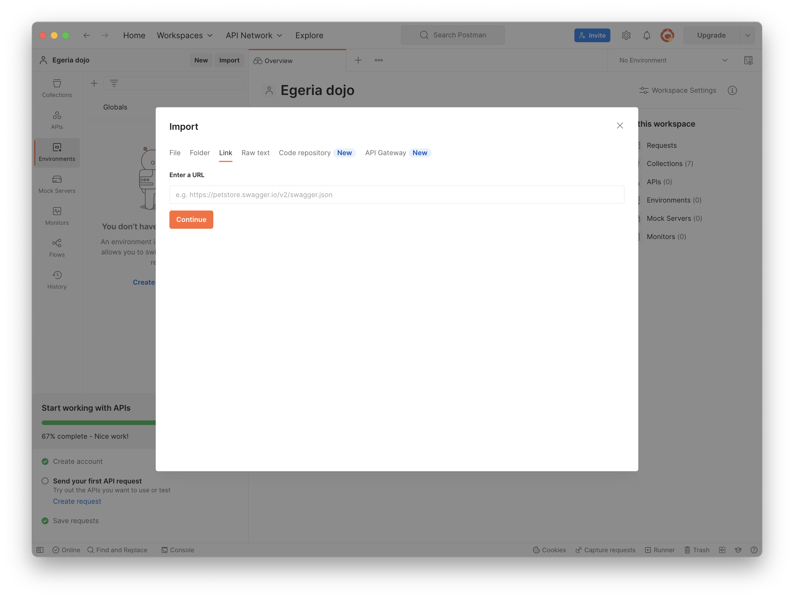

??? beginner "Paste the sample environment URL found below and click 'Continue'"
    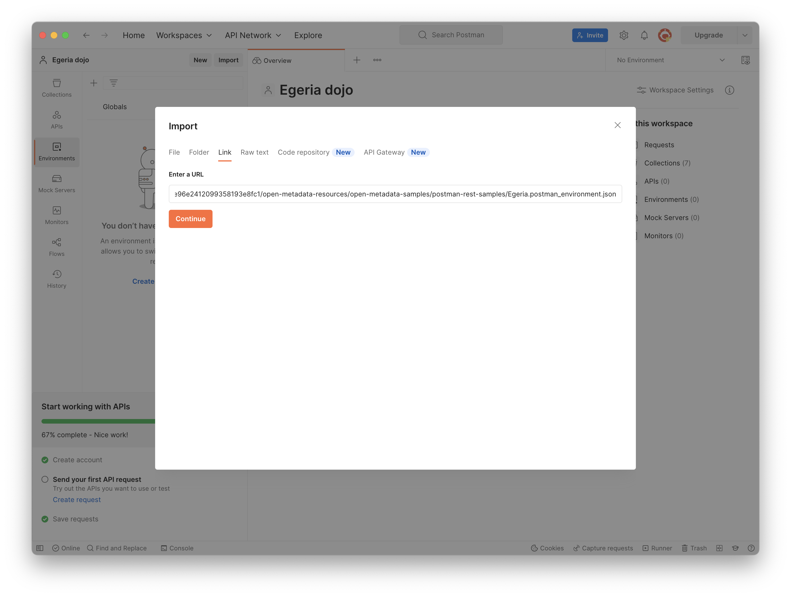

```{.url .copy}
https://raw.githubusercontent.com/odpi/egeria/40ec581a8dbf82eeb7e96e2412099358193e8fc1/open-metadata-resources/open-metadata-samples/postman-rest-samples/Egeria.postman_environment.json
```

??? beginner "In the 'Import Elements' tab, confirm the environment to be imported and click 'Import'"
    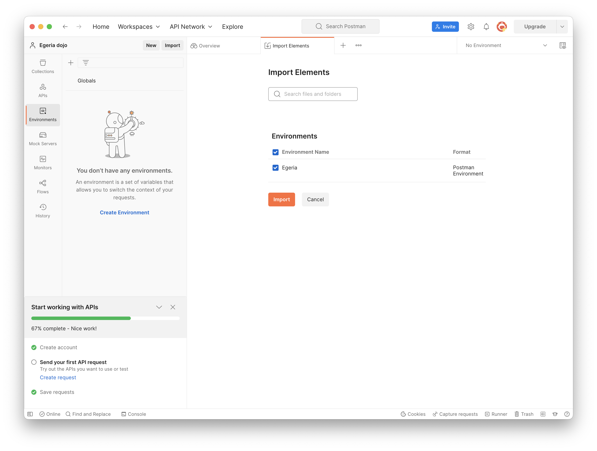

??? success "Confirm the 'Import Elements' tab displays 'Import Complete'"
    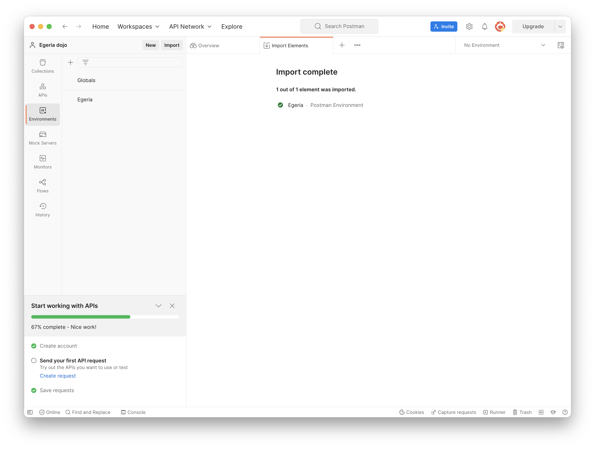


## Updating Postman settings

Egeria uses secure connections. However the demo environment has self-signed certificates which 
Postman will not see as valid without further configuration. To simplify this process we will 
turn off certificate validation in postman:

??? beginner "In the upper right hand corner select the *gear* dropdown menu and click 'Settings'"
    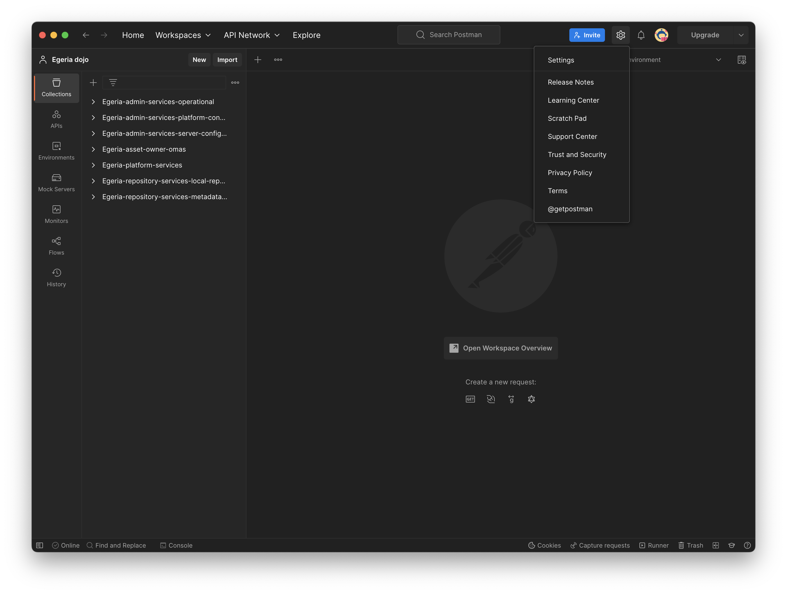

??? beginner "Ensure 'SSL certificate verification' option is switched off"
    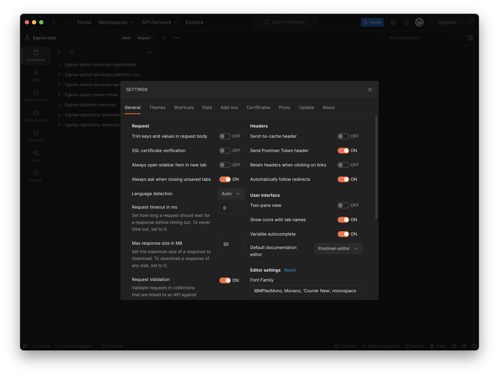


## Egeria Environment settings

The Import process will have imported some Egeria environment settings.

In general you can leave the values as default except for hostnames which should be pointed at the relevant
Egeria platform. Tutorial content will walk you through this explicitly.

Let's make the Egeria environment the default in this workspace:

??? beginner "In the upper right hand corner of the Postman interface, click on the dropdown menu which currently lists 'No Environment' and select 'Egeria'"
    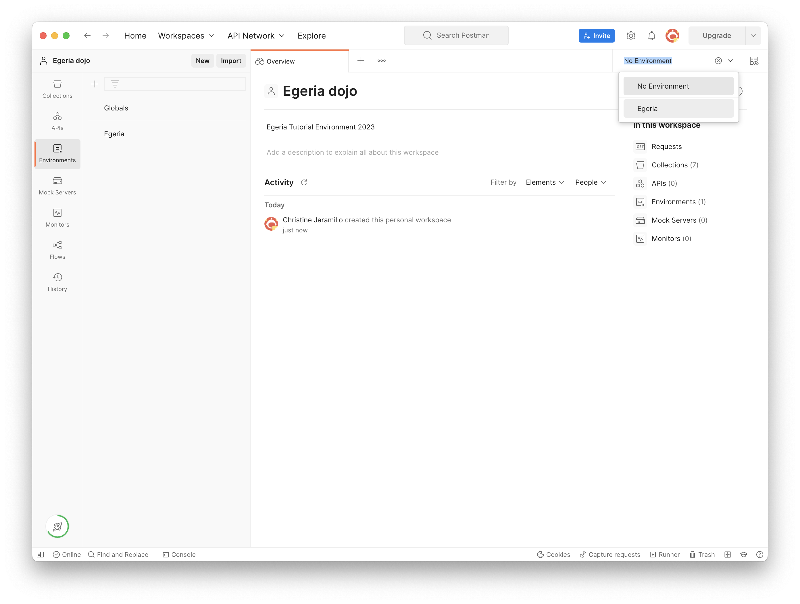

??? beginner "To the right of the environment dropdown menu, click the 'Environment quick look' icon"
    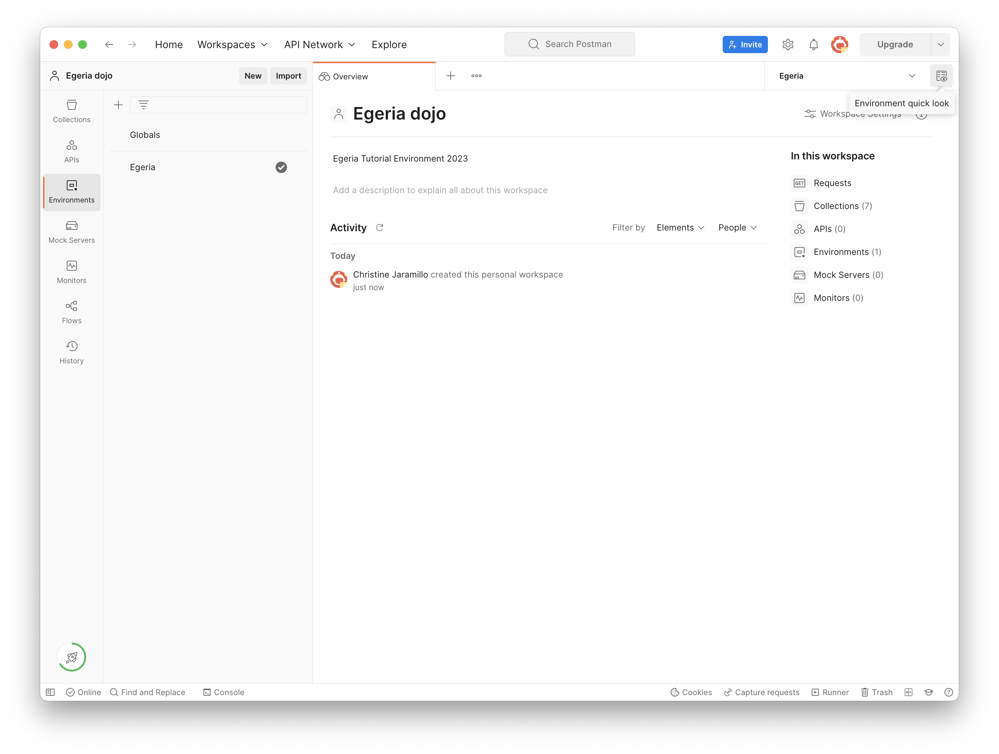

??? success "You should be able to view your current environment configuration"
    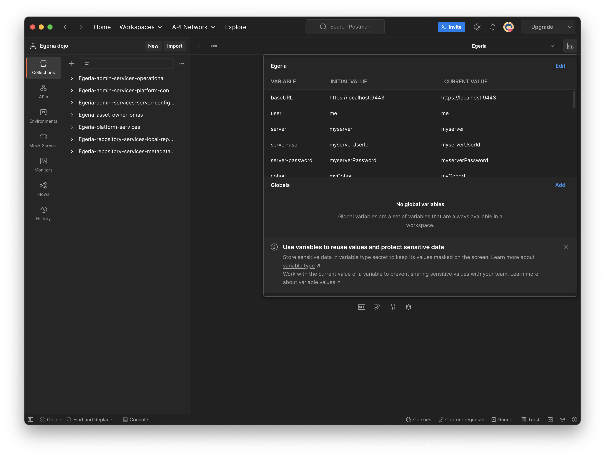

## Finished!

Postman is now ready to be used with Egeria. Refer back to the tutorials for specific
examples, or experiment!

Instructions for contributing new Postman collections
are located in the [developer-resources :material-dock-window:](/guides/contributor/guidelines/#postman-artifacts-for-apis){ target=docs} .

--8<-- "snippets/abbr.md"
