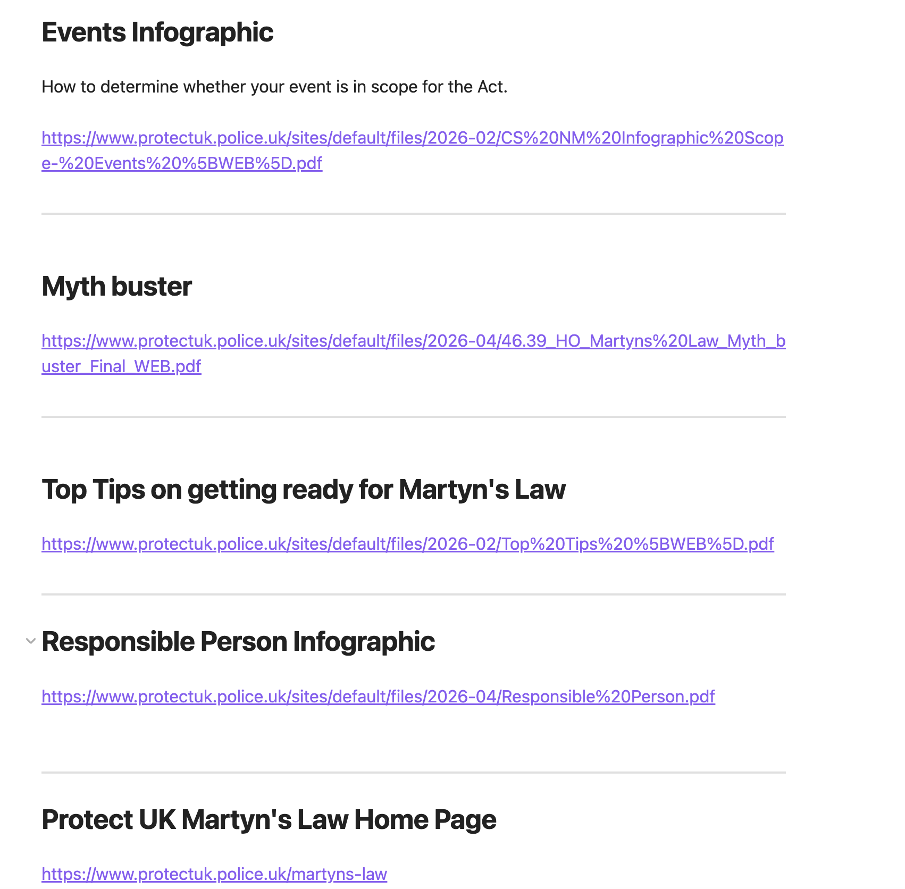
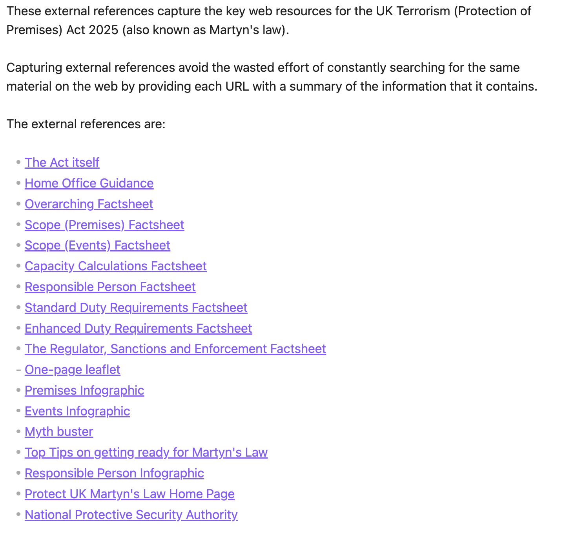
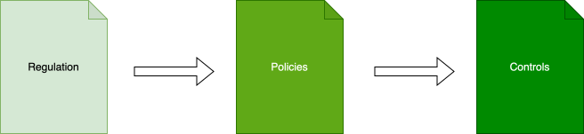
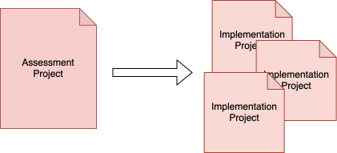

<!-- SPDX-License-Identifier: CC-BY-4.0 -->
<!-- Copyright Contributors to the Egeria project. -->

# Assessing new regulation

New regulations and amendments to existing legislation are a common occurrence in today's business landscape.  Keeping track of their requirements and how your organization is responding to them is critical to ensure compliance and minimize potential risks. This solution provides guidance on how to assess the impact of new regulations on existing systems and processes within an organization. It covers the steps required to identify, evaluate, and take any necessary actions associated with regulatory changes.

The aim is to provide a method that systematically:

* organizes the key sources of information related to a regulation, 
* extracts the requirements that are critical to you,
* develops one of more approaches to meeting these requirements, and 
* sets up the necessary processes (controls) to manage and track the effort.

Most of the solution is supported by [Dr.Egeria](/user-interfaces/dr-egeria/overview).  This feature uses Markdown text documents to create structured definitions relating to the regulation.  These can be shared and edited with colleagues, saved to a repository for safe keeping, published for general review and printed.  When each markdown document is complete, Dr.Egeria's command processor will scan the document, extracting the definitions and load them into Egeria's knowledge graph.  From there, new reports and web pages can be generated. Other teams can use the knowledge graph to drive their work and contribute their own content.

Not only does this approach help you to efficiently understand the changed to your regulatory landscape.  It prepares you to act and measure how effective your response is.  Information about the decisions that were made, and why, is captured for traceability and for future reference.

As each regulation is managed through this process, your organization is building a rich knowledge source of your organization's position on regulatory matters.

The steps to assessing a new regulation are described below.  The examples are largely drawn from Ivor Padlock's [Preparing for Martyn's Law](/practices/coco-pharmaceuticals/scenarios/preparing-for-martyns-law/overview) which is a 2025 UK counter-terrorism Law.

## Locating information sources

The useful documentation related to a regulation may be scattered across multiple sources.  There is typically the original source website maintained by the legislator, plus multiple sites offering guidance from the regulators to professional organizations to companies offering services relating to the legislation.

The first step is to list the names of the interesting sources returned from a web search in a markdown file.  

!!! example "Example list of references"

    
    > **Figure 1:** Initial list of references using a top level heading for a brief title and the URL.  You may wish to add a short description of the source based on your initial scan.  Each entry in the list is separated by a dividing line (4 underscore characters).

You may also wish to add a short description to the top of the Markdown document and a table of contents listing each of the resources.  This file is where you will build descriptions of these sources to help locate the original sources of information at a future time.  These descriptions are called [external references](/concepts/external-reference).

!!! example "Example table of contents"
    

## Understanding the requirements

The next phase extracts the requirements from the regulation and key definitions are organized into a glossary.  Details of the information found in the web sources are added to the external references markdown file to aid review and verification at a later time.

Create two new files, one for the regulation description and one for the glossary of terms.

The glossary file holds the definition of the overall glossary and a list of terms and their meanings extracted from the regulation's text.  The aim is to create communication clarity in the follow-on work with the regulators and other stakeholders.

Begin by creating the glossary definition by pasting in the template for the glossary and filling it out. 

The regulation description file will contain the main text of the regulation's requirements.  There is a single regulation element in the open metadata knowledge graph for the regulations itself.  It is also possible to create a *RegulationArticle* element for each article/section of the regulation.  This would allow you to divide the work of track the progress of each article.  It is your choice on which appropach to take.  For Martyn's Law, Coco Pharmaceuticals decided to use a single regulation element.

Add the regulation template to the regulation file.

Taking each of the sources listed in the previous section, start reviewing its contents. and extracting the requirements that are critical to your organization is the next step.

## Defining the response

The next phase is a collaborative effort working with all the stakeholders to review the requirements and create a set of policies that describe the approach to meeting them.

The three main types of policy are:

* **Principles** - a set of principles that guide the approach to meeting the requirements.  For example, the principle of "data minimization" states that only the data necessary to meet the requirements should be collected and processed.
* **Approach** - Details the chosen approach to documenting the way that the organization will support the regulation's requirements.
* **Obligations** - detail requirements that are mandatory and must be supported.  These are typically areas that the regulators focus on during reviews.

* 

## Organizing your definitions

You may wish to organize your definitions using a hierarchy of collections.  For example, the diagram below shows a top -level collection covering all regulations.  There are sub-folder collections for each major group of regulations and folders under that for particular regulations.  These collection could link the regulation definition itself, the glossary and the external sources.

## Managing the effort

Finally, Dr.Egeria supports the the management of projects that can be used to organize people into teams reposible for different aspects of the effort needed to support the regulation.

## Summary

This guide provides an overview of how to use Dr.Egeria to assess new regulations and manage the effort required to support them.  It covers the three main types of policy, organizing your definitions, and managing the effort required to support the regulation.

The fully worked example is available in the [Egeria workspaces](/egeria-solutions).
--8<-- "snippets/abbr.md"