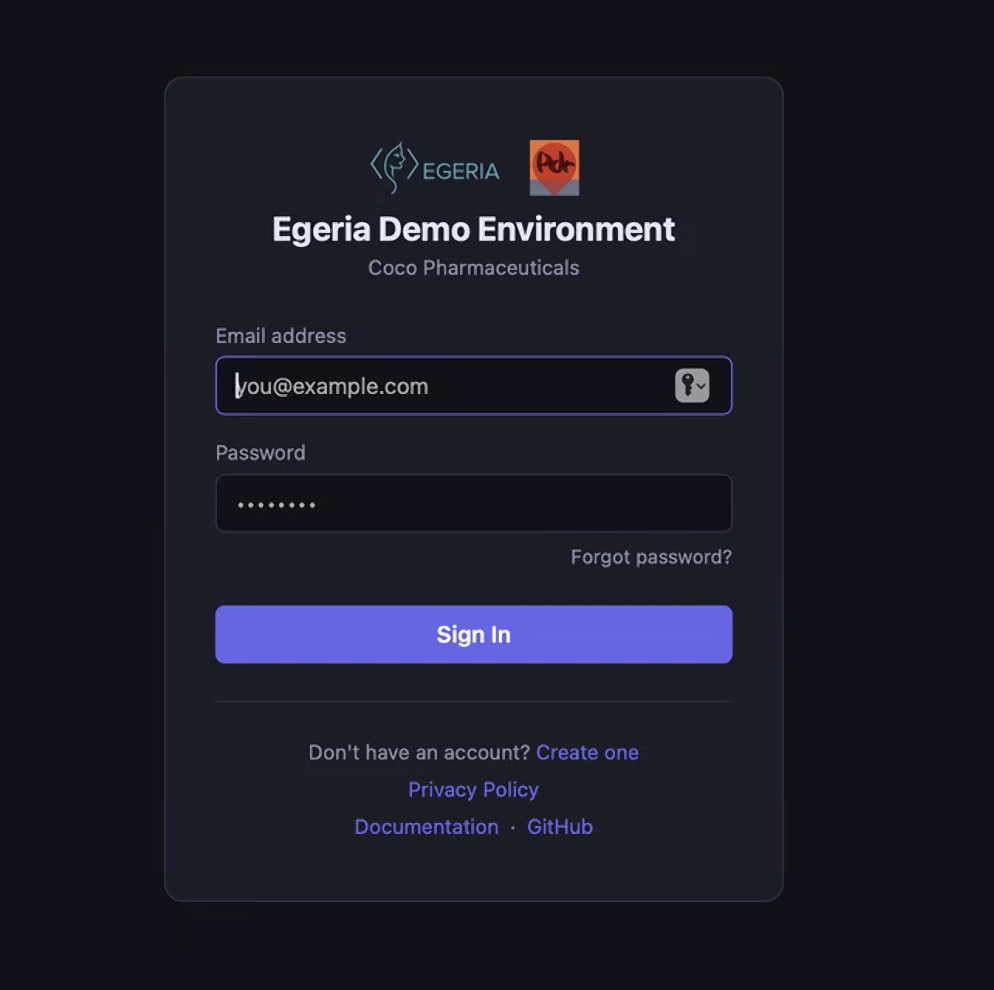
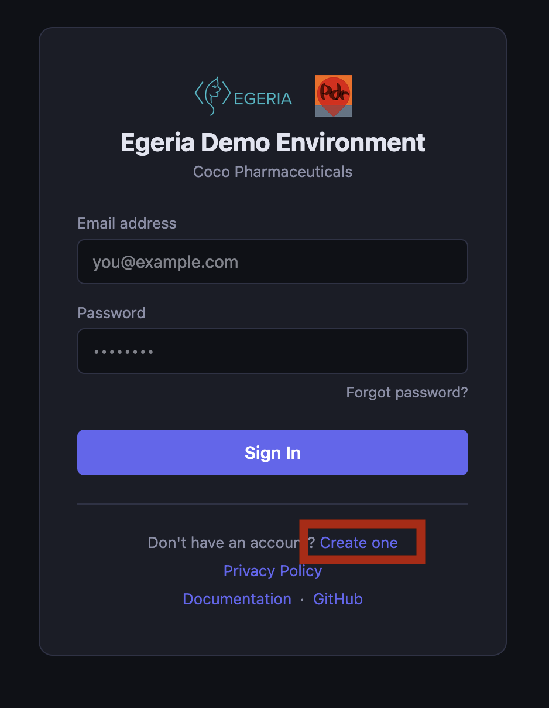
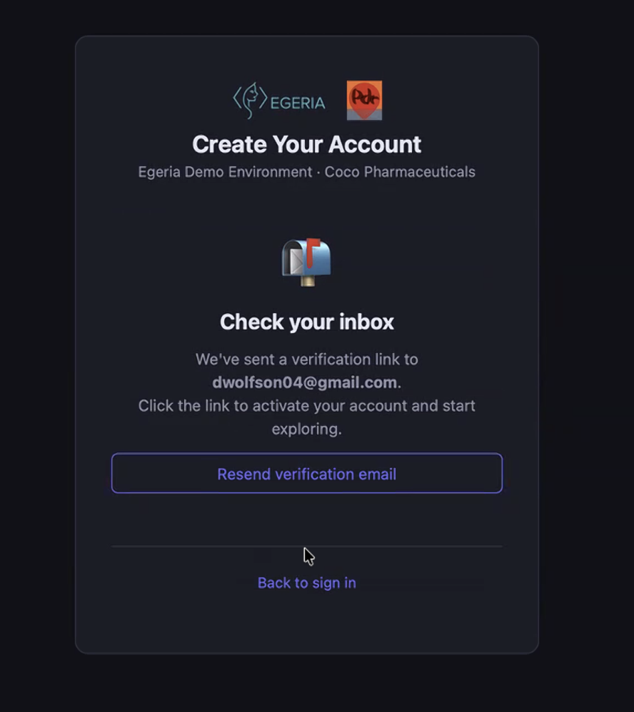
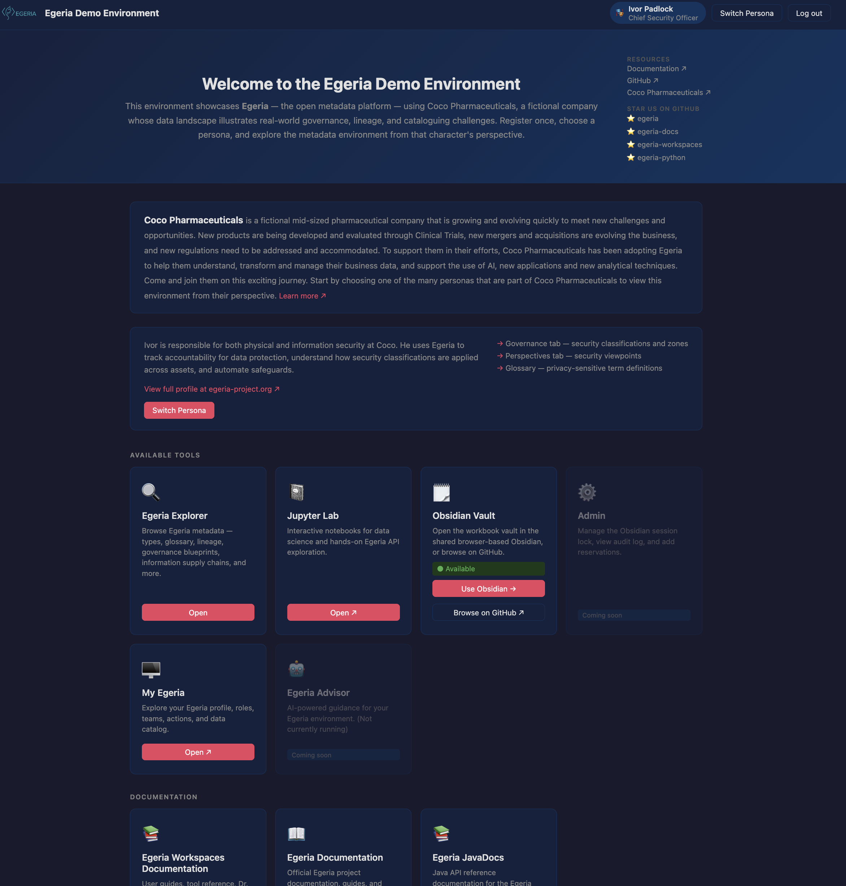

<!-- SPDX-License-Identifier: CC-BY-4.0 -->
<!-- Copyright Contributors to the Egeria project. -->

# Egeria's Demo Environment

[Pragmatic Data Research](https://pdr-associates.com/) has kindly offered to host a version of [Egeria Quickstart](/egeria-workspaces/quick-start/overview) on their website.  You can access it at [https://egeria.pdr-associates.com](https://egeria.pdr-associates.com).  It is a public environment that is reset each day so you cannot store your own metadata in it, if you want to keep it, that is :).  It is also possible that a previous user may have already run some labs.  

    <iframe width="560" height="315" src="https://www.youtube.com/embed/JV2UdEo1k8A" title="YouTube video player" allow="accelerometer; autoplay; clipboard-write; encrypted-media; gyroscope; picture-in-picture" allowfullscreen></iframe>

## Registering for the Demo Environment

The first time you access the demo environment, you will be prompted to register.  This is a simple process that involves providing your name and email address.  

> Initial logon screen

> Select **Create One** to register.

> Confirm your email address.

Once you have registered, you will be able to access the demo environment and start working through the labs.

## The Demo Environment Portal

Once you have logged on, you can explore the different uer interfaces.  First select your persona.  This will provide you with a user account to log oinot Egeria.  The different persona have different access privileges, so you may see different detail depending on the person you select.

> The demo environment.

This environment is changing rapidly as we containerise more tools and service, so check back regularly.  Also there is a feedback button on each page.  Please let us know if your experience is good or bad.  We are keen to improve both the navigation and the function on offer.

!!! attention "Security"
    The demo environment is public and is reset each day.  Do not add any private information into it.

--8<-- "snippets/abbr.md"