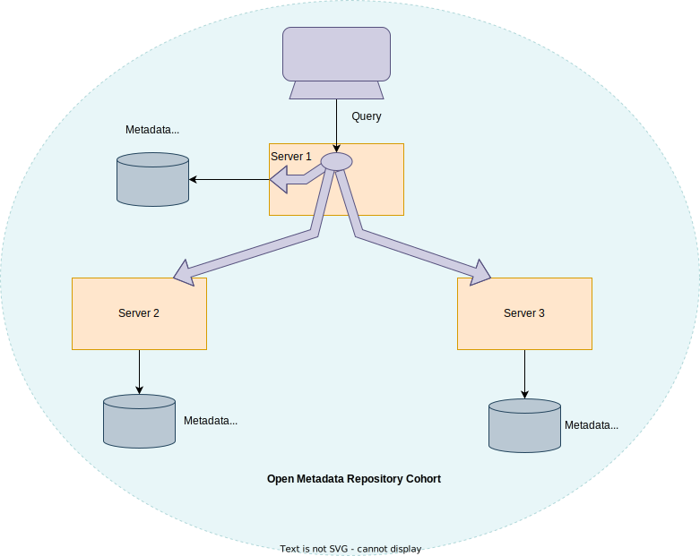
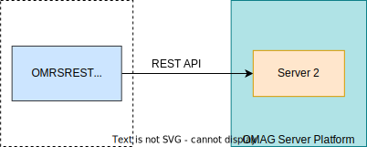

<!-- SPDX-License-Identifier: CC-BY-4.0 -->
<!-- Copyright Contributors to the Egeria project. -->

# Open Metadata Repository Cohort Operation

An *Open Metadata Repository Cohort* (or more simply, just a *cohort*) is a collection of [servers](#cohort-members) sharing metadata using a peer-to-peer exchange protocol.  Once a server becomes a member of the cohort, it can share metadata with, and receive metadata from, any other member either through events, or through [federated queries](#federated-queries).

The following types of servers can become a member of one or more cohorts.  

- [Metadata access store](/concepts/metadata-access-store)
- [Metadata access point](/concepts/metadata-access-point)
- [Repository proxy](/concepts/repository-proxy)

Their configuration lists the cohorts that they are to join.

--8<-- "snippets/admin/configuring-registration-to-a-cohort.md"

## Formation of a cohort

Cohort membership is established dynamically at server start up. This is through the cohort topic(s) defined in the configuration.

### First server

To join an open metadata repository cohort, a server first adds a [registration event](/concepts/cohort-events/#registry-events) to the cohort topic(s). This event identifies the server, its metadata repository (if any) and its capabilities.

> **Figure 1:** The first server to join the cohort issues a registration request and waits for others to join.

### Subsequent servers

When another server joins the cohort, it also adds its registration event to the cohort topic(s) and begins to receive the registration events from other members. The other members respond with [re-registration events](/concepts/cohort-events/#registry-events) to ensure the new member has the latest information about the originator's capabilities. The exchange of registration information causes all members to verify that they have the latest information about their peers. This is maintained in their own [cohort registry store](/connectors/cohort-registry-store-connector) so that they can reconfigure themselves on restart without needing the other members to resend their registration information.

> **Figure 2:** When another server joins the cohort they exchange registration information.

### Peer-to-peer operation

Once the registration information is exchanged and stored in each member's cohort registry store, it is ready to issue federated queries across the cohort, and respond to metadata requests from other members. The registration information includes the URL Root and server name of the member. The federation capability in each member allows it to issue metadata create, update, delete and search requests to each and every member of the cohort.

> **Figure 3:** Once the registration is complete the cohort members can issue federated queries.

!!! tip "Primary mechanism for accessing metadata"
    This peer-to-peer operation and federated queries are the primary mechanism for accessing metadata, because the [access services](/services/omas) use federated queries for every request they make for metadata.

### Metadata exchange

Once the cohort membership is established, the server begins publishing information using [instance events](/concepts/cohort-events/#instance-events) about changes to its [home metadata instances](/concepts/metadata-collection) in its local repository. These events can be used by other members to maintain a cache of reference copies of this metadata to improve availability of the metadata and retrieval performance. Updates to this metadata will, however, be automatically routed to the home repository by the enterprise repository services:

> **Figure 4:** Metadata can also be replicated through the cohort to allow caching for availability and performance.

!!! tip "Metadata refresh"
    A member may also request that metadata is "refreshed" across the cohort. The originator of the requested metadata then sends the latest version of this metadata to the rest of the cohort through the cohort topic. This mechanism is useful to seed the cache in a new member of the cohort and is invoked as a result of a federated query issued from any cohort member.

### Dynamic changes to types

Finally, as type definitions (TypeDefs) are added and updated, the cohort members send out events to allow the other members to verify that this type does not conflict with any of their types. Any conflicts in the types causes [audit log messages](/concepts/audit-log) to be logged in all members, prompting action to resolve the conflicts.

> **Figure 5:** TypeDef validation.

### Leaving the cohort

When an OMAG Server permanently leaves the cohort, it sends an unregistration request. This enables the other members to remove the parting member from their registries.

### Security

The server's [metadata security connector](/features/metadata-security/overview) provides fine-grained control on which metadata is sent, received and/or stored by the server. This level of control is necessary for metadata repositories that are managing specific collections of valuable metadata such as [Assets](/concepts/asset) that have sensitive attributes that need to be removed before the .

!!! education "Explore hands-on"
    The administration [hands-on lab](/education/open-metadata-labs) called "Understanding Cohort Configuration Lab" provides an opportunity to query the cohort registries of cohort members as they exchange metadata for Coco Pharmaceuticals.

## Federated queries

A federated query combines metadata retrieved from all members of the connected cohorts.

> Federated query visiting the local repository and then calling all other servers connected via the cohort(s).

The list of servers that are called by a federated query is built dynamically from the [cohort registration request](#cohort-registration) events.  These events take information from the [configuration document](/concepts/configuration-document) for the server.  

### Configuring the local repository for federated queries

In the *Local Repository* section of the configuration document are two connections:

* *LocalRepositoryLocalConnection* is the [connector to the metadata repository](/concepts/repository-connector) for this local server.
* *LocalRepositoryRemoteConnection* is the [connector that remote servers](/connectors/#cohort-member-client-connectors) should use in their federated queries to retrieve information from this local repository.

> Configuration document showing the both the local and remote connections for the local repository in a [metadata access store](/concepts/metadata-access-store) or [repository proxy](/concepts/repository-proxy).  In a [metadata access point](/concepts/metadata-access-point), both connections are null. In a metadata access store that does not support federated queries, LocalRepositoryRemoteConnection is null.

The LocalRepositoryRemoteConnection is sent to the other cohort members in the registration request events. The default value specifies the [OMRS REST Repository Connector](/connectors/#cohort-member-client-connectors) as the remote repository connector.

> The default remote-repository connector is a REST API client for the Repository REST API supported by Egeria OMAG Server Platform.

When the registration request is accepted, the receiving system uses the LocalRepositoryRemoteConnection to configure the remote repository connector in the *Enterprise Repository Connector* from the [enterprise repository services](/services/omrs/#enterprise-repository-services) that is responsible for executing the federated queries.

> The remote repository connectors are established dynamically in the enterprise repository connector using information from the registration events.

### Making federated queries

Whenever an [Open Metadata Access Service (OMAS)](/services/omas) is called, it uses the enterprise repository connector to create, retrieve, update and delete metadata.

The operation of the enterprise repository connector depends on the type of request.  When metadata is retrieved, the request is passed to all connected repositories and the results are combined.

> When metadata is retrieved, the enterprise repository connector calls the local repository and each of the registered remote repositories.  The metadata returned is combined and passed to caller.

Updates and deletes are targeted to the home repository of the instance.  The metadata collection identifier of the home repository is encoded in the header of the metadata instance.  This identifier is also known to each of the remote repository connectors, so it is possible to match the instance with its home repository.

> The home metadata collection is identified in the header of each metadata element.

When the home repository makes the change to the instance, it sends an event with the latest version of the instance to the rest of the cohort.

Create requests are passed first to the local repository, and if it can not support the requested type of metadata, then the enterprise repository connector tries each of the remote repository connectors until one of them returns to say that the new instance is created.

Whichever repository created the instance, becomes that instance's home repository, and it sends out an event to the rest of the cohort to announce that the new instance is available.

--8<-- "snippets/abbr.md"
