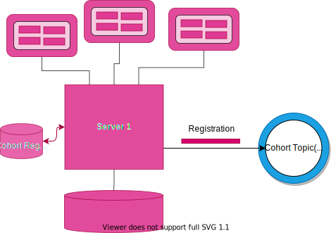
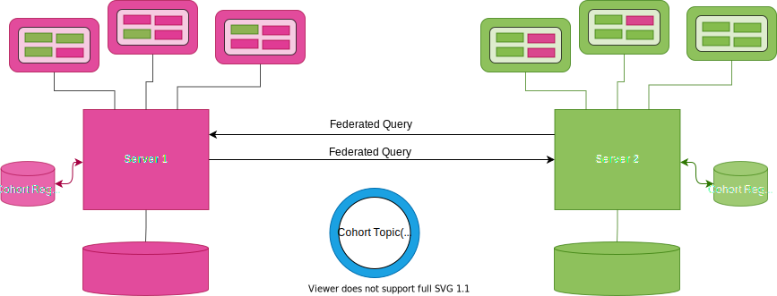

<!-- SPDX-License-Identifier: CC-BY-4.0 -->
<!-- Copyright Contributors to the Egeria project. -->

# Open Metadata Repository Cohort Operation

An *Open Metadata Repository Cohort* (or more simply, just a *cohort*) is a collection of [servers](#cohort-members) sharing metadata using a peer-to-peer exchange.  Once a server becomes a member of the cohort, it can share metadata with, and receive metadata from, any other member either through events, or through federated queries.

## Formation of a cohort

Cohort membership is established dynamically. This is through the [cohort topic(s)](/egeria-docs/concepts/cohort-events/#event-topics).

### First server

To join an open metadata repository cohort, a server must integrate with the OMRS module. OMRS then manages the metadata exchange. When OMRS running inside the server is [configured to join a cohort](/egeria-docs/guides/admin/guide) it first adds a [registration event](/egeria-docs/concepts/cohort-events/#registry-events) to the cohort topic(s). This event identifies the server, its metadata repository (if any) and its capabilities.

> **Figure 1:** The first server to join the cohort issues a registration request and waits for others to join.

### Subsequent servers

When another server joins the cohort, it also adds its registration event to the cohort topic(s) and begins to receive the registration events from other members. The other members respond with [re-registration events](/egeria-docs/concepts/cohort-events/#registry-events) to ensure the new member has the latest information about the originator's capabilities. The exchange of registration information causes all members to verify that they have the latest information about their peers. This is maintained in their own [cohort registry store](/egeria-docs/connectors/cohort-registry-store-connector) so that they can reconfigure themselves on restart without needing the other members to resend their registration information.

> **Figure 2:** When another server joins the cohort they exchange registration information.

### Peer-to-peer operation

Once the registration information is exchanged and stored in each member's cohort registry store, it is ready to issue federated queries across the cohort, and respond to requests for metadata from other members. These requests can both retrieve metadata and maintain metadata in the [home metadata repository](../metadata-repositories/#home-metadata-repositories).

The management of federated queries and the routing of maintenance requests is managed by OMRS's [enterprise repository services](../#enterprise-repository-services). The enterprise repository services are configured with the registration information from across the cohort at the same time as the cohort registry store is updated. This process is managed by the [cohort registry](#cohort-registry).

The registration information includes the URL Root and server name of the member. The federation capability in each member allows it to issue metadata create, update, delete and search requests to each and every member of the cohort.

> **Figure 3:** Once the registration is complete the cohort members can issue federated queries.

!!! tip "Primary mechanism for accessing metadata"
    This peer-to-peer operation and federated queries are the primary mechanism for accessing metadata, because the [access services](/egeria-docs/services/omas) use federated queries for every request they make for metadata.

### Metadata exchange

Once the cohort membership is established, the server begins publishing information using [instance events](/egeria-docs/concepts/cohort-events/#instance-events) about changes to the [home metadata instances](../metadata-repositories/#home-metadata-repositories) in their repository. These events can be used by other members to maintain a cache of reference copies of this metadata to improve availability of the metadata and retrieval performance. Updates to this metadata will, however, be automatically routed to the home repository by the enterprise repository services:

> **Figure 4:** Metadata can also be replicated through the cohort to allow caching for availability and performance.

!!! tip "Metadata refresh"
    A member may also request that metadata is "refreshed" across the cohort. The originator of the requested metadata then sends the latest version of this metadata to the rest of the cohort through the cohort topic. This mechanism is useful to seed the cache in a new member of the cohort and is invoked as a result of a federated query issued from any cohort member.

### Dynamic changes to types

Finally, as type definitions (TypeDefs) are added and updated, the cohort members send out events to allow the other members to verify that this type does not conflict with any of their types. Any conflicts in the types causes [audit log messages](/egeria-docs/concepts/audit-log) to be logged in all members, prompting action to resolve the conflicts.

> **Figure 5:** TypeDef validation.

### Leaving the cohort

When an OMAG Server permanently leaves the cohort, it sends an unregistration request. This enables the other members to remove the parting member from their registries.

## Enabling cohort membership

Egeria provides a number of pre-built [cohort members](#cohort-members).

One of them, the [repository proxy](/egeria-docs/concepts/repository-proxy) provides a simple way to integrate a third party server into a cohort by creating an [OMRS Repository Connector and optional Event Mapper Connector :material-github:](https://github.com/odpi/egeria/tree/master/open-metadata-implementation/adapters/open-connectors/repository-services-connectors/open-metadata-collection-store-connectors){ target=gh } to map between the third party APIs/events and the repository service's equivalents

A more bespoke integration involves:

- Creating an [OMRS repository connector and optional event mapper connector :material-github:](https://github.com/odpi/egeria/tree/master/open-metadata-implementation/adapters/open-connectors/repository-services-connectors/open-metadata-collection-store-connectors){ target=gh }
- Designing how to configure the OMRS Services for your metadata repository. Typically, this is done by extending the existing administration services of the metadata repository, but Egeria also offers some pre-built [administration services](/egeria-docs/guides/admin/guide) that can be used or modified.
- Plugging the OMRS and any administration services into the metadata repository's security module so that requests to the server can be secured against unauthorized access.
- Integrating the OMRS, administration and security capability into your product.

There are different integration patterns available to help you choose the best approach for your product. Each method is optimized for specific use cases and so the metadata repository can only play a full role in the open metadata use cases if it supports all integration methods. These are:

- Support for an OMRS repository connector to allow open metadata API calls to the repository to create, query, update and delete metadata stored in the repository.
    - The OMRS connectors support the [Open Connector Framework (OCF)](/egeria-docs/frameworks/ocf/overview) to provide a call interface to the metadata repositories.
    - The OMRS Repository Connector API is a standard interface for all metadata repositories. This enables services such as the Enterprise OMRS Repository Connector to interact with 1 or many metadata repositories through the same interface.  
    - The connection configuration it passes to the OCF determines which type of OMRS connector is returned by the OCF.
- Support for the OMRS event notifications that are used to synchronize selective metadata between the metadata repositories.

### Cohort members

A *cohort member* is an [OMAG Server](/egeria-docs/concepts/omag-server) that is registered with at least one open metadata repository cohort.

Management of a server's membership is handled by the [cohort services](../#cohort-services).

The exchange of metadata uses the [Open Metadata Repository Services (OMRS)](/egeria-docs/services/omrs) interfaces which gives fine-grained[^1] metadata notifications and updates. During server start up, the repository services detect the configuration of at least one cohort and starts the *metadata highway manager*. The metadata highway manager creates a *cohort manager* for each cohort configuration. The cohort manager manages the initialization and shutdown of the server's connectivity to a cohort, including the management of the [cohort registry](#cohort-registry).

The server's [metadata security connector](/egeria-docs/features/metadata-security/overview) provides fine-grained control on which metadata is sent, received and/or stored by the server. This level of control is necessary for metadata repositories that are managing specific collections of valuable objects such as [Assets](../../../access-services/docs/concepts/assets).

The types of cohort members include:

- [Metadata access store](/egeria-docs/concepts/metadata-access-store)
- [Metadata access point](/egeria-docs/concepts/metadata-access-point)
- [Repository proxy](/egeria-docs/concepts/repository-proxy)
- [Conformance test server](/egeria-docs/concepts/conformance-test-server)

!!! education "Explore hands-on"
    The administration [hands-on lab](/egeria-docs/education/open-metadata-labs) called "Understanding Cohort Configuration Lab" provides an opportunity to query the cohort registries of cohort members as they exchange metadata for Coco Pharmaceuticals.

## Cohort registration

Each repository in the cohort has a [cohort registry](#cohort-registry) that supports the registration of the metadata repositories across the cohort. Through the registration process, each cohort registry assembles a list of all members of the cohort. This is saved in the [cohort registry store](/egeria-docs/connectors/cohort-registry-store-connector).

The list of connections to the remote members of the cohort are passed to the OMRS Enterprise Connector Manager that in turn manages the configuration of the Enterprise OMRS Repository Connectors. The Enterprise OMRS Connector provides federated query support across the metadata cohort for the [Open Metadata Access Services (OMAS)](/egeria-docs/services/omas).

When a metadata repository registers with the [cohort registry](#cohort-registry), the administrator may either supply a unique server identifier, or ask the OMRS to generate one. This server identifier (the [metadata collection id](/egeria-docs/concepts/metadata-collection-id)) is used in the OMRS event notifications, and on OMRS repository connector calls to identify the location of the home copy of the metadata entities and to identify which repository is requesting a service or supports a particular function.

Once the metadata repository has registered with the [cohort registry](#cohort-registry), it is a member of the metadata repository cohort and can synchronize and share metadata with other repositories in the cohort through the [cohort topic(s)](/egeria-docs/concepts/cohort-events/#event-topics).

!!! tip "Registering with multiple cohorts"
    A single metadata repository can register with multiple metadata cohorts as long as its server identifier is unique across all cohorts that it joins and it manages the posting of events to the appropriate OMRS topic for each cohort it registers with.

    This capability is useful for a metadata repository that is aggregating reference copies of metadata from multiple open metadata repository cohorts.

### Cohort registry

The *cohort registry* resides in each [cohort member](#cohort-members). It is responsible for registering a member with a specific open metadata repository cohort and maintaining a list of the other members of this cohort.

The registration process is managed by exchanging [registry events](/egeria-docs/cohort-events/#registry-events) over the [cohort topic(s)](/egeria-docs/concepts/cohort-events/#event-topics).

The cohort registry maintains its record of the membership of the cohort in a [cohort registry store](/egeria-docs/guides/developer/runtime-connectors/cohort-registry-store-connector).

[^1]: You may want to see the [OMRS metamodel](/egeria-docs/guides/developer/metamodel/overview) for more details on the granularity of metadata exchange.

--8<-- "snippets/abbr.md"
