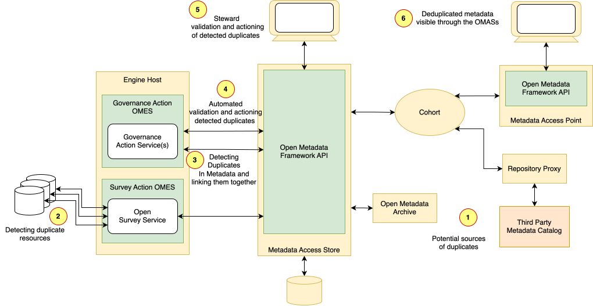
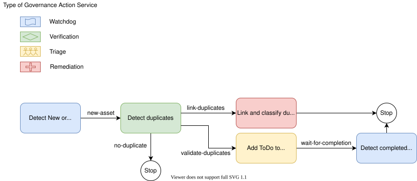
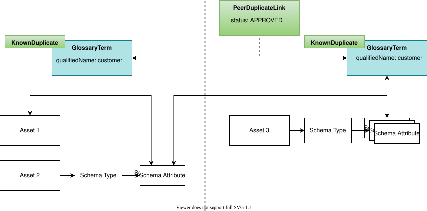
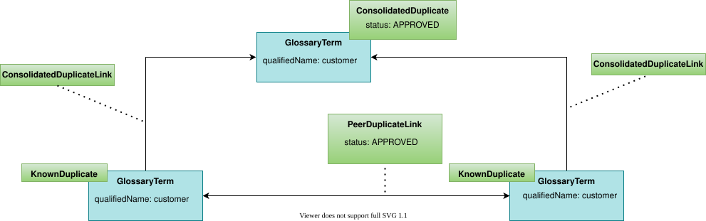
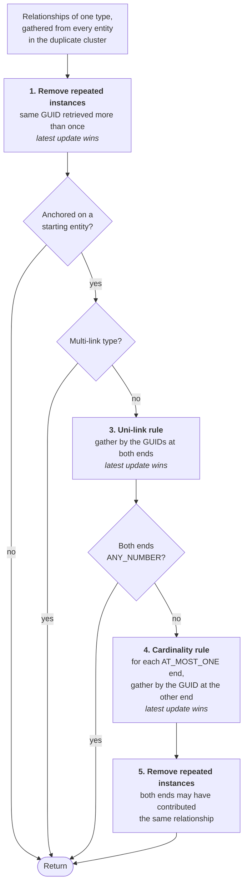
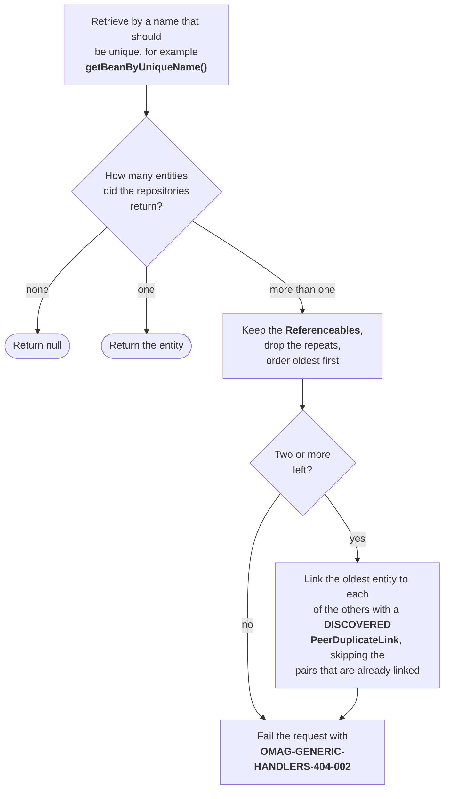
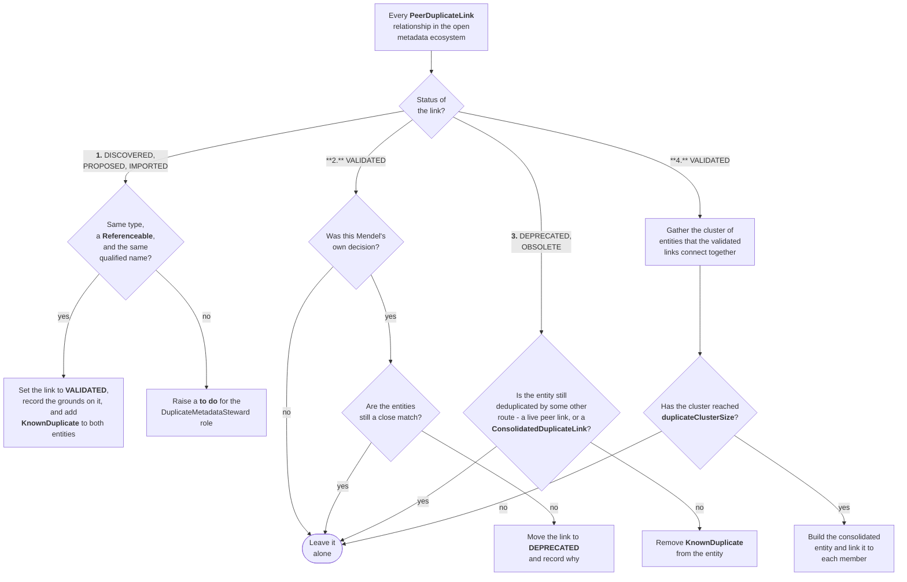

<!-- SPDX-License-Identifier: CC-BY-4.0 -->
<!-- Copyright Contributors to the ODPi Egeria project 2020. -->

# Duplicate Management

Duplicate management identifies multiple metadata instances that represent the same concept or resource. These *duplicate instances*, as they are called, occur when the same concept or resource is captured in multiple tools.  They are not noticed as duplicates when the tools operate independently.  However, when these tools are connected together through Egeria, the duplicates are shared.  The result is the appearance of more resources than there are, and any inconsistencies between them can lead to possible errors in decisions made using this information.

It is rarely possible to simply delete all but one of the duplicate instances because each copy is often needed by its originating tool.  Egeria needs a mechanism to handle these duplicates.

Egeria's duplicate management ensures duplicate instances are linked and classified so that on retrieval, the information from the duplicates is combined to give a meaningful result.

## Examples duplicate instances

Figure 1 shows a simple case where each duplicate instance originates from a different tool.  Although each instance has a different unique identifier (GUID), the rest of the metadata is consistent.  This makes it easy to spot when both are returned in a search query.  However, a query to count, say, the number of glossary terms would give misleading results.

> **Figure 1:** Two copies of the same glossary term originating from different repositories

When related information is required (for example, which assets are linked to the glossary term `customer`) the request needs to be issued for each duplicate instance to retrieve the complete picture.  Figure 2 shows that the users of one tool have linked their copy of the glossary term to assets 1 and 2 whereas the users of the other tool have linked their copy of the glossary term to asset 3.

> **Figure 2:** Different sets of relationships associated with each duplicate

Some duplicates are not so easy to identify.  Figure 3 shows an example of duplicate assets where the values in the assets are different, but the fact that they describe the same resource can be deduced by the fact that the related endpoints point to the same location.

>**Figure 3:** Duplicate assets identified through their endpoints

In some circumstances the tools are correctly cataloguing the existence of two resources however the resources themselves are duplicates of one another.  Figure 4 shows two copies of the same image.  The tools record the name of each copy but have no knowledge that their contents are the same.

> **Figure 4:** Two copies of the same resource are catalogued as two assets.  There is no shared values in the metadata.

## Avoiding duplicates

Duplicates can add a significant burden to your data processing.  Therefore, there is value in controlling the copying of data and ensuring that resources are catalogued only once. However, some duplication can not be avoided and Egeria has mechanisms to handle them.

## How are duplicates managed in Egeria?

Duplicate management has four parts to it:

* Detecting duplicate resources
* Detecting duplicate metadata entries for the same resource or concept.
* Linking duplicate instances together so that they can be processed together.
* Combining duplicate instances so that they can be retrieved as if they were one.

Figure 5 shows the architecture of an Egeria duplicate management solution.

>**Figure 5:** Components in a deduplication solution include the cohort members that are supplying the duplicates and retrieving metadata along with the engine host that is running the governance engines detecting and managing duplicates in conjunction with the stewards

The numbers on the diagram refer to the following points:

1. These are the tools that are potentially introducing duplicates into the cohort.  In this example they are connected through repository proxies and are not capable of storing reference copies of metadata.  This means the duplicates that they collectively introduce must be managed for the benefit of other consumers of the metadata.

2. [Metadata Discovery](/features/metadata-discovery/overview) analyses the content of resources and so can be used to detect duplicate resources (as opposed to duplicate catalog entries for the same resource).  There are algorithms for producing a fingerprint (like a hash) that represents the content of each resource. These fingerprints can be [stored as annotations](/types/6/0620-Resource-Profiling) attached to the resource's asset via a [survey report](/concepts/survey-report).  These fingerprint annotations are metadata that can be automatically analysed during duplicate detection.

3. The examples in figures 1-4 show that the mechanisms to detect duplicates are varied and often require knowledge of the data management practices in the organization.  As such this function must be pluggable into Egeria's runtime. [Engine Actions](/concepts/engine-action) monitor for changes in metadata and search for duplicate instances.  They link detected duplicates together.

4. A governance action, possibly the same one that detected the duplicates, can validate and action the duplicates so that survivorship processing occurs when they are retrieved from the metadata repositories (see step 6).

5. Alternatively, the duplicates can be validated and actioned by a steward.

6. When a [service](/services/omas) detects duplicates during a request to retrieve metadata from the repositories it automatically processes the duplicates so the caller is not aware that the duplicates exist.

Figure 6 shows an example of a [governance action process](/concepts/governance-action-process) that controls the governance actions and the use of the stewards for duplicate detection.

>**Figure 6:** The steps in an example governance action process 

There is a watchdog governance action that is monitoring for new assets. It initiates a verification governance action to detect any duplicates for each new asset.  Each verification governance action produces a guard whose value depends on the confidence that it has in the accuracy of any detected duplicates:

* `no-duplicate` guard means it discovered no duplicates and so the process stops.
* `link-duplicates` guard means it is very confident that it has detected a duplicate and so it can be actioned automatically by a remediation governance action before the process stops.
* `validate-duplicates` guard means that a steward should verify that duplicates have really been detected.  This is achieved by a triage governance action creating a [`ToDo`](/concepts/to-do) and a watchdog governance action waiting for the steward to complete the ToDo before stopping.  The steward uses the [Classification Manager](/services/omvs/classification-explorer/overview) API to verify and set up the duplicates.

Egeria also supplies a ready-made implementation of this loop that needs no governance action process to be defined.  It detects the duplicates that share a qualified name and manages the resulting links with an integration connector - see [automated duplicate management](#automated-duplicate-management).

## Duplicate management styles

Egeria has two styles of duplicate management that can be actioned automatically or by a steward.  They are *peer linking* and *consolidation*.  The open metadata types used in both styles are defined in model [0465 Duplicate Management](/types/4/0465-Duplicate-Processing).

### Peer linking

When duplicate entities are first detected by a governance action, they are linked together by the [PeerDuplicateLink](/types/4/0465-Duplicate-Processing#PeerDuplicateLink) relationship.  This relationship includes properties that indicate how confident the detecting process is that the entities are duplicate instances.  No change occurs in the retrieval of these instances at this point.

If a steward or automated process confirms the duplicate instances are correctly identified, [KnownDuplicate](/types/4/0465-Duplicate-Processing#knownDuplicate) classifications added to the entities tell the metadata retrieval functions to [automatically combine the content of the duplicates](#survivorship-rules) when any of them is requested.  This is *peer linking*.

### Consolidation

Consolidation is the process where the combined results of the duplicates is pre-calculated, stored as a new entity and linked to the duplicate instances using the [ConsolidatedDuplicateLink](/types/4/0465-Duplicate-Processing#consolidatedduplicate-and-consolidatedduplicatelink) relationship.  The assessment of confidence of the deduplication is stored in the [ConsolidatedDuplicate](/types/4/0465-Duplicate-Processing#consolidatedduplicate-and-consolidatedduplicatelink) classification on the instance that contains the combined results.

### Metadata retrieval of duplicates

When an Egeria retrieval operation is requested by an [Open Metadata Access Service (OMAS)](/services/omas), it monitors for the `KnownDuplicate` classification on the entities it is retrieving.  When found, and the retrieval request is not part of duplication management, deduplication occurs.  

#### Deduplication

During deduplication, the retrieval process first looks for the `ConsolidatedDuplicateLink` relationship.  If that is found, the consolidated instance is returned instead. If not, the instances linked via `PeerDuplicateLink` relationships are combined.  The combination process requires choices to be made on which values to use.  These choices are called the *survivorship rules*.

#### Survivorship rules

The survivorship rules operate on the following principles:

* Newer metadata is more accurate.
* The cardinality of relationships must be respected.
* If multiple peer entities point to the same target entity with the same type of uni-link relationship then the target entity is processed only once.

Figure 7 shows two glossary terms linked as peer duplicates. When an entity is queried by GUID, properties from the most recently updated duplicate instance are returned with a combination of classifications.  Conflicts in classifications are recorded on the audit log.  The latest values from the conflicting classifications are used. 

When the relationships of an identified duplicate are queried, the combination of relationships from all duplicate entities is returned unless only one instance of a relationship is allowed in which case the latest values are used.  

> **Figure 7:** Peer duplicates with distinct relationships

Figure 8 shows that both glossary terms link to the same schema attribute using the [SemanticAssignment](/types/3/0370-Semantic-Assignment) relationship.  Although this relationship has a cardinality of many-to-many, it is [*uni-link*](/concepts/uni-multi-link) so only the newest relationship is processed. 

> **Figure 8:** Peer duplicates pointing to the same entity via the same type of uni-link relationship

Figure 9 shows a consolidated duplicate linked to the glossary terms.  If any of these three entities are requested the consolidated duplicate is returned.

> **Figure 9:** Peer duplicates linked to a consolidated duplicate

Note: survivorship rules only operate on instances with appropriate [effectivity dates](/features/effectivity-dates/overview).

## Entity deduplication

The [survivorship rules](#survivorship-rules) describe the result that a caller sees.  This section and the next describe how that result is produced.  The work is done by the [repository handler](/services/repository-handler) common service, in the `org.odpi.openmetadata.commonservices.repositoryhandler` package.  For entities the entry point is the `validateRetrievedEntity()` method of `RepositoryHandler`, which uses `DuplicateEntityIterator` to work out which entities make up the duplicate cluster.

Every entity that the repository handler passes back - whether it was retrieved by GUID, returned by a search, or found at the far end of a relationship - goes through this processing.  It is a *retrieval-time* filter: nothing in the repositories is created, updated or deleted, so the duplicates are still there.  They are simply presented to the caller as a single entity.

### Resolving the duplicate cluster

`DuplicateEntityIterator` starts from the entity that the repositories returned and works out which entities need to be gathered.

```mermaid
flowchart TD
    A["Entity retrieved
    from the repositories"] --> B{"`**KnownDuplicate**
    classification,
    effective now?`"}
    B -->|no| Z(["Return the
    entity as it stands"])
    B -->|yes| C["`Follow the
    **ConsolidatedDuplicateLink**`"]
    C --> D{"Consolidated entity
    found and approved?"}
    D -->|yes| Y(["Return the
    consolidated entity"])
    D -->|no| E["`Walk the confirmed
    **PeerDuplicateLink** relationships,
    transitively, visiting
    each entity once`"]
    E --> F["Combine the
    peer entities"]
```
> **Figure 10:** How the repository handler decides which entities make up the duplicate cluster

1. If the entity does not carry the `KnownDuplicate` classification - or the classification is not effective at the caller's [effective time](/features/effectivity-dates/overview) - there is nothing to do and the entity is returned as it stands.  This is the normal path, and it costs one classification check.

2. If the entity is a known duplicate, the iterator follows its `ConsolidatedDuplicateLink` relationship, looking for a consolidated entity of the same type.  If one is found, and its `ConsolidatedDuplicate` classification is effective at the caller's effective time and carries a `statusIdentifier` of `VALIDATED`, that entity is returned *in place of* the one that was retrieved and the peers are not visited at all.  The combining work was done when the consolidated entity was created, so there is nothing left to calculate.  Any other status - or a classification that is not effective now - means the consolidated entity is ignored and processing continues with the peers.

3. Otherwise the iterator walks the `PeerDuplicateLink` relationships.  Only links whose `statusIdentifier` is `VALIDATED` are followed.  Every other value leaves the entities uncombined, whether it means that nobody has ruled on the link yet (`DISCOVERED`, `PROPOSED`, `IMPORTED`) or that a steward has separated the entities again (`DEPRECATED`, `OBSOLETE`).  The walk is transitive - the peers of each peer are added to the list - and each entity is visited only once, so a cluster that has been linked up piecemeal by different detection runs is still traversed completely, and a loop in the links cannot send the walk round for ever.

Each entity the walk reaches is checked before it is allowed to contribute to the result.  It must be effective at the caller's effective time, and an entity carrying the [Memento](/concepts/memento) classification is passed over unless this is a lineage request.  An entity that fails these checks is still traversed for its own peer links, because it may be the only entity that knows about another member of the cluster.  Peers that cannot be retrieved at all - because they have been deleted, or the caller is not authorized to see them - are logged and skipped rather than failing the whole request.

### Combining the peer entities

When the cluster turns out to be more than one entity - that is, there was no approved consolidated entity and there are confirmed peers - the peers are combined into a new in-memory entity.  The entity that is built is a copy, so nothing held in the repositories or their caches is altered.

**Properties and identity.**  Each peer in turn is compared with the result so far and the more recently updated of the two is kept.  Where an entity has never been updated its creation time is used instead.  If two entities are equally recent, the one with the higher GUID is kept, so the outcome does not depend on the order in which the repositories happened to return the peers.  The winner supplies the whole of the returned entity apart from its classifications - not just its properties, but its GUID, type, status and [provenance](/features/metadata-provenance/overview) as well.  A caller that retrieves a known duplicate by GUID may therefore be handed an entity whose GUID is that of one of its peers.

**Classifications.**  These are treated separately, because a classification that only one member of the cluster carries is still information about the concept that the cluster describes.  They are gathered by name: the classifications of the entity that was originally retrieved go in first, and then those of each peer are merged in.  The returned entity therefore carries one instance of every classification name found anywhere in the cluster.

Where the same classification name is found on more than one member of the cluster, the two versions are in conflict and only one of them can be returned.  The most recently updated version is the one that is kept, and the conflict is recorded on the [audit log](/concepts/audit-log) so that it can be investigated.  A conflict is not an error - the members of a cluster are maintained by different tools, so they will naturally drift apart - but a classification that is repeatedly in conflict is a sign that the tools disagree about the concept, which is worth knowing.

The result is a single entity holding the newest properties in the cluster, together with the newest version of each classification in the cluster.

### Entities in search results

When a list of entities is returned - from a search, or from following a relationship to its far end - each entity in the list is put through the same processing and the results are gathered into the list that the caller receives.

A search will often match several members of the same duplicate cluster, since it is precisely their similarity that made them duplicates in the first place.  Each of those members resolves to the same consolidated or combined entity, so the list is checked as it is built and an entity that is already present is not added a second time.  A duplicate cluster therefore contributes a single entry to the results however many of its members the search matched, so the caller sees one result per concept rather than one result per tool that catalogued it.

Entities that are filtered out by this processing simply do not appear in the list.  An empty list is therefore not the same as "no more results": it means everything on this page was filtered out, and the caller can ask for the next page.

Where a single entity was requested by GUID and the processing filters it out, the handler cannot return nothing without explanation, so it throws an `InvalidParameterException` carrying `OMAG-REPOSITORY-HANDLER-0009` and writes the same information to the [audit log](/concepts/audit-log).  The message records the classifications that were on the entity, its effectivity dates, the effective time that was asked for and the `forLineage` and `forDuplicateProcessing` settings, which between them identify which of the checks rejected it.

## Relationship deduplication

Combining the entities of a duplicate cluster is only half of the job.  The relationships of those entities have to be combined too, otherwise the caller would see the same attachment several times over - once for each member of the cluster.  This is the work of the `RelationshipAccumulator` class, and like entity deduplication it is a retrieval-time filter that leaves the repositories untouched.

### Gathering the relationships

When the relationships of an entity are requested, the repository handler does not simply query the entity that the caller named.  It first resolves the duplicate cluster in exactly the way [described above](#resolving-the-duplicate-cluster), then retrieves the relationships of every entity in that cluster and passes them to the `RelationshipAccumulator`.  Three things happen as they are added:

* The `PeerDuplicateLink` and `ConsolidatedDuplicateLink` relationships themselves are removed.  They are the plumbing of duplicate management and are of no interest to a caller that is unaware duplicates exist.
* Relationships whose effectivity dates do not span the caller's effective time are discarded.
* The end of the relationship that points to the peer is replaced by a proxy for the entity that the caller actually asked for, complete with its unique properties.  This is what allows the caller to be presented with a single, coherent graph anchored on their entity - and it is also what makes the filtering below possible, because relationships that came from different peers to the same target now look identical at the anchor end.

The accumulated relationships are sorted by type name and each type is filtered independently, since the rules that follow depend on the settings in the relationship's type definition.

### The filtering passes

```mermaid
flowchart TD
    A["Relationships of one type,
    gathered from every entity
    in the duplicate cluster"] --> B["`**1. Remove repeated instances**
    same GUID retrieved more than once
    _latest update wins_`"]
    B --> C{"Anchored on a
    starting entity?"}
    C -->|no| Z(["Return"])
    C -->|yes| D{"Multi-link type?"}
    D -->|yes| Z
    D -->|no| E["`**3. Uni-link rule**
    gather by the GUIDs at both ends
    _latest update wins_`"]
    E --> F{"Both ends
    ANY_NUMBER?"}
    F -->|yes| Z
    F -->|no| G["`**4. Cardinality rule**
    for each AT_MOST_ONE end,
    gather by the GUID at the other end
    _latest update wins_`"]
    G --> H["`**5. Remove repeated instances**
    both ends may have contributed
    the same relationship`"]
    H --> Z
```
> **Figure 11:** The passes that the relationship accumulator makes over the relationships of a single type

1. **Remove repeated instances.**  The same relationship can be retrieved more than once, because both of its ends may be members of the duplicate cluster, or because the same consolidated entity was reached from several peers.  Relationships are gathered by GUID and the version with the latest update time survives.  Where a relationship has never been updated, its creation time is used instead.

2. **Stop if there is nothing to anchor on.**  A search for relationships (`findRelationships()`) has no starting entity, so there is no basis on which to decide that two different relationships represent the same link.  The list from pass 1 is returned unchanged.  The same applies to [multi-link](/concepts/uni-multi-link) relationship types, where several instances between the same two elements are legitimate and must all be returned.

3. **Apply the uni-link rule.**  For [uni-link](/concepts/uni-multi-link) types, only one relationship of the type is permitted between two elements in a particular direction.  The relationships are gathered by the pair of GUIDs at their two ends and, again, the most recently updated one survives.  Because the peer end was rewritten to the requested entity when the relationships were gathered, relationships from different members of the duplicate cluster to the same target element collide here and collapse to a single relationship.  This is the behaviour illustrated in figure 8.

4. **Apply the cardinality rule.**  If both ends of the type are defined with a cardinality of `ANY_NUMBER` there is nothing more to do and the result of pass 3 is returned.  Where an end is defined as `AT_MOST_ONE`, the relationships are gathered by the GUID at the *other* end and the most recently updated one survives, so that a duplicate cluster cannot present the caller with more attachments than the type allows.

    Two details govern how the two ends interact:

    * If the attribute names at the two ends of the type are different, the ends are independent - the relationship has a direction - and each end is filtered separately.  If the attribute names are the same, the type is [reversible](/concepts/uni-multi-link#reversible-relationships) and the two ends are filtered against a single set of elements, so at most one relationship survives no matter which way round it is stored.
    * If the caller has restricted the results to attachments at a specific end, the filtering for the opposite end is skipped, because pass 3 has already removed those duplicates.

5. **Remove repeated instances again.**  Passes 3 and 4 each contribute their surviving relationships to the result, so the same relationship instance can be added twice.  Pass 1 is repeated over the result to remove them.

### Audit log record

Whenever the filtering changes the number of relationships being returned, the repository handler writes message `OMAG-REPOSITORY-HANDLER-0014` to the [audit log](/concepts/audit-log).  It lists the GUID, creator and type of each relationship that was retrieved from the repositories, along with the GUIDs of the relationships that were returned to the caller.  It is logged at `INFO` severity because deduplication is normal behaviour; the reason for capturing it is so that the duplicates that are being suppressed can be checked and confirmed as genuine.

## Requests that do not deduplicate

Deduplication has to be suppressed for the processes that manage the duplicates, otherwise they would be unable to see the instances they are working on:

* When a request is made with `forDuplicateProcessing` set to `true`, none of the processing described above takes place.  The entity that was retrieved is returned as it stands, with no peers gathered and no classifications merged, and every relationship is returned including the `PeerDuplicateLink` and `ConsolidatedDuplicateLink` relationships themselves.  This is the mode used by the governance actions that detect and link duplicates, by the [Mendel Automated Duplicate Manager](#the-mendel-automated-duplicate-manager) for every read and write it makes, and by the stewardship interfaces such as the [Classification Explorer](/services/omvs/classification-explorer/overview) that the steward uses to confirm them.
* Requests that count matching entities or relationships rather than returning them are not filtered by default, so a count can be higher than the number of instances a retrieval would return.  The caller chooses which they want with the `pushDown` parameter on the count operations.  With `pushDown` set to `true` - the default - the repository counts the matching rows itself, which never materializes an instance and is therefore fast, but counts what matches the search rather than what the caller would be given.  With `pushDown` set to `false` the instances are retrieved and counted, so the answer agrees with the list by construction, at the cost of reading every one of them.  Deduplication is only one of the reasons the two answers differ - a retrieval also drops the instances whose anchor the caller is not authorized to read.

## Automated duplicate management

The duplicate detection in figures 5 and 6 is deliberately pluggable, because most duplicates can only be recognized by rules that are specific to an organization's tools and data management practices.  There is, however, one shape of duplicate that Egeria can recognize on its own: two entities of the same type that share a [qualified name](/concepts/referenceable).  A qualified name is intended to be unique for a type of element, so two `GlossaryTerm` entities that share one are describing the same term, whichever tool catalogued them.

Egeria's automated duplicate management works on that case, and it comes in two halves:

* **Detection.**  When metadata is retrieved by a name that is supposed to be unique and more than one entity matches, the entities are linked to one another with candidate `PeerDuplicateLink` relationships.  Nothing else changes: no classifications are added, and the retrieval processing goes on returning the entities separately.
* **Management.**  The [Mendel Automated Duplicate Manager](#the-mendel-automated-duplicate-manager) reviews those duplicate links.  It confirms the ones it is sure of, passes the rest to a steward, takes back its own confirmations when the grounds for them disappear, takes the classifications off the duplicates that are no longer combined with anything, and consolidates the clusters that have grown large enough.

The two halves are independent of one another.  Detection leaves its record whether or not anyone is running Mendel, and Mendel works on every `PeerDuplicateLink` relationship in the ecosystem, however it was created - by detection, by a [governance action service](/concepts/governance-action-service), by a steward, or by a tool outside Egeria.

!!! info "Where this matters in practice"
    Between the 6.0 and 6.1 releases, a large number of the elements in Egeria's own [open metadata archives](/concepts/open-metadata-archive) were given new unique identifiers while keeping their qualified names.  A repository that has loaded both releases' archives therefore holds two copies of each of them: the same type and the same qualified name, with different GUIDs.  In the [core content pack](/content-packs/core-content-pack/overview) alone, 874 elements are in this state.  Nobody created these duplicates deliberately, and they are exactly the shape that automated duplicate management is built to resolve.

### Detecting duplicates during a unique name lookup

A lookup by a name that should be unique - `getBeanGUIDByUniqueName()` and `getBeanByUniqueName()` in the `OpenMetadataAPIGenericHandler` of the [generic handlers](/services/generic-handlers) common service - can only return one entity.  When the repositories return more than one, the server has no way of knowing which of them the caller meant, so the request fails with `OMAG-GENERIC-HANDLERS-404-002`.  The failure is unavoidable, but the knowledge that these particular entities collide is worth keeping, so before the exception is thrown the entities are linked together as detected duplicates.

Only unmanaged duplicates reach this point.  The search behind the lookup is an ordinary retrieval, so a cluster that has already been confirmed has been [combined](#entity-deduplication) into a single entity by the time the lookup counts the results.  It is the duplicates that nothing has ruled on yet that make the lookup ambiguous.

```mermaid
flowchart TD
    A["`Retrieve by a name that should
    be unique, for example
    **getBeanByUniqueName()**`"] --> B{"How many entities
    did the repositories
    return?"}
    B -->|none| X(["Return null"])
    B -->|one| Y(["Return the entity"])
    B -->|more than one| C["`Keep the **Referenceables**,
    drop the repeats,
    order oldest first`"]
    C --> D{"Two or more
    left?"}
    D -->|no| E["`Fail the request with
    **OMAG-GENERIC-HANDLERS-404-002**`"]
    D -->|yes| F["`Link the oldest entity to each
    of the others with a **DISCOVERED**
    **PeerDuplicateLink**, skipping the
    pairs that are already linked`"]
    F --> E
```
> **Figure 12:** What happens when a lookup by a unique name finds more than one entity

The links that are created record what was detected and nothing more:

* Only [`Referenceable`](/concepts/referenceable) entities are linked, because both ends of a `PeerDuplicateLink` relationship must be a `Referenceable`, and it is the `Referenceable` that carries the qualified name.
* The oldest entity becomes end 1 of every link, which matches the definition of the relationship's ends.  Where two entities were created at the same moment - which is ordinary for elements that arrived in the same archive load - the GUID breaks the tie, so the same pair is always linked the same way round and a second link is not created in the opposite direction to one that already exists.
* A pair that is already linked is left alone, so a name that is looked up repeatedly does not accumulate relationships.  The check is made with `forDuplicateProcessing` set to `true`, because an ordinary retrieval [strips the duplicate links out](#gathering-the-relationships) of its results, and with a null effective time, so that a link that is not effective now still counts.
* The `statusIdentifier` of each link is set to `DISCOVERED`, its `source` names the service and server that found the collision, and its `notes` record the method, the type and the name that were involved.
* No `KnownDuplicate` classification is added.  Detection is a report of a collision, not a judgement that the entities are the same thing, and the [retrieval processing](#metadata-retrieval-of-duplicates) combines nothing until both the classification and a `VALIDATED` link are in place.

Linking the duplicates is a best-effort operation: the caller's request is already failing, and that failure must not be replaced by a different one from the attempt to record it.  A successful detection is recorded on the [audit log](/concepts/audit-log) as `OMAG-GENERIC-HANDLERS-0029`, which lists the entities that were linked; a failure to link them is recorded as `OMAG-GENERIC-HANDLERS-0030`, which lists the same entities so that they can be linked by hand.

!!! note "Detection happens in the server"
    `getMetadataElementByUniqueName()` on the [Open Metadata Store](/services/open-metadata-store) client puts the question to the server - `POST {serverPlatformURLRoot}/servers/{serverName}/open-metadata/access-services/open-metadata-store/users/{userId}/metadata-elements/by-unique-name` - rather than issuing a search and choosing an answer itself.  The server owns what an ambiguous unique name means, and answering the question on the client side would produce the same failure while losing the record of it.

### The Mendel Automated Duplicate Manager

--8<-- "snippets/content-status/tech-preview.md"

The Mendel Automated Duplicate Manager is an [integration connector](/concepts/integration-connector) that manages the duplicate links and classifications that the retrieval processing depends on.  It is named in recognition of the work on inheritance by [Gregor Mendel](https://en.wikipedia.org/wiki/Gregor_Mendel), since the [survivorship rules](#survivorship-rules) decide which properties a combined element inherits in much the same way.

It is defined in the [core content pack](/content-packs/core-content-pack/overview) and runs in its own [integration group](/concepts/integration-group), so all that is needed to start it is to configure an [integration daemon](/concepts/integration-daemon) with that group.

| | |
|---|---|
| **Connector name** | `MendelAutomatedDuplicateManager` |
| **Integration group** | `Egeria:IntegrationGroup:Mendel` |
| **Provider class** | `org.odpi.openmetadata.adapters.connectors.mendel.MendelAutomatedDuplicateManagerProvider` |
| **Connector userId** | `mendelnpa` |
| **Refresh interval** | 24 hours |
| **Configuration property** | `duplicateClusterSize` - the number of validated peer duplicates that must be linked together before they are consolidated into a single element.  The default is 3; a configured value of 1 or less falls back to that default, since a cluster of one is a single element. |
| **Audit log messages** | `MENDEL-DUPLICATE-MANAGER-` |

Mendel works across the whole open metadata ecosystem rather than through [catalog targets](/concepts/catalog-target), and every read and write it makes sets `forDuplicateProcessing` to `true`.  A connector that manages duplicates has to be able to see them: reading [the combined view](#requests-that-do-not-deduplicate) would mean seeing one element where there are three, with the relationships of all three merged onto it, which is neither what is stored nor what needs changing.

Each refresh retrieves every `PeerDuplicateLink` relationship in the ecosystem and makes four passes over that one snapshot.

```mermaid
flowchart TD
    A["`Every **PeerDuplicateLink**
    relationship in the open
    metadata ecosystem`"] --> B{"Status of
    the link?"}
    B -->|"`**1.** DISCOVERED,
    PROPOSED, IMPORTED`"| C{"`Same type,
    a **Referenceable**,
    and the same
    qualified name?`"}
    C -->|yes| D["`Set the link to **VALIDATED**,
    record the grounds on it, and add
    **KnownDuplicate** to both entities`"]
    C -->|no| E["`Raise a **to do** for the
    DuplicateMetadataSteward role`"]
    B -->|"**2.** VALIDATED"| L{"Was this Mendel's
    own decision?"}
    L -->|no| Z(["Leave it
    alone"])
    L -->|yes| M{"Are the entities
    still a close match?"}
    M -->|yes| Z
    M -->|no| N["`Move the link to **DEPRECATED**
    and record why`"]
    B -->|"`**3.** DEPRECATED,
    OBSOLETE`"| F{"`Is the entity still
    deduplicated by some other
    route - a live peer link, or a
    **ConsolidatedDuplicateLink**?`"}
    F -->|yes| Z
    F -->|no| G["`Remove **KnownDuplicate**
    from the entity`"]
    B -->|"**4.** VALIDATED"| I["Gather the cluster of
    entities that the validated
    links connect together"]
    I --> J{"`Has the cluster reached
    **duplicateClusterSize**?`"}
    J -->|no| Z
    J -->|yes| K["Build the consolidated
    entity and link it to
    each member"]
```
> **Figure 13:** The four passes that the Mendel Automated Duplicate Manager makes over the duplicate links

Validated links are looked at twice - once by the pass that asks whether the decision still holds, and once by the pass that builds clusters out of the ones that do.  Because all four passes work from the same snapshot, the links that a refresh validates are consolidated by the *next* refresh rather than the one that validated them.  A link that a refresh withdraws is the exception: the new status is written back onto the snapshot as well as into the repository, so the two passes that follow see the decision that has just been made rather than the state the link was retrieved in.  A duplicate link that can not be processed is logged and skipped, so one problem link does not stop the rest of the pass.

#### Pass one - the links waiting for a decision

The `DISCOVERED`, `PROPOSED` and `IMPORTED` statuses all mean that nobody has ruled on the link yet.  For each of them, Mendel decides whether it can confirm the duplicate on its own authority.  It can when:

* the entities at the two ends are of *exactly* the same type - not one a subtype of the other;
* that type is a `Referenceable`, since only a `Referenceable` has a qualified name; and
* the two qualified names are the same.

This is the same reasoning that detection uses, and it is deliberately the only rule Mendel applies without asking.  Any other combination - different types at the two ends, or a match on some other property - is a judgement call that belongs to a steward.

Where the entities are a close match, the `statusIdentifier` of the link is moved to `VALIDATED` and the `KnownDuplicate` classification is added to each entity that does not already carry it.  Both are needed before the retrieval processing combines anything.  The outcome is recorded as `MENDEL-DUPLICATE-MANAGER-0004`.

The status is what the retrieval processing acts on; the rest of what is written to the link is for whoever reads it afterwards.  The `steward` property holds Mendel's own userId, with `stewardTypeName` of `UserIdentity` and `stewardPropertyName` of `userId`; `source` names the connector; and `notes` records the grounds - the three tests above, and the fact that a pairing failing any of them is referred to a steward instead.  A steward looking at a pair of combined entities can therefore see that the decision was the connector's rather than a person's, and on what basis.  That distinction is what the [next pass](#pass-two---the-decisions-mendel-can-take-back) turns on.

Where the entities are not a close match, a [`ToDo`](/concepts/to-do) is created for a steward and recorded as `MENDEL-DUPLICATE-MANAGER-0005`.  The to do describes the decision to be made, and carries both entities as action targets named `duplicateElement` so that the steward can work on them directly.  It is assigned to the `DuplicateMetadataSteward` [person role](/types/1/0118-Actor-Roles), which Mendel creates the first time it needs it - recorded as `MENDEL-DUPLICATE-MANAGER-0003`.

!!! tip "Appoint someone to the role"
    The to dos are only useful once somebody holds the role they are assigned to.  Appointing one or more people to `DuplicateMetadataSteward` is the step that turns Mendel's referrals into decisions.

There is one to do per duplicate link.  Its qualified name is derived from the link's GUID, so the same link always produces the same name; Mendel remembers the links it has already referred, and looks the name up in the repository for the ones it does not remember, because a restarted connector - or a second one - would otherwise raise a second to do for a decision that is already waiting.

The steward's side of the decision is the same either way: confirming the duplicates means moving the link to `VALIDATED` and adding `KnownDuplicate` to both entities, and rejecting them means moving the link to `DEPRECATED`.  Both are done through the [Classification Explorer](/services/omvs/classification-explorer/overview).

#### Pass two - the decisions Mendel can take back

A close match can stop being one.  The usual way is that somebody corrects a qualified name - which is exactly what a pair that only ever shared a name by mistake looks like once the mistake is fixed.  Nothing else revisits a validated link, so without this pass the two entities would go on being combined for ever on the strength of a match that no longer exists.

Mendel therefore re-tests the close match rule on every validated link, and where the grounds have gone it withdraws its decision:

* The link is moved to `DEPRECATED` rather than deleted, so the decision stays visible and reversible.  Its `notes` are replaced with an explanation of what was withdrawn and why, including the fact that a steward who believes the entities really are duplicates can validate the link again.
* The `KnownDuplicate` classifications are not touched here.  [Pass three](#pass-three---the-entities-that-are-no-longer-combined) takes them off once the entity is no longer deduplicated by any route, which is the same rule that applies when a steward retires a link.
* The withdrawal is recorded as `MENDEL-DUPLICATE-MANAGER-0017`.

!!! warning "Only Mendel's own decisions are reconsidered"
    A steward's decision is a judgement the connector is not entitled to overturn - a steward may well validate a pair that was never a close match, and that is the normal case rather than an exception.  The two are told apart by the link's `updatedBy`: Mendel writes its decisions under its own userId, so a link last updated by anyone else was ruled on by somebody else and is left alone.

A withdrawal does not break up a consolidated cluster.  The members of a cluster go on being reached through the entity that replaced them, whatever happens to the pairwise links behind it, and whether a cluster should be broken up is a steward's decision rather than a side effect of retiring the evidence that first justified it.  What the withdrawal does mean is that the cluster now rests on less than it did, so when either end of a withdrawn link belongs to a consolidated cluster, `MENDEL-DUPLICATE-MANAGER-0018` is raised at `ACTION` severity to put the question in front of a steward.

#### Pass three - the entities that are no longer combined

`DEPRECATED` and `OBSOLETE` mean that the link no longer stands - because a steward has ruled that the entities are not duplicates after all, or because [pass two](#pass-two---the-decisions-mendel-can-take-back) has withdrawn a decision of Mendel's own.  Retiring the link is not enough on its own, because it is the `KnownDuplicate` classification on the entity that makes the retrieval processing look for peers at all.

The classification may only come off an entity that is not deduplicated by *either* route:

* No live peer link.  An entity becomes a candidate when it is found at the end of a retired link, and is disqualified as soon as it is found at the end of a link that is not retired - a single live link is enough to mean the entity is still combined with something.
* No `ConsolidatedDuplicateLink`.  The classification is also what gates the redirect to a consolidated entity, so taking it off a member of a consolidated cluster would silently detach that one member: it would start returning itself while the rest of the cluster went on returning the consolidated entity, which still carries the content merged from it.

The classification is removed from the candidates that survive both tests, and the removal is recorded as `MENDEL-DUPLICATE-MANAGER-0006`.

#### Pass four - consolidating the clusters

Two entities are in the same cluster when there is a chain of `VALIDATED` links between them, so the clusters are the connected components of the graph that the validated links form.  Mendel builds those clusters from the snapshot and consolidates each one that has reached `duplicateClusterSize` members.  A cluster that is already linked to a consolidated entity is skipped.

Consolidation is an optimization rather than a prerequisite.  A smaller cluster is still combined by the retrieval-time [peer combination](#combining-the-peer-entities) on every request; consolidating it pre-computes that work once the cluster is large enough that doing it repeatedly costs more than maintaining a pre-combined entity.

The consolidated entity is built from the cluster's members ordered latest first, using the update time of each member, or its creation time where it has never been updated:

* **Type.**  The consolidated entity takes the type of the latest member.  The members of a cluster are not necessarily all of the same type - a steward can validate a duplicate link between entities of different types - so this choice governs what the rest of the merge is allowed to carry.
* **Properties.**  The latest member's properties are taken first, and each earlier member then contributes any property that no later member supplied.  Nothing that a member knows about is lost, and where the members disagree the latest value wins.
* **Qualified name.**  This is the one property that is not inherited.  The members are still there holding their own qualified names, and a qualified name is unique, so the consolidated entity is given a derived one: the original with the ISO-8601 time of the merge appended.  Without this the repository would reject the new entity as a duplicate of the very entities it is consolidating.
* **Classifications.**  These are gathered in the same way as the [peer combination](#combining-the-peer-entities) gathers them, and for the same reason: a classification that only one member of the cluster carries is still information about the concept that the cluster describes.  The consolidated entity therefore carries one instance of every classification name found anywhere in the cluster, and where more than one member carries the same classification it is the latest member's version that is kept.  Four classifications are deliberately left behind: `KnownDuplicate` and `ConsolidatedDuplicate`, because the consolidated entity is the survivor of the cluster rather than another member of it; `Anchors`, because it is created as its own anchor; and [`Memento`](/concepts/memento), because one member being archived says nothing about the entity that replaces the whole cluster.
* **The `ConsolidatedDuplicate` classification.**  On top of the members' classifications, and added last so that nothing picked up from a member can displace it, the consolidated entity is created with the `ConsolidatedDuplicate` classification, carrying a `statusIdentifier` of `VALIDATED` and a `source` naming the connector.  Without a validated `ConsolidatedDuplicate` classification the retrieval processing ignores the consolidated entity and goes on returning the members separately.
* **Links to the members.**  Each member is linked to the consolidated entity with a `ConsolidatedDuplicateLink` relationship, created through the Classification Explorer's `linkConsolidatedDuplicateToSourceElement()` operation so that the stewardship API owns how a consolidated entity is tied to the entities it was built from.  The member is at end 1 and the consolidated entity at end 2, which is the direction the retrieval processing looks in.
* **Relationships.**  The members' relationships are copied onto the consolidated entity, again latest member first.  The `PeerDuplicateLink` and `ConsolidatedDuplicateLink` relationships are not copied, and neither are the relationships between members of the same cluster - they describe the members' relationship to each other, not to the world.  The same relationship is never created twice between the same two entities, and where the type only permits one relationship at the consolidated entity's end - an [end cardinality](/concepts/uni-multi-link) of `AT_MOST_ONE` on the opposite end - the first one to be offered wins, which is the latest member's.

!!! note "Consolidation is not quite the same as peer combination"
    The two agree on classifications, and on taking the newest value where the members disagree.  They differ on the properties that only an older member holds: the retrieval-time [peer combination](#combining-the-peer-entities) returns the whole of the winning peer, so those properties do not appear in the result, whereas the consolidated entity fills the gaps in from the earlier members.  A consolidated entity can therefore carry properties that the peer combination would not have returned for the same cluster.

The result is recorded as `MENDEL-DUPLICATE-MANAGER-0007`.  From this point the retrieval processing returns the consolidated entity in place of any of its members, and the combining work is no longer done on each request.

##### What the merge leaves behind

A merge is a series of choices, and every choice discards something.  Rather than let that happen silently, each discarded value is written to the [audit log](/concepts/audit-log) at `DECISION` severity, naming the member it came from and the value that was kept instead, so that a steward can see exactly what the consolidated entity does not carry.

Some content is dropped because a later member has already supplied it:

| | |
|---|---|
| `MENDEL-DUPLICATE-MANAGER-0011` | A property value, because a more recently updated member supplies a different one.  The qualified name is left out of this check: the members are expected to disagree on it, and the consolidated entity takes neither value. |
| `MENDEL-DUPLICATE-MANAGER-0013` | A classification, because a more recently updated member carries the same classification with different properties. |
| `MENDEL-DUPLICATE-MANAGER-0015` | A relationship, because the type only permits one at the consolidated entity's end and a more recently updated member has supplied it. |

The rest is dropped because the consolidated entity's type cannot hold it.  This is the cost of a cluster whose members are not all of the same type: the consolidated entity has one type, and content belonging to another member's type has nowhere to go.  Storing it anyway would have the repository reject the whole consolidation.

| | |
|---|---|
| `MENDEL-DUPLICATE-MANAGER-0012` | A property that the consolidated entity's type does not define. |
| `MENDEL-DUPLICATE-MANAGER-0014` | A classification that cannot be attached to the consolidated entity's type. |
| `MENDEL-DUPLICATE-MANAGER-0016` | A property of a classification that the classification's own type does not define - which happens when a member was created against a different version of the open metadata types. |

Where nothing is known about a type - its properties are not available, or a classification does not say which entities it can attach to - the value is passed on and the repository has the final say.

#### Reacting to duplicate links as they appear

Once the first refresh has worked through the backlog of duplicate links, Mendel registers a listener for open metadata events - recorded as `MENDEL-DUPLICATE-MANAGER-0009` - so that a new or updated duplicate link is reviewed as it occurs rather than waiting up to a day for the next refresh.  Registering the listener after the first refresh rather than at start up means the events for the links that refresh has just processed are not delivered as well.

The listener is deliberately narrow:

* Only the creation and update of a `PeerDuplicateLink` relationship is of interest.  A deleted link means the duplicates have been separated again, which needs no action.  The other three passes stay on the refresh cycle: the retirement and consolidation passes depend on all of the duplicate links attached to an entity rather than the one that changed, and the pass that reconsiders Mendel's own decisions turns on a change to an *entity* - a corrected qualified name - which produces no duplicate link event at all.
* An event whose link is not in one of the undecided statuses is ignored.  This is also what stops a loop: the update that Mendel makes to a link produces another event for the same relationship, and by then its status is `VALIDATED`.
* Events are ignored while a refresh is in progress, so that a duplicate link is not worked on by both threads at once.

If the listener can not be registered, the failure is recorded as `MENDEL-DUPLICATE-MANAGER-0010` and Mendel carries on working from its refresh cycle alone, trying again on each refresh.

#### Entities that this repository does not master

The duplicates that most need managing are often ones that this repository holds but does not master - the copies that arrive from successive releases of a content pack, or from another member of the [cohort](/features/cohort-operation/overview).  An instance like this can only be changed on behalf of whoever does own it, so Mendel names the instance's home metadata collection as the external source of every update it makes to one, taking the value from the instance's own header.  Nothing is named for an instance that this repository masters, since doing so would wrongly record it as belonging to somebody else.

For this to work the instance has to record which repository is replicating it.  As well as the instances mastered by an external technology, this is now recorded for the instances onboarded from an open metadata archive: a content pack has no live repository behind it, so without it an archive instance could be read but never maintained - which would leave the duplicates that arrive from successive content pack releases impossible to resolve.

--8<-- "snippets/abbr.md"