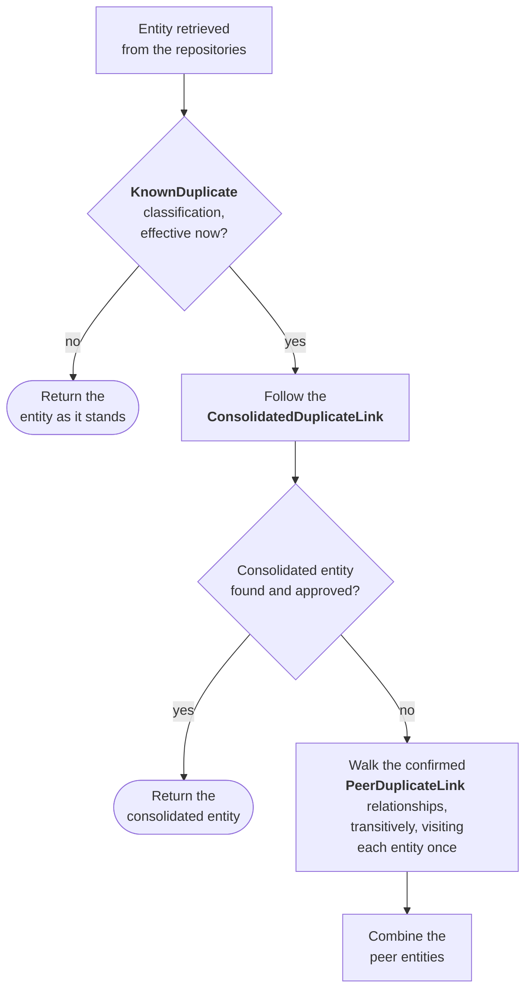

<!-- SPDX-License-Identifier: CC-BY-4.0 -->
<!-- Copyright Contributors to the ODPi Egeria project 2020. -->

# Duplicate Management

Duplicate management identifies multiple metadata instances that represent the same concept or resource. These *duplicate instances*, as they are called, occur when the same concept or resource is captured in multiple tools.  They are not noticed as duplicates when the tools operate independently.  However, when these tools are connected together through Egeria, the duplicates are shared.  The result is the appearance of more resources than there are, and any inconsistencies between them can lead to possible errors in decisions made using this information.

It is rarely possible to simply delete all but one of the duplicate instances because each copy is often needed by its originating tool.  Egeria needs a mechanism to handle these duplicates.

Egeria's duplicate management ensures duplicate instances are linked and classified so that on retrieval, the information from the duplicates is combined to give a meaningful result.

## Examples duplicate instances

Figure 1 shows a simple case where each duplicate instance originates from a different tool.  Although each instance has a different unique identifier (GUID), the rest of the metadata is consistent.  This makes it easy to spot when both are returned in a search query.  However, a query to count, say, the number of glossary terms would give misleading results.

> **Figure 1:** Two copies of the same glossary term originating from different repositories

When related information is required (for example, which assets are linked to the glossary term `customer`) the request needs to be issued for each duplicate instance to retrieve the complete picture.  Figure 2 shows that the users of one tool have linked their copy of the glossary term to assets 1 and 2 whereas the users of the other tool have linked their copy of the glossary term to asset 3.

> **Figure 2:** Different sets of relationships associated with each duplicate

Some duplicates are not so easy to identify.  Figure 3 shows an example of duplicate assets where the values in the assets are different, but the fact that they describe the same resource can be deduced by the fact that the related endpoints point to the same location.

>**Figure 3:** Duplicate assets identified through their endpoints

In some circumstances the tools are correctly cataloguing the existence of two resources however the resources themselves are duplicates of one another.  Figure 4 shows two copies of the same image.  The tools record the name of each copy but have no knowledge that their contents are the same.

> **Figure 4:** Two copies of the same resource are catalogued as two assets.  There is no shared values in the metadata.

## Avoiding duplicates

Duplicates can add a significant burden to your data processing.  Therefore, there is value in controlling the copying of data and ensuring that resources are catalogued only once. However, some duplication can not be avoided and Egeria has mechanisms to handle them.

## How are duplicates managed in Egeria?

Duplicate management has four parts to it:

* Detecting duplicate resources
* Detecting duplicate metadata entries for the same resource or concept.
* Linking duplicate instances together so that they can be processed together.
* Combining duplicate instances so that they can be retrieved as if they were one.

Figure 5 shows the architecture of an Egeria duplicate management solution.

>**Figure 5:** Components in a deduplication solution include the cohort members that are supplying the duplicates and retrieving metadata along with the engine host that is running the governance engines detecting and managing duplicates in conjunction with the stewards

The numbers on the diagram refer to the following points:

1. These are the tools that are potentially introducing duplicates into the cohort.  In this example they are connected through repository proxies and are not capable of storing reference copies of metadata.  This means the duplicates that they collectively introduce must be managed for the benefit of other consumers of the metadata.

2. [Metadata Discovery](/features/metadata-discovery/overview) analyses the content of resources and so can be used to detect duplicate resources (as opposed to duplicate catalog entries for the same resource).  There are algorithms for producing a fingerprint (like a hash) that represents the content of each resource. These fingerprints can be [stored as annotations](/types/6/0620-Resource-Profiling) attached to the resource's asset via a [survey report](/concepts/survey-report).  These fingerprint annotations are metadata that can be automatically analysed during duplicate detection.

3. The examples in figures 1-4 show that the mechanisms to detect duplicates are varied and often require knowledge of the data management practices in the organization.  As such this function must be pluggable into Egeria's runtime. [Engine Actions](/concepts/engine-action) monitor for changes in metadata and search for duplicate instances.  They link detected duplicates together.

4. A governance action, possibly the same one that detected the duplicates, can validate and action the duplicates so that survivorship processing occurs when they are retrieved from the metadata repositories (see step 6).

5. Alternatively, the duplicates can be validated and actioned by a steward.

6. When a [service](/services/omas) detects duplicates during a request to retrieve metadata from the repositories it automatically processes the duplicates so the caller is not aware that the duplicates exist.

Figure 6 shows an example of a [governance action process](/concepts/governance-action-process) that controls the governance actions and the use of the stewards for duplicate detection.

>**Figure 6:** The steps in an example governance action process 

There is a watchdog governance action that is monitoring for new assets. It initiates a verification governance action to detect any duplicates for each new asset.  Each verification governance action produces a guard whose value depends on the confidence that it has in the accuracy of any detected duplicates:

* `no-duplicate` guard means it discovered no duplicates and so the process stops.
* `link-duplicates` guard means it is very confident that it has detected a duplicate and so it can be actioned automatically by a remediation governance action before the process stops.
* `validate-duplicates` guard means that a steward should verify that duplicates have really been detected.  This is achieved by a triage governance action creating a [`ToDo`](/concepts/to-do) and a watchdog governance action waiting for the steward to complete the ToDo before stopping.  The steward uses the [Classification Manager](/services/omvs/classification-explorer/overview) API to verify and set up the duplicates.

## Duplicate management styles

Egeria has two styles of duplicate management that can be actioned automatically or by a steward.  They are *peer linking* and *consolidation*.  The open metadata types used in both styles are defined in model [0465 Duplicate Management](/types/4/0465-Duplicate-Processing).

### Peer linking

When duplicate entities are first detected by a governance action, they are linked together by the [PeerDuplicateLink](/types/4/0465-Duplicate-Processing#PeerDuplicateLink) relationship.  This relationship includes properties that indicate how confident the detecting process is that the entities are duplicate instances.  No change occurs in the retrieval of these instances at this point.

If a steward or automated process confirms the duplicate instances are correctly identified, [KnownDuplicate](/types/4/0465-Duplicate-Processing#knownDuplicate) classifications added to the entities tell the metadata retrieval functions to [automatically combine the content of the duplicates](#survivorship-rules) when any of them is requested.  This is *peer linking*.

### Consolidation

Consolidation is the process where the combined results of the duplicates is pre-calculated, stored as a new entity and linked to the duplicate instances using the [ConsolidatedDuplicateLink](/types/4/0465-Duplicate-Processing#consolidatedduplicate-and-consolidatedduplicatelink) relationship.  The assessment of confidence of the deduplication is stored in the [ConsolidatedDuplicate](/types/4/0465-Duplicate-Processing#consolidatedduplicate-and-consolidatedduplicatelink) classification on the instance that contains the combined results.

### Metadata retrieval of duplicates

When an Egeria retrieval operation is requested by an [Open Metadata Access Service (OMAS)](/services/omas), it monitors for the `KnownDuplicate` classification on the entities it is retrieving.  When found, and the retrieval request is not part of duplication management, deduplication occurs.  

#### Deduplication

During deduplication, the retrieval process first looks for the `ConsolidatedDuplicateLink` relationship.  If that is found, the consolidated instance is returned instead. If not, the instances linked via `PeerDuplicateLink` relationships are combined.  The combination process requires choices to be made on which values to use.  These choices are called the *survivorship rules*.

#### Survivorship rules

The survivorship rules operate on the following principles:

* Newer metadata is more accurate.
* The cardinality of relationships must be respected.
* If multiple peer entities point to the same target entity with the same type of uni-link relationship then the target entity is processed only once.

Figure 7 shows two glossary terms linked as peer duplicates. When an entity is queried by GUID, properties from the most recently updated duplicate instance are returned with a combination of classifications.  Conflicts in classifications are recorded on the audit log.  The latest values from the conflicting classifications are used. 

When the relationships of an identified duplicate are queried, the combination of relationships from all duplicate entities is returned unless only one instance of a relationship is allowed in which case the latest values are used.  

> **Figure 7:** Peer duplicates with distinct relationships

Figure 8 shows that both glossary terms link to the same schema attribute using the [SemanticAssignment](/types/3/0370-Semantic-Assignment) relationship.  Although this relationship has a cardinality of many-to-many, it is [*uni-link*](/concepts/uni-multi-link) so only the newest relationship is processed. 

> **Figure 8:** Peer duplicates pointing to the same entity via the same type of uni-link relationship

Figure 9 shows a consolidated duplicate linked to the glossary terms.  If any of these three entities are requested the consolidated duplicate is returned.

> **Figure 9:** Peer duplicates linked to a consolidated duplicate

Note: survivorship rules only operate on instances with appropriate [effectivity dates](/features/effectivity-dates/overview).

## Entity deduplication

The [survivorship rules](#survivorship-rules) describe the result that a caller sees.  This section and the next describe how that result is produced.  The work is done by the [repository handler](/services/repository-handler) common service, in the `org.odpi.openmetadata.commonservices.repositoryhandler` package.  For entities the entry point is the `validateRetrievedEntity()` method of `RepositoryHandler`, which uses `DuplicateEntityIterator` to work out which entities make up the duplicate cluster.

Every entity that the repository handler passes back - whether it was retrieved by GUID, returned by a search, or found at the far end of a relationship - goes through this processing.  It is a *retrieval-time* filter: nothing in the repositories is created, updated or deleted, so the duplicates are still there.  They are simply presented to the caller as a single entity.

### Resolving the duplicate cluster

`DuplicateEntityIterator` starts from the entity that the repositories returned and works out which entities need to be gathered.

```mermaid
flowchart TD
    A["Entity retrieved
    from the repositories"] --> B{"`**KnownDuplicate**
    classification,
    effective now?`"}
    B -->|no| Z(["Return the
    entity as it stands"])
    B -->|yes| C["`Follow the
    **ConsolidatedDuplicateLink**`"]
    C --> D{"Consolidated entity
    found and approved?"}
    D -->|yes| Y(["Return the
    consolidated entity"])
    D -->|no| E["`Walk the confirmed
    **PeerDuplicateLink** relationships,
    transitively, visiting
    each entity once`"]
    E --> F["Combine the
    peer entities"]
```
> **Figure 10:** How the repository handler decides which entities make up the duplicate cluster

1. If the entity does not carry the `KnownDuplicate` classification - or the classification is not effective at the caller's [effective time](/features/effectivity-dates/overview) - there is nothing to do and the entity is returned as it stands.  This is the normal path, and it costs one classification check.

2. If the entity is a known duplicate, the iterator follows its `ConsolidatedDuplicateLink` relationship, looking for a consolidated entity of the same type.  If one is found and its `ConsolidatedDuplicate` classification carries a `statusIdentifier` showing it has been approved, that entity is returned *in place of* the one that was retrieved and the peers are not visited at all.  The combining work was done when the consolidated entity was created, so there is nothing left to calculate.  If the consolidated entity's status shows it has not yet been approved, it is ignored and processing continues with the peers.

3. Otherwise the iterator walks the `PeerDuplicateLink` relationships.  Only links whose `statusIdentifier` shows the duplicate has been confirmed are followed.  The walk is transitive - the peers of each peer are added to the list - and each entity is visited only once, so a cluster that has been linked up piecemeal by different detection runs is still traversed completely, and a loop in the links cannot send the walk round for ever.

Each entity the walk reaches is checked before it is allowed to contribute to the result.  It must be effective at the caller's effective time, and an entity carrying the [Memento](/concepts/memento) classification is passed over unless this is a lineage request.  An entity that fails these checks is still traversed for its own peer links, because it may be the only entity that knows about another member of the cluster.  Peers that cannot be retrieved at all - because they have been deleted, or the caller is not authorized to see them - are logged and skipped rather than failing the whole request.

### Combining the peer entities

When the cluster turns out to be more than one entity - that is, there was no approved consolidated entity and there are confirmed peers - the peers are combined into a new in-memory entity.  The entity that is built is a copy, so nothing held in the repositories or their caches is altered.

**Properties and identity.**  Each peer in turn is compared with the result so far and the more recently updated of the two is kept.  Where an entity has never been updated its creation time is used instead.  If two entities are equally recent, the one with the higher GUID is kept, so the outcome does not depend on the order in which the repositories happened to return the peers.  The winner supplies the whole of the returned entity apart from its classifications - not just its properties, but its GUID, type, status and [provenance](/features/metadata-provenance/overview) as well.  A caller that retrieves a known duplicate by GUID may therefore be handed an entity whose GUID is that of one of its peers.

**Classifications.**  These are treated separately, because a classification that only one member of the cluster carries is still information about the concept that the cluster describes.  They are gathered by name: the classifications of the entity that was originally retrieved go in first, and then those of each peer are merged in.  The returned entity therefore carries one instance of every classification name found anywhere in the cluster.

Where the same classification name is found on more than one member of the cluster, the two versions are in conflict and only one of them can be returned.  The most recently updated version is the one that is kept, and the conflict is recorded on the [audit log](/concepts/audit-log) so that it can be investigated.  A conflict is not an error - the members of a cluster are maintained by different tools, so they will naturally drift apart - but a classification that is repeatedly in conflict is a sign that the tools disagree about the concept, which is worth knowing.

The result is a single entity holding the newest properties in the cluster, together with the newest version of each classification in the cluster.

### Entities in search results

When a list of entities is returned - from a search, or from following a relationship to its far end - each entity in the list is put through the same processing and the results are gathered into the list that the caller receives.

A search will often match several members of the same duplicate cluster, since it is precisely their similarity that made them duplicates in the first place.  Each of those members resolves to the same consolidated or combined entity, so the list is checked as it is built and an entity that is already present is not added a second time.  A duplicate cluster therefore contributes a single entry to the results however many of its members the search matched, so the caller sees one result per concept rather than one result per tool that catalogued it.

Entities that are filtered out by this processing simply do not appear in the list.  An empty list is therefore not the same as "no more results": it means everything on this page was filtered out, and the caller can ask for the next page.

Where a single entity was requested by GUID and the processing filters it out, the handler cannot return nothing without explanation, so it throws an `InvalidParameterException` carrying `OMAG-REPOSITORY-HANDLER-0009` and writes the same information to the [audit log](/concepts/audit-log).  The message records the classifications that were on the entity, its effectivity dates, the effective time that was asked for and the `forLineage` and `forDuplicateProcessing` settings, which between them identify which of the checks rejected it.

## Relationship deduplication

Combining the entities of a duplicate cluster is only half of the job.  The relationships of those entities have to be combined too, otherwise the caller would see the same attachment several times over - once for each member of the cluster.  This is the work of the `RelationshipAccumulator` class, and like entity deduplication it is a retrieval-time filter that leaves the repositories untouched.

### Gathering the relationships

When the relationships of an entity are requested, the repository handler does not simply query the entity that the caller named.  It first resolves the duplicate cluster in exactly the way [described above](#resolving-the-duplicate-cluster), then retrieves the relationships of every entity in that cluster and passes them to the `RelationshipAccumulator`.  Three things happen as they are added:

* The `PeerDuplicateLink` and `ConsolidatedDuplicateLink` relationships themselves are removed.  They are the plumbing of duplicate management and are of no interest to a caller that is unaware duplicates exist.
* Relationships whose effectivity dates do not span the caller's effective time are discarded.
* The end of the relationship that points to the peer is replaced by a proxy for the entity that the caller actually asked for, complete with its unique properties.  This is what allows the caller to be presented with a single, coherent graph anchored on their entity - and it is also what makes the filtering below possible, because relationships that came from different peers to the same target now look identical at the anchor end.

The accumulated relationships are sorted by type name and each type is filtered independently, since the rules that follow depend on the settings in the relationship's type definition.

### The filtering passes

```mermaid
flowchart TD
    A["Relationships of one type,
    gathered from every entity
    in the duplicate cluster"] --> B["`**1. Remove repeated instances**
    same GUID retrieved more than once
    _latest update wins_`"]
    B --> C{"Anchored on a
    starting entity?"}
    C -->|no| Z(["Return"])
    C -->|yes| D{"Multi-link type?"}
    D -->|yes| Z
    D -->|no| E["`**3. Uni-link rule**
    gather by the GUIDs at both ends
    _latest update wins_`"]
    E --> F{"Both ends
    ANY_NUMBER?"}
    F -->|yes| Z
    F -->|no| G["`**4. Cardinality rule**
    for each AT_MOST_ONE end,
    gather by the GUID at the other end
    _latest update wins_`"]
    G --> H["`**5. Remove repeated instances**
    both ends may have contributed
    the same relationship`"]
    H --> Z
```
> **Figure 11:** The passes that the relationship accumulator makes over the relationships of a single type

1. **Remove repeated instances.**  The same relationship can be retrieved more than once, because both of its ends may be members of the duplicate cluster, or because the same consolidated entity was reached from several peers.  Relationships are gathered by GUID and the version with the latest update time survives.  Where a relationship has never been updated, its creation time is used instead.

2. **Stop if there is nothing to anchor on.**  A search for relationships (`findRelationships()`) has no starting entity, so there is no basis on which to decide that two different relationships represent the same link.  The list from pass 1 is returned unchanged.  The same applies to [multi-link](/concepts/uni-multi-link) relationship types, where several instances between the same two elements are legitimate and must all be returned.

3. **Apply the uni-link rule.**  For [uni-link](/concepts/uni-multi-link) types, only one relationship of the type is permitted between two elements in a particular direction.  The relationships are gathered by the pair of GUIDs at their two ends and, again, the most recently updated one survives.  Because the peer end was rewritten to the requested entity when the relationships were gathered, relationships from different members of the duplicate cluster to the same target element collide here and collapse to a single relationship.  This is the behaviour illustrated in figure 8.

4. **Apply the cardinality rule.**  If both ends of the type are defined with a cardinality of `ANY_NUMBER` there is nothing more to do and the result of pass 3 is returned.  Where an end is defined as `AT_MOST_ONE`, the relationships are gathered by the GUID at the *other* end and the most recently updated one survives, so that a duplicate cluster cannot present the caller with more attachments than the type allows.

    Two details govern how the two ends interact:

    * If the attribute names at the two ends of the type are different, the ends are independent - the relationship has a direction - and each end is filtered separately.  If the attribute names are the same, the type is [reversible](/concepts/uni-multi-link#reversible-relationships) and the two ends are filtered against a single set of elements, so at most one relationship survives no matter which way round it is stored.
    * If the caller has restricted the results to attachments at a specific end, the filtering for the opposite end is skipped, because pass 3 has already removed those duplicates.

5. **Remove repeated instances again.**  Passes 3 and 4 each contribute their surviving relationships to the result, so the same relationship instance can be added twice.  Pass 1 is repeated over the result to remove them.

### Audit log record

Whenever the filtering changes the number of relationships being returned, the repository handler writes message `OMAG-REPOSITORY-HANDLER-0014` to the [audit log](/concepts/audit-log).  It lists the GUID, creator and type of each relationship that was retrieved from the repositories, along with the GUIDs of the relationships that were returned to the caller.  It is logged at `INFO` severity because deduplication is normal behaviour; the reason for capturing it is so that the duplicates that are being suppressed can be checked and confirmed as genuine.

## Requests that do not deduplicate

Deduplication has to be suppressed for the processes that manage the duplicates, otherwise they would be unable to see the instances they are working on:

* When a request is made with `forDuplicateProcessing` set to `true`, none of the processing described above takes place.  The entity that was retrieved is returned as it stands, with no peers gathered and no classifications merged, and every relationship is returned including the `PeerDuplicateLink` and `ConsolidatedDuplicateLink` relationships themselves.  This is the mode used by the governance actions that detect and link duplicates, and by the stewardship interfaces such as the [Classification Explorer](/services/omvs/classification-explorer/overview) that the steward uses to confirm them.
* Requests that count matching entities or relationships rather than returning them are not filtered either.  Producing a deduplicated count would mean retrieving every matching instance, which defeats the purpose of a count operation.  A count may therefore be higher than the number of instances a retrieval would return.

--8<-- "snippets/abbr.md"