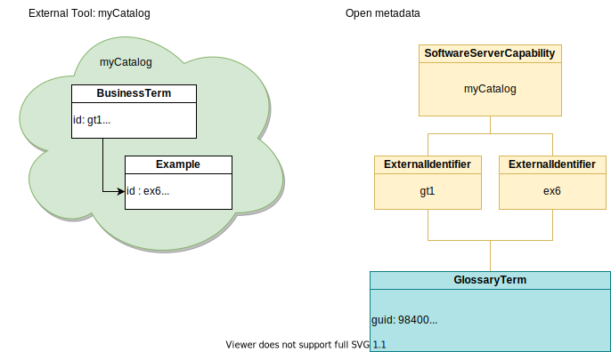

<!-- SPDX-License-Identifier: CC-BY-4.0 -->
<!-- Copyright Contributors to the Egeria project. -->

# Managing External Identifiers

Every open metadata instance has a unique identifier called its GUID. This provides a means to locate and retrieve the instance from the metadata repository. However, often the GUID is not known in the systems and tools that integrate with open metadata. Metadata instances that inherit from the [`Referenceable`](/egeria-docs/types/0/0010-Base-Model/#referenceable) type have a property called `qualifiedName`. This is a unique name for the `Referenceable` instance. When such an instance is created, the qualified name can be set up to a unique identifier that is a natural unique name for the resource that it represents (such as the full path name of a file) or a unique identifier from an external tool. The element can then be retrieved using the `qualifiedName`.

Now consider the situation where each external tool that uses the instance has a different identifier for the instance. There is only one qualified name property in the instance which will not be able to cover all the identifiers from the external systems/tools.

In this situation it is possible to set up multiple *external identifiers* for an open metadata instance. Each external identifier is linked to the open metadata instance it represents and the software capability of the external system/tool that uses it. You can think of this link to the software capability as providing a scope in which the external identifier is valid.

The external identifiers can support both one-to-many, many-to-one and many-to-many between metadata elements from external systems/tools and open metadata instances.

## Many-to-one

Imagine situation where an external tool called `myCatalog` uses two metadata elements: one for a type it refers to as *BusinessTerm* and the other of type *Example*, to represent all the properties that are stored in one open metadata [`GlossaryTerm`](/egeria-docs/types/3/0330-terms/#glossaryterm).

To represent this in open metadata, the unique identifiers for the business term and example metadata elements (`gt1` and `ex6` respectively) are each stored in their own external identifier that is linked to both the `myCatalog`'s software capability and the corresponding open metadata glossary term. This means the glossary term can be located in an open metadata repository either using the identifier `gt1` or `ex6`. Similarly, it is possible to locate a glossary term's properties in `myCatalog` by looking up both the `gt1` and `ex6` elements.

## One-to-many

Now imagine the opposite situation: where it takes multiple open metadata instances to represent a single metadata element in an external system/tool. In this example the external system/tool directly links its *Database* elements to its *Table* elements.  Whereas in the open metadata types, there is a [SchemaType](/egeria-docs/types/5/0501-schema-elements/#schematype) (specifically [RelationalDBSchemaType](/egeria-docs/types/5/0534-relational-schemas/#relationaldbschematype)) between a [DeployedDatabaseSchema](/egeria-docs/types/5/0534-relational-schemas/#deployeddatabaseschema) instance and the [RelationalTable](/egeria-docs/types/5/0534-relational-schemas/#relationaltable) instance.

Again, an external identifier is created for each of the external metadata elements and this is linked to the software capability for `myCatalog`. Each external identifier is then linked to each of the open metadata instances that have properties that map to its equivalent metadata element in the external system/tool.

The use of external identifiers is particularly important to the [integration connectors](/egeria-docs/concepts/integration-connector) running in the [Open Metadata Integration Services (OMISs)](/egeria-docs/services/omis), where the ability to maintain consistent metadata stores in both open metadata and third party systems and tools is important.

## Open metadata representation

The open metadata types for external identifier are in [model 0017](/egeria-docs/types/0/0017-External-Identifiers). The [`ExternalIdLink`](/egeria-docs/types/0/0017-External-Identifiers/#externalidlink) relationship is between the external identifier and the open metadata instance it represents. The [`ExternalIdScope`](/egeria-docs/types/0/0017-External-Identifiers/#externalidscope) is the relationship between the external identifier and the software capability that represents the external system/tool.

## Implementations

The [Asset Manager OMAS](/egeria-docs/services/omas/asset-manager/overview) provides support for external identifier mapping on its APIs. This capability is visible through the [Catalog Integrator OMIS](/egeria-docs/services/omis/catalog-integrator/overview) and the [Lineage Integrator OMIS](/egeria-docs/services/omis/lineage-integrator/overview) that are based on the Asset Manager OMAS client.

The [Open Connector Framework (OCF)](/egeria-docs/frameworks/ocf/overview) provides the ability to query the external identifiers attached to an asset through the [connected asset properties](/egeria-docs/concepts/connected-asset-properties). This is also visible through the *`AssetUniverse`* interfaces of the:

- [Asset Consumer OMAS](/egeria-docs/services/omas/asset-consumer/overview)
- [Asset Owner OMAS](/egeria-docs/services/omas/asset-owner/overview)
- [Discovery Engine OMAS](/egeria-docs/services/omas/discovery-engine/overview)

--8<-- "snippets/abbr.md"
