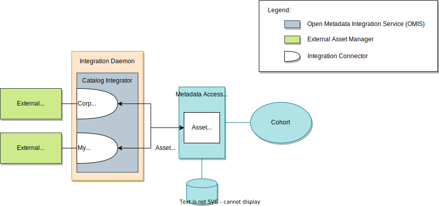

<!-- SPDX-License-Identifier: CC-BY-4.0 -->
<!-- Copyright Contributors to the Egeria project. -->

# Managing External Identifiers

Every open metadata instance has a unique identifier called its GUID. This provides a means to locate and retrieve the instance from the metadata repository. However, often the GUID is not known in external systems and tools that integrate with open metadata. Metadata instances that inherit from the [`Referenceable`](/types/0/0010-Base-Model/#referenceable) type have a property called `qualifiedName`. This is a unique name for the instance. When such an instance is created, the qualified name can be a unique identifier that is a natural unique name for the resource that it represents (such as the full path name of a file) or a unique identifier from an external system or tool. The element can then be retrieved using the `qualifiedName`.

Now consider the situation where multiple external systems/tools wish to retrieve the element using their own identifier. There is only one qualified name property in the instance which will not be able to cover all the identifiers from these external systems/tools.

In this situation it is possible to set up multiple *external identifiers* for an open metadata instance. Each external identifier is linked to the open metadata instance(s) it represents and the software capability of the external system/tool that uses it. You can think of this link to the software capability as providing a scope in which the external identifier is valid. The external identifiers can support both one-to-many, many-to-one and many-to-many between metadata elements from external systems/tools and open metadata instances.

## An example

Consider an organization that is using two catalogs:

* *corpCatalog* is used to catalog and manage the business-critical applications and data stores.  It also includes a corporate glossary.
* *myCatalog* is used by the data science team.  They wanted to have their own data catalog to give them flexibility to catalog the data sets that they were experimenting with without needing to use the more complex corporate procedures for cataloguing business-critical data stores.  They do need to share these data sets with other tools and make use of the corporate glossary in their catalog.  When a new analytics model is to be moved into production, it, and its data sets will move into the corporate catalog as part of the deployment processes.

> *Figure 1*: Using integration connectors to perform a two-way synchronization between external asset managers, such as a data catalog or configuration management database (CMDB).  In this situation, it is often necessary to use external identifiers to correlate the identifiers used in open metadata and those used by the external asset managers.

## Many-to-one

First consider the exchange of glossary terms from `corpCatalog` to `myCatalog`. `corpCatalog` uses two metadata elements to represent all the properties that are stored in one open metadata [`GlossaryTerm`](/types/3/0330-terms/#glossaryterm).  One element is for a type it refers to as *BusinessTerm* and the other element is of type *Example*.  This is shown in the top left-hand side of figure 2. 

When the `corpCatalogExchange` integration connector shown in figure 1 runs, it queries `corpCatalog` for the business terms it stores (and their corresponding example element).  It then adds a glossary term to open metadata for each business term it finds. 

On the right-hand side of figure 2 is the open metadata glossary term with a guid of `98400` created by `corpCatalogExchange`.  Linked above it are two external identifiers: one holding the identifier of the corresponding business term (`456`) and the other holding the identifier (`456ex`) for the corresponding example.  These two external identifiers are linked to the software capability element for `corpCatalog` to show that these identifiers are only valid in the `corpCatalog`.

The creation of the glossary term in open metadata causes a notification to be picked up by the `myCatalogExchange` integration connector shown in figure 1.  It stores the glossary term in `myCatalog` and then adds the unique identifier that `myCatalog` assigned to it (`gt1`) as an external identifier in open metadata.  You can see the external identifier for `gt1` is linked below the glossary term on the right-hand side of figure 2.  This external identifier is also linked to the software capability for `myCatalog` to show where the identifier is valid.

> **Figure 2:** exchanging glossary terms between 

## One-to-many

Now imagine the opposite situation: where it takes multiple open metadata instances to represent a single metadata element in an external system/tool. In figure 3, `myCatalog` directly links its *Database* elements to its *Table* elements.  Whereas in the open metadata types, there is a [SchemaType](/types/5/0501-schema-elements/#schematype) (specifically [RelationalDBSchemaType](/types/5/0534-relational-schemas/#relationaldbschematype)) between a [Database](/types/2/0224-databases) instance and the [RelationalTable](/types/5/0534-relational-schemas/#relationaltable) instance.

Again, an external identifier is created for each of the external metadata elements and this is linked to the software capability for `myCatalog`. Each external identifier is then linked to each of the open metadata instances that have properties that map to its equivalent metadata element in the external system/tool.

Figure 3 shows the external identifier `123` for the database linked to three open metadata elements: the database, a glossary term that is holding the abbreviation and the relational db schema type.

> **Figure 3:** One external metadata element mapping to many open metadata instances

The use of external identifiers is particularly important to the [integration connectors](/concepts/integration-connector) running in the [Open Metadata Integration Services (OMISs)](/services/omis), where the ability to maintain consistent metadata stores in both open metadata and third party systems and tools is important.

## Open metadata representation

The open metadata types for external identifier are in [model 0017](/types/0/0017-External-Identifiers). The [`ExternalIdLink`](/types/0/0017-External-Identifiers/#externalidlink) relationship is between the external identifier and the open metadata instance it represents. The [`ExternalIdScope`](/types/0/0017-External-Identifiers/#externalidscope) is the relationship between the external identifier and the software capability that represents the external system/tool.

## Implementations

The [Asset Manager OMAS](/services/omas/asset-manager/overview) provides support for external identifier mapping on its APIs. This capability is visible through the [Catalog Integrator OMIS](/services/omis/catalog-integrator/overview) and the [Lineage Integrator OMIS](/services/omis/lineage-integrator/overview) that are based on the Asset Manager OMAS client.

The [Open Connector Framework (OCF)](/frameworks/ocf/overview) provides the ability to query the external identifiers attached to an asset through the [connected asset properties](/concepts/connected-asset-properties). This is also visible through the *`AssetUniverse`* interfaces of the:

- [Asset Consumer OMAS](/services/omas/asset-consumer/overview)
- [Asset Owner OMAS](/services/omas/asset-owner/overview)

--8<-- "snippets/abbr.md"
