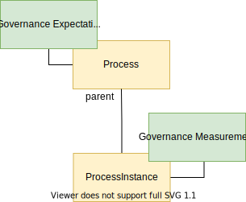

<!-- SPDX-License-Identifier: CC-BY-4.0 -->
<!-- Copyright Contributors to the ODPi Egeria project 2020. -->

# Governance Definitions

A *Governance Definition* is a metadata element that describes the context or purpose for an activity that supports the organization's operation. Figure 1 shows the main types of governance definition and how they link together to create a coherent response to a business strategy or regulation.

> **Figure 1:** Using governance definitions to provide traceability from business drivers and regulations to actions.

## Governance domains

Governance domains are the areas of an organization's operation that receive specific focus from a governance point of view.

> **Figure 2:** Examples of different governance domains within an organization.  Each domain is typically the responsibility of a different executive in the organization.  They may use slightly different terminology and often different tools but in fact they are very similar in the way that the operate.  Egeria allows the teams from the different governance domains to collaborate and benefit from each others efforts.

## Subject areas

Subject areas are topics or domains of knowledge that are of interest to the governance leaders.

## Governance classification, tagging and linking

## Setting up the levels for your governance classifications

## Measures and metrics

## Execution points

Implementing the actions defined in your governance definitions.

--8<-- "snippets/abbr.md"