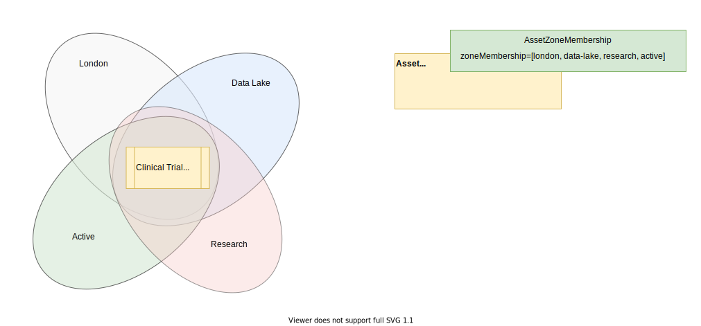
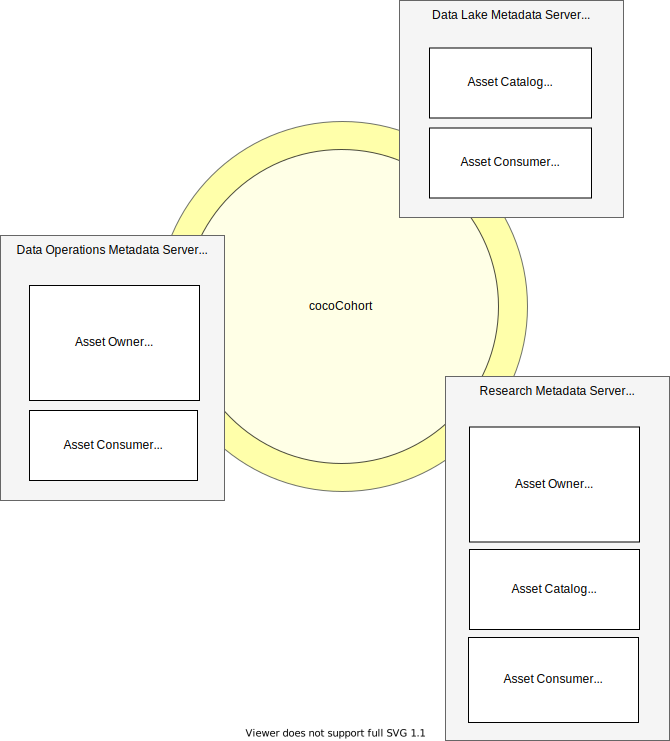

<!-- SPDX-License-Identifier: CC-BY-4.0 -->
<!-- Copyright Contributors to the ODPi Egeria project 2020. -->

# Governance Zoning

A *Governance Zone* defines a list of assets that are grouped together for a specific purpose. It may represent assets that are consumed or managed in a particular way; or should only be visible to particular groups of users, or processed by particular types of engine. There may also be zones used to indicate that the asset is in a particular state.  

> **Figure 1:** Examples of types of zones

For example, Coco Pharmaceuticals use a quarantine zone for data that has arrived from an external partner. It is not visible to the researchers until it has been cataloged and verified.  Then it is added to the zones that others can see.

> **Figure 2:** Visibility rules associated with governance zones

Zones are typically independent of one another, but they can be nested if desired.  

## Defining governance zones

Governance zones are defined as part of the governance program.  They are stored in open metadata as
[`GovernanceZone`](/types/4/0424-Governance-Zones/) entities.  They can be linked to [governance definitions](/features/governance-program/overview) that may directly or indirectly identify the visibility rules that apply to the zone.

> **Figure 3:** Visibility rules associated with governance zones

The visibility rules associated with the zones are typically executed:

* [Via options on the Open Metadata Access Services (OMASs)](#controlling-access-to-assets-through-the-omass) that control both the settings of an asset's zones and the visibility of assets through its event notifications and APIs.

* [Via the server security connector](/concepts/server-metadata-security-connector) that can both dynamically assign/augment the zones for an asset before its security check and use the setting of the asset's zones to determine if the requested action by the requested user is allowed.

* [Within an external security manager](/features/synchronizing-access-security/overview) where the zone information is typically transforming into security tags or settings in access control lists (ACLs).

## Use cases

Governance zones help to support the following types of use cases:

* Data sovereignty - by defining zones that represent the origin of data and using visibility rules that match consumer to origin.
* Adjustments for legal jurisdiction - by defining zones for each jurisdiction and attaching appropriate rules to each.
* Asset visibility and access control - by defining zones that group assets into 
* Data access control - using the zones assigned to the asset [when setting up security tags](/features/synchronized-access-control/overview/#consolidate).
* Maintenance and backup processing - by defining zones that represent different archiving or maintenance requirements.  The engines that perform the automated maintenance work through the list of assets in the relevant zones.
* Understanding dependencies between different parts of the organizations to support the information supply chains - by defining zones for different parts of the organization and visualizing 
* Metering and billing - by defining zones that represent the cost structure of assets and using the zone membership of assets being used to determine the charge.

## Membership of a zone

An asset can belong to all, one or many zones.  The list of zones that an asset belongs to is configured in the `zoneMembership` property of its [`AssetZoneMembership` classification](/types/4/0424-Governance-Zones/).  If it is blank, it means the asset logically belongs to all zones.  Otherwise it belongs only to the zones that are listed.  It is added to or removed from a zone by updating the AssetZoneMembership classification.

As new assets are onboarded, use template or governance action services to ensure the asset is assigned to the right set of zones as it is added to the catalog.  The zones can then be maintained as needed throughout the lifetime of the asset.

> **Figure :** Examples of types of zones

When designing the governance zones for your organization, it is necessary to take care that the visibility rules associated with an asset's zones are complementary rather than conflicting.

> **Figure 5:** Thinking through the meaning of belonging to multiple zones

## Controlling access to assets through the OMASs

All Open Metadata Access Services (OMASs) that retrieve assets, such as [Asset Catalog](/services/omas/asset-catalog/overview), [Asset Consumer](/services/omas/asset-consumer/overview) and [Asset Owner](/services/omas/asset-owner/overview), use the **supportedZones** option that is configured for the service in the in their server's configuration document.  This property defines the zones of assets that can be returned by this instance of the access service.

In addition, access services that create assets, use the **defaultZones** option to define the list of zones set up in any new asset they create.

Finally access services that are synchronizing assets between different third party technologies, such as the [Data Manager OMAS](/services/omas/data-manager/overview), will also use the **publishZones** option to publish an asset to consumer zones once they are completely defined in the catalog.

> **Figure 6:** Visibility setting in the Open Metadata Access Services (OMASs)

The meaning, purpose and governance requirements for assets within a specific zone are maintained through the [Governance Program OMAS](/services/omas/governance-program/overview).

It is also possible to associate [security access control with a governance zone](/festures/metadata-security/overview).

--8<-- "snippets/abbr.md"