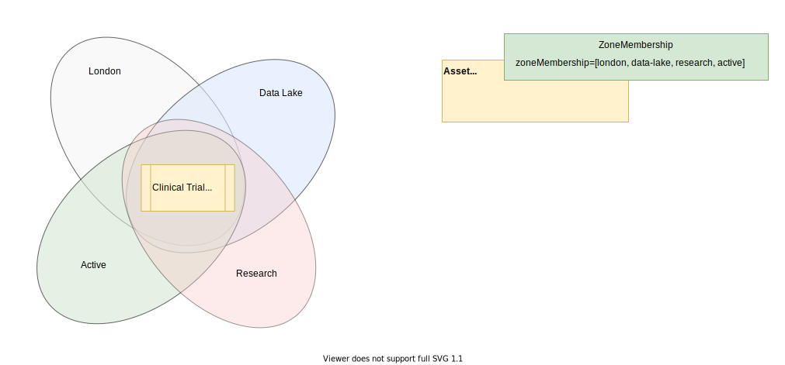
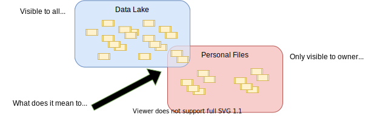

<!-- SPDX-License-Identifier: CC-BY-4.0 -->
<!-- Copyright Contributors to the ODPi Egeria project 2020. -->

# Governance Zoning

A *Governance Zone* groups elements together for a specific purpose. It may represent, for example:

* elements that are consumed or managed in a particular way, or 
* elements that should only be visible to particular groups of users, or
* elements processed by particular types of engine.

There may also be zones used to indicate that the element is in a particular state.  

----


> **Figure 1:** Examples of types of zones

For example, [Coco Pharmaceuticals](/practices/coco-pharmaceuticals) use the `quarantine` zone for data assets that have just arrived from an external partner. Such an asset should not be visible to the researchers until it has been cataloged and verified.  The `quarantine` zone limits the visibility of these assets to the onboarding team.  Once the onboarding is complete, the assets are moved to a zone that permits others to see them.


> **Figure 2:** Visibility rules associated with governance zones

## Use cases

Governance zones help to support the following types of use cases:

* Data sovereignty - by defining zones that represent the origin of data and using visibility rules that match consumer to origin.
* Adjustments for legal jurisdiction - by defining zones for each jurisdiction and attaching appropriate rules to each.
* Asset visibility and access control - by defining zones that group elements into 
* Data access control - using the zones assigned to the element [when setting up security tags](/features/synchronized-access-control/overview/#consolidate).
* Maintenance and backup processing - by defining zones that represent different archiving or maintenance requirements.  The engines that perform the automated maintenance work through the list of elements in the relevant zones.
* Understanding dependencies between different parts of the organizations to support the information supply chains - by defining zones for different parts of the organization and visualizing 
* Metering and billing - by defining zones that represent the cost structure of assets and using the zone membership of assets being used to determine the charge.


## Membership of a zone

An element can belong to all, one or many zones.  By default, it belongs to all zones. 

The [ZoneMembership classification](/types/4/0424-Governance-Zones/)  specifies the list of zones that the attached element belongs to via the `zoneMembership` property.  

If zoneMembership is null or empty, the element belongs to all zones, just as if the element had no ZoneMembership classification.  Otherwise, it belongs only to the zones that are listed.  It is added to or removed from a zone by updating the *ZoneMembership* classification.


> **Figure 3:** Use of multiple zones

## Using templates

[Templates](/concepts/template) are a powerful way to define the governance zones for new elements as they are catalogued.

For example, as new data sets are onboarded, the set-up of the templates used by the onboarding process can ensure that the new elements that represent these data sets are assigned to the right zones as they are catalogued in open metadata.  

The zones can then be maintained as needed throughout the lifetime of the assets.  For example, if one of these assets becomes part of a digital product, its zone membership may be updated to match the zones for the overall digital product.  

## Using multiple zones for an element

When designing the governance zones for your organization, it is necessary to take care that the visibility rules associated with an element's zones are complementary rather than conflicting.

Here is an example:


> **Figure 4:** Thinking through the meaning of belonging to multiple zones

A user only has to have access through **either** of the listed zones to be able to perform their desired operation on the element.

## Using zone membership to filter query results

[QueryOptions](/services/omvs) (and by definition SearchOptions too) includes a property called `governanceZoneFilter` that can be used to restrict the results of a query to only those elements that are explicitly in **all** the specified zones.

> Note:
> 
>  * The `governanceZoneFilter` property is a list of zone names.  If multiple zones are specified, then only elements that are members of **all** of the specified zones will be returned. For example, to find all elements that are both in the `digital-product` zone and the `security` zone, you would set `governanceZoneFilter` to `["digital-product", "security"]`.  This can be useful for finding elements that are specific to a community nad in a specific state for example.
>  * An element that has no ZoneMembership classification is, by default, a member of all zones.  However, for this filter, such elements will not be returned.
>  * When a governance zone is applied to an anchor element, all elements anchored to it are in the same zone.  Therefore, governanceoneFilter can be used on all types of elements.
>  * The `governanceZoneFilter` property is ignored if the caller is not authorized to see the element.


## Standard Governance Zones for Egeria

There are a number of standard governance zones defined in Egeria:

* **digital-product** - this is the zone that elements describing digital products belong to.  It is set up as an unsecured zone which means it can be used as a filter on searches.  Access to digital produces is typically controlled by additional governance zones that represents the communities that create and consume these products.
* **egeria-runtime** - this is the zone that elements describing the runtime environment of Egeria belong to.  It is set up to allow read access to all active users, whilst restricting update/delete access to runtime managers (`securityRole=runtimeManager`).
* **security** - this is the zone that links users to the security access controls.  It is set up to restricting all access to security managers (`securityRole=securityManager`) only.  

There is also a feature called the **user's personal zone**.  This is  a governance zone with a name that matches the user's userId.  It gives that user full access to all elements in that zone. 

## Default zone settings

A *User Account* in the secrets store can be configured with a list of zones that will be assigned to new elements created by this user.  This list is called the **defaultZones**.  

If the default zones are not defined for this user then no zones are assigned to the element beyond any passed on the create request.

Typically, the default zones are only specified for automated users such as integration connectors and governance services. These types of components perform a specific function and it is likely that all elements they create can be assigned to the same zones.

Below is an example of the user account for the Jacquard Digital Product Loom.  This integration connector is responsible for dynamically creating the [Open Metadata Digital Product Catalog](/patterns/harvest-and-publish/overview).  Therefore it is reasonable that it has default zones set to `digital-product`.

```yaml
      jacquardnpa:
        userAccountStatus: AVAILABLE
        userAccountType: DIGITAL
        userName: JacquardDigitalProductLoomIntegrationConnector
        otherProperties:
          defaultZones:
            - digital-product
          publishZones:
            - digital-product
```

## Publish zone settings

The user account above also shows the definition for the **publishZones**.  These are the zones that are set on an element when this user calls the `publishMetadataElement` operation of the [Metadata Expert API](/services/omvs/metadata-expert/overview).

There is also a `withdrawMetadataElement` operation. This sets the governance zones of an element back to the **defaultZones** setting for the calling user.  

The `withdrawMetadataElement` operation is useful when performing remediation work on a metadata element after it has been published.
For example, if a number of changes need to be made to an element and while this is happening, the element should not be visible to general users, calling `withdrawMetadataElement` can be used to hide the element from general users.  Once the updates are complete, the element can be published again to broaden its visibility.

## Defining Governance Zones

Governance Zones are a type of [security access control](/concepts/security-access-control) that is maintained in the OMAG Server Platform's user directory.  The [Security Officer API](/services/omvs/security-officer/overview) has an operation called `createSecurityAccessControl` that will add a new governance zone to the user directory, along with its associated permissions.  

A summary of the governance zone is created in the open metadata repository by the Secrets Store Monitor integration connector.  This summary is a governance definition of type [GovernanceZone](/types/4/0424-Governance-Zones).  It can be queried using the [Governance Officer API](/services/omvs/governance-officer/overview).  This is useful for users that want to understand which zones to specify in their query requests.  It also forms part of Egeria's security auditing capability. 


> **Figure 5:** Defining visibility rules for governance zones
> 1. The Security Officer API is called to create a new governance zone.  This includes the permissions that define the access control rules for the zone. The governance zone is added to the user directory.
> 2. The Secrets Store Monitor integration connector detects the change to the secrets store and updates the governance definition summaries in the open metadata repositories.
> 3. The governance zone summary is a type of governance definition that may be queried using the Governance Officer API.

This is the default definition for the `egeria-runtime`, `digital-product` and `security` zones. 

```yaml
      # Governance Zones Access Controls
      egeria-runtime:
        controlDisplayName: Egeria's Runtime Zone
        controlTypeName: GovernanceZone
        description: Resources describing Egeria's runtime components including the OMAG Server Platform, OMAG Servers, Integration Connectors, Governance Engines and the Governance Services.  The contents of this zone are readable to all, but may only be maintained by the runtime manager processed.
        associatedSecurityList:
          READ:
            - openMetadataMember
          DEFAULT:
            - runtimeManager

      digital-product:
        controlDisplayName: Digital Products Zone
        controlTypeName: GovernanceZone
        description: Resources describing the digital products that are being managed by Egeria.  This is an unsecured governance zone.

      security:
        controlDisplayName: Security Zone
        controlTypeName: GovernanceZone
        description: Resources used by the security team for audit and diagnostic purposes.  It is secured so that only authorized security people, teams and processes can access it.
        associatedSecurityList:
          DEFAULT:
            - securityManager
```
The `associatedSecurityList` defines the permissions for the zone based on the requested operation (`READ`, `DEFAULT` for example, or it may be the name of a service operation).  The `DEFAULT` operation means any operation not explicitly listed.  

Under each operation are the security roles/groups that are permitted to perform that operation.

## Zone Membership Profile

The *ZoneMembershipProfile* is a classification attached to the *GovernanceZone* entity describing a governance zone.  It includes counts of all of the members of the zone, and also by type.  The values are calculated by a [Lovelace Insight Service](/patterns/metadata-insight/overview) called the [Zone Membership Profiler Lovelace Service](https://github.com/odpi/egeria/tree/main/open-metadata-implementation/adapters/open-connectors/lovelace-insights).  It also includes the time that the values were calculated.  The Babbage Integration connector that initializes this service is set to refresh once a day by default.

???+ info "Further information"

    * See [Metadata Security](/features/metadata-security/overview) for more information on security in Egeria.
    * See [Model 0424 Governance Zones](/types/4/0424-Governance-Zones) for more information on the GovernanceZone entity.

--8<-- "snippets/abbr.md"