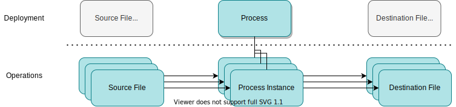
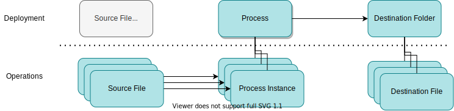
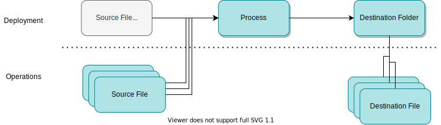
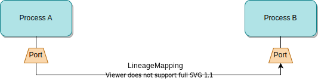
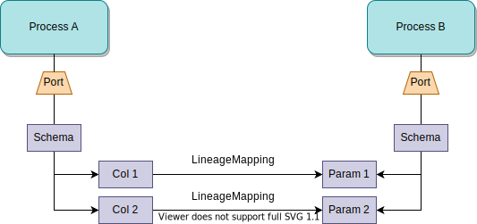
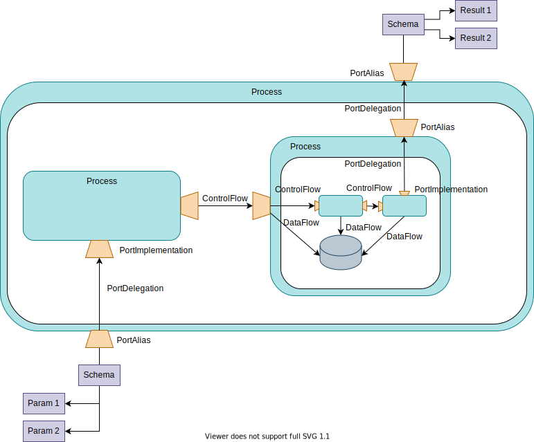

<!-- SPDX-License-Identifier: CC-BY-4.0 -->
<!-- Copyright Contributors to the ODPi Egeria project. -->

# Lineage

Lineage shows how data flows from its origins to its various destinations. This includes details of the processing along the way.  It is used to understand:
 
* whether the data used in reports and analytics models has come from the correct sources and has passed through the correct processing (known as *traceability of data*).
  
* what would be the impact on downstream processing and consumers if something was changed (known as *impact analysis*).

* whether the operational processes that implement the data flows are executing correctly (known as *governance by expectation*).

## The lineage graph

Lineage is typically envisaged as a graph showing processes interacting with different data stores.   Some processes copy data from one store to another.  Other processes may retrieve data from multiple stores and combine them to produce a new value that is stored in another store.  The result is that a logical flow of data emerges from the interaction. 

Figure 1 shows some examples of different types of processes and data stores.

On the left here is an Apache Spark job that reads from a file, looks up a value in an Apache Hive table, makes a calculation and writes the results to an Apache Kafka topic. On the right, an API is called that invokes a microservice.  The microservice updates a data store.  This data store is also loaded by an ETL job and any changes to it are copied to other stores via a data replication service.  This second example illustrates that the data in the data store may have come from two sources, either the API caller or the data sources used by the ETL job.

> **Figure 1:** Examples of processes

As the importance of lineage is understood, it is becoming common that individual technologies provide a lineage view of their processing similar to figure 1.  This is very useful to the immediate users of that technology.  However from an enterprise perspective these technologies do not run in isolation.  Enterprises need to be able to link the lineage from these technologies together to show how data flows from its original sources to its ultimate destinations.

Figure 2 shows a flow of data through multiple technologies.  It begins with a Relational Database (RDB). This is read by an ETL job that writes all or some of its contents to an Apache Hive table. A report is requested which calls and API to retrieve the data. An Apache Spark job is initiated through the API. It reads from the Apache Hive table, runs an analytics model based on the data from the table and invokes an Apache Airflow DAG (process) before returning the results to the report.  The Apache Airflow DAG writes the information into an Apache Avro file and an event to an Apache Kafka topic. 

> **Figure 2:** The lineage graph emerges

You can also imagine that this flow is only a part of something much bigger.  For example, what is responsible for maintaining the data in the relational database?  Which technologies are consuming the events in the Apache Kafka topic.  Lineage graphs can get very large.

Figure 3 abstracts the example shown in figure 2.  From this you can see that the flow is not a simple progression from left to right.  API calls can pass data in either direction for example. 

> **Figure 3:** The abstract lineage graph

There are also often systems that act as a hub, with many processes extracting data, performing processing and then storing the results back into the same system.  Other stores act as a consolidation point, receiving data from many systems and then distributing to multiple downstream stores.  So the graph also involves loops and fan-in-fan-out structures.

## Lineage architecture

Figure 4 shows Egeria's architecture for lineage.  There are three parts to it:

* *Lineage capture* - through the [integration daemon](/egeria-docs/concepts/integration-daemon) and [Data Engine Proxy](/egeria-docs/concepts/data-engine-proxy) servers, metadata about data sources and the processing around them is captured and shared through open metadata.  It is possible that one service is capturing particular types of data sources and another is capturing processes.

* *Stewardship* - the lineage information from each of the technologies is linked together.  Where the naming of data sources and processes is consistent, this assembling of the lineage graph is automatic.  However, experience shows that if it can be different, it will be different. Many technologies make their own choices in naming and so governance action services along with human stewardship is required to match and link the graphs together.  The governance action services run in the [Engine Host](/egeria-docs/concepts/engine-host) server.  They automatically add the relationships between the lineage contributions from each technology that may need to be verified by a human steward.  The human steward may also manually add relationships where there is no well known pattern that can be encoded in a governance action services.  Stewardship also involves analysis of the lineage to ensure the digital landscape is operating as it should.

* *Preservation and Use* - Once the lineage graphs are assembled, the lineage can be viewed and analysed from a business perspective.  Could, for example, the operation of the digital landscape be optimized?  Lineage is accessible through standard open metadata queries. However, since the lineage data is large, lineage is automatically captured and stored in the [Open Lineage Server](/egeria-docs/concepts/open-lineage-server) server.  This optimizes the lineage graphs for quick retrieval and analysis.  Its presence allows lineage data to be regularly archived from the operational open metadata ecosystem.  This is particularly important in regulated industries where lineage for critical reports may need to be kept for many years.

The three parts of the lineage architecture are summarized in figure 4.

> **Figure 4:** The lineage architecture showing the three phases of (1) lineage capture typically through Egeria's automated cataloguing capabilities, (2) automated and human stewardship coordinated by the engine host server to stitch the lineage contributions together into full data flows, and finally (3) lineage preservation and use in the open lineage server.

## Lineage capture

Capturing lineage has both a static and a dynamic aspect to it.  

- The *static* aspect involves cataloguing all of the [resources](/egeria-docs/concepts/resource) that are deployed into your digital landscape.  This defines the data sources and processing engines and how they link together.  Ideally this cataloguing is done as these resources are deployed, which may then be augmented with [automated cataloguing](/egeria-docs/features/inteegrated-cataloguing) of resources and [metadata discovery](/egeria-docs/features/discovery-and-stewardship).  It is also possible that tools may catalogue resources under the guidance of their users and this metadata is [shared with the open metadata ecosystem](/egeria-docs/patterns/metadata-exchange).

- The *dynamic* aspect captures information about the activity that happens day-to-day, such as the running of processes, and its effects.  This could include details of the volumes of data discovered and/or processed along with any analysis of its contents.

Each of these aspects have their challenges.

- the cataloguing of your digital landscape typically involves many different techniques since there are many choices of technologies typically deployed.  These techniques expose inconsistencies in naming, formats and detail.  It is also possible that the same resource is catalogued multiple times.  Ths is why the lineage architecture includes [stewardship](#lineage-stewardship) to reconcile these differences.

- Processing engines either produce no dynamic lineage information (this is the most common) or it is formatted in a unique proprietary format that needs to be transformed before it can be linked with the equivalent information from another processing engine.

- When dynamic lineage information is captured, it produces a huge amount of data, much of which is of low value, or only valuable for a short period of time.  It needs to be actively pruned to prevent it from overwhelming the digital landscape.

### Design lineage verses operational lineage

The static and dynamic aspects of lineage capture contribute to both *design lineage* and *operational lineage*.

Design lineage describes all of the digital resources and their linkages.  Some tools, such as ETL engines, produce design lineage in their tools as part of their design process.  Other technologies rely on design lineage captured in the dev-ops pipeline or the automatic cataloguing of digital resources as they are added to the pre-production or production environment.

Operational lineage is the lineage information produced by a data processing engine when it runs processes. It enables an organization to validate that processes run at the right time, using the right data and produce the right results.  It primarily focuses on capturing the dynamic aspects of lineage, but may also identify parts of the digital landscape that have not yet been catalogued.

### Lineage Styles

Figure 5 illustrates the difference between design lineage and operational lineage for a process copying data from one database to another.  At deployment time the lineage shows the relationships between the process and the two databases.  If the data in the destination database is incorrect, the lineage relationships shows that they could be caused by the behavior of the process, or the values in the source database.

Similarly, if there is a proposal to change the schema of either databases, the lineage relationships identify that the process is likely to be impacted by this change and that it will need updating at the same time. 
 

> **Figure 5:** The design lineage known at deployment describes how a particular process reads data from the source database and writes to destination database.  The operational lineage captures a process instance each time the process runs which may include details of the amount of data processed and any errors or issues encountered.

The operational lineage shown at the bottom of figure 5 captures process instance information each time the process runs.  It is then possible to see how often it runs, and how much data it processes each time.  This could uncover that the quality problem identified in the destination database was caused by the fact that although the process should run every hour, it had not run for a week and so the values from the source database have not been transferred.

Running a process instance can cause resources (such as database tables) to be created, moved and deleted.  This means that the dynamically captured lineage needs to contribute both to design lineage (to catalog the changing resources) and operational lineage.  

This blurring between design lineage and operational lineage is particularly true when processing files. The next set of images (figures 6-11) show different patterns of lineage that can be chosen for particular circumstances.  The choice comes down to the value that the detail brings against its cost of capture and processing.

Each figure shows the same process that reads a source file created dynamically by a predecessor process and after some calculation, writes the result to a new destination file.

At deployment time, the files do not exist and so the process is not connected to any files except, potentially [templates](../templated-cataloguing) for the operational cataloguing of files when the process is running.

It is not until the process runs that its lineage is captured.  Figures 6-11 show different levels of detail that could be captured.  Figure 6 begins with the capture of every run of the process (that is its process instances) linked to the particular file that was processed. 

> **Figure 6:** New files are read and created each time the process runs.  The operational lineage shows which files are associated with each run of the process.

Figure 6 provides complete information, but imagine it running every second, every day of the week.  There would be a huge amount of lineage created and it may not be necessary.

In figure 7, only the files are dynamically captured and linked to the process for design lineage.  No process instances are captured. This may not matter if the process runs regularly and the creation times of the files are sufficient to correlate them with the processing.

> **Figure 7:** New files are read and created each time the process runs; these are catalogued and linked to the process as soon as they are detected; however no operation lineage is captured, so it is not possible to know which process instance created each file.  

In figure 8, the attempt to link each of the destination files to the process has been abandoned and only the folder is linked.  The source files are still linked to the process instances because, for example, it is important to know when they were processed.

> **Figure 8:** New files are catalogued in the destination - but only the folder that they belong to is linked to the process.  This is very efficient if all files in the folder come from the process.  However if multiple processes are populating the folder, there is no information on which process created each destination file.

Figure 9 shows that the process instances are not captured and the source files are linked directly to the process.  If this always done in a timely manner then the creation time of the relationship may be sufficient to know when the process instance that worked on the source file ran.

> **Figure 9:** In this example, sources files are linked to the process, but again the destination is only shown at the folder level.

In figure 10, the files are being catalogued, but they are not linked to the process.  

> **Figure 10:** This example shows no linkage between the process and the files.  The new files are just catalogued in their folder as they are created.

It is also possible that even the cataloguing of the files themselves is not useful since they are processed as a collection and each file is effectively like a row in a database table.  In this case, all of the design lineage information can be catalogued at deployment time.  This is shown in figure 11.

> **Figure 11:** A simple static lineage flow between the source folder, process and destination folder.

Each of the patterns shown in figures 7-11 reduce the amount of metadata that is captured compared to the full lineage shown in figure 6. The missing metadata can be filled out with knowledge of how the process works. This knowledge may be needed when making use of the lineage at a later date.

### The OpenLineage Standard

[OpenLineage](https://github.com/OpenLineage/OpenLineage) is a sister open source project to Egeria in the [LF AI and Data Foundation](https://lfaidata.foundation/).  It is very welcome since it defines a standard for [*dynamic lineage capture*](#lineage-capture).
 
 Figure 12 shows the scope of the standard.  When a processing engine such as *Apache Spark* runs a process, it produces a series of events called *RunEvents* that describe the activity of the process.  The standard covers the format of the events and a simple REST API that receives the events.  The REST API only has one operation called `{{urlroot}}/api/v1/lineage` that takes a single event as the request body.

> **Figure 12:** The OpenLineage standard defines the payload for *RunEvents* as well as a standard URL for a service that acts as a collection point for RunEvents.

Processes can log information about their internal structure.  Figure 13 shows a process with three steps.

> **Figure 13:** a three step process: (1) run quality analysis, (2) categorize data file and (3) move the data file to its destination.

Figure 14 shows the events from an instance of this process.  Notice each event has an *eventType* that describes the type of action that the process instance took.  The *runId* identifies the process instance.  The sub-process instances are linked to the top-level process instance via the *parentRunId*.

> **Figure 14:** RunEvents from a three step process show the start and end of each process instance along with additional events to report on its findings such as a data quality assessment.

### RunEvent format

Figure 15 shows the structure of a run event that is defined in the [OpenLineage Specification](https://github.com/OpenLineage/OpenLineage/tree/main/spec).  It has 8 parts to it:

- *eventType* - the type of activity being described.
- *eventTime* - the time of the event as a `ZonedDateTime`.
- *run* - the description of the process instance.
- *job* - the description of the process.
- *inputs* - the list of data sources that were used as inputs by the process instance.
- *outputs* - the list of data sources that hold the output of the process instance.
- *producer* - the name/location of the processing engine producing the events.
- *schemaURL* - the location of the JSON schema that describes the structure of the RunEvent.

> **Figure 15:** The structure of a RunEvent

The *namespace* groups related processes together, for example the processes from the same subsystem or business process.  The OpenLineage standard provides suggested [naming conventions for the *name* of jobs and data sources](https://github.com/OpenLineage/OpenLineage/blob/main/spec/Naming.md).

Throughout the RunEvent are `additionalProperties`.  These allow extensions to be added to the event.  These extensions are called *facets*.  The structure of each facet is defined in a JSON spec that is identified in the `_schemaURL` property.

The OpenLineage standard defines a number of [standard facets](https://github.com/OpenLineage/OpenLineage/tree/main/spec/facets).  Any organization or processing engine can define their own custom facets.  The spec must be published so it is accessible to consumers and it must follow the [OpenLineage naming convention for facets](https://github.com/OpenLineage/OpenLineage/blob/main/spec/OpenLineage.md#custom-facet-naming)

Figures 16-20 show the current set of standard facets defined by OpenLineage.

The standard *Run Facets* in figure 16 can be carried in the *run* section of the event and provide more detail of the process instance.  The *nominalTime* specifies the time when something should have happened.  This can be compared with the actual time in the event header.  The *parent* links a child process instance to a parent process instance.

> **Figure 16:** Standard Run facets of nominalTime and parent.

The *Job Facets* in figure 17 describe the process in more detail.  This includes the *documentation* links, *source code location* and the *SQL query* used by the process (if any).  These are *static* elements that can either be used in cataloguing for design lineage, or to correlate the other information in the event with existing catalog elements.

> **Figure 17:** Standard Job facets of documentation, sourceCodeLocation and sql.

The *DataSet Facets* in figure 18 can be used in both the description of the inputs and the outputs.  It includes *documentation* links, the structure (*schema*) of the data set and the location of the *data source*.  These are also *static* elements that can either be used in cataloguing for design lineage, or to correlate the other information in the event with existing catalog elements.

> **Figure 18:** Standard DataSet facets that can be used in both the inputs or outputs section.

The *InputDataSet Facets* describe the dynamic details of processing the inputs such as the *data quality metrics*.

> **Figure 19:** Standard InputDataSet facets covering dataQualityMetrics.

Similarly, the *OutputDataSet Facets* describe the dynamic details of processing the outputs such as the *output statistics*.

> **Figure 20:** Standard OutputDataSet facets covering outputStatistics.

With this extensible payload, it is possible to create, distributed and interpret operational lineage in an heterogeneous digital landscape.

### Integrating with the OpenLineage standard

Any server can implement the OpenLineage REST API.  Figure 21 shows [Marquez](https://marquezproject.github.io/marquez/), the reference implementation of the standard, acting as the back end to receive OpenLineage events from a spark processing engine.

> **Figure 21:** Marquez capturing the OpenLineage events.

The disadvantage of the API is that the server supporting it must be available whenever the processing engine is running.

The OpenLineage project provides a simple implementation of the OpenLineage API called the *proxy backend* (figure 22).  This is designed to act as a side car to the processing engine that can distribute the OpenLineage events to multiple external consumers through a kafka topic.

> **Figure 22:** The proxy backend transfers RunEvents received on its API to a Kafka topic 

Since the proxy backend is only supporting one processing engine it can be managed by the same team as the processing engine and hence its availability can be matched to the needs of the processing engine.

### Egeria's OpenLineage support

Egeria offers two approaches to capture OpenLineage events from the processing engines.  The first (figure 23) uses an [integration connector](/egeria-docs/connectors/integration/open-lineage-event-receiver-integration-connector) listening on the kafka topic(s) populated by the proxy backends tied to each of the processing engines.

> **Figure 23:** Receiving events via the Kafka topic populated by the proxy backend

Egeria's [integration daemon](/egeria-docs/concepts/integration-daemon) also supports the OpenLineage API for local processing engines.  It is one of the operations supported by the [Lineage Integrator OMIS](/egeria-docs/services/omis/lineage-integrator/overview).

> **Figure 24:** Receiving events via the OpenLineage API directly into the integration daemon

The Lineage Integrator OMIS inside the integration daemon hosts the integration connectors that [process the OpenLineage events](/egeria-docs/connectors/#lineage).  They are divided in to two groups:

- the integration connectors that are acquiring or creating the OpenLineage events.

- the integration connectors that are processing or distributing the OpenLineage events.

They are connected to each other by the Lineage Integrator OMIS:

- An integration connector may register a listener to receive OpenLineage events that are received through the API or are published by another integration connector.

- An integration connector may request that an OpenLineage event is published to other integration connectors that have registered an OpenLineage event listener in the same Lineage Integrator OMIS instance.

- An integration connector may register a listener to the Asset Manager OMAS's OutTopics and issue requests to the Asset Manager's REST API in order to correlate the metadata in the open metadata ecosystem with the content of the OpenLineage events.  

Figure 25 illustrates these mechanism with the [five pre-build integration connectors](/egeria-docs/connectors/#lineage) supplied by Egeria.

> **Figure 25:** The pre-built integration connectors supplied by Egeria

The numbers on the diagram refer to the notes below.

1. A third party technology (processing engine) sends OpenLineage events to Egeria's OpenLineage API endpoint.  This is passed to the Lineage Integrator OMIS's context manager.

2. A third party technology is using the proxy backend to publish OpenLineage event to a Kafka topic.

3. The [OpenLineage Event Receiver](/egeria-docs/connectors/integration/open-lineage-event-receiver-integration-connector) integration connector is receiving OpenLineage events from the Kafka topic.  It passes them to the Lineage Integrator OMIS's context manager via its own context.

4. The [Governance Action OpenLineage](/egeria-docs/connectors/integration/governance-action-open-lineage-integration-connector) integration connector has registered a listener to receive events about the [governance actions](/egeria-docs/concepts/governance-action) that are being processed in the open metadata ecosystem.  

5. The Governance Action OpenLineage integration connector creates OpenLineage events to represent the processing by the governance actions and passes them to the Lineage Integrator OMIS's context manager via its own context.

6. An integration connector that wishes to receive OpenLineage events must register a listener with the Lineage Integrator OMIS's context manager via its own context.  Once it is registered, it receives all OpenLineage events that are subsequently passed to the context manager.

7. The [API-based OpenLineage Log Store](/egeria-docs/connectors/integration/api-based-open-lineage-log-store-integration-connector) registers a listener for OpenLineage events and passes each one received to a remote server supporting the OpenLineage API (such as [Marquez](https://marquezproject.github.io/marquez/)).

8. The [File-based OpenLineage Log Store](/egeria-docs/connectors/integration/file-based-open-lineage-log-store-integration-connector) registers a listener for OpenLineage events and stores each event received as a file in a nominated folder on the file system.

9. The [OpenLineage Cataloguer](/egeria-docs/connectors/integration/open-lineage-cataloguer-integration-connector) registers a listener for OpenLineage events and ensures the jobs describe in them are catalogued as [Processes](/egeria-docs/types/2/0215-Software-Components) in open metadata.  Depending on its configuration, it may also catalog each run as a *TransientEmbeddedProcess* entity linked to the job's process entity.

### OpenLineage Log Store

The OpenLineage log store is a destination where OpenLineage events can be written.  This enables them to be queried by governance processes that are validating the behavior of the operational environment.

Figure 26 shows the capture of OpenLineage events into the OpenLineage log store which is a directory (folder) in the filesystem.  The content of the log store is later queried by the *ProcessValidatorConnector* (a [governance verification service](/egeria-docs/concepts/governance-service) running in an [engine host](/egeria-docs/concepts/engine-host)) to determine if the [processes are operating as expected](#governing-expectations).

> **Figure 26:** An example deployment of Egeria that is capturing and processing OpenLineage events. On the left hand side the integration connectors running in the integration daemon are capturing the events, storing them in the OpenLineage log store and creating additional metadata as appropriate.  On the right hand side of the diagram, are the stewardship processes that are stitching together the lineage and validating that the digital landscape is operating as expected.

The implementation of the OpenLineage log store is pluggable so an OpenLineage log store could be implemented as a server such as [Marquez](https://marquezproject.github.io/marquez/).  This is shown in figure 27.

> **Figure 27:** Using Marquez as the OpenLineage log store.  This is the same diagram as figure 26 except tha Marquez has replaced the file system as the log store.  Marquez provides an API to simplify the processing of the OpenLineage events.

## Lineage stewardship

*Stewardship* is the second part of the [lineage architecture](#lineage-architecture) illustrated in figure 4.  It is performing two functions:

- Maintaining and linking open metadata to ensure the lineage graph is properly connected.

- Validating that the lineage information is confirming that the digital landscape is operating as expected.

### Deduplicating

One of the causes of disconnected lineage graphs is multiple catalog entries for the same resource and different parts of the lineage graph are attached to the different copies.  It is necessary to either eliminate the duplicates if possible and connect the lineage to the remaining copy, or link the duplicates together so the graph is connected.  [Duplicate Management](../duplicate-management) covers the techniques to perform these tasks.

### Stitching

Once the duplicates are eliminated, there are still likely to be breakages in the lineage graph as the processing crosses between different types of technology.  Often a caller is not aware of the exact implementation of the processing it is calling since the request may be routed through different service abstractions.  Also, typically a called process instance is unaware of its caller.

The adding of relationships in the metadata to link the lineage graph together is called *stitching*.  There are two groups of relationships:

- *[Data passing relationships](/egeria-docs/types/7/0750-Data-Passing)* add the links to show which process called another and the style of the invocation.  Some of these relationships are captured in the automatic cataloguing and the rest are added during stitching.   The type of relationship reflects the implementation of the components.
    - *DataFlow* - Shows that data is passed between the two processes - typically by the processing engine that hosts them. 
    - *ControlFlow* - Shows that control is passed between the two processes - typically by the processing engine that hosts them.
    - *ProcessCall* - Shows that one process makes an explicit call to another.

- *[LineageMapping relationships](/egeria-docs/types/7/0770-Lineage-Mapping)* associates two elements from different assets that are equivalent.  For example an output data field in one process is the input data field in another.  This is a logical association rather than a implemented association.

The stitching relationships can be added at different levels of granularity in the lineage graph.  For example, in figure 28, the process call relationship shows one process calling another.

> **Figure 28:** Process between processes

Figure 29 shows lineage mapping between the ports of a process to show that the output of one port is actually the same as the input of another process.

> **Figure 29:** Lineage mapping between ports

Figure 30 goes down a level further and links specific data fields.  This level of mapping allows the possible paths of individual data fields to be exposed.

> **Figure 30:** Lineage mapping between data fields

Some technologies provide metadata of detailed internal processing using the [data passing relationships](/egeria-docs/types/7/0750-Data-Passing).  Figure 31 shows an example.

> **Figure 31:** In a complex nested process, the elements may be already linked with the data passing relationships.

This detail may be useful for some purposes, but it is too much for lineage so the lineage mapping is used to create a short cut between the outer input ports and the equivalent outer output ports.  Figure 32 shows the use of the lineage mapping on the process shown in figure 30.

> **Figure 32:** Lineage mapping linking input port to output port to skip the detail

As the lineage mappings are added, the lineage graph grows. Figure 33 shows the lineage mappings linking the graph together.

> **Figure 33:** In a complex nested process, the elements may be already linked with the data passing relationships.

### Governing expectations

Governing expectations is where the lineage information is used to validate that the processes are operating as expected.  [Governance Action Services](/egeria-docs/concepts/governance-service) running in an [engine host](egeria-docs/concepts/engine-host) can be used to read from the [OpenLineage Log Store](#openlineage-log-store) to validate that the right processes are running at the expected times and are processing the expected events.  This is shown in figure 34.

> **Figure 34:** A governance action service called *Process Validation Connector running in an Engine Host server is reading the openLineage log and validating the processes that are running and detecting the processes that should have run but did not.

## Lineage preservation and use

Design lineage can be consolidated and exported for preservation by the [Asset Lineage OMAS](/egeria-docs/services/omas/asset-lineage/overview) and then stored in the [open lineage server](/egeria-docs/concepts/open-lineage-server).

Figure 35 shows metadata capture using:

- The [data engine proxy](/egeria-docs/concepts/data-engine-proxy) server to poll metadata in automated way.
- A caller using [Data Engine OMAS's](/egeria-docs/services/omas/data-engine/overview) API.

Bot mechanisms push metadata into the open metadata ecosystem so that is it picked up by the Asset Lineage OMAS and then stored by the open lineage server.

> **Figure 35:** Capturing lineage using Data Engine Proxy, Data Engine OMAS and Asset Lineage OMAS

Once the lineage graphs are assembled in the open lineage server, the lineage can be viewed and analyzed for business cases such as traceability of data, impact analysis or data processes monitoring.

### Building a lineage warehouse

The [open lineage server](/egeria-docs/concepts/open-lineage-server) is the warehouse for lineage. It is the destination store for all relevant lineage data graphs. 

> **Figure 36:** Open Lineage Server preservation and use details

1. Metadata instance events from the cohort are distributed to Metadata Access Server running Asset Lineage OMAS. 

2. Asset Lineage OMAS selects instance types suitable for lineage. It retrieves asset related metadata and completes the asset context portion of the graph. Once ready, this lineage context graph structured as vertices and edges is sent on Lineage Output Topic for further processing and preservation.

3. Lineage context graph events are consumed up by Open Lineage Services Lineage Event listener that in turn uses technology connector to persist the lineage elements building up the large lineage graph.

4. Lineage jobs run in background to a) poll for changes and request updates using REST API; and b) to scan the lineage graph and augment lineage paths for optimized querying. 

5. Lineage REST API is used to query asset lineage for specific business views such as horizontal and vertical.

### User views

#### Horizontal lineage

Organizations use horizontal lineage view to understand and visualize how their data flows from origin to various destinations enabling comprehensive data traceability. This view can represent both design or operational lineage aspect with different styles and level of details.

> **Figure 37:** Lineage between data stores and processes on different levels

#### Vertical lineage

Organizations use vertical lineage view to visualize how business concepts such as glossaries, terms are mapped to data assets and related elements. This allows business users to understand how digital landscape is implemented and perform impact analysis when needed.

> **Figure 38:** Lineage between business glossaries and data stores

## Summary

Egeria's lineage support is comprehensive both in its capability and reach. Since the lineage is an integral part of the open metadata type system, metadata captured for lineage is useful for other purposes such as governance and quality management. Similarly, metadata captured to support a data catalog becomes part of the lineage graph.

By using open metadata, metadata is captured once and used for many purposes.

## Further reading

- [File Lineage solution using Egeria](/egeria-docs/scenarios/file-lineage/overview)

APIs for capturing lineage
- [Asset Manager Open Metadata Access Service (OMAS)](/egeria-docs/services/omas/asset-manager/overview)
- [Open Metadata Integration Services (OMISs)](/egeria-docs/services/omis)

APIs for retrieving lineage
- [Open Lineage Services](/egeria-docs/services/open-lineage-services)
- [Asset Owner](/egeria-docs/services/omas/asset-owner/overview) and [Asset Consumer](/egeria-docs/services/omas/asset-consumer/overview) through the [Open Connector Framework (OCF)](/egeria-docs/frameworks/ocf/overview).

--8<-- "snippets/abbr.md"