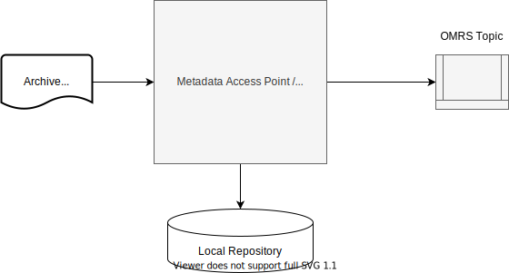
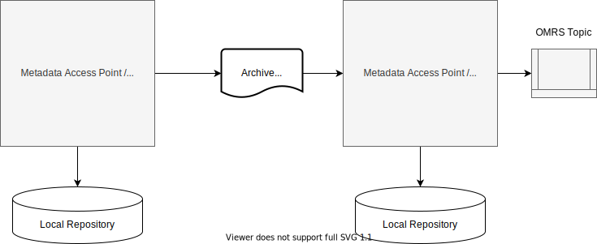
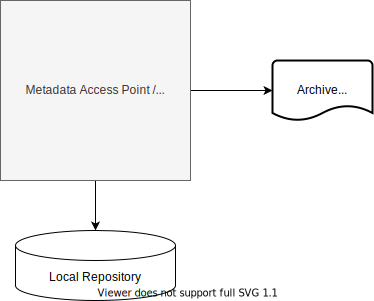

<!-- SPDX-License-Identifier: CC-BY-4.0 -->
<!-- Copyright Contributors to the ODPi Egeria project. -->
  
# Open Metadata Archives
  
The open metadata archives provide pre-canned content (open metadata types and instances) to load into an open metadata
repository.  There are three main types of open metadata archive:

- **Content packs** - read only metadata types and instances that are reusable in many organizations.
  The type definitions for the [Open Metadata Types](/egeria-docs/types)
  are managed in a content pack.  They are also used for distributing standard glossaries or other types of definitions.
  
- **Metadata exports** - metadata exported from a specific open metadata repository that can act as a backup.
It is read-write if loaded into an open metadata repository with the same metadata collection id as the originating
repository, or read-only if loaded into a repository with a different metadata collection id.

- **Repository backups** - used for creating a back up for an open metadata repository.

Figure 1 shows a content pack being loaded into a metadata repository.  It is stored in the local repository
and distributed around any connected cohorts.  These types of archives can be provided by the
Egeria community and third party organizations.
Notice that due to the distribution of this metadata across the cohorts, it is only necessary to load the archive into
one of the servers.

> **Figure 1:** Loading a content pack

When data and other types of assets are being transported between organizations,
it is possible to use a metadata export open metadata archive to pass the related metadata as well.
This is shown in figure 2.

> **Figure 2:** Exporting and reimporting metadata between unconnected repositories

Figure 3 shows a metadata export archive to create a backup of selected metadata. This can be used to recover the metadata repository content after a bad load or other operational error.

> **Figure 3:** Selective back up of metadata elements

## Creating open metadata archives

There are two approaches to create an open metadata archive:

- Assemble the contents in memory and push to the open metadata archive store when the archive is assembled.
- Push the elements in the archive one-by-one as they are built.

The first approach works well for small archives such as content packs and the second is for large archives such as backups.

There are three supporting components used in the construction process:

- *Helper* - logic to build the different types of elements for the archive.
- *Builder* - logic to assemble the elements into the archive structure.
- *Writer* - logic to store the contents of the archive on disk.

They are driven by specific archive logic that knows what content to add to the archive and an [open metadata archive store connector](/egeria-docs/concepts/open-metadata-archive-store-connector) that is responsible for the storage of the archive.

> **Figure 4:** Assembling an open metadata archive in memory and then writing it out to disk once it is complete

> **Figure 5:** Assembling an open metadata archive directly on disk

The archive logic can either be an [offline utility](#supported-utilities-for-open-metadata-archives) or an [archive service](/egeria-docs/guides/developer/archive-services/overview) running in an [archive engine](/egeria-docs/concepts/archive-engine).

## Inside an Open Metadata Archive

The open metadata archive has three parts to it.  This is shown in **Figure 4**.
The header defines the type of archive and its properties.  Then there is the type store.
This contains new types and updates to types (patches).  Finally there is the instance store.
This contains new instances (entities, relationships and classifications).

> **Figure 6:** Inside an Open Metadata Archive

--8<-- "docs/guides/developer/open-metadata-archives/open-metadata-archive-header-example.md"

## Storage structures

> **Figure 7:** Storing an open metadata archive as a single file

> **Figure 8:** Storing an open metadata archive in a directory structure

## Loading open metadata archives

A metadata server's configuration document can list the
archives to load each time the server is started.  This is useful if the server does not retain
metadata through a server restart (like the in-memory metadata repository).
Open metadata archives may also be loaded while the server is running using a REST API call.

These articles describe how to load open metadata archives into a server:

- [Configuring an open metadata archive in an OMAG Server](/egeria-docs/concepts/open-metadata-archive/#configuring-metadata-to-load-on-startup.md)
- [Adding an open metadata archive to a running OMAG Server](/egeria-docs/concepts/open-metadata-archive/#adding-archive-to-running-server.md)

The archive loads in the following order:

- Attribute Type Definitions (AttributeTypeDefs) from the type store.
  - PrimitiveDefs
  - CollectionDefs
  - EnumDefs
  
- New Type Definitions (TypeDefs) from the type store.
  - EntityDefs
  - RelationshipDefs
  - ClassificationDefs
  
- Updates to types (TypeDefPatches)

- New Instances
  - Entities
  - Relationships
  - Classifications
  
The archive is loaded once and its content is immediately available.
If the repository persists metadata over a server restart then this archive content
continues to be available after the server restarts.

It does not matter how many times an archive is loaded, only one copy of the content is
added to the repository.

## Supported utilities for open metadata archives

Egeria supports the following open metadata archives.  Associated with each archive
are utilities that help you build additional archives of your own content.

- [Open Metadata Types](open-metadata-types) - the Egeria Open Metadata Type Definitions.
This archive is always loaded by each OMAG metadata repository server at start-up.
This is to reduce the chance that new types developed by a third party have names that conflict with the open metadata types.
There is also a utility to create the archive file for these open metadata types.
To find out more about the Open Metadata Types [click here](/egeria-docs/types).

- [Open Connector Archives](open-connector-archives) - provides utilities for building
open metadata archives containing information about one or more connectors that
follow the [Open Connector Framework (OCF)](/egeria-docs/frameworks/ocf/overview).
In addition, there are utilities for building an open metadata archive containing the connector type
definitions for Egeria's data store connectors.

- [Design Model Archives](design-model-archives) - provides utilities to
manage common/standard model content from third parties.  It includes
an example archive for the [Cloud Information Model (CIM)](https://cloudinformationmodel.org).

---8<-- "snippets/abbr.md"