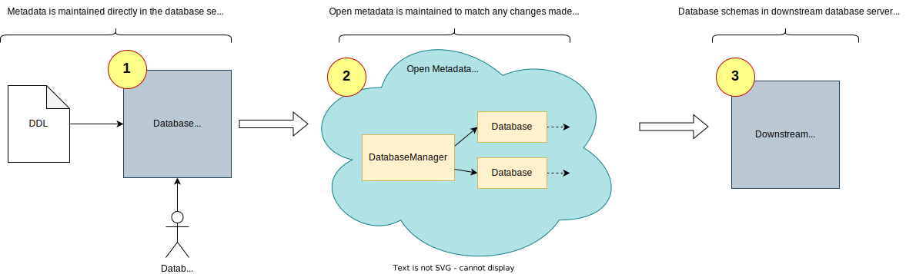
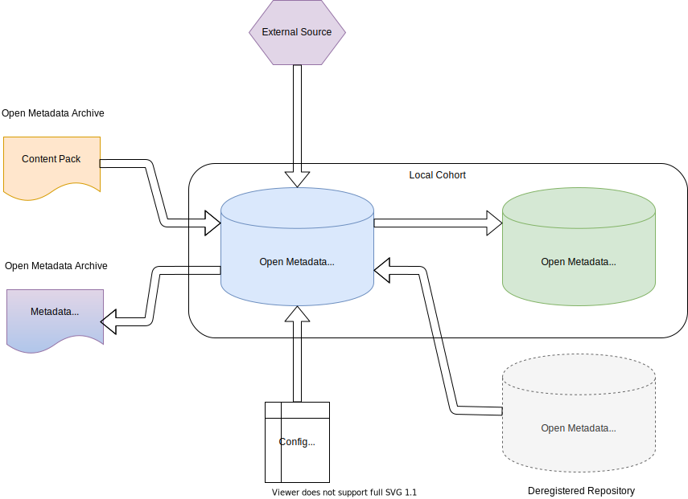

<!-- SPDX-License-Identifier: CC-BY-4.0 -->
<!-- Copyright Contributors to the ODPi Egeria project 2020. -->

# Metadata Provenance

The open metadata ecosystem draws together metadata from many sources. Metadata provenance provides information about where metadata has come from and how it can be maintained (that is updated and deleted).

## Metadata Collections

The metadata that a specific technology instance creates and maintains is referred to as a *metadata collection*.  For example, in figure 1, there are three metadata collections.  There is one in the database server on the left, (at least) one in the open metadata ecosystem and one in the downstream database server on the right.

> **Figure 1:** Examples of metadata collections.  In this example, metadata is originating from the database server in the left (labelled 1) and is being copied into the open metadata ecosystem where it is distributed to other metadata repositories, tools and systems as appropriate.  This includes a downstream database server (labelled 3).

## Metadata Collection Identifiers

In open metadata, each metadata collection has a unique identifier, called the *metadata collection id* and an optional *metadata collection name*. When a metadata instance from the collection is shared within the broader open metadata ecosystem, it includes the metadata collection id and metadata collection name in its header.  This identifies the originating metadata of the metadata instance.
 
The metadata instance header also includes a category name that describes how the metadata was introduced into the open metadata ecosystem. This category name is called the **Instance Provenance Type** by the [Open Metadata Repository Services (OMRS)](/services/omrs) and **Element Origin** by the [Open Connector Framework (OCF)](/frameworks/ocf/overview) and most of the [Open Metadata Access Services (OMASs)](/services/omas).  We will use *Element Origin* for the rest of this description since it is the most commonly used name.

Figure 2 shows the different values of Element Origin and how they tie into the mechanism used to introduce the metadata to the open metadata ecosystem.

> **Figure 2:** What the different values of Element Origin say about the source of metadata

* **Local Cohort** means that the metadata collection comes from a member of one of the open metadata repository cohorts that the local server is a member of.  The owning cohort member will maintain the metadata and distribute any changes to the other cohort members. The metadata collection id and name is set up in the [configuration of the cohort member's OMAG Server](/concepts/metadata-collection-id).
  
* **Deregistered Repository** means that the metadata collection is owned by a server that used to be a member of one of the cohorts that the local server belongs too but is has deregistered from the cohort.  This means it is no longer sending updates to the rest of the cohort.  Its metadata is still visible because **reference copies** (read only copies) have been kept by the other members. There are two routes to making this metadata maintainable again:
    
     * Connect the original repository back into the cohort.
     * If the original repository has gone forever, re-home the metadata so that it is owned by a current active member.
       
* **External Source** means the metadata originates in a third party technology and a copy is maintained through an [Open Metadata Access Service (OMAS)](/services/omas). Typically, the OMAS is called via an [Open Metadata Integration Service (OMIS)](/services/omis) running in an [Integration Daemon](/concepts/integration-daemon).  The metadata collection id and name is defined in Open Metadata as the [unique identifier, or GUID,](/concepts/guid) and [unique name, or qualified name,](/concepts/referenceable) of a [Software Capability](/concepts/software-capability) representing the source technology.
  
* **Configuration** means the metadata comes from a [Configuration Document](/concepts/configuration-document).  Configuration documents control the capabilities of an [OMAG Server](/concepts/omag-server).  This metadata is maintained through Egeria's [Administration Services](/guides/admin/overview)
  
* **Content Pack** means the metadata comes from an open metadata archive that contains a collection of standard definitions.  Content packs could contain glossaries, reference data sets, definitions from regulations and other types of standards. The archive documents the metadata collection id and name for the collection.  In addition, a content pack is used to define [Open Metadata Types](/types).  The metadata from a content pack can be updated by loading a later version of the content pack.  Updated instances and types are replaced by the newer versions.
  
* **Metadata Export** is also content from an open metadata archive.  However, it has been exported from a repository that has never been a member of the open metadata repository cohorts.  It typically describes assets that are being imported from a third party (such as a business partner) that is also providing the accompanying metadata.  Just as with content packs, this metadata is updated by loading a newer version of the metadata export archive.

## Using provenance to manage metadata integrity

Egeria ensures that only the owner of a metadata instance is permitted to update it. This enforcement makes use of the metadata provenance information in the metadata instance's header.

Typically, the owner is the originator of the metadata instance, but the section below describes how to move a metadata instance's home from one metadata collection.  This effectively changes the owner to the new metadata collection.

## Changing the metadata collection that a metadata instance belongs to

The [Open Metadata Repository Services](/services/omrs) supports commands to change the metadata collection that a metadata instance belongs to.  This should be done only if the instance needs to be edited and the technology supporting the original metadata collection is no longer available. For example, for instances belonging to a deregistered repository.  The change needs to be made with care and planning ensuring that all members of the cohort are connected when the command is issued so that the change of ownership can be recorded consistently in all repositories.
  
??? education "Further information"

    * Find out more about [membership of a cohort](/concepts/cohort-member).
    * Learn about how [external sources can integrate with the open metadata ecosystem](/concepts/integration-daemon).
    * Set up [metadata solutions that integrate metadata from many sources](/patterns/metadata-exchange/overview).
    * Create and load [Open Metadata Archives](/concepts/open-metadata-archives) into your open metadata ecosystem.
    * Learn about [Configuration Documents](/concepts/configuration-document) that control the behaviour of OMAG Servers and how to set them up.

--8<-- "snippets/abbr.md"