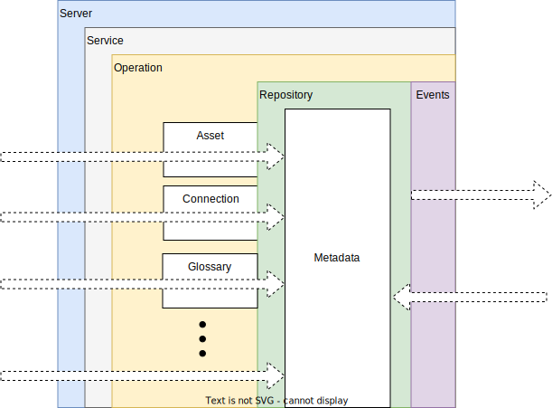

<!-- SPDX-License-Identifier: CC-BY-4.0 -->
<!-- Copyright Contributors to the ODPi Egeria project. -->


# Open Metadata Security

Open Metadata Security provides fine-grained authorization services for open metadata services, types and instances. Since each organization will have different security requirements, the support is implemented through connectors. Egeria defines the interfaces and when it will call the connector.  You define the behavior the connector implements, and Egeria acts on the returned decision.

The `metadata-security` module defines the base classes and interfaces for the open metadata security connectors as well as the server implementation to host and call them.

There are two types of connector:

* **Open metadata platform security connector** - secures access to the platform services that are not specific to an OMAG Server.  This includes the admin services to create new servers, the ability to start and stop new servers as well as the ability to query whether a server is running, and if it is, what services are active.

* **Open metadata server security connector** - secures access to the specific services of an OMAG server.  This includes the server itself, specific services within the server, specific Assets and Connections managed by the server and the types and instances stored in the local repository.

The 2 types of connectors are shown in Figure 1:


> **Figure 1:** positioning of the security connectors

Within an OMAG Server Platform there is one instance of the open metadata platform security connector.  This connector is configured once the platform is running using the admin service call:
```
POST {{platformURLRoot}}/open-metadata/admin-services/users/{{adminUserId}}/platform/security/connection
```
where the `{{adminUserId}}` is the administrator's userId. The connection for the connector and the platform URL root are passed in the request body.  There are `GET` and `DELETE` services with the same URL to retrieve and remove this connector respectively.

The open metadata server security connector is configured for each OMAG server to allow for each server to have a different implementation.  The admin services command to configure a security connector for a server is:
```
POST {{platformURLRoot}}/open-metadata/admin-services/users/{{adminUserId}}/servers/{{serverName}}/security/connection
```
where the `{{adminUserId}}` is the administrator's userId and `{{serverName}}` is the name of the server where the connector is to run. The connection for the server security connector is passed in the request body.  Again, there are `GET` and `DELETE` services with the same URL to retrieve and remove this connector respectively.

The security implementation in a server potentially invokes the server security connector multiple times as the request (shown as dotted white arrow) is handled by the server code. Figure 2 shows the different layers of checks.  Each layer is optional and so the server security connector can be implemented to support the most appropriate granularity of security for the situation. Details of the implementation choices are given in the [security connector API](#metadata-security-apis).


> **Figure 2:** layers of security checks within the server

The security connectors are optional.  If they are not defined then there are no additional authorization checks
performed inside the OMAG Server Platform nor the OMAG Servers hosted on the platform.
As such, it is important that the open metadata platform security connector is configured
as soon as the platform is started, and the server security connector is configured before the server is started for the first time.

## Metadata security APIs

Below is a description of the API of the two
[Open Metadata Security Connectors](../metadata-security-connectors).

### Open metadata platform security connector interface

The connector that plugs in to the platform implements the following interface.

*  **OpenMetadataPlatformSecurity** - provides the interface for a plugin connector that validates whether a calling user can access any service on an OMAG Server Platform.  It is called within the context of a specific OMAG Server Platform request.  Each OMAG Server Platform can define its own plugin connector implementation and will have its own instance of the connector. 
   
   * **validateUserForPlatform** - Check that the calling user is authorized to issue a (any) request to the OMAG Server Platform.
   * **validateUserAsAdminForPlatform** - Check that the calling user is authorized to issue administration requests to the OMAG Server Platform.
   * **validateUserAsOperatorForPlatform** - Check that the calling user is authorized to issue operator requests to the OMAG Server Platform.
   * **validateUserAsInvestigatorForPlatform** - Check that the calling user is authorized to issue operator requests to the OMAG Server Platform.
  
### Open metadata server security connector interface

The connector that can be defined for an OMAG Server offers a series of layers of security checks.  An organization can choose which layers to make use of and which to allow all requests to pass.  Figure 2 shows the layers. Each layer is implemented in a separate interface and the connector can choose which interfaces to implement.  Below are the interfaces and methods for the different layers:

* **OpenMetadataServerSecurity** - provides the root interface for a connector that validates access to Open Metadata services and instances for a specific user.  There are other optional interfaces that define which actions should be validated.
 
  * **validateUserForServer** - Checks that the calling user is authorized to issue a (any) request to the OMAG Server.
  * **validateUserAsServerAdmin** - Checks that the calling user is authorized to update the configuration for a server.
  * **validateUserAsServerOperator** - Checks that the calling user is authorized to issue operator requests to the OMAG Server.
  * **validateUserAsServerInvestigator** - Checks that the calling user is authorized to issue operator requests to the OMAG Server.

* **OpenMetadataServiceSecurity**  - provides the interface for a plugin connector that validates whether a calling user can access a specific metadata service.  It is called within the context of a specific OMAG Server. Each OMAG Server can define its own plugin connector implementation and will have its own instance of the connector.  However the server name is supplied so a single connector can use it for logging error messages and locating the valid user list for the server.
 
  * **validateUserForService** - Checks that the calling user is authorized to issue this request.
  * **validateUserForServiceOperation** - Checks that the calling user is authorized to issue this specific request.
 
* **OpenMetadataRepositorySecurity** - defines security checks for accessing and maintaining open metadata types and instances in the local repository.
 
  An instance is an entity or a relationship.  There is also a special method for changing classifications added to an entity.
  
  * **validateUserForTypeCreate** - Tests for whether a specific user should have the right to create a typeDef within a repository.
  * **validateUserForTypeRead** - Tests for whether a specific user should have read access to a specific typeDef within a repository.
  * **validateUserForTypeUpdate** - Tests for whether a specific user should have the right to update a typeDef within a repository.
  * **validateUserForTypeDelete** - Tests for whether a specific user should have the right to delete a typeDef within a repository.
  * **validateUserForEntityCreate** - Tests for whether a specific user should have the right to create a instance within a repository.
  * **validateUserForEntityRead** - Tests for whether a specific user should have read access to a specific instance within a repository.  May also remove content from the entity before it is passed to caller.
  * **validateUserForEntitySummaryRead** - Tests for whether a specific user should have read access to a specific instance within a repository.
  * **validateUserForEntityProxyRead** - Tests for whether a specific user should have read access to a specific instance within a repository.
  * **validateUserForEntityUpdate** - Tests for whether a specific user should have the right to update a instance within a repository.
  * **validateUserForEntityClassificationUpdate** - Tests for whether a specific user should have the right to update the classification for an entity instance
   within a repository.
  * **validateUserForEntityDelete** - Tests for whether a specific user should have the right to delete a instance within a repository.
  * **validateUserForRelationshipCreate** - Tests for whether a specific user should have the right to create a instance within a repository.
  * **validateUserForRelationshipRead** - Tests for whether a specific user should have read access to a specific instance within a repository.  May also remove content from the relationship before it is passed to caller.
  * **validateUserForRelationshipUpdate** - Tests for whether a specific user should have the right to update a instance within a repository.
  * **validateUserForRelationshipDelete** - Tests for whether a specific user should have the right to delete a instance within a repository.
  * **validateEntityReferenceCopySave** - Tests for whether a reference copy should be saved to the repository.
  * **validateRelationshipReferenceCopySave** - Tests for whether a reference copy should be saved to the repository.

* **OpenMetadataEventsSecurity** - defines security checks for sending and receiving events on the
[open metadata repository cohorts](/concepts/cohort-member).
  
  * **validateInboundEvent** - Validates whether an event received from another member of the cohort should be processed by this server.   May also remove content from the event before it is processed by the server.
  * **validateOutboundEvent** - Validates whether an event should be sent to the other members of the cohort by this server.   May also remove content from the event before it is sent to the cohort.
    
* **OpenMetadataAssetSecurity** - validates what a user is allowed to do with to Assets.
  The methods are given access to the whole asset to allow a variety of values to be tested.
  
  * **setSupportedZonesForUser** - Provides an opportunity to override the deployed module setting of 
  [supportedZones](/features/governance-zoning) for a user specific list.
  * **validateUserForAssetCreate** - Tests for whether a specific user should have the right to create an asset.
  * **validateUserForAssetRead** - Tests for whether a specific user should have read access to a specific asset.
  * **validateUserForAssetDetailUpdate** - Tests for whether a specific user should have the right to update an asset.
   This is used for a general asset update, which may include changes to the
   zones and the ownership.
  * **validateUserForAssetAttachmentUpdate** - Tests for whether a specific user should have the right to update elements attached directly
   to an asset such as schema and connections.
  * **validateUserForAssetFeedback** - Tests for whether a specific user should have the right to attach feedback - such as comments,
   ratings, tags and likes, to the asset.
  * **validateUserForAssetDelete** - Tests for whether a specific user should have the right to delete an asset.
    
* **OpenMetadataConnectionSecurity** - defines the interface of a connector that is validating whether a specific user should be given access to a specific Connection object.  This connection information is retrieved from an open metadata repository.  It is used to create a Connector to an Asset.  It may include user credentials that could enhance the access to data and function within the Asset that is far above the specific user's approval.  This is why this optional check is performed by any open metadata service that is returning a Connection object (or a Connector created with the Connection object) to an external party.

  * **validateUserForConnection** - Tests for whether a specific user should have access to a connection.
  * **validateUserForAssetConnectionList** - Selects an appropriate connection for a user from the list of connections attached to an Asset.

## Sample connectors

There are sample implementations of the security connectors for [Coco Pharmaceuticals](https://opengovernance.odpi.org/coco-pharmaceuticals/) in the samples module under [open-metadata-security-samples](https://github.com/odpi/egeria/tree/master/open-metadata-resources/open-metadata-samples/open-metadata-security-samples)


--8<-- "snippets/abbr.md"