<!-- SPDX-License-Identifier: CC-BY-4.0 -->
<!-- Copyright Contributors to the ODPi Egeria project 2020. -->

# People, roles and organizations

## The nature of organizations

Everyone plays multiple roles in their lives: parent, daughter, employee, scout leader, … even within an organization it is not uncommon, particularly for more experienced people, to be assigned to multiple roles.

For example, figure 1 shows some of the roles that [Tessa Tube](https://opengovernance.odpi.org/coco-pharmaceuticals/personas/tessa-tube.html) performs at [Coco Pharmaceuticals](https://opengovernance.odpi.org/coco-pharmaceuticals/).  *Researcher* is her primary role, but she is also a manager, system owner and information consumer.  Each of these roles needs particular skills and knowledge.  They will also take up some of her time.

> **Figure 1:** Roles that Tessa Tube plays in Coco Pharmaceuticals

A role has a context. For example, Tessa is a manager, but not for everyone in Coco Pharmaceuticals. She is a manager of a specific team. Similarly, she may be a system owner, but not of all systems.

So a role has a scope, and roles can be combined together to form the complete “job” that an individual performs.

Now consider what a role is from an organization's perspective. Roles can be thought of as slots, or vacancies, in the organization's teams that individuals are appointed to for a span of time.  A role can have more than one person appointed. [Head count](/egeria-docs/concepts/person-role/#head-count-limit) is an optional attribute that indicates how many people are expected to be assigned to the role.

The teams are typically organized into one or more hierarchies.  These hierarchies reflect how the work has been divided up to meet the objectives of the organization. Figure 2 shows the general structure.

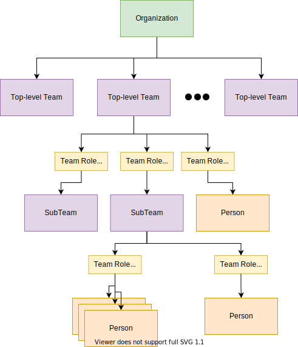
> **Figure 2:** Basic structure of an organization showing the top-level organization linked to the top-level teams.  Nested under the top-level teams are the sub-teams.  The roles in each team are divided into leaders and members.  The roles can have multiple people appointed to them.

Figure 3 shows part of the Coco Pharmaceuticals organization.

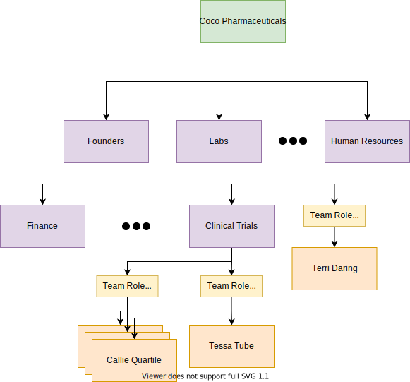
> **Figure 3**: Coco Pharmaceuticals divides its labs and research work from the sales and manufacturing.  The leader of the labs is one of the founders, Terri Daring.  Tessa Tube works for her and Callie Quartile works for Tessa.

Coco Pharmaceuticals is a small company but even so, its organization structure is hard to draw on a flat diagram.  Terri Daring is a founder and a member of the *Founders* team (not shown in figure 3) as well as being a leader of the *London Lab* organization.

## Projects and communities

An individual acquires their roles from the projects they work on and the communities they belong to as well as their direct team in the organization hierarchy (department).

Figure 4 shows a role attached to a community.  The `CommunityMembership` relationship defines the type of members that perform the role.  So a community may have a community leader role that is separate from the community administrator role for example.

> **Figure 4**: Linking of a role to a community showing the type of membership associated with the role

Figure 5 shows the roles associated with a project.  There are the roles associated with the management of the project as well as the project team that performs the work of the project.

> **Figure 5**: Linking of roles to a project.  There is a separation of the roles to manage the project from the roles to lead the team that does the work.

## Types of roles

Egeria's [open metadata types](/egeria-docs/types) represent a role using the [`PersonRole`](/egeria-docs/types/1/0122-People) entity type.  Figure 6 shows a hierarchy of subtypes for 'PersonRole' that are also included in the open metadata types to help structure your organization's role types into broad groups that identify particular skill sets.  For example, Coco Pharmaceuticals may define role types of `Researcher` and `Data Scientist` that inherit from `PersonRole`; a role type of `DepartmentManager` that inherits from `TeamLeader`; and a role type of `ClinicalTrialLeader` that inherits from `ProjectLeader`. 

> **Figure 6**: Inheriting from PersonRole (from model 0112) are the team roles (from model 0115) of TeamMember and TeamLeader; the ProjectLeader role (from model 0130); the CommunityMember role (from model 0140) and the GovernanceRole roles (from model 0445) of Governance Officer, Asset Owner, SubjectAreaOwner ComponentOwner and DataItemOwner.

Instances of a role type (ie role instances) describe a specific role in the organization that has a scope and potentially people appointed to it.  For example, in figure 7, an instance of the `ClinicalTrialLeader` role has been created for the *Drop Foot Clinical Trial* project.  *Tessa Tube* has been appointed to that role to indicate that she is the leader of that project.

> **Figure 7**: The left-hand side of the diagram shows the inheritance hierarchy of the type for `ClinicalTrialLeader` which inherits from `ProjectLeader` which inherits from `PersonRole`. The right hand-side shows the instances: the Person entity for Tessa Tube is linked to the ClinicalTrialLeader entity for the Drop Foot Clinical Trial which in turn is linked to the Project entity for the Drop Foot clinical trial project.

## Roles in action

Roles are a key mechanism for organizing people for governance. Consider this scenario.

### Clinical trial example

The characters in figure 8 are involved in the clinical trial for a new cancer drug developed by Coco Pharmaceuticals.  They are collaborating on their findings as selected patients are given the new drug.  The data is created by the hospital and shared with Coco Pharmaceuticals for analysis.  Results and feedback are returned to the hospital personnel.

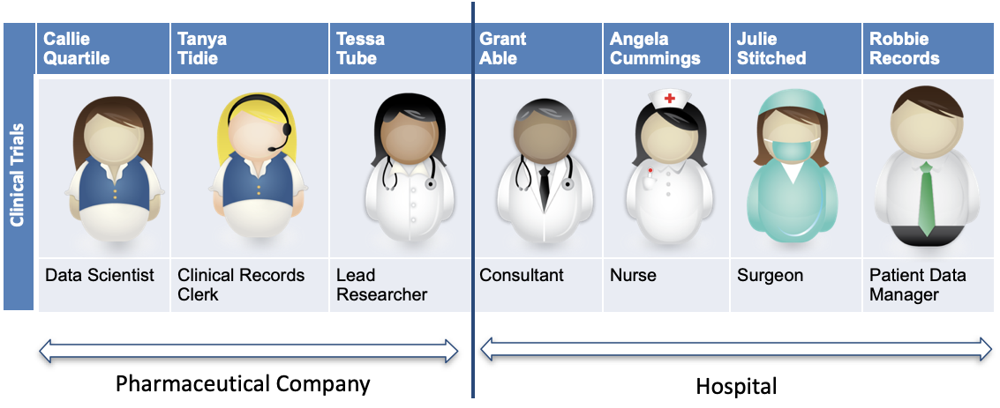
> **Figure 8:** The people from the hospital (Grant Able, Angela Cummings, Julie Stitched and Robbie Records) and from Coco Pharmaceuticals (Callie Quartile, Tanya Tidie and Tessa Tube) who are working together on the clinical trial.

In this example, there is an exchange of sensitive personal data which needs to managed carefully, both for legal reasons and to maintain the trusted partnership between the hospital and Coco Pharmaceuticals. 

When it comes to working with data, the role each are playing is often related to the task an individual is performing and the data resources they are working with.  This becomes important in managing the access that an individual has to the resources.

### Clear responsibilities

Figure 9 shows how the roles - and hence the responsibilities - or individuals vary with respect to the patient data.

The hospital has a close association with the information subjects (patients) and information originators (medical staff) who are typically the information owners.

The hospital appoints an information steward ([Robbie Records](https://opengovernance.odpi.org/coco-pharmaceuticals/personas/robbie-records.html)) to work with the information owners on the terms and conditions that must be met by external organizations using the data.  Robbie also chases down data quality issues and ensures their data practices are clean.

At Coco Pharmaceuticals, Tanya Tidie is appointed as the information custodian for the data.  She takes responsibility for meeting the terms and conditions for the incoming data.

> **Figure 9:** Robbie Records and Tanya Tidie managing the sharing of data from the hospital

Figure 10 shows a broader view the roles of each character when it comes to the transfer of data from the hospital.  The role names are not important.  There is little standardization fo these names in the industry.  Just focus on the fact that the people involved with the clinical data have different roles/responsibilities with respect to its protection and use.

> **Figure 10:** The patient is the information subject.  The information originators are the medical staff making notes and capturing clinical data.  Robbie is the information steward managing the data and its transfer to external organization on the hospital-side.  Tanya Tidie is the receiver of the data and as the information custodian, she is responsible for the proper management of Coco Pharmaceutical's copy of the data. Tessa Tube and Callie Quartile are information consumers.  They read the data and perform analysis on it to determine how well the new drug is helping the patient.

Tanya Tidie needs to ensure that only the clinical trials team have access to the data.  The team also need to be educated on their responsibilities to meet the terms and conditions of the data transfer.

## Actor Profiles

Figures 2, 3 and 7 show that individuals are represented using a `Person` instance.  Figures 2 and 3 also show `Team` instances for each team.  Both `Person` and `Team` are types of [`ActorProfile`](/egeria-docs/types/1/0110-Actor-Profile).  [`ITProfile`](/egeria-docs/types/1/0117-IT-Profiles) is another type of ActorProfile that are linked to [Assets](/egeria-docs/concepts/asset) to show the user information typically of a process such as a connector or a software server.

Figure 11 shows the different types of actor profile as well as a link to a `UserIdentity` entity. This describes a user account or userId associated with the profile. 

> **Figure 11:** There are three subtypes for ActorProfile: ITProfile for assets, Person for individuals and Team for organized groups of roles.  Any one of these subtypes can have a UserIdentity associated with them.

Unless security is disabled, every action performed in an IT system is associated with a user account.  The linkage of the UserIdentity which represents the user account with the profile makes it possible to look up the originator of the action.

User accounts are typically associated with specific running processes and individuals.  However it is also possible to have a shared user account for a team, although this makes it difficult to identify which person performed a specific action.

It is also possible for an individual, team or process to have multiple user accounts 

Figure 12 also shows that a profile can be linked to multiple user identities but not the other way around so that given a userId it is possible to look up the profile.

> **Figure 12:** Showing the possibility of a profile having multiple user identities associated with it

In summary, figure 13 show that the other elements linked to the profile creates a broader view of the context of an action in the IT systems.

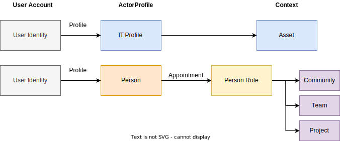
> **Figure 13:** The full context of a user action. At the top is the ITProfile showing which Asset is using a particular user account.  Below that is the Person linked to the associated PersonRoles, which are in turn linked to the scope in which they are defined (community, team or project)

## Linking governance and security to roles

Access to [resources](/egeria-doces/concepts/resource) is controlled by identifying which user accounts can access which resources.  Typically similar resources are identified and a *user group* is defined for them.  The group contains the list of user accounts that are allowed to access the associated resources.  Figure 

> **Figure 14:** Members of an LDAP user group are listed in the group definition.  These users are given access to the resources that are protected by that group.

The roles and their membership of teams, projects and communities in an organization help to determine who should have access to specific resources.  However the access control managers do not work directly with the roles, teams, projects and communities - they only understand the user account. [`UserIdentities`](/egeria-docs/types/1/0110-Actors/#UserIdentity) therefore document the user accounts of the individuals, teams and processes.  Egeria also provides the means to defined the security information that  links between the organization and the asset descriptions of the resources.

[`SecurityGroups`](/egeria-docs/types/4/0423-Security-Definitions) are entities that describe a user group in a security control system.  They are subtypes of the `GovernanceDefinition` that supports two relationships:

- [`GovernedBy`](/egeria-docs/types/4/0401-Governance-Definitions) - to indicate the resources that are governed by the governance definition.  When the governance definition is a security group it means these are the resources that are protected by the security group.

- [`ScopedBy`](/egeria-docs/types/4/0401-Governance-Definitions) - to indicate where the governance definition applies.  For a security group this means the people, roles, teams etc that should be given permission to the security group.

Figure 15 shows these two relationships.

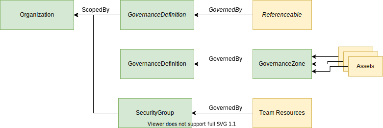
> **Figure 15:** Security groups are subtypes of governance definitions.  They can be linked to resources with the *GovernanceBy* relationship to show that the security group is used to govern access to these resources.  The security group can also be linked to an organization, service or business capability using the *ScopedBy* relationship to show that it is only used within the identified scope.

Figures 16 and 17 show some examples of the security group linking different types of resources to the different parts of the organization.

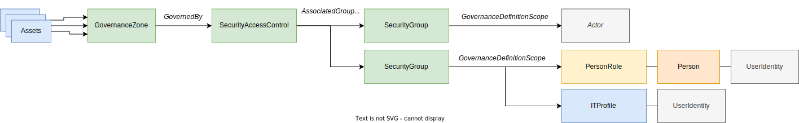
> **Figure 16:** Example of associating a security group to a governance zone to give a process that is maintaining the resources in a governance zone.

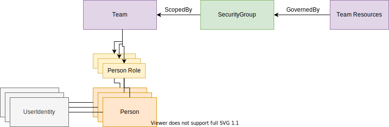
> **Figure 17:** Example of associating a security group to a team to give the team members access to the team resources.

The navigation between these elements is technically feasible, but time-consuming and difficult to audit.  Egeria also defines a classification for a user identity that lists all of the security groups that should be assigned to that user identity.  This is shown in figure 18.

> **Figure 18:** The SecurityGroupMembership classification lists the security groups that the user identity should be added to in the user directory (such as LDAP).

Egeria's governance actions can automate the maintenance of the [`SecurityGroupMembership`](/egeria-docs/types/4/0423-Security-Definitions) classification.  For example, Callie Quartile, a Data Scientist at Coco Pharmaceuticals analyses data for both clinical trials and marketing.  She therefore has two roles that each use different data.  The result is that her userId needs access to both the clinical trials data and the marketing data.  Figure 19 shows the navigation that the governance action uses to set up the security groups for Callie's userid.

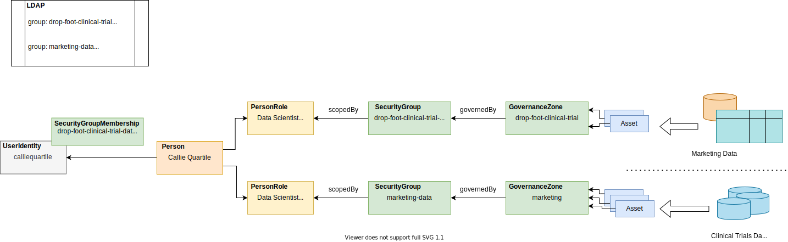
> **Figure 19:** Setting the security groups in a governance action involves navigating from the security groups to the linked roles and on to the userIdentities associated with the Person profile.

## Specialist user accounts

Given the different level of access needed to perform each of her roles, Callie becomes concerned that it is difficult for her to separate the data she uses for clinical trials from her marketing work.

Callie is given an additional user account called `callie-marketing` that she can use for her marketing work.  This userId needs to replace the entry in the marketing group.  Callie can switch users to access the different data sets for her two roles

> **Figure 20:** Callie's additional user account called `callie-marketing` and the settings needed in the associated LDAP groups.

Figure 21 shows a possible issue when the second user identity is assigned to Callie since there is no guidance on which user identities should be associated with which security groups.

> **Figure 21:** Dilemma on setting SecurityGroupMembership.

The solution is to add the role mapping on the profile identity relationship between the person entity and the user identity entity for the new marketing userId.  Only security groups associated with the identified role are assigned to this user identity,  All other security groups go to the unmapped user identity.  This is illustrated in figure 22.

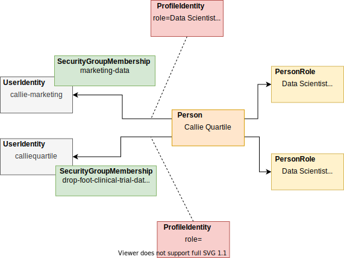
> **Figure 22:** Setting role information on the profile identity relationship.

## Working with people

There will be situations where a governance action discovers an error, an inconsistency or a gap in the metadata it is working with that needs a person to resolve, either through making a choice, supplying additional information or approve a recommendation from the governance engine.

Individuals do not have a REST API to call.  However they do use different tools and notification mechanisms such as instant messaging and email.  These tools can be used to pass information about the decisions and/or changes that the governance needs the person to perform.  The selected person can then make the desired changes either through the Egeria APIs or another tool that is connected to the open metadata ecosystem.  Once the changes are visible to the governance action(s), they can continue processing. 

> **Figure 23:** Mechanisms needed to include an individual in a governance process include a notification mechanism to alert the selected individual that their help is needed; APIs to investigate the situation and make the changes needed to the open metadata.  These changes can be detected and the governance action(s) can then proceed.

Governance actions uses the open metadata [`ToDo`](/egeria-docs/types/1/0137-Actions) entity to request action from an individual.  This is set up in a governance action implemented by a [*Triage Governance Service*](/egeria-docs/frameworks/gaf/overview/#triage-governance-service).  This service navigates to the role that needs to take the action.  An integration connector typically running in the [Organization Integrator OMIS](/egeria-docs/services/omis/organization-integrator/overview) can then send a notification to the person or people appointed to that role.

Figure 24 shows a [governance action process](/egeria-docs/concepts/governance-action-process) that includes a governance action called `Request Stewardship`.  This creates an appropriate ToDo when the `Assign SecurityGroup` governance action detects there is ambiguity relating to which user groups should be assigned to each user identity for an individual.  It is retried once the ToDo is complete.

> **Figure 24:** Including a stewardship step in a governance action process.

The `Request Stewardship` governance action in this example assigns the ToDo to the individual's manager.  Figure 25 shows the navigation from Callie's profile to Tessa's management role
where the ToDo is then attached.

> **Figure 25:** Locating the role for the ToDo

Figure 26 summarizes the processing that notifies Tessa of the ToDo and the assignment of the role identifiers needed to set up Callie's security groups in LDAP.

> **Figure 26:** Overview of the ToDo processing

*ToDos* are good mechanisms when the person responsible for taking action is clear.  All governance actions are also able to create an [Incident Report](/egeria-docs/concepts/incident-report).  This is a report that documents the need to take action.  However, there is no need for the governance action to assign a specific person to the report - this is handled by an [*Incident Management System*](/egeria-docs/features/incident-reporting/overview). 

## Synchronizing organization data with open metadata

Egeria's synchronization capability helps in the maintenance of the organization data and user identities in open metadata followed by the synchronization of the security information in the security access control services:

- When onboarding a new service that has an embedded security system (such as a cloud platform) or even for Egeria itself.
- When making changes to the organization structure.
- When setting up new projects and communities.

Egeria may have one or more of the following uses of organization data and this will effect the scope and coverage of this data that flows through Egeria.

- Egeria is a consumer of the organization data for collaboration and governance.
- Egeria is a validator of the consistency of the organization data in the different systems.
- Egeria is a distributor of the organization data between systems.  This may include its only security definitions used to security the access of open metadata through Egeria.

In general, if Egeria is just consuming the organization data then it only needs information about the people and teams using Egeria.  If, however, Egeria is validating or distributing organization data, it tends to hold all of the organization data that is relevant to the sources and consumers of the organization data.

The text below covers all three uses.

## Systems that hold organization data

Organization data is widely distributed across an organization's systems.  Each system holds a different subset of the organization data and is updating some or all of its content.  When planning to integrate organization data into Egeria, it is important to understand where the authoritative source of each attribute is located and how the information in different systems can be correlated together.  Below are the descriptions of three systems in Coco Pharmaceuticals that are responsible for managing organization information.

### HR Information Manager (HRIM)

HRIM is owned by the Human Resources (HR) team in Coco Pharmaceuticals for managing information about employees.  It covers applicants, current employees and those who have left.

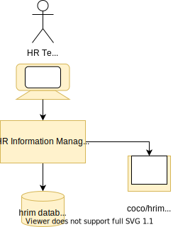

This is a model of the HRIM data.  You can see it includes not only the employees, but also the department structure.

### The cocopages company directory

The cocopages application provides contact information for anyone associated with Coco Pharmaceuticals business.  This includes contractors and business partners such as the hospital staff working on clinical trials. It is also owned by the Human Resources (HR) team in Coco Pharmaceuticals but any Coco employee can update their own entry and add third parties to it.

This is a model of the cocopages data.  You can see it covers email addresses and telephone numbers.

### Security Administration (SecAdmin)

SecAdmin is owned by the security team in Coco Pharmaceuticals.  It defines who has access to which resources.

This is a model of the SecAdmin data. 

## Automating the exchange of information

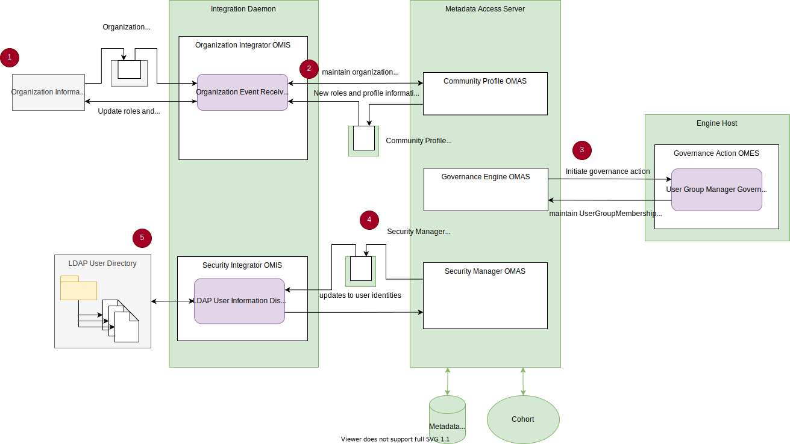

## Using information about individuals in collaboration

### Collaboration metadata
### Contribution records
### Karma points and karma point plateaus

## Summary

--8<-- "snippets/abbr.md"