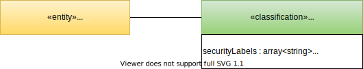
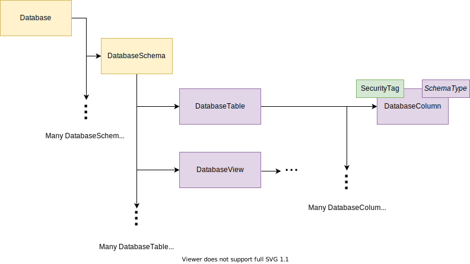

<!-- SPDX-License-Identifier: CC-BY-4.0 -->
<!-- Copyright Contributors to the ODPi Egeria project 2020. -->

# Synchronized access control

There are many factors that influence who should have access to a digital service or data source:

- the type of data
- the scope of data
- the accuracy of data
- the origin of data
- the data subject's permissions
- the data owner's permissions
- the person or system requesting access
- the use that the data is to be put to

Egeria enables all of this information to be assembled and linked together at multiple levels - for example a database column may be linked to a glossary term called employee-salary that is in turn classified as sensitive personal information (SPI).

Security managers, such as Apache Ranger, however just needs to know that the column is SPI. So [engine actions](/concepts/engine-action) convert this complex model into something much more operationally-focused in the form of *security tags*.  The security tags attached to the schemas are all that needs to be distributed to the security managers.

## Representing security tags

Figure 1 shows the open metadata type definition for the *SecurityTag* classification from [model 0423](/types/4/0423-Security-Tags).


> **Figure 1:** The classification *SecurityTags* contains the list of security labels and properties that can be attached to assets and schema attributes that describe the data fields within the asset 

A SecurityTags classification can be attached to any [referenceable](/concepts/referenceable) but is typically attached to the schema attributes that represent the data fields.  For example the columns in a database.  However, it may be attached to groups of data fields - such as a database table or a database schema - to indicate that the security tags apply to all data fields in the group - or to the asset itself if all of the data within the asset should have the same security tags.  Figure 2 shows a SecurityTag attached to a database column.


> **Figure 2:** The classification *SecurityTags* is attached to a database column to indicate the security tags that apply to the data stored in that column

The security tags can be simple labels that indicate that the data item(s) belong to a specific *category* of data.  Alternatively, they can be name-value property pairs.

## Security tag examples

In the example below there are two security labels: `reference-data` and `product-description` and one property called `expires-on` that has a value of `31/12/2024`.
```

securityLabel = [ "reference-data", "product-description" ]
securityProperties = ["expires-on"->"31/12/2024"]

```
These are the types of values that are stored in the SecurityTag classification.

## Using the security tags in security rules

The rules that are associated with the security tags are defined in the security manager, such as Apache Ranger.

Figure 3 shows an Apache Ranger rule that is activated when the `reference-data` security label is attached to a column.


> **Figure 3:** Configuring a tag-based rule in Apache Ranger involves identifying the security label and then defining what should happen based on the type of user requesting access to the data

Figure 4 shows an Apache Ranger rule that works with a security property `expires-on`.  It is activated when the security property is present and uses the value of the security property in the rule execution.


> **Figure 4:** Configuring a tag-based rule that uses a security property


## Phases of synchronized access control


> **Figure 5:** The five phases of synchronized access control: (1) capture of technical metadata; (2) augmentation of technical metadata with governance metadata that define the factors that effect access control; (3) consolidation of governance metadata into the security tags; (4) distribution of the technical metadata with the security tags to the security manager(s); (5) audit of the security tag settings and rules to ensure that the data is appropriately protected

### Catalog

[Cataloguing of assets](/features/integrated-cataloguing/overview) and their schemas (often called technical metadata) may be manually catalogued by individuals/tools or through the integration daemon.

### Augment

Using [templates](/features/templated-cataloguing/overview), [metadata discovery](/features/discovery-and-stewardship/overview) or [governance action services](/guides/developer/governance-action-services/overview), governance metadata is added to the assets that provide the business and jurisdictional context to the assets.

### Consolidate

A [governance action service](/guides/developer/governance-action-services/overview) trawls the metadata about the asset and sets up the `SecurityTags` classification.

### Distribute

Through an [integration connector](/concepts/integration-connector) running in the [Security Integrator OMIS](/services/omis/security-integrator/overview) hosted by the [Integration Daemon](/concepts/integration-daemon), the security tags are synchronized with the external security manager that is manage access control.

### Audit

Audit of security set up is possible because both governance metadata and the resulting security tags are available.  These can then be verified against the rules in the security policy enforcement engines.


> **Figure 6:** Deployment of the synchronized access control technology showing the capture of the technical metadata, plus any additional governance metadata through the use of templates through the Integration Daemon on the top left-hand side.  The augmentation and consolidation is running in the Engine Host at the bottom left-hand side and the distribution to the external security manager through another Integration Daemon is shown on the right-hand side.  The separation of the connectors across different integration daemons and their use of different cohort members is purely to help with the layout of the diagram.  You are free to distribute these connectors and services as you choose.


## Summary of the services that support synchronized access control

Figure 7 provides a summary of the registered services involved in supporting synchronized access control.


> **Figure 7:** Summary of the services that support synchronized access control

The links below take you to each service's description that includes how to configure and use these services.

### Catalog Services

- [Catalog Integrator OMIS](/services/omis/catalog-integrator/overview)
- [Lineage Integrator OMIS](/services/omis/lineage-integrator/overview)
- [API Integrator OMIS](/services/omis/api-integrator/overview)
- [Display Integrator OMIS](/services/omis/display-integrator/overview)
- [Files Integrator OMIS](/services/omis/files-integrator/overview)
- [Database Integrator OMIS](/services/omis/database-integrator/overview)

### Augmentation Services

- [Asset Owner OMAS](/services/omas/asset-owner/overview)
- [Asset Analysis OMES](/services/omes/asset-analysis/overview)
- [Governance Action OMES](/services/omes/governance-action/overview)
- [Stewardship Action OMAS](/services/omas/stewardship-action/overview)

### Consolidation Services

- [Governance Action OMES](/services/omes/governance-action/overview)


### Distribution Services

- [Security Integrator OMIS](/services/omis/security-integrator/overview)

### Audit Services

- [Security Officer OMAS](/services/omas/security-officer/overview)


--8<-- "snippets/abbr.md"