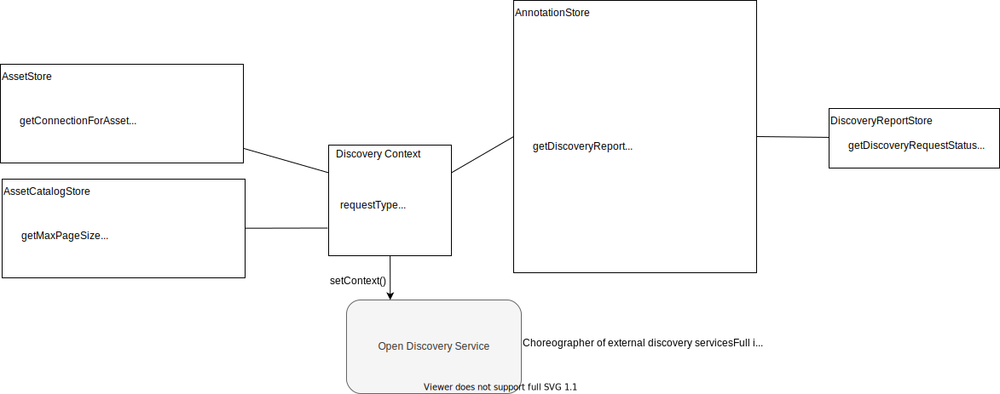

<!-- SPDX-License-Identifier: CC-BY-4.0 -->
<!-- Copyright Contributors to the Egeria project. -->

--8<-- "snippets/content-status/deprecated.md"

# Open Discovery Framework (ODF)
  
The *Open Discovery Framework (ODF)* enables [metadata discovery tools](/features/discovery-and-stewardship) to integrate with open metadata repositories by defining the interfaces for metadata discovery components (called [discovery services](#discovery-service)) to:

- Access metadata discovery configuration.
- Search for [assets](/concepts/asset) in the metadata repository.
- Extract all the metadata known about a specific asset.
- Record the results of the analysis in the open metadata repository and attach it to the asset's metadata for later processing.

## Discovery service

A *discovery service* provides specific analysis of the metadata and contents of an [asset](/concepts/asset) on request.

It is implemented as a specialized [connector](/concepts/connector).

A discovery service is initialized with a connector to the asset it is to analyze and details of the results of other discovery services that have run before it if it is part of a [discovery pipeline](#discovery-pipeline).

The result is one or more sets of related properties that the discovery service has discovered about the asset, its metadata, structure and/or content. These are stored in a set of [discovery annotations](#discovery-annotation) linked off of a [discovery analysis report](#discovery-analysis-report). The discovery analysis report is linked off of the asset definition in the open metadata repository.

Discovery services run in a [discovery engine](#discovery-engine) that is hosted in a [discovery server](#discovery-server).

### Discovery context

A *discovery context* provides the [discovery service](#discovery-service) with access to information about the discovery request along with the open metadata repository interfaces.

The discovery context provides parameters used by a discovery service to locate and analyze an asset and then record the results.

### Discovery request type

The *discovery request type*, as the name suggests, is the name of the type of discovery that a [discovery engine](#discovery-engine) should run. It is a string value and is defined in the [discovery configuration server](#discovery-configuration-server).

Each discovery request type is associated with a discovery service. When a discovery request is made the discovery engine, it looks up the discovery request type and runs the associated discovery service.

## Implementation in Egeria

Egeria's discovery sevices are implemented using the [Survey Action Framework (SAF)](/frameworks/saf/overview)

It also supports event notifications through
the [Discovery Engine OMAS's out topic](/concepts/out-topic).

## Discovery pipeline

A *discovery pipeline* is a specialized implementation of a [discovery service](#discovery-service) that runs a set of discovery services against a single asset. The implementation of the discovery pipeline determines the order that these discovery services are run.

The aim of the discovery pipeline is to enable a detailed picture of the properties of an asset to be built up by the discovery services it calls. Each discovery service is able to access the results of the discovery services that have run before it.

## Discovery annotation

A *discovery annotation* describes one or more related properties about an [asset](/concepts/asset) that has been discovered by a [discovery service](#discovery-service).

Some discovery annotations refer to an entire asset and others refer to a data field within an asset. The annotations that describe a single data field are called *data field annotations*.

| Annotation type | Description |
|---|---|
| Classification annotation | Captures a recommendation of which classifications to attach to this asset. It can be made at the asset or data field level. |
| Data class annotation | Captures a recommendation of which data class this data field closely represents. |
| Data profile annotation | Capture the characteristics of the data values stored in a specific data field in a data source. |
| Data profile log annotation | Capture the names of the log files where profile characteristics of the data values stored in a specific data field. This is used when the profile results are too large to store in open metadata. |
| Data source measurement annotation | Collect arbitrary properties about a data source. |
| Data source physical status annotation | Documents the physical characteristics of a data source asset. |
| Relationship advice annotation | Document a recommended relationship that should be established with the asset. |
| Quality annotation | Document calculated quality scores on different dimensions. |
| Schema analysis annotation | Document the structure of the data (schema) inside the asset. |
| Semantic annotation | Documents suggested meanings for this data based on the values and name of the field. |

The open metadata types for a discovery annotations are described in [area 6](/types/6) of the model.

The main entity type is called [`Annotation`](/types/6/0610-Annotations). It is extended by [`DataFieldAnnotation`](/types/6/0617-Data-Field-Analysis) to distinguish annotations that refer, primarily to a data field. Other more specialist annotations extend these two basic annotation types.

## Discovery analysis report

The *discovery analysis report* lists the [discovery annotations](#discovery-annotation) that were created during the execution of a [discovery service](#discovery-service).

The discovery analysis report is created in the open metadata repository by the [discovery engine](#discovery-engine) when it creates the discovery service instance. The discovery service can retrieve information about the discovery analysis report through the [discovery analysis report store](/guides/developer/open-discovery-ervices/overview/#discovery-analysis-report-store) client.

### Discovery analysis report store

The discovery analysis report store is a client to an open metadata server that enables a [discovery service](#discovery-service) to query the properties of its discovery analysis report and update the analysis step that is currently executing.

The discovery analysis report store is accessed from the [discovery annotation store](#discovery-annotation-store).

The discovery analysis report store also enables a long-running discovery service (typically a [discovery pipeline](#discovery-pipeline)) to record its current analysis step.

### Discovery annotation store

The discovery annotation store provides a [discovery-service](#discovery-service) with a client to write [discovery annotations](#discovery-annotation) to an open metadata repository. These annotations describe the results of the analysis performed on an asset by the discovery service.

The annotations are linked to a discovery analysis report that is in turn linked off of the analysed asset.

The discovery service is passed the discovery annotation store via the [discovery context](#discovery-context).

## Discovery engine

A *discovery engine* is the execution environment for [discovery services](#discovery-service).

The discovery engine configuration defines a set of discovery services. Its definition is stored in an open metadata repository and maintained through the [Discovery Engine OMAS](/services/omas/discovery-engine/overview).

Discovery engines are hosted in [discovery servers](#discovery-server).

Egeria's implementation of the discovery engine is provided by the [Asset Analysis OMES](/services/omes/asset-analysis/overview).

## Discovery server

The *discovery server* is the server environment that hosts one or more [discovery engines](#discovery-engine). Discovery servers are deployed close to the physical assets they are analysing. They connect to the [Discovery Engine OMAS](/services/omas/discovery-engine/overview) running in a [metadata access server](/concepts/metadata-access-server) to provide metadata about assets and to store the results of the discovery service's analysis. Many discovery servers can use the same metadata server.

In Egeria, the discovery server is implemented by the [Asset Analysis OMES](/services/omes/asset-analysis/overview) running in the [engine host](/concepts/engine-host) OMAG Server.

### Discovery configuration server

The *discovery configuration server* is the server responsible for holding and managing the configuration needed by the discovery servers and the [discovery engines](#discovery-engine) within them.

This configuration consists of defining which [discovery request types](#discovery-request-type) are supported and which [discovery services](#discovery-service) they map to.

## Discovery asset catalog store

The *discovery asset catalog store* provides a search interface that enables a [discovery service](#discovery-service) to locate assets that are described in the open metadata repository.

The discovery service is passed the discovery asset catalog store via the [discovery context](#discovery-context).

## Framework implementation

Egeria provides a full implementation of the ODF. It provides a [discovery server](/services/omes/asset-analysis/overview) as well as an implementation of the metadata server APIs by the [Discovery Engine OMAS](/services/omas/discovery-engine/overview). There are also implementations of discovery services in the [discovery-service-connectors :material-github:](https://github.com/odpi/egeria/tree/main/open-metadata-implementation/adapters/open-connectors/discovery-service-connectors){ target=gh } module.

--8<-- "snippets/abbr.md"
