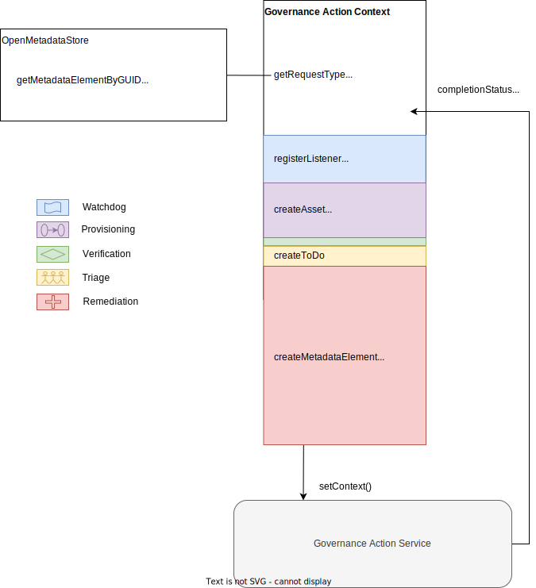

<!-- SPDX-License-Identifier: CC-BY-4.0 -->
<!-- Copyright Contributors to the Egeria project. -->

--8<-- "snippets/content-status/stable.md"

# Open Governance Framework (OGF)
  
The *governance action framework (OGF)* provides the interfaces and base implementations for [governance action services](#governance-action-services) that take action to:

- detect, report and eventually correct a situation that is harmful to the data or the organization in some way or 
- to enhance the metadata to improve its use.

The governance action services can be used for three purposes:

- Provide the complete implementation and orchestration of a governance process.
- Provide coordination between processes run by specialized governance systems. For example, coordinating a DevOps pipeline with a data movement and quality process and security incident management.
- Provide contextual metadata plus an audit trail of actions managed by an external governance process.

## Governance Action Service

A *governance action service* is a specialized [connector](/concepts/connector) that performs monitoring of metadata changes, validation of metadata, triage of issues, assessment and/or remediation activities on request.

There are five types of governance action services, each of which supports a specialist governance activity (see subsections).

These are often used in conjunction with the [survey action services](/concepts/survey-action-service) from the [Survey Action Framework (SAF)](/frameworks/osf/overview). Collectively they are called the *governance services* and they can be linked together into [governance action processes](/concepts/governance-action-process).

Some governance action services invoke functions in external engines that are working with data and related assets. The GAF offers embeddable functions and APIs to simplify the implementation of governance action services, and their integration into the broader digital landscape, whilst being resilient and with good performance.

The governance request parameters are a collection of name-value properties that are passed to a governance action service via the governance action context when it starts.

### Watchdog governance action service

--8<-- "snippets/connectors/watchdog-governance-action-service-intro.md"

### Verification governance action service

--8<-- "snippets/connectors/verification-governance-action-service-intro.md"

### Triage governance action service

--8<-- "snippets/connectors/triage-governance-action-service-intro.md"

### Remediation governance action service

--8<-- "snippets/connectors/remediation-governance-action-service-intro.md"

### Provisioning governance action service

--8<-- "snippets/connectors/provisioning-governance-action-service-intro.md"

--8<-- "snippets/abbr.md"
