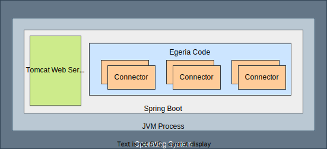
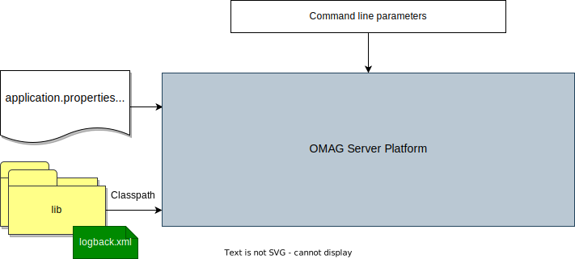
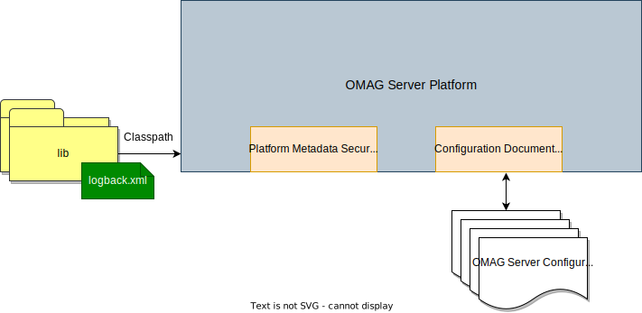
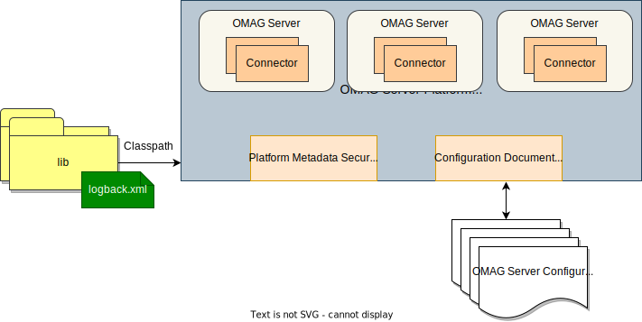
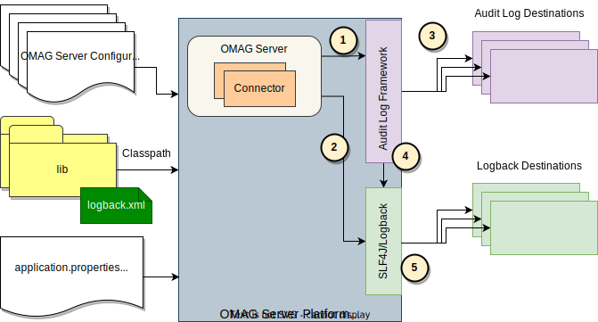

<!-- SPDX-License-Identifier: CC-BY-4.0 -->
<!-- Copyright Contributors to the Egeria project 2020. -->

# Configuring the OMAG Server Platform

The [OMAG Server Platform](/concepts/omag-server-platform) is a JVM process that includes a Tomcat web server and uses [Spring Boot :material-dock-window:](https://spring.io/){ target=spring } to support its REST APIs.  The Egeria code is in the centre of this and, through configuration, starts up plug-in components called [connectors](/concepts/connector).


> High-level structure of the OMAG Server Platform

The behaviour of these components is influenced by:

* The command line properties passed when the platform is started.
* The contents of the `application.properties` file (or their environment variable equivalents).
* The contents of the classpath.  This includes the Java libraries that provide the function of the OMAG Server Platform as well as a special file called `logback.xml` used to control the logging output of the platform.


> Configuration choices for the OMAG Server Platform

## Command line options

The command to start the OMAG Server Platform follows this form:

```bash
$ java <command line options> -jar omag-server-platform-{release}.jar
```
The directory where this command is issued from is called the platform's *working directory*.  The platform code assumes its `application.properties` file is located in this directory and the java libraries for its classpath are in the `lib` subdirectory.

The working directory is displayed in one of the messages emitted by the OMAG Server Platform when it starts up.  You can also see that it is listening on port `9443`.

```text
%  Project Egeria - Open Metadata and Governance
    ____   __  ___ ___    ______   _____                                 ____   _         _     ___
   / __ \ /  |/  //   |  / ____/  / ___/ ___   ____ _   __ ___   ____   / _  \ / / __    / /  / _ /__   ____ _  _
  / / / // /|_/ // /| | / / __    \__ \ / _ \ / __/| | / // _ \ / __/  / /_/ // //   |  / _\ / /_ /  | /  _// || |
 / /_/ // /  / // ___ |/ /_/ /   ___/ //  __// /   | |/ //  __// /    /  __ // // /  \ / /_ /  _// / // /  / / / /
 \____//_/  /_//_/  |_|\____/   /____/ \___//_/    |___/ \___//_/    /_/    /_/ \__/\//___//_/   \__//_/  /_/ /_/

 :: Powered by Spring Boot (v3.0.6) ::

2023-06-13T11:53:54.571+01:00  INFO 55711 --- [           main] o.o.o.s.springboot.OMAGServerPlatform    : Starting OMAGServerPlatform using Java 17.0.6 with PID 55711 (/egeria/deployments/platform/omag-server-platform-4.2.jar started by adminUser in /egeria/deployments)
2023-06-13T11:53:54.573+01:00  INFO 55711 --- [           main] o.o.o.s.springboot.OMAGServerPlatform    : No active profile set, falling back to 1 default profile: "default"
2023-06-13T11:53:58.709+01:00  INFO 55711 --- [           main] o.s.b.w.embedded.tomcat.TomcatWebServer  : Tomcat initialized with port(s): 9443 (https)
2023-06-13T11:54:00.187+01:00  INFO 55711 --- [           main] o.o.o.s.springboot.OMAGServerPlatform    : Working directory is: /egeria/deployments

```
The following command line options change these defaults:

* `-Dloader.path` is set to a list of directories whether the java libraries for the class path are located.  These can either be absolute path names or paths relative to the working directory.  Each name is separated by your operating system's file path separator (`;` on Windows and `:` on *nix).
* `-Dserver.port` is set to the port that the platform should listen on.
* `-Dspring.config.location` is set to the location of the `application.properties` file.  Again this location can either be an absolute path name or a path name relative to the working directory.

For example, the command below starts the 4.2 version of the platform listening on port 9444 with the application.properties and lib directory in a subdirectory called `platform` that is under the working directory.

```bash
$ java -Dloader.path=platform/lib -Dserver.port=9444 -Dspring.config.location=platform/application.properties -jar omag-server-platform-4.2.jar
```

## The application.properties file

The `application.properties` file may include properties that configure Tomcat, Spring or Egeria.  The sections that follow are not an exhaustive list but cover the commonly used values.


### Egeria's platform connectors

The implementation of the two platform connectors can be specified in the `application.properties` file:

* The [configuration document store connector](/concepts/configuration-document-store-connector) manages the storage and retrieval of [configuration documents](/concepts/configuration-document) - one for each OMAG server.
* The [platform metadata security connector](/concepts/platform-metadata-security-connector) authorizes calls to the [Administration Services](/services/admin/services/overview) that maintain the configuration documents as well as the [Platform Services](/services/platform-services/overview) that control the platform when it is running.

If these connectors are specified in the `application.properties` file, they are activated as part of the platform start up - assuming the JAR file(s) containing the implementation of the specified connectors is in the classpath.  If these connectors are not specified in the `application.properties` file then each configuration document is stored in its own encrypted file and there is no platform security authorization.  This default may be sufficient for a development environment.  For production the platform should be configured with a platform metadata security connector because this ensures the management of OMAG Server is performed by authorized users.


> The platform connectors running in the OMAG Server Platform


#### Configuration document store

The [configuration document](/concepts/configuration-document) is the place where the configuration for a single [OMAG Server](/concepts/omag-server) is stored. This may include security certificates and passwords.  By default, the configuration document is stored in its own encrypted file under the working directory of the [OMAG Server Platform](/concepts/omag-server-platform), named:

```text
./data/servers/{serverName}/config/{serverName}.config
```
You may wish to:

- Move the location of the configuration documents.
- Change the storage of the configuration documents to clear text.
- Write you own alternative store for the configuration documents.

All of these options are possible because the configuration document store is implemented in a [configuration document store connector](/concepts/configuration-document/#storage). It is therefore possible to change the implementation or behavior of this connector with a simple configuration change to the OMAG Server Platform.

From V4.2, the configuration document store connector is typically configured in the `application.properties`.   Alternatively, the configuration document store connector can be dynamically configured using the following [Administration Services](/services/admin-services/overview).

A configuration document store connector typically needs two pieces of information:

* The class name of the [Connector Provider](/concepts/connector-provider).
* The location where the [configuration documents](/concepts/configuration-document) are to be stored and retrieved from.

These two pieces of information can be provided through these two properties:

* `platform.configstore.provider` - class name of the configuration document store provider.
* `platform.configstore.endpoint` - name/pattern of resource, eg file name, needed by the connector.

The default configuration document store connector is the [encrypted file store connector](https://github.com/odpi/egeria/tree/main/open-metadata-implementation/adapters/open-connectors/configuration-store-connectors/configuration-encrypted-file-store-connector).  If you wanted your configuration documents to be stored in clear text, set the following properties in the `application.properties` file:

```properties
platform.configstore.provider=org.odpi.openmetadata.adapters.adminservices.configurationstore.file.FileBasedServerConfigStoreProvider
platform.configstore.endpoint=./data/servers/{0}/config/{0}.config
```

The connector will substitute the name of the server for `{0}`.

#### Configuring the default configuration document

[Configuration Documents](/concepts/configuration-document) describe the properties of an [OMAG Server](/concepts/omag-server).  They can be built up through a series of REST API calls to the platform's [Administration Services](/services/admin-services/overview).  It is possible to set up a default set of properties that will be added to any new configuration documents that are created on the platform using the `platform.default.config.document` property in the `application.properties` file.  The default properties are specified as a JSON document.  Here is an example that set the default values for the `organizationName`, `maxPageSize` and `eventBusConfig`:

```properties
###############################################
### Set up the default configuration document for any new OMAG Server configurations
###############################################
platform.default.config.document=\
  {\
    "class": "OMAGServerConfig",\
    "organizationName": "myOrg",\
    "maxPageSize": 600,\
    "eventBusConfig": \
        {\
            "class": "EventBusConfig",\
            "topicURLRoot": "egeria.omag",\
            "configurationProperties":\
             {\
                "producer": {"bootstrap.servers": "localhost:9092"},\
                "consumer": {"bootstrap.servers": "localhost:9092"}\
             }\
        }\
  }
```
A simple way to create this structure is to [configure a server](/guides/admin/servers) and then [retrieve the configuration document](/guides/admin/servers/#retrieving-the-configuration) for the server, removing any server specific details.  The resulting JSON structure can be added directly into `application.properties`, as show above, or set in an environment variable.  The environment variable can then be used to set `platform.default.config.document`.  The example below shows this property being set using an environment variable called `DEFAULT_SERVER_CONFIG`.  This second approach is useful if the same default configuration is being used by multiple platforms, each with different `application.properties` files.

```properties
###############################################
### Set up the default configuration document for any new OMAG Server configurations
###############################################
platform.default.config.document=${DEFAULT_SERVER_CONFIG}
```

#### Configuring the platform metadata security connector

The [OMAG Server Platform](/concepts/omag-server-platform) provides configuration, operational and diagnostic services for [OMAG Servers](/concepts/omag-server) which in themselves provide access to a wide variety of information and control points.  Therefore, it is necessary to provide authorization services relating to the dynamic management of the platform.

Egeria provides [a platform security authorization capability](/services/metadata-security-services). It is implemented in a [platform metadata security connector](/concepts/platform-metadata-security-connector) that is called whenever requests are made to the server platform services.

A platform metadata security connector typically needs the following pieces of information:

* `platform.security.provider` - class name of the platform metadata security provider
* `platform.security.name` - name (or platform URL root) for platform to use in security error messages.

For example, to configure tha [Coco Pharmaceuticals platform metadata security connector](https://github.com/odpi/egeria/tree/main/open-metadata-resources/open-metadata-samples/open-metadata-security-samples) set up the following properties:

```properties
platform.security.provider=org.odpi.openmetadata.metadatasecurity.samples.CocoPharmaPlatformSecurityProvider
platform.security.name=Coco Pharmaceuticals Platform
```

### Auto-starting servers

The [Platform Services](/services/platform-services/overview) are used to dynamically start and stop OMAG Servers on the platform.  They also provide query APIs that return details of the OMAG Servers that are running - or have ever run - on the platform.

When the OMAG Servers start up, their associated configuration document defines the open metadata and governance services to run and the connectors that these services are to use.  The classpath needs to include all the Java libraries for both the Egeria services and the connectors that are configured for each OMAG Server.


> OMAG Servers running open metadata and governance services along with configured connectors

OMAG Servers can be automatically activated when an OMAG Server Platform starts up by setting the `startup.server.list` property in the `application.properties` file. The server names are listed without quotes. For example:

```properties
startup.server.list=cocoMDS1, cocoMDS2
```

Each server is started with the administration user id set in the property `startup.user`.

For example:

```properties
startup.user=garygeeke
```

By default, this user id is set to `system`.

When the platform shuts down, if any of the servers that were in the startup list are still running, they will be shutdown before the platform exits.

### Transport Layer Security (TLS)

Transport layer security describes the security applied to API calls made between servers. The most commonly known transport layer security is SSL.

Egeria uses TLS with certificates to secure the communication to and from the [OMAG Server Platforms](/concepts/omag-server-platform).

#### Brief background on TLS

[Transport Layer Security (TLS) :material-dock-window:](https://en.wikipedia.org/wiki/Transport_Layer_Security){ target=wikipedia } protects communications over network connections through encryption, authentication and integrity. It is just one layer of security of many.

##### One-way SSL exchange

One-way SSL exchange is typically in use when browsing the web - since as a user you are most concerned that the server you are connecting to is authentic.

With this approach, the server is not able to guarantee your authenticity at the transport level. This means you can be assured of the identity of the server, but it cannot be sure of who you are.


##### Two-way (mutual) SSL exchange

With two-way (mutual) SSL exchange, trust is established both ways. This [mutual authentication :material-dock-window:](https://en.wikipedia.org/wiki/Mutual_authentication){ target=wikipedia } is more typical when interconnecting different systems and applications which are known in advance.


#### Certificates for the OMAG Server Platform

!!! attention "Important note on terminology"
    Egeria's [OMAG Server Platform](/concepts/omag-server-platform) is a Spring Boot based application. We refer to it as Egeria's *OMAG Server Platform*, which hosts Egeria [OMAG Servers](/concepts/omag-server).

    However, in the documentation relating to network communications and SSL, a "server" is usually seen as an application listening on a network port. For Egeria, this "server" would be the OMAG Server Platform. It is important to be aware of this terminology difference when reading the links and references mentioned here.

An instance of the OMAG Server Platform services requests over a REST based API from other OMAG Server Platforms, UIs, tools and engines. In this regard its role in SSL network requests described above is that of a *network server*, with its callers performing the role of a *network client*.

However, since the OMAG Server Platform also makes requests to other systems (including other OMAG Server Platforms and Apache Kafka) it is also fulfilling a *network client* role.

As a Spring application, the OMAG Server Platform's configuration for its network server role allows the following Spring properties to be set:

| Property | Use |
|---|---|
| `server.ssl-key-store` | Used by Tomcat/Spring Boot to locate keys that identify the server |
| `server.ssl-key-alias` | Used by Tomcat/Spring Boot to identify the alias of the key tomcat should use for itself |
| `server.ssl.key-store-password` | Used by Tomcat/Spring Boot for the keystore password (2 way SSL) |
| `server.ssl.trust-store` | Used by Tomcat/Spring Boot to understand what clients it can trust (2 way SSL) |
| `server.ssl.trust-store-password` | Used by Tomcat/Spring Boot  for the password of the truststore (2 way SSL) |
| `strict.ssl` | This is an additional parameter Egeria provides (non-standard Spring property) which if `true` causes SSL verification to be skipped entirely |

For further details on these and other less common configuration options, refer to the Spring Docs.

Since the OMAG Server Platform is also a network client the settings in the next section for clients are also required.

#### Egeria Java clients

Standard Java properties need to be set within the JVM running the Egeria client code (this includes the OMAG Server Platform):

| Property | Use |
|---|---|
| `javax.net.ssl.keyStore` | keyStore for client to use (2 way SSL needs this) |
| `javax.net.ssl.keyStorePassword` | password for the keystore  (2 way SSL needs this) |
| `javax.net.ssl.trustStore` | trustStore for the client to use (always needs setting as Egeria makes client calls) |
| `javax.net.ssl.trustStorePassword` | password for the truststore (always - as above) |
| `strict.ssl` | For any executable jars provided by Egeria (such as samples), setting this additional parameter to `true` will cause SSL verification to be skipped. This is only recommended for test and development. |

Note that in the case of Java clients, these are system properties, and do not use Spring conventions.

#### Other clients

Similar principles to those documented for Java should apply. If you need further assistance, please contact the team on [Slack :material-slack:](https://slack.lfaidata.foundation){ target=slack }. A pull request (or issue) with contributed documentation is also very welcome!

#### Example to launch Egeria

Examples certificates are provided in the codebase under [open-metadata-resources/open-metadata-deployment/certificates :material-github:](https://github.com/odpi/egeria/tree/main/open-metadata-resources/open-metadata-deployment/certificates){ target=gh }

As an example of running the Egeria OMAG Server Platform with the certificates generated above, add the following options when launching the `omag-server-platform.jar` jar file:

```
-Dserver.ssl.key-store=${KS}
-Dserver.ssl.key-alias=EgeriaServerChassis
-Dserver.ssl.key-store-password=egeria
-Dserver.ssl.trust-store=truststore.p12
-Dserver.ssl.trust-store-password=egeria
-Djavax.net.ssl.keyStore=EgeriaServerChassis
-Djavax.net.ssl.keyStorePassword=egeria
-Djavax.net.ssl.trustStore=truststore.p12
-Djavax.net.ssl.trustStorePassword=egeria
```

??? question "Detailed explanation"
    We have to use both `server.ssl` and `javax.net` values since the former controls how the OMAG Server Platform works when accepting inbound connections and the latter are needed when it acts as a network client.

    We have assumed the default keystore passwords, and also that we will use the same key regardless of whether it is the one that the chassis sends back to its client after they connect, or the one the chassis may send to those other repositories. They could be distinct if needed.

#### Creating your own certificates

The example certificates are fine for development; however, it is important to have your own certificates for a production environment.

An example script (MacOS/Linux) to create certificates is provided in [`gensamplecerts.sh` :material-github:](https://github.com/odpi/egeria/blob/main/open-metadata-resources/open-metadata-deployment/certificates/gensamplecerts.sh){ target=gh }. It is intended only as an example. It requires the `openssl` tool and `keytool`. Deployment frameworks in cloud services may also offer support to generate certificates, and it is likely an enterprise process will be in place in larger organizations.

The script creates a Certificate Authority and then specific certificates for different Egeria components. It could be extended to create certificates for other clients especially if using 2 way SSL.

When the script is run it also makes use of the configuration template [`openssl.cnf` :material-github:](https://github.com/odpi/egeria/blob/main/open-metadata-resources/open-metadata-deployment/certificates/openssl.cnf){ target=gh }.

Together, both set some important characteristics that are needed to allow the certificate to work properly, especially with current browsers:

- ensuring `basicConstraints` are specified
- ensuring the certificate expiry time is not too far in the future
- ensuring `subjectAltName` is specified.

??? note "Additional notes on building diagrams"
    The rendered image files are checked in, however when updating, the diagrams can be regenerated using [PlantUML :material-dock-window:](https://plantuml.com){ target=new }

    For example: `plantuml -svg ssl-oneway.puml`

    The diagrams are best rendered to svg, however notes do not render with a background if using the IntelliJ markdown plugin. They do render correctly if opened directly in IntelliJ, as well as in a browser

    It's also recommended to install the IntelliJ 'PlantUML' plugin to get a real-time preview whilst updating the diagrams.

[^1]: For more details on the encrypted format, see the [encrypted file store connector :material-github:](https://github.com/odpi/egeria/tree/main/open-metadata-implementation/adapters/open-connectors/configuration-store-connectors/configuration-encrypted-file-store-connector){ target=gh }.

### Logging

The `application.properties` file controls which types of developer/debug logging should be produced by the OMAG Server Platform.  The Egeria code (and most third party technology integrated into it) uses SLF4J (or its predecessor Log4J which can be routed to SLF4J) to write log entries that explain the code pathways that are running and any errors encountered.  This can be extremely useful when debugging a set up or code issue.  However, it is very expensive in terms of performance and should be used when needed.

The `logging.level.xxx` properties in the `application.properties` file define which Java classes should produce log entries and the level of severity that should be included (TRACE, DEBUG, INFO, WARN and ERROR).

These are logging values included in the default `application.properties` file. The `logging.level.root` provides the default logging level.

```properties
logging.level.root=OFF
logging.level.org.springframework=ERROR
logging.level.org.springframework.boot.web.embedded.tomcat=INFO
logging.level.org.odpi.openmetadata.serverchassis.springboot=INFO
```
If you are routing audit log messages to SLF4J using the SLF4J audit log destination connector then you need to add logging levels for the loggers used by this connector.  It uses loggers with the following name structure:

```text
"org.odpi.openmetadata.frameworks.auditlog.{serverName}.{componentName}
```
It uses a logging level of ERROR for audit log record with a severity of *Exception* or *Error*.  All other audit log severities are logged using logging level INFO.

This means, for example, if you wanted all *Exception* or *Error* audit log records from any server to be produced as SLF4J log entries add the following in your `application.properties` file.

```properties

logging.level.org.odpi.openmetadata.frameworks.auditlog=ERROR
```

In addition, if you wanted all audit log messages from the `cocoMDS1` server to be produced, then add the following property.

```properties

logging.level.org.odpi.openmetadata.frameworks.auditlog.cocoMDS1=INFO
```

Note that the severities of audit log records processed by the SLF4J audit log destination connector can be filtered by changing the configuration for this connector.

The [logback.xml](#the-logbackxml-file) file is used to control where this logging is routed to.


> (1) Audit log record are produced by all components supporting an OMAG Server.
> (2) These components also produce debug logging using SLF4J
> (3) Audit log record are routed to the audit log destinations described in the OMAG Server's configuration document
> (4) The SLF4J audit log destination routes audit log records to SLF4J
> (5) The logging level properties in application.properties define which log entries are produced by SLF4J.  The logback.xml file defined where these log entries are stored.

### Swagger

Swagger provides an interactive webpage that describes the REST APIs supported by the OMAG Server Platform.  This is very useful in a development environment, but may not be desired in a production environment.  The properties in the `application.properties file` control whether the swagger endpoint and web page is enabled.

These are the default values for the OMAG Server Platform.

```properties
springdoc.version='@springdoc.version@'
springdoc.api-docs.enabled=true
springdoc.api-docs.path=/v3/api-docs
springdoc.swagger-ui.path=/swagger-ui.html
springdoc.swagger-ui.displayRequestDuration=true
springdoc.swagger-ui.tagsSorter=alpha
springdoc.swagger-ui.operationsSorter=alpha
springdoc.swagger-ui.docExpansion=none
```

!!! tip "Additional properties"
Spring provides [extensive documentation on its standard properties :material-dock-window:](https://docs.spring.io/spring-boot/docs/current/reference/html/appendix-application-properties.html){ target=spring }.

## The classpath

As mentioned above, the classpath is the list of folders where the Java Virtual Machine (JVM) is to look for JAR files.  The JAR files contain the java classes (implementation) of Egeria's modules and the connectors it is running.
By default, the OMAG Server Platform is built as a single JAR file that contains all the Egeria modules.  The `lib` directory contains all the connector implementations located in the egeria.git repository.  You need to add the JAR files of any additional connectors that you wish to run.  You can either add them to the `lib` directory or create a new directory called `extralibs` and add your additional JARs there.  This separation means that it is clear which Jar files have come from Egeria's build and which are sourced from elsewhere.

If you choose the `extralibs` approach, then remember to update your `-Dloader.path` command line option to include the `extralibs` directory.

For example:

```properties
-Dloader.path=platform/lib:platform/extralibs
```

There is also a build option called `-PadminChassisOnly` to create a skinny OMAG Server Platform.  This does not include any of the [Registered Services](/services/#registered-services) nor connector implementations.

The JAR files for the registered services and connectors that you want to use should be copied from the Egeria build into a directory on the classpath (eg `lib `or `extralibs`).  These registered services will be dynamically loaded when the OMAG Server Platform starts.  The connectors will be loaded when their configuration is activated either by the OMAG Server Platform start up or the actions of an OMAG Server.


## The logback.xml file

The `logback.xml` is also located in one of the directories on the classpath.  This is used to control the output of developer/debug logging produced by the software running in the OMAG Server Platform through the *SLF4J/logback* service.

The [sample logback.xml file](https://github.com/odpi/egeria/blob/main/logback.xml) in the `egeria.git` repository shows how to redirect the logging output of the OMAG Server Platform to a directory where the recent log entries are in a clear text file called `debug.log`.  After a time (or if the `debug.log` file gets to big) the older log entries are archived and TARed to new files identifying their time window.

It also redirects audit log messages for a server called `cocoMDS1` that are being routed to SLF4J through the SLF4J audit log destination connector.  These log messages are initially stored in clear text, and rolled up into TARed archive files just like `debug.log`.

The sample `logback.xml` is not activated in the OMAG Server Platform by default.  It is provided as a sample for you to customise.

### Inside the logback.xml file

When you look in the logback.xml file, you will see three types of entries:

* Appenders - define where log entries are to be rooted to
* Loggers - define which log entries are to be routed to each appender
* Root - defines the default routing to the appenders

There are separate appenders for standard out (console), the audit log entries from cocoMDS1 and the debug log fro many component running in the OMAG Server Platform.

## What next?

???+ info "Next steps"
    * [How to configure OMAG Servers](/guides/admin/servers)
    * [Practical tutorial working with the OMAG Server Platform](/education/tutorials/omag-server-tutorial/overview)

--8<-- "snippets/abbr.md"

