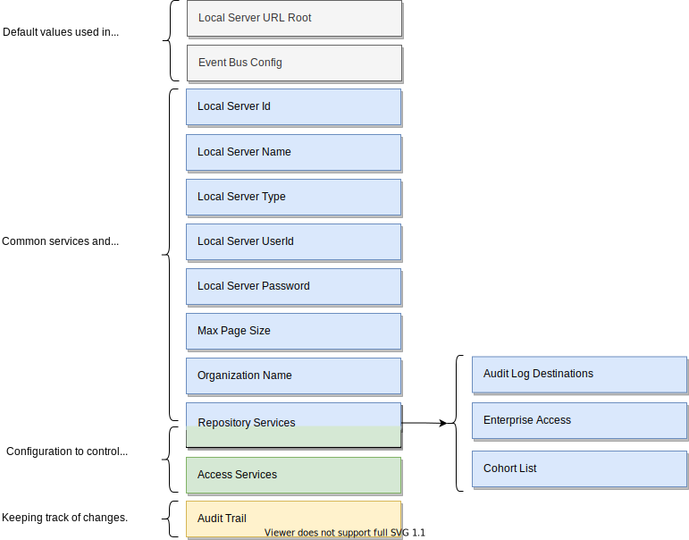

<!-- SPDX-License-Identifier: CC-BY-4.0 -->
<!-- Copyright Contributors to the Egeria project 2020. -->

# Configuring a [metadata access point](/concepts/metadata-access-point)

A *Metadata Access Point* is configured by creating a [configuration document](/concepts/configuration-document).  Below is the outline structure of the server's configuration document.

For a metadata access point, the following can be configured:

??? info "Configuring the default values used in subsequent configuration commands"
    --8<-- "docs/guides/admin/servers/configuring-event-bus.md"
    --8<-- "docs/guides/admin/servers/configuring-local-server-url.md"

??? info "Configuring the basic properties"
    --8<-- "docs/guides/admin/servers/configuring-omag-server-basic-properties.md"

??? info "Configuring the audit log"
    --8<-- "docs/guides/admin/servers/configuring-the-audit-log.md"

??? info "Configuring the server security connector"
    --8<-- "docs/guides/admin/servers/configuring-the-server-security-connector.md"

??? info "Registering the server with a cohort"
    --8<-- "docs/guides/admin/servers/configuring-registration-to-a-cohort.md"

??? info "Configuring the access services"
    --8<-- "docs/guides/admin/servers/configuring-the-access-services.md"

--8<-- "snippets/abbr.md"
