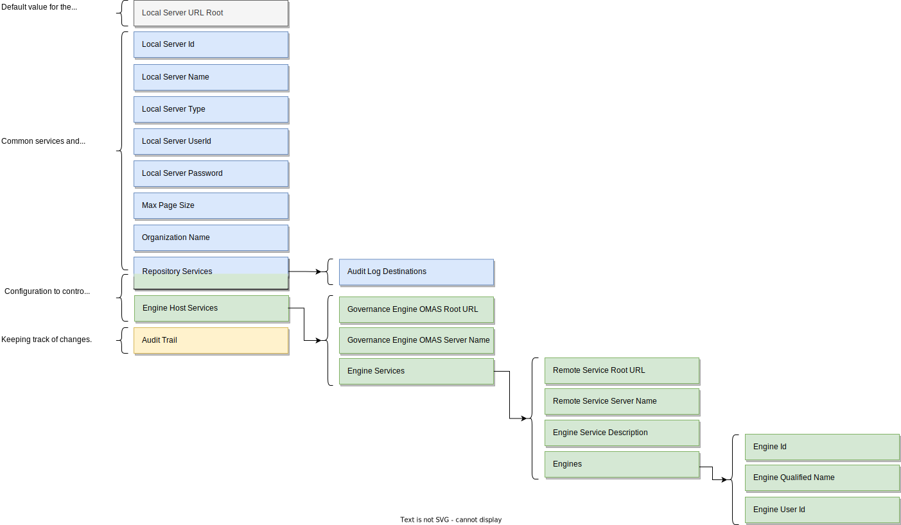

<!-- SPDX-License-Identifier: CC-BY-4.0 -->
<!-- Copyright Contributors to the Egeria project. -->

# Configuring an [engine host](/egeria-docs/concepts/engine-host)

Each [type of OMAG Server](/egeria-docs/concepts/omag-server/#types-of-omag-server) is configured by creating
a [configuration document](/egeria-docs/concepts/configuration-document).



!!! example "Example configuration of a minimal engine host server"
    Below is an example of the configuration for a minimal engine host server. It has
    a single engine service (`Asset Analysis OMES`) and the default audit log.
    Both the Governance Engine OMAS used by the engine host services and the Discovery Engine OMAS
    used by the Asset Analysis OMES are running on the metadata server called `myMetadataServer`.

    ```json
    {
        "class": "OMAGServerConfigResponse",
        "relatedHTTPCode": 200,
        "omagserverConfig": {
            "class": "OMAGServerConfig",
            "versionId": "V2.0",
            "localServerId": "8b745d03-5ffc-4978-81ab-bd3d5156eebe",
            "localServerName": "myserver",
            "localServerType": "Open Metadata and Governance Server",
            "localServerURL": "https://localhost:9443",
            "localServerUserId": "OMAGServer",
            "maxPageSize": 1000,
            "engineHostServicesConfig": {
                "omagserverPlatformRootURL": "https://localhost:9443",
                "omagserverName": "myMetadataServer",
                "engineServices": [
                    {
                        "class": "EngineServiceConfig",
                        "engineId": 6000,
                        "engineQualifiedName": "Asset Analysis",
                        "engineServiceFullName": "Asset Analysis OMES",
                        "engineServiceURLMarker": "asset-analysis",
                        "engineServiceDescription": "Analyses the content of an asset's real world counterpart, generates annotations in an open discovery report that is attached to the asset in the open metadata repositories .",
                        "engineServiceWiki": "https://egeria.odpi.org/open-metadata-implementation/engine-services/asset-analysis/",
                        "engines" : [ {"engineId" : "daff1dca-984b-4b8a-8a8f-febaf72b82a8",
                                       "engineName" : "engine1", 
                                       "engineUserId" : "engine1UserId"},
                                      {"engineId" : "a80aa0f8-2ea0-4f84-b613-d68becba2693",
                                       "engineName" : "engine2", 
                                       "engineUserId" : "engine2UserId"} ],
                        "engineServiceOperationalStatus": "ENABLED",
                        "engineServiceAdminClass": "org.odpi.openmetadata.engineservices.assetanalysis.admin.AssetAnalysisAdmin",
                        "omagserverPlatformRootURL": "https://localhost:9443",
                        "omagserverName": "myMetadataServer"
                    }
                ]},
            "repositoryServicesConfig": {
                "class": "RepositoryServicesConfig",
                "auditLogConnections": [
                    {
                        "class": "Connection",
                        "headerVersion": 0,
                        "displayName": "Console",
                        "connectorType": {
                            "class": "ConnectorType",
                            "headerVersion": 0,
                            "type": {
                                "class": "ElementType",
                                "headerVersion": 0,
                                "elementOrigin": "LOCAL_COHORT",
                                "elementVersion": 0,
                                "elementTypeId": "954421eb-33a6-462d-a8ca-b5709a1bd0d4",
                                "elementTypeName": "ConnectorType",
                                "elementTypeVersion": 1,
                                "elementTypeDescription": "A set of properties describing a type of connector."
                            },
                            "guid": "4afac741-3dcc-4c60-a4ca-a6dede994e3f",
                            "qualifiedName": "Console Audit Log Store Connector",
                            "displayName": "Console Audit Log Store Connector",
                            "description": "Connector supports logging of audit log messages to stdout.",
                            "connectorProviderClassName": "org.odpi.openmetadata.adapters.repositoryservices.auditlogstore.console.ConsoleAuditLogStoreProvider"
                        },
                        "configurationProperties": {
                            "supportedSeverities": [
                                "<Unknown>",
                                "Information",
                                "Event",
                                "Decision",
                                "Action",
                                "Error",
                                "Exception",
                                "Security",
                                "Startup",
                                "Shutdown",
                                "Asset",
                                "Types",
                                "Cohort"
                            ]
                        }
                    }
                ]
            },
            "auditTrail": [
                "Tue Dec 08 18:38:32 GMT 2020 me updated configuration for engine service asset-analysis.",
                "Tue Dec 08 18:43:47 GMT 2020 me set up default audit log destinations."
            ]
        }
    }
    ```

--8<-- "snippets/tasks/configuring-omag-server-basic-properties.md"

--8<-- "snippets/tasks/configuring-the-audit-log.md"

--8<-- "snippets/tasks/configuring-the-server-security-connector.md"

--8<-- "snippets/tasks/configuring-the-engine-host-services.md"

--8<-- "snippets/abbr.md"
